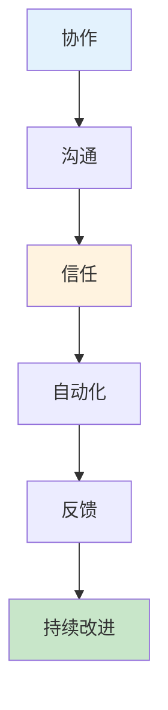
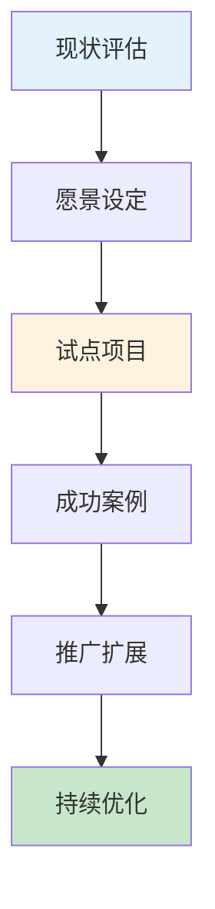
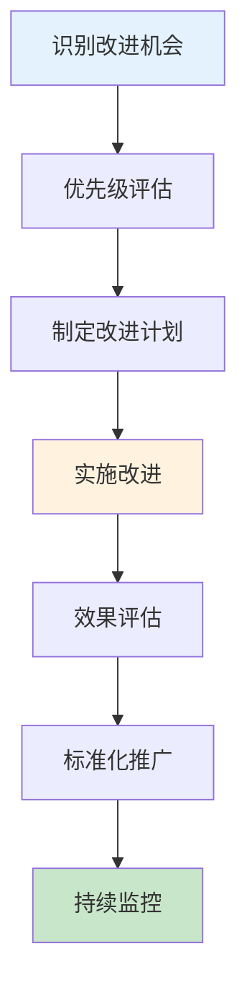

# 持续改进与DevOps文化建设生产环境最佳实践

## 情境(Situation)

DevOps不仅仅是工具和流程，更是一种文化和思维方式。建立DevOps文化能够打破团队壁垒，促进协作，提高交付效率和质量。

## 冲突(Conflict)

许多团队在DevOps文化建设中面临以下挑战：
- **部门壁垒**：开发和运维之间存在隔阂
- **抗拒变革**：团队成员习惯传统工作方式
- **缺乏度量**：难以衡量DevOps实践的效果
- **持续改进难**：改进措施难以持续推进
- **文化落地难**：文化变革需要时间和耐心

## 问题(Question)

如何在团队中成功推广DevOps文化，并建立有效的持续改进机制？

## 答案(Answer)

本文将基于真实生产案例，提供一套完整的持续改进与DevOps文化建设最佳实践指南。

---

## 一、DevOps文化核心价值观

### 1.1 DevOps文化要素



### 1.2 文化价值观说明

| 价值观 | 说明 | 实践表现 |
|:------:|------|----------|
| **协作** | 跨团队紧密合作 | 开发和运维共同负责 |
| **沟通** | 开放透明的沟通 | 定期同步、信息共享 |
| **信任** | 相互信任的氛围 | 允许试错、心理安全 |
| **自动化** | 自动化一切可自动化的 | CI/CD、自动化测试 |
| **反馈** | 快速反馈机制 | 监控告警、用户反馈 |
| **持续改进** | 不断优化流程 | 复盘、指标驱动 |

---

## 二、DevOps文化推广策略

### 2.1 文化变革路线图



### 2.2 推广策略

```yaml
# DevOps文化推广策略
culture_strategy:
  phase_1_assessment:
    activities:
      - 团队访谈
      - 流程梳理
      - 痛点分析
      - 基准评估
    duration: 2周
  
  phase_2_vision:
    activities:
      - 定义目标
      - 制定路线图
      - 获得管理层支持
      - 沟通愿景
    duration: 1周
  
  phase_3_pilot:
    activities:
      - 选择试点项目
      - 组建试点团队
      - 实施DevOps实践
      - 收集反馈
    duration: 4-8周
  
  phase_4_scale:
    activities:
      - 分享成功案例
      - 培训推广
      - 扩展到其他团队
      - 建立社区
    duration: 3-6个月
  
  phase_5_optimize:
    activities:
      - 持续度量
      - 流程优化
      - 文化深化
      - 经验沉淀
    duration: 持续
```

---

## 三、DevOps指标体系

### 3.1 DORA指标

| 指标 | 定义 | 计算公式 | 目标值 |
|:----:|------|----------|--------|
| **部署频率** | 单位时间内的部署次数 | 部署次数 / 时间 | 按需部署 |
| **变更失败率** | 导致故障的变更比例 | 失败变更数 / 总变更数 | < 15% |
| **平均恢复时间(MTTR)** | 从故障到恢复的时间 | 故障恢复总时间 / 故障次数 | < 1小时 |
| **前置时间** | 代码提交到部署的时间 | 平均提交到部署时间 | < 1天 |

### 3.2 指标仪表盘配置

```json
{
  "title": "DevOps指标仪表盘",
  "panels": [
    {
      "type": "stat",
      "title": "部署频率",
      "targets": [
        {
          "expr": "count(deployments_total[7d]) / 7",
          "legendFormat": "次/天"
        }
      ],
      "thresholds": "1,5",
      "colorMode": "value"
    },
    {
      "type": "stat",
      "title": "变更失败率",
      "targets": [
        {
          "expr": "sum(deployment_failures[7d]) / sum(deployments_total[7d]) * 100",
          "legendFormat": "%"
        }
      ],
      "thresholds": "10,15",
      "colorMode": "value"
    },
    {
      "type": "stat",
      "title": "MTTR",
      "targets": [
        {
          "expr": "avg(incident_resolution_time_seconds[7d]) / 3600",
          "legendFormat": "小时"
        }
      ],
      "thresholds": "1,4",
      "colorMode": "value"
    },
    {
      "type": "stat",
      "title": "前置时间",
      "targets": [
        {
          "expr": "avg(lead_time_seconds[7d]) / 86400",
          "legendFormat": "天"
        }
      ],
      "thresholds": "1,3",
      "colorMode": "value"
    },
    {
      "type": "graph",
      "title": "部署趋势",
      "targets": [
        {
          "expr": "sum(deployments_total[1d])",
          "legendFormat": "每日部署数"
        }
      ],
      "yAxis": {
        "label": "次数",
        "min": 0
      }
    }
  ]
}
```

---

## 四、持续改进机制

### 4.1 改进流程



### 4.2 改进优先级矩阵

```yaml
# 改进优先级评估矩阵
improvement_prioritization:
  criteria:
    impact:
      description: "改进的业务影响"
      weight: 40%
    
    effort:
      description: "实施所需的工作量"
      weight: 30%
    
    risk:
      description: "实施风险"
      weight: 20%
    
    alignment:
      description: "与战略目标的对齐"
      weight: 10%
  
  scoring:
    high: 3
    medium: 2
    low: 1
  
  thresholds:
    critical: "总分 >= 8"
    high: "总分 >= 6"
    medium: "总分 >= 4"
    low: "总分 < 4"
```

### 4.3 改进跟踪模板

```markdown
# 改进跟踪模板

## 改进标题
简短描述改进内容

## 背景
为什么需要这个改进？当前的问题是什么？

## 目标
改进的预期目标是什么？

## 优先级
- 影响: [高/中/低]
- 工作量: [高/中/低]
- 风险: [高/中/低]
- 综合评分: [分数]

## 计划
| 阶段 | 任务 | 负责人 | 截止日期 | 状态 |
|------|------|--------|----------|------|
| 规划 | 分析问题 | 张三 | 2024-01-15 | 完成 |
| 实施 | 开发解决方案 | 李四 | 2024-01-20 | 进行中 |
| 验证 | 测试验证 | 王五 | 2024-01-25 | 待开始 |
| 推广 | 文档和培训 | 赵六 | 2024-01-30 | 待开始 |

## 指标
| 指标 | 改进前 | 目标值 | 改进后 |
|------|--------|--------|--------|
| 部署时间 | 30分钟 | 10分钟 | - |
| 错误率 | 5% | 1% | - |

## 状态
[进行中/已完成/已取消]

## 备注
其他需要说明的信息
```

---

## 五、团队建设与培训

### 5.1 培训体系

```yaml
# DevOps培训体系
training_program:
  foundation:
    name: "DevOps基础"
    duration: "2天"
    content:
      - DevOps概念和原则
      - 持续集成/持续部署
      - 自动化测试
      - 监控与告警
  
  intermediate:
    name: "DevOps实践"
    duration: "3天"
    content:
      - CI/CD流水线设计
      - 基础设施即代码
      - 容器化技术
      - Kubernetes基础
  
  advanced:
    name: "DevOps专家"
    duration: "5天"
    content:
      - SRE原则
      - 性能优化
      - 安全DevOps
      - 组织变革
  
  certification:
    - AWS DevOps Engineer
    - Docker Certified Associate
    - CKAD/CKS
```

### 5.2 知识分享机制

```yaml
# 知识分享机制
knowledge_sharing:
  tech_talks:
    frequency: "每周一次"
    duration: "60分钟"
    format: "在线分享"
    topics:
      - 技术深度分享
      - 故障复盘
      - 最佳实践
  
  brown_bag:
    frequency: "每月一次"
    duration: "30分钟"
    format: "午餐分享"
    topics:
      - 新技术介绍
      - 工具使用技巧
      - 工作经验交流
  
  hackathon:
    frequency: "每季度一次"
    duration: "24小时"
    goal: "创新解决方案"
  
  mentorship:
    - pair_programming: true
    - shadowing: true
    - knowledge_transfer: true
```

---

## 六、领导支持与激励机制

### 6.1 领导支持策略

```yaml
# 领导支持策略
leadership_support:
  executive_sponsorship:
    - 获得CTO/VP级别支持
    - 定期汇报进展
    - 争取资源支持
  
  visible_commitment:
    - 领导参与启动会
    - 领导参与重要复盘
    - 公开认可团队成就
  
  resource_allocation:
    - 预算支持
    - 人员配置
    - 时间投入
```

### 6.2 激励机制

```yaml
# 激励机制
incentives:
  recognition:
    - 月度之星评选
    - 最佳实践奖
    - 创新贡献奖
  
  career_path:
    - DevOps专家通道
    - SRE职业发展
    - 技术领导力培养
  
  learning_opportunities:
    - 培训补贴
    - 技术大会
    - 认证支持
  
  team_building:
    - 定期团建
    - 远程团队活动
    - 庆祝里程碑
```

---

## 七、最佳实践总结

### 7.1 DevOps文化建设原则

| 原则 | 说明 | 实践建议 |
|:----:|------|----------|
| **高层支持** | 获得管理层认可和支持 | 定期汇报、争取资源 |
| **循序渐进** | 从小处着手，逐步推广 | 试点项目验证 |
| **以身作则** | 领导带头践行DevOps | 参与实践、分享经验 |
| **持续沟通** | 保持开放透明的沟通 | 定期同步、信息共享 |
| **度量驱动** | 用数据衡量效果 | DORA指标跟踪 |

### 7.2 常见问题与解决方案

| 问题 | 症状 | 解决方案 |
|:-----|:-----|:----------|
| **部门壁垒** | 开发运维沟通不畅 | 跨团队项目、共享目标 |
| **抗拒变革** | 团队不愿改变 | 展示成功案例、培训支持 |
| **缺乏动力** | 改进积极性不高 | 建立激励机制 |
| **难以持续** | 改进措施难以坚持 | 定期复盘、持续监控 |
| **效果不明显** | 度量数据没有改善 | 重新评估策略、调整目标 |

---

## 总结

DevOps文化建设是一个持续的过程，需要高层支持、团队协作和持续改进。通过建立明确的目标、有效的度量体系和激励机制，可以成功推广DevOps文化，提升团队效率和产品质量。

> **延伸阅读**：更多DevOps文化相关面试题，请参考 [SRE面试题解析：基于JD与简历匹配分析]()。

---

## 参考资料

- [DORA指标](https://cloud.google.com/blog/products/devops-sre/using-the-four-keys-to-measure-your-devops-performance)
- [DevOps Handbook](https://www.amazon.com/DevOps-Handbook-World-Class-Reliability-Organizations/dp/1942788002)
- [Accelerate](https://www.amazon.com/Accelerate-Software-Performing-Technology-Organizations/dp/1942788339)
- [Google SRE Books](https://sre.google/books/)
