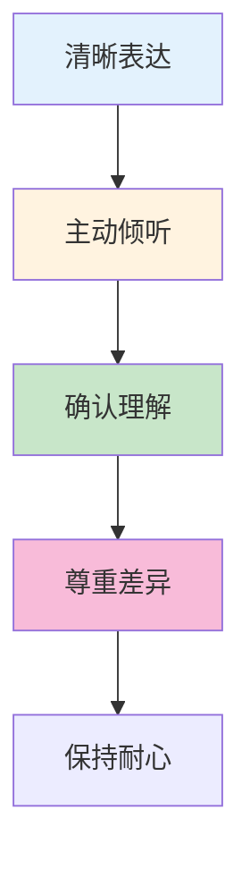
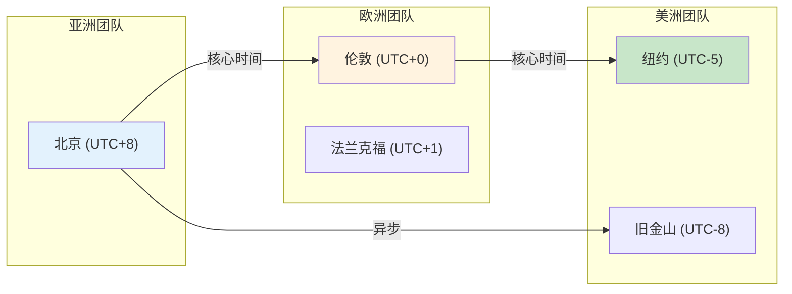
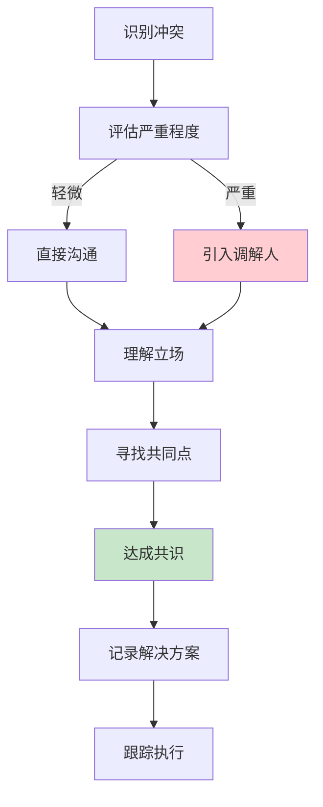

# 跨文化团队协作生产环境最佳实践

## 情境(Situation)

在全球化的今天，跨文化团队协作已成为常态。作为DevOps/SRE工程师，与来自不同文化背景的团队成员合作是必备技能。有效的跨文化协作能够提升团队效率，促进知识共享。

## 冲突(Conflict)

许多团队在跨文化协作中面临以下挑战：
- **沟通障碍**：语言差异导致误解
- **文化差异**：工作方式和价值观不同
- **时区差异**：团队分布在不同时区
- **信任问题**：远程协作难以建立信任
- **协作效率**：跨时区沟通成本高

## 问题(Question)

如何在跨文化团队中建立有效的协作机制，确保高效沟通和团队协作？

## 答案(Answer)

本文将基于真实生产案例，提供一套完整的跨文化团队协作最佳实践指南。

---

## 一、跨文化沟通策略

### 1.1 沟通渠道选择

| 渠道 | 适用场景 | 优点 | 注意事项 |
|:----:|----------|------|----------|
| **同步沟通** | 实时讨论、紧急问题 | 即时反馈 | 时区协调困难 |
| **异步沟通** | 非紧急问题、信息分享 | 灵活、可回顾 | 响应延迟 |
| **视频会议** | 深度讨论、团队建设 | 表情和肢体语言 | 网络质量要求 |
| **书面文档** | 决策记录、知识分享 | 可追溯、准确 | 需要维护 |

### 1.2 沟通技巧



**沟通技巧要点**：
- **清晰表达**：使用简洁、明确的语言，避免俚语和歧义
- **主动倾听**：认真听取他人意见，给予充分表达空间
- **确认理解**：重复要点，确保双方理解一致
- **尊重差异**：尊重不同的观点和工作方式
- **保持耐心**：给对方足够的时间理解和回应

---

## 二、文化差异管理

### 2.1 常见文化维度

| 维度 | 描述 | 不同文化表现 |
|:----:|------|--------------|
| **个人主义 vs 集体主义** | 个人成就 vs 团队目标 | 西方偏个人主义，东方偏集体主义 |
| **权力距离** | 上下级关系 | 高权力距离文化尊重权威 |
| **不确定性规避** | 对风险的态度 | 有的文化避免风险，有的接受风险 |
| **时间观念** | 对时间的看法 | 线性时间观 vs 弹性时间观 |

### 2.2 文化差异应对策略

```yaml
# 文化差异应对策略
cultural_strategies:
  communication:
    - 避免使用方言和俚语
    - 使用简单直接的表达方式
    - 提供详细的背景信息
    - 定期检查理解程度
  
  decision_making:
    - 了解不同文化的决策风格
    - 尊重层级结构
    - 提供充分的讨论时间
    - 记录决策过程
  
  working_hours:
    - 确定核心工作时间
    - 灵活安排会议时间
    - 利用异步沟通工具
    - 尊重个人工作生活平衡
  
  feedback:
    - 了解反馈文化差异
    - 采用建设性反馈方式
    - 平衡正面和负面反馈
    - 尊重个人隐私
```

---

## 三、时区管理最佳实践

### 3.1 时区协调策略



### 3.2 核心工作时间配置

```yaml
# 团队时区配置
team_timezones:
  asia:
    name: "亚洲团队"
    timezone: "UTC+8"
    working_hours: "09:00-18:00"
    members: ["China", "Japan", "Korea"]
  
  europe:
    name: "欧洲团队"
    timezone: "UTC+1"
    working_hours: "09:00-18:00"
    members: ["Germany", "UK", "France"]
  
  americas:
    name: "美洲团队"
    timezone: "UTC-5"
    working_hours: "09:00-18:00"
    members: ["USA", "Canada"]

# 核心重叠时间
core_overlap_time:
  start: "15:00"  # UTC+8
  end: "17:00"    # UTC+8
  description: "所有团队都在线的时间窗口"
```

---

## 四、协作工具与流程

### 4.1 协作工具矩阵

| 工具类型 | 推荐工具 | 用途 |
|:--------:|----------|------|
| **即时通讯** | Slack, Microsoft Teams | 日常沟通、快速问题 |
| **视频会议** | Zoom, Google Meet | 团队会议、深度讨论 |
| **项目管理** | Jira, Trello | 任务管理、进度跟踪 |
| **文档协作** | Confluence, Google Docs | 知识共享、文档协作 |
| **代码协作** | GitHub, GitLab | 代码版本控制、Code Review |
| **持续集成** | Jenkins, GitHub Actions | CI/CD流水线 |

### 4.2 协作流程规范

```yaml
# 跨文化团队协作流程
workflow:
  daily_standup:
    time: "10:00 UTC+8"
    duration: "15分钟"
    format: "视频会议"
    agenda:
      - 昨日完成
      - 今日计划
      - 阻塞问题
  
  weekly_sync:
    time: "每周三 16:00 UTC+8"
    duration: "60分钟"
    format: "视频会议"
    agenda:
      - 进度回顾
      - 问题讨论
      - 下周计划
  
  code_review:
    policy: "至少两位reviewer"
    time_limit: "24小时内回复"
    guidelines:
      - 代码质量
      - 安全性
      - 可读性
      - 测试覆盖
  
  incident_response:
    on_call: "7x24轮值"
    escalation: "按时区就近原则"
    documentation: "即时更新"
```

---

## 五、信任建立与团队建设

### 5.1 信任建立策略

| 策略 | 行动 | 效果 |
|:----:|------|------|
| **透明沟通** | 分享信息、公开决策 | 减少猜疑 |
| **兑现承诺** | 按时交付、说到做到 | 建立可靠性 |
| **认可贡献** | 公开表扬、奖励优秀 | 增强归属感 |
| **共同目标** | 明确团队目标 | 凝聚团队 |

### 5.2 远程团队建设活动

```yaml
# 团队建设活动
team_building:
  virtual_coffee:
    frequency: "每周一次"
    format: "随机配对视频聊天"
    duration: "30分钟"
    purpose: "非正式交流"
  
  knowledge_sharing:
    frequency: "每月一次"
    format: "在线分享会"
    duration: "60分钟"
    purpose: "技术分享"
  
  team_retreat:
    frequency: "每年一次"
    format: "线下聚会"
    duration: "2-3天"
    purpose: "深度交流"
  
  celebration:
    events: ["生日", "项目里程碑", "节日"]
    format: "线上庆祝"
    purpose: "团队凝聚力"
```

---

## 六、跨文化冲突处理

### 6.1 冲突处理流程



### 6.2 冲突处理技巧

```bash
#!/bin/bash
# conflict_resolution.sh - 跨文化冲突处理指南

echo "=== 跨文化冲突处理步骤 ==="

echo "1. 保持冷静：避免情绪化反应"
echo "2. 积极倾听：理解对方观点"
echo "3. 表达感受：使用\"我\"语句"
echo "4. 寻求理解：询问开放式问题"
echo "5. 寻找解决方案：共同探讨"
echo "6. 记录结果：确保清晰记录"
echo "7. 跟进：确认解决方案执行"

echo ""
echo "=== 沟通技巧 ==="
echo "- 避免指责：关注问题而非个人"
echo "- 尊重差异：接受不同观点"
echo "- 使用中性语言：避免歧义"
echo "- 保持耐心：给对方时间表达"
```

---

## 七、最佳实践总结

### 7.1 跨文化协作原则

| 原则 | 说明 | 实践建议 |
|:----:|------|----------|
| **尊重** | 尊重文化差异 | 学习了解不同文化 |
| **沟通** | 清晰、透明的沟通 | 使用多种沟通渠道 |
| **灵活性** | 灵活适应不同工作方式 | 调整工作时间和流程 |
| **信任** | 建立互信关系 | 兑现承诺、透明决策 |
| **同理心** | 站在对方角度思考 | 理解不同视角 |

### 7.2 常见问题与解决方案

| 问题 | 症状 | 解决方案 |
|:-----|:-----|:----------|
| **沟通误解** | 信息传达不准确 | 使用简单语言，确认理解 |
| **时区冲突** | 会议难以安排 | 确定核心工作时间 |
| **决策缓慢** | 多方协调困难 | 明确决策流程和负责人 |
| **信任缺失** | 团队凝聚力低 | 定期团队建设活动 |
| **效率低下** | 协作成本高 | 优化工具和流程 |

---

## 总结

跨文化团队协作是全球化时代的必备能力。通过理解文化差异、建立有效的沟通机制、合理管理时区、使用合适的协作工具，可以打造高效的全球化团队。

> **延伸阅读**：更多跨文化协作相关面试题，请参考 [SRE面试题解析：基于JD与简历匹配分析]()。

---

## 参考资料

- [跨文化沟通指南](https://www.culturewizard.com/)
- [远程工作最佳实践](https://www.flexjobs.com/blog/post/remote-work-best-practices/)
- [分布式团队管理](https://www.atlassian.com/team-playbook/plays/distributed-teams)
- [跨文化管理书籍](https://www.amazon.com/Culture-Maps-Breaking-Invisible-Boundaries/dp/162527583X)
