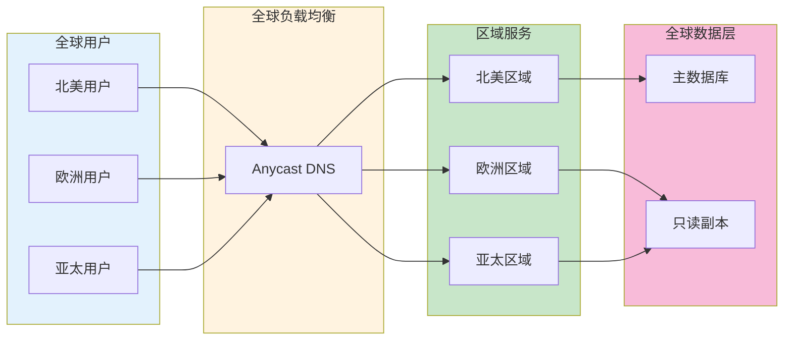
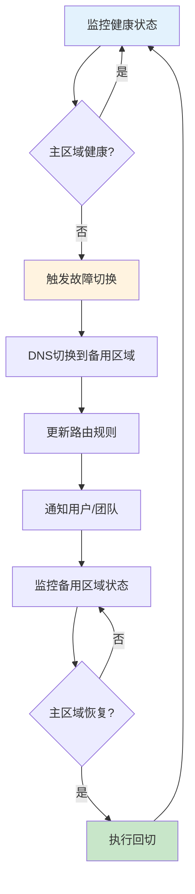

# 跨区域部署实践生产环境最佳实践

## 情境(Situation)

随着企业业务的全球化发展，跨区域部署已成为保障全球用户体验的关键需求。如何在多个地理区域部署服务，确保用户就近访问，同时保证数据一致性和服务可靠性，是一个复杂的挑战。

## 冲突(Conflict)

许多企业在跨区域部署方面面临以下挑战：
- **延迟问题**：用户距离服务端过远导致响应慢
- **数据一致性**：多区域数据同步困难
- **故障切换复杂**：跨区域故障转移需要协调
- **成本管理**：多区域部署成本较高
- **合规要求**：数据主权和隐私法规限制

## 问题(Question)

如何设计和实施跨区域部署架构，确保全球服务的高性能、高可用性和数据一致性？

## 答案(Answer)

本文将基于真实生产案例，提供一套完整的跨区域部署最佳实践指南。

---

## 一、跨区域架构设计

### 1.1 多区域架构模式



### 1.2 架构模式对比

| 模式 | 适用场景 | 优点 | 缺点 |
|:----:|----------|------|------|
| **主备模式** | 灾备场景 | 简单、成本低 | 故障切换时间长 |
| **主动-主动模式** | 全球分发 | 低延迟、高可用 | 数据一致性复杂 |
| **多活模式** | 大规模全球服务 | 高性能、高可用 | 复杂度高 |
| **边缘计算** | 低延迟场景 | 极致性能 | 边缘资源有限 |

---

## 二、全球负载均衡

### 2.1 Anycast DNS配置

```yaml
# Route 53 Anycast配置
{
  "Comment": "Global Load Balancing",
  "Changes": [
    {
      "Action": "UPSERT",
      "ResourceRecordSet": {
        "Name": "api.example.com",
        "Type": "A",
        "SetIdentifier": "us-east-1",
        "GeoLocation": {
          "ContinentCode": "NA"
        },
        "TTL": 300,
        "ResourceRecords": [
          { "Value": "1.2.3.4" }
        ]
      }
    },
    {
      "Action": "UPSERT",
      "ResourceRecordSet": {
        "Name": "api.example.com",
        "Type": "A",
        "SetIdentifier": "eu-west-1",
        "GeoLocation": {
          "ContinentCode": "EU"
        },
        "TTL": 300,
        "ResourceRecords": [
          { "Value": "5.6.7.8" }
        ]
      }
    },
    {
      "Action": "UPSERT",
      "ResourceRecordSet": {
        "Name": "api.example.com",
        "Type": "A",
        "SetIdentifier": "ap-east-1",
        "GeoLocation": {
          "ContinentCode": "AS"
        },
        "TTL": 300,
        "ResourceRecords": [
          { "Value": "9.10.11.12" }
        ]
      }
    }
  ]
}
```

### 2.2 健康检查配置

```yaml
# AWS Route 53健康检查
{
  "HealthCheckConfig": {
    "Type": "HTTPS",
    "FullyQualifiedDomainName": "api.example.com",
    "Port": 443,
    "ResourcePath": "/health",
    "RequestInterval": 30,
    "FailureThreshold": 3,
    "MeasureLatency": true,
    "Inverted": false,
    "HealthThreshold": 2
  },
  "HealthCheckTags": [
    {
      "Key": "Environment",
      "Value": "production"
    }
  ]
}
```

---

## 三、数据复制与一致性

### 3.1 多区域数据复制策略

```yaml
# 数据复制策略
data_replication:
  strategy: "active-passive"
  
  primary_region:
    name: "us-east-1"
    role: "read-write"
  
  secondary_regions:
    - name: "eu-west-1"
      role: "read-only"
      latency: "< 1 second"
    
    - name: "ap-east-1"
      role: "read-only"
      latency: "< 1 second"
  
  replication_mode: "async"
  sync_mode: "near-real-time"
```

### 3.2 数据库跨区域复制配置

```yaml
# AWS Aurora跨区域复制
Resources:
  PrimaryDBCluster:
    Type: AWS::RDS::DBCluster
    Properties:
      Engine: aurora-postgresql
      DBClusterIdentifier: primary-cluster
      MasterUsername: admin
      MasterUserPassword: password
      DatabaseName: myapp
  
  SecondaryDBCluster:
    Type: AWS::RDS::DBCluster
    Properties:
      Engine: aurora-postgresql
      DBClusterIdentifier: secondary-cluster
      SourceDBClusterIdentifier: !Ref PrimaryDBCluster
      DBSubnetGroupName: secondary-subnet-group
      VpcSecurityGroupIds:
        - !Ref SecondarySecurityGroup
```

### 3.3 数据一致性模型

| 一致性级别 | 说明 | 适用场景 |
|:---------:|------|----------|
| **强一致性** | 所有节点同时看到最新数据 | 金融交易、订单系统 |
| **最终一致性** | 数据最终会同步一致 | 内容分发、缓存 |
| **会话一致性** | 同一会话内一致 | 用户会话、购物车 |
| **因果一致性** | 因果相关操作保持一致 | 社交Feed、评论 |

---

## 四、CDN与边缘缓存

### 4.1 CDN配置

```yaml
# Cloudflare CDN配置
apiVersion: cloudflare.crossplane.io/v1alpha1
kind: Zone
metadata:
  name: example-com
spec:
  forProvider:
    zone: example.com
    plan: enterprise
  
---
apiVersion: cloudflare.crossplane.io/v1alpha1
kind: PageRule
metadata:
  name: static-caching
spec:
  forProvider:
    zoneRef:
      name: example-com
    target: "example.com/static/*"
    actions:
      - cacheLevel: "cache_everything"
        edgeTTL: 86400
        browserTTL: 3600
```

### 4.2 缓存策略

```yaml
# 缓存策略配置
cache_strategy:
  static_assets:
    pattern: "/static/*"
    ttl: 86400
    cache_level: "aggressive"
  
  api_responses:
    pattern: "/api/*"
    ttl: 60
    cache_level: "basic"
  
  html_pages:
    pattern: "/*.html"
    ttl: 300
    cache_level: "standard"
  
  images:
    pattern: "/*.{jpg,jpeg,png,gif,webp}"
    ttl: 604800
    optimization: true
```

---

## 五、故障切换与容灾

### 5.1 故障切换流程



### 5.2 故障切换配置

```yaml
# 故障切换配置
failover_config:
  monitoring:
    interval: 30s
    failure_threshold: 3
    recovery_threshold: 5
  
  dns_ttl:
    normal: 300s
    failover: 30s
  
  regions:
    - name: "us-east-1"
      priority: 1
      weight: 80
    
    - name: "eu-west-1"
      priority: 2
      weight: 20
    
    - name: "ap-east-1"
      priority: 3
      weight: 0
  
  notification:
    channels:
      - "slack"
      - "email"
      - "pagerduty"
    severity: "critical"
```

### 5.3 容灾演练流程

```yaml
# 容灾演练流程
dr_exercise:
  frequency: "每季度"
  duration: "4小时"
  
  objectives:
    - 验证故障切换流程
    - 测试数据恢复能力
    - 评估RTO/RPO
    - 检验团队响应能力
  
  steps:
    - step: "通知相关团队"
      duration: "30分钟"
    
    - step: "模拟主区域故障"
      duration: "15分钟"
    
    - step: "执行故障切换"
      duration: "30分钟"
    
    - step: "验证业务连续性"
      duration: "60分钟"
    
    - step: "执行回切"
      duration: "30分钟"
    
    - step: "总结复盘"
      duration: "60分钟"
  
  success_criteria:
    - "RTO < 15分钟"
    - "RPO < 5分钟"
    - "业务功能正常"
    - "数据一致性验证通过"
```

---

## 六、性能优化

### 6.1 延迟优化策略

```yaml
# 延迟优化策略
latency_optimization:
  dns:
    - "使用Anycast DNS"
    - "降低TTL"
    - "地理DNS解析"
  
  content_delivery:
    - "CDN加速"
    - "边缘计算"
    - "静态资源本地化"
  
  network:
    - "全球骨干网络"
    - "专线连接"
    - "优化路由"
  
  application:
    - "API网关就近部署"
    - "分布式缓存"
    - "异步处理"
```

### 6.2 性能监控

```yaml
# 性能监控指标
performance_metrics:
  latency:
    - name: "P50延迟"
      target: "< 200ms"
    
    - name: "P95延迟"
      target: "< 500ms"
    
    - name: "P99延迟"
      target: "< 1000ms"
  
  availability:
    - name: "区域可用性"
      target: "> 99.95%"
    
    - name: "全局可用性"
      target: "> 99.99%"
  
  throughput:
    - name: "请求处理能力"
      target: "> 100K QPS"
```

---

## 七、成本管理

### 7.1 多区域成本优化

```yaml
# 成本优化策略
cost_optimization:
  resource_rightsizing:
    - "根据负载调整实例大小"
    - "使用预留实例"
    - "自动伸缩"
  
  data_transfer:
    - "减少跨区域数据传输"
    - "使用本地副本"
    - "压缩数据"
  
  storage:
    - "冷热数据分离"
    - "生命周期策略"
    - "删除冗余数据"
  
  monitoring:
    - "关闭不必要的监控"
    - "优化日志保留期"
```

### 7.2 成本监控配置

```yaml
# 成本告警配置
cost_alerts:
  - name: "月度成本预警"
    threshold: "80% of budget"
    action: "通知"
  
  - name: "月度成本超支"
    threshold: "100% of budget"
    action: "通知 + 限制"
  
  - name: "异常成本增长"
    threshold: "20% week-over-week"
    action: "立即通知"
```

---

## 八、合规与数据主权

### 8.1 数据主权要求

```yaml
# 数据主权配置
data_sovereignty:
  regions:
    - name: "eu-west-1"
      regulations:
        - "GDPR"
      data_location: "EU only"
    
    - name: "ap-east-1"
      regulations:
        - "PDPA"
        - "网络安全法"
      data_location: "China only"
    
    - name: "us-east-1"
      regulations:
        - "CCPA"
      data_location: "US only"
  
  compliance:
    - "数据加密"
    - "访问审计"
    - "数据脱敏"
    - "跨境传输审批"
```

---

## 九、最佳实践总结

### 9.1 跨区域部署原则

| 原则 | 说明 | 实践建议 |
|:----:|------|----------|
| **就近访问** | 用户连接最近的区域 | 全球负载均衡+CDN |
| **数据一致性** | 确保多区域数据同步 | 选择合适的一致性模型 |
| **故障隔离** | 区域故障不影响其他区域 | 独立部署单元 |
| **成本优化** | 合理规划资源 | 预留实例+自动伸缩 |
| **合规优先** | 满足当地法规要求 | 数据本地化存储 |

### 9.2 常见问题与解决方案

| 问题 | 症状 | 解决方案 |
|:-----|:-----|:----------|
| **高延迟** | 用户响应慢 | CDN+边缘计算 |
| **数据不一致** | 多区域数据不同步 | 选择合适的复制策略 |
| **故障切换慢** | RTO过长 | 自动化故障切换 |
| **成本过高** | 多区域部署成本高 | 资源优化+预留实例 |
| **合规问题** | 数据跨境违规 | 数据本地化存储 |

---

## 总结

跨区域部署是构建全球服务的关键。通过合理的架构设计、全球负载均衡、数据复制策略和故障切换机制，可以确保全球用户获得一致的高性能体验。

> **延伸阅读**：更多跨区域部署相关面试题，请参考 [SRE面试题解析：基于JD与简历匹配分析]()。

---

## 参考资料

- [AWS Global Infrastructure](https://aws.amazon.com/about-aws/global-infrastructure/)
- [Google Cloud Regions](https://cloud.google.com/about/locations)
- [Azure Regions](https://azure.microsoft.com/en-us/global-infrastructure/geographies/)
- [Cloudflare Global Network](https://www.cloudflare.com/network/)
- [Anycast DNS](https://en.wikipedia.org/wiki/Anycast)
