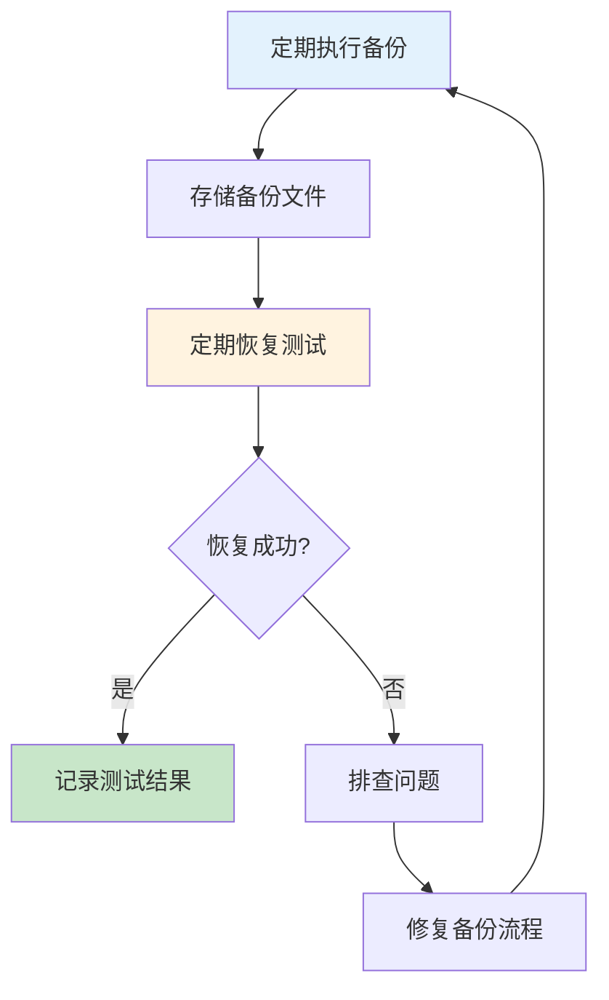

# 数据库运维经验生产环境最佳实践

## 情境(Situation)

数据库是企业应用的核心组件，数据库运维的质量直接影响业务的稳定性和可靠性。随着数据量的增长和业务复杂度的提高，数据库运维面临越来越多的挑战。

## 冲突(Conflict)

许多团队在数据库运维方面面临以下挑战：
- **数据丢失风险**：备份策略不完善，无法快速恢复
- **性能瓶颈**：查询慢、响应时间长
- **扩展性不足**：无法应对业务增长
- **故障恢复慢**：MTTR过长
- **安全隐患**：数据泄露风险

## 问题(Question)

如何建立一套完整的数据库运维体系，确保数据安全、性能稳定和高可用性？

## 答案(Answer)

本文将基于真实生产案例，提供一套完整的数据库运维最佳实践指南。

---

## 一、数据库备份策略

### 1.1 备份类型选择

| 备份类型 | 优点 | 缺点 | 适用场景 |
|:--------:|------|------|----------|
| **全量备份** | 恢复简单、完整 | 耗时较长、占用空间大 | 定期备份 |
| **增量备份** | 速度快、占用空间小 | 恢复复杂 | 日常备份 |
| **差异备份** | 介于全量和增量之间 | 需要基准备份 | 中等频率备份 |
| **日志备份** | 支持点时间恢复 | 需要持续维护 | 高可用场景 |

### 1.2 MySQL备份脚本

```bash
#!/bin/bash
# MySQL全量备份脚本

DATE=$(date +%Y%m%d_%H%M%S)
BACKUP_DIR="/backup/mysql"
DB_USER="backup_user"
DB_PASS="password"
MYSQL_HOST="localhost"

# 创建备份目录
mkdir -p $BACKUP_DIR

# 全量备份
mysqldump -h$MYSQL_HOST -u$DB_USER -p$DB_PASS --all-databases --single-transaction --master-data=2 > $BACKUP_DIR/full_backup_$DATE.sql

# 压缩备份文件
gzip $BACKUP_DIR/full_backup_$DATE.sql

# 删除7天前的备份
find $BACKUP_DIR -type f -name "*.sql.gz" -mtime +7 -exec rm {} \;

echo "Backup completed successfully: $BACKUP_DIR/full_backup_$DATE.sql.gz"
```

### 1.3 PostgreSQL备份脚本

```bash
#!/bin/bash
# PostgreSQL增量备份脚本

DATE=$(date +%Y%m%d_%H%M%S)
BACKUP_DIR="/backup/postgresql"
DB_NAME="myapp"
DB_USER="backup_user"

# 创建备份目录
mkdir -p $BACKUP_DIR

# 基础备份
pg_basebackup -D $BACKUP_DIR/base_$DATE -U $DB_USER -X stream -P

# WAL日志备份
psql -U $DB_USER -d $DB_NAME -c "SELECT pg_start_backup('incremental_backup');"
rsync -av /var/lib/postgresql/14/main/pg_wal/ $BACKUP_DIR/wal_$DATE/
psql -U $DB_USER -d $DB_NAME -c "SELECT pg_stop_backup();"

echo "Backup completed successfully: $BACKUP_DIR/base_$DATE"
```

### 1.4 备份恢复测试流程



---

## 二、数据库性能调优

### 2.1 性能调优流程


### 2.2 MySQL性能配置

```ini
# MySQL my.cnf 性能配置
[mysqld]
# 连接设置
max_connections = 500
wait_timeout = 60
interactive_timeout = 60

# 缓存设置
query_cache_type = 1
query_cache_size = 64M
query_cache_limit = 2M

# 内存设置
innodb_buffer_pool_size = 4G
innodb_log_file_size = 1G
innodb_log_buffer_size = 64M
innodb_flush_log_at_trx_commit = 1

# 查询优化
sort_buffer_size = 2M
join_buffer_size = 2M
tmp_table_size = 64M
max_heap_table_size = 64M

# 日志设置
slow_query_log = 1
slow_query_log_file = /var/log/mysql/slow.log
long_query_time = 2
```

### 2.3 PostgreSQL性能配置

```ini
# PostgreSQL postgresql.conf 性能配置
# 连接设置
max_connections = 200
superuser_reserved_connections = 10

# 内存设置
shared_buffers = 4GB
work_mem = 64MB
maintenance_work_mem = 512MB
effective_cache_size = 12GB

# 日志设置
log_min_duration_statement = 2000
log_statement = 'all'
log_query_stats = on

# 写入优化
wal_buffers = 16MB
checkpoint_completion_target = 0.9
max_wal_size = 4GB
min_wal_size = 1GB

# 查询优化
random_page_cost = 1.1
effective_io_concurrency = 200
```

### 2.4 慢查询分析

```sql
-- MySQL慢查询分析
SELECT 
    query_time, 
    lock_time, 
    rows_sent, 
    rows_examined, 
    sql_text 
FROM 
    mysql.slow_log 
WHERE 
    query_time > 2 
ORDER BY 
    query_time DESC 
LIMIT 10;

-- PostgreSQL慢查询分析
SELECT 
    queryid, 
    query, 
    calls, 
    total_time, 
    mean_time, 
    max_time 
FROM 
    pg_stat_statements 
WHERE 
    mean_time > 2000 
ORDER BY 
    total_time DESC 
LIMIT 10;
```

---

## 三、数据库高可用架构

### 3.1 MySQL主从复制

```yaml
# MySQL主从复制配置
apiVersion: v1
kind: ConfigMap
metadata:
  name: mysql-config
data:
  master.cnf: |
    [mysqld]
    server-id = 1
    log-bin = mysql-bin
    binlog-format = ROW
    innodb_flush_log_at_trx_commit = 1
    sync_binlog = 1
  
  slave.cnf: |
    [mysqld]
    server-id = 2
    relay-log = relay-bin
    read_only = 1
    log_slave_updates = 1
```

### 3.2 PostgreSQL流复制

```yaml
# PostgreSQL高可用配置
apiVersion: apps/v1
kind: StatefulSet
metadata:
  name: postgres-ha
spec:
  replicas: 3
  serviceName: postgres
  template:
    spec:
      containers:
      - name: postgres
        image: postgres:14
        env:
        - name: POSTGRES_PASSWORD
          value: password
        - name: POSTGRES_REPLICATION_MODE
          value: streaming
        - name: POSTGRES_REPLICATION_USER
          value: replicator
        - name: POSTGRES_REPLICATION_PASSWORD
          value: rep_password
        ports:
        - containerPort: 5432
        volumeMounts:
        - name: data
          mountPath: /var/lib/postgresql/data
  volumeClaimTemplates:
  - metadata:
      name: data
    spec:
      accessModes: [ "ReadWriteOnce" ]
      resources:
        requests:
          storage: 100Gi
```

### 3.3 高可用架构对比

| 架构 | 适用场景 | 优点 | 缺点 |
|:----:|----------|------|------|
| **主从复制** | 读多写少 | 简单、成熟 | 故障切换需要手动干预 |
| **MGR/Mesh** | 高可用要求高 | 自动故障转移 | 复杂度高 |
| **Paxos/Raft** | 分布式场景 | 强一致性 | 性能开销 |
| **云托管服务** | 追求稳定 | 托管运维 | 成本较高 |

---

## 四、数据库安全

### 4.1 访问控制

```yaml
# MySQL用户权限配置
CREATE USER 'app_user'@'192.168.1.%' IDENTIFIED BY 'secure_password';
GRANT SELECT, INSERT, UPDATE, DELETE ON myapp.* TO 'app_user'@'192.168.1.%';
FLUSH PRIVILEGES;

# PostgreSQL用户权限配置
CREATE ROLE app_user WITH LOGIN PASSWORD 'secure_password';
GRANT CONNECT ON DATABASE myapp TO app_user;
GRANT SELECT, INSERT, UPDATE, DELETE ON ALL TABLES IN SCHEMA public TO app_user;
ALTER DEFAULT PRIVILEGES IN SCHEMA public GRANT SELECT, INSERT, UPDATE, DELETE ON TABLES TO app_user;
```

### 4.2 数据加密

```yaml
# MySQL透明数据加密
ALTER TABLE sensitive_data 
MODIFY COLUMN password VARBINARY(256);

# PostgreSQL数据加密
CREATE EXTENSION pgcrypto;

INSERT INTO users (id, username, password)
VALUES (1, 'user1', crypt('password', gen_salt('bf')));

SELECT * FROM users WHERE username = 'user1' AND password = crypt('password', password);
```

### 4.3 审计日志

```yaml
# MySQL审计日志配置
[mysqld]
plugin-load-add=audit_log.so
audit_log_format=JSON
audit_log_file=/var/log/mysql/audit.log
audit_log_policy=ALL

# PostgreSQL审计日志配置
log_line_prefix = '%t [%p]: [%c-%l] user=%u,db=%d,app=%a,client=%h '
log_statement = 'all'
log_connections = on
log_disconnections = on
log_duration = on
```

---

## 五、数据库迁移与升级

### 5.1 迁移流程


### 5.2 数据迁移脚本

```bash
#!/bin/bash
# 数据库迁移脚本

SOURCE_HOST="old-db.example.com"
DEST_HOST="new-db.example.com"
DB_NAME="myapp"
DB_USER="migrate_user"

echo "=== 开始数据库迁移 ==="

# 从源数据库导出数据
echo "1. 导出数据..."
mysqldump -h$SOURCE_HOST -u$DB_USER -p --single-transaction $DB_NAME > dump.sql

# 传输到目标服务器
echo "2. 传输数据..."
scp dump.sql $DEST_HOST:/tmp/

# 导入到目标数据库
echo "3. 导入数据..."
ssh $DEST_HOST "mysql -u$DB_USER -p $DB_NAME < /tmp/dump.sql"

# 验证数据
echo "4. 验证数据..."
SOURCE_COUNT=$(mysql -h$SOURCE_HOST -u$DB_USER -p -e "SELECT COUNT(*) FROM users" $DB_NAME)
DEST_COUNT=$(mysql -h$DEST_HOST -u$DB_USER -p -e "SELECT COUNT(*) FROM users" $DB_NAME)

if [ "$SOURCE_COUNT" == "$DEST_COUNT" ]; then
    echo "✅ 数据验证成功"
else
    echo "❌ 数据验证失败"
    exit 1
fi

echo "=== 迁移完成 ==="
```

---

## 六、监控与告警

### 6.1 监控指标

| 指标类型 | 关键指标 | 告警阈值 |
|:--------:|----------|----------|
| **连接数** | active_connections | > 80% max_connections |
| **查询性能** | slow_queries | > 10次/分钟 |
| **缓存命中率** | query_cache_hit_rate | < 90% |
| **IO性能** | disk_io_wait | > 50% |
| **复制状态** | seconds_behind_master | > 300秒 |
| **存储空间** | disk_usage | > 80% |

### 6.2 Prometheus监控配置

```yaml
# Prometheus MySQL监控配置
- job_name: 'mysql'
  static_configs:
    - targets: ['mysql:9104']
  metrics_path: /metrics
  scrape_interval: 30s

# Prometheus PostgreSQL监控配置
- job_name: 'postgresql'
  static_configs:
    - targets: ['postgres:9187']
  metrics_path: /metrics
  scrape_interval: 30s
```

### 6.3 告警规则

```yaml
# Prometheus告警规则
groups:
- name: database_alerts
  rules:
  - alert: MySQLHighConnectionUsage
    expr: mysql_global_status_threads_connected / mysql_global_variables_max_connections > 0.8
    for: 5m
    labels:
      severity: warning
    annotations:
      summary: "MySQL连接使用率过高"
      description: "当前连接数: {{ $value }}%"
  
  - alert: PostgreSQLReplicationLag
    expr: pg_replication_lag_seconds > 300
    for: 5m
    labels:
      severity: critical
    annotations:
      summary: "PostgreSQL复制延迟"
      description: "延迟时间: {{ $value }}秒"
```

---

## 七、最佳实践总结

### 7.1 数据库运维原则

| 原则 | 说明 | 实践建议 |
|:----:|------|----------|
| **定期备份** | 确保数据可恢复 | 全量+增量+日志备份 |
| **性能监控** | 及时发现问题 | Prometheus + Grafana |
| **安全第一** | 保护数据安全 | 最小权限、加密存储 |
| **高可用** | 确保业务连续性 | 主从复制、自动故障转移 |
| **持续优化** | 不断提升性能 | 慢查询分析、索引优化 |

### 7.2 常见问题与解决方案

| 问题 | 症状 | 解决方案 |
|:-----|:-----|:----------|
| **查询慢** | 响应时间长 | 分析慢查询、优化索引 |
| **连接数满** | 无法建立新连接 | 调整max_connections、优化连接池 |
| **复制延迟** | 从库数据落后 | 检查网络、优化主库写入 |
| **磁盘空间不足** | 写入失败 | 清理日志、扩容存储 |
| **数据不一致** | 主从不一致 | 重新同步、检查复制配置 |

---

## 总结

数据库运维是保障业务稳定的关键环节。通过建立完善的备份策略、持续性能调优、高可用架构设计和安全防护措施，可以确保数据库系统的稳定运行。

> **延伸阅读**：更多数据库运维相关面试题，请参考 [SRE面试题解析：基于JD与简历匹配分析]()。

---

## 参考资料

- [MySQL官方文档](https://dev.mysql.com/doc/)
- [PostgreSQL官方文档](https://www.postgresql.org/docs/)
- [Oracle官方文档](https://docs.oracle.com/en/database/)
- [Percona Toolkit](https://www.percona.com/software/database-tools/percona-toolkit)
- [pgHero](https://pghero.herokuapp.com/)
