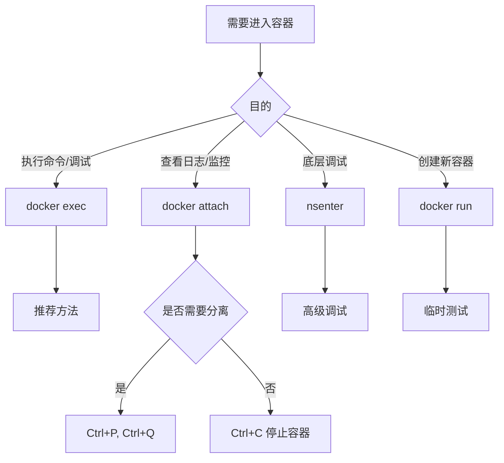

# Docker容器进入方法生产环境最佳实践：从基础到高级

## 情境(Situation)

在容器化技术广泛应用的今天，Docker已经成为企业级应用部署的标准工具。作为SRE工程师，我们经常需要进入容器内部执行命令，进行调试、配置修改、日志查看等操作。进入容器是日常运维工作中的基本操作，但不同的进入方法有不同的特点和适用场景。

选择合适的容器进入方法，不仅可以提高工作效率，还可以避免不必要的问题，如误停止容器、影响其他用户等。因此，掌握各种容器进入方法及其适用场景，是SRE工程师的必备技能。

## 冲突(Conflict)

在实际应用中，SRE工程师经常面临以下挑战：

- **方法选择**：不知道何时使用哪种进入方法
- **操作风险**：使用不当可能导致容器停止或影响服务
- **环境限制**：某些容器可能没有bash或其他shell
- **权限问题**：进入容器后没有足够的权限执行操作
- **高级调试**：需要底层访问时的方法选择

## 问题(Question)

如何选择合适的Docker容器进入方法，在保证服务稳定的同时，高效完成运维和调试任务？

## 答案(Answer)

本文将从SRE视角出发，详细介绍Docker容器的四种进入方法及其适用场景，提供一套完整的生产环境最佳实践。核心方法论基于 [SRE面试题解析：如何进入一个容器执行命令？](#42-如何进入一个容器执行命令)。

---

## 一、容器进入方法概述

### 1.1 四种进入方法

**Docker提供了四种主要的容器进入方法**：

| 方法 | 命令 | 特点 | 适用场景 | 推荐度 |
|:------|:------|:------|:----------|:--------|
| **docker exec** | `docker exec -it <容器> /bin/bash` | 推荐方法，独立会话 | 管理调试 | ⭐⭐⭐⭐⭐ |
| **docker attach** | `docker attach <容器>` | 共享主进程终端 | 查看日志 | ⭐⭐⭐ |
| **nsenter** | `nsenter --target $PID --mount...` | 底层命名空间访问 | 高级调试 | ⭐⭐⭐ |
| **docker run** | `docker run -it <镜像> /bin/bash` | 创建新容器 | 临时测试 | ⭐⭐ |

### 1.2 选择流程

**容器进入方法选择流程**：



---

## 二、详细方法说明

### 2.1 docker exec（推荐）

**`docker exec`** 是Docker官方推荐的容器进入方法，它会在容器内创建一个新的进程，不会影响容器的主进程。

**基本语法**：
```bash
docker exec [OPTIONS] CONTAINER COMMAND [ARG...]
```

**常用选项**：
- `-i, --interactive`：保持标准输入打开
- `-t, --tty`：分配伪终端
- `-d, --detach`：后台执行
- `-u, --user`：指定用户

**示例**：

```bash
# 进入容器并打开bash
docker exec -it <容器ID或名称> /bin/bash

# 执行单条命令
docker exec <容器ID或名称> ls -la /etc

# 后台执行命令
docker exec -d <容器ID或名称> <命令>

# 指定用户执行命令
docker exec -u root <容器ID或名称> <命令>

# 执行多条命令
docker exec <容器ID或名称> sh -c "echo hello && ls -la"
```

**优点**：
- 创建独立会话，不影响容器主进程
- 支持后台执行
- 可以指定用户
- 适用于大多数场景

**缺点**：
- 需要容器正在运行
- 某些轻量级容器可能没有bash

### 2.2 docker attach

**`docker attach`** 会连接到容器的主进程终端，共享同一个终端会话。

**基本语法**：
```bash
docker attach [OPTIONS] CONTAINER
```

**常用选项**：
- `--no-stdin`：不附加标准输入
- `--sig-proxy`：代理信号到容器（默认true）

**示例**：

```bash
# 附加到容器
docker attach <容器ID或名称>

# 安全退出（不停止容器）
# 按 Ctrl+P, Ctrl+Q

# 停止容器
# 按 Ctrl+C
```

**优点**：
- 直接查看容器主进程的输出
- 适合监控日志

**缺点**：
- 共享终端，可能影响其他用户
- Ctrl+C会停止容器
- 退出方式不够直观

### 2.3 nsenter

**`nsenter`** 是Linux系统工具，可以进入指定进程的命名空间，是一种底层的容器进入方法。

**安装**：
```bash
# Debian/Ubuntu
apt install util-linux

# RedHat/CentOS
yum install util-linux
```

**使用**：

```bash
# 获取容器PID
PID=$(docker inspect --format '{{.State.Pid}}' <容器ID或名称>)

# 进入所有命名空间
nsenter --target $PID --mount --uts --ipc --net --pid

# 进入指定命名空间
nsenter --target $PID --mount --net
```

**优点**：
- 底层访问，功能强大
- 可以进入任何命名空间
- 适用于高级调试

**缺点**：
- 需要安装额外工具
- 操作复杂
- 安全性较低

### 2.4 docker run

**`docker run`** 不是直接进入现有容器，而是创建一个新的容器并进入。

**基本语法**：
```bash
docker run [OPTIONS] IMAGE [COMMAND] [ARG...]
```

**常用选项**：
- `-i, --interactive`：保持标准输入打开
- `-t, --tty`：分配伪终端
- `--rm`：容器退出后自动删除

**示例**：

```bash
# 创建并进入新容器
docker run -it --name <容器名> <镜像> /bin/bash

# 创建临时容器（退出后自动删除）
docker run -it --rm <镜像> /bin/bash

# 挂载卷并进入容器
docker run -it -v /host/data:/container/data <镜像> /bin/bash
```

**优点**：
- 适合临时测试
- 可以使用不同的配置

**缺点**：
- 不是进入现有容器
- 会创建新的容器实例

---

## 三、生产环境最佳实践

### 3.1 方法选择指南

**根据场景选择合适的方法**：

| 场景 | 推荐方法 | 原因 |
|:------|:----------|:------|
| **日常管理和调试** | `docker exec` | 独立会话，不影响主进程 |
| **查看容器日志输出** | `docker attach` | 直接查看主进程输出 |
| **高级系统调试** | `nsenter` | 底层访问，功能强大 |
| **临时测试和验证** | `docker run` | 隔离环境，不影响现有容器 |
| **执行单条命令** | `docker exec` | 简洁高效 |
| **后台执行任务** | `docker exec -d` | 不阻塞终端 |
| **需要root权限** | `docker exec -u root` | 提权操作 |

### 3.2 安全最佳实践

**安全考虑**：

1. **最小权限原则**：
   - 使用非root用户进入容器
   - 仅授予必要的权限

2. **访问控制**：
   - 限制谁可以进入容器
   - 记录进入容器的操作

3. **命令执行**：
   - 避免在容器内执行危险命令
   - 验证命令的安全性

4. **网络安全**：
   - 避免在容器内暴露敏感信息
   - 注意网络访问控制

**示例**：

```bash
# 使用非root用户进入容器
docker exec -it -u appuser <容器> /bin/bash

# 执行安全的命令
docker exec <容器> ls -la /app

# 避免执行危险命令
# 危险：docker exec <容器> rm -rf /
```

### 3.3 常见问题解决方案

**常见问题**：

| 问题 | 解决方案 |
|:------|:----------|
| **容器中无bash** | 使用`/bin/sh`或其他可用shell |
| **无法进入容器** | 确认容器状态`docker ps`，检查容器是否运行 |
| **attach后无法退出** | 使用`Ctrl+P, Ctrl+Q`分离 |
| **exec退出后容器停止** | 检查容器启动命令是否为前台运行 |
| **权限不足** | 使用`-u root`选项提权 |
| **命令执行失败** | 检查命令是否存在，使用绝对路径 |

**解决方案示例**：

```bash
# 容器中无bash，使用sh
docker exec -it <容器> /bin/sh

# 检查容器状态
docker ps | grep <容器名>

# 提权执行命令
docker exec -u root <容器> <命令>

# 使用绝对路径执行命令
docker exec <容器> /usr/bin/ls
```

### 3.4 自动化脚本

**容器进入脚本**：

```bash
#!/bin/bash

# Docker容器进入脚本

set -e

USAGE="Usage: $0 <container-name or id> [shell]"

if [ $# -lt 1 ]; then
    echo "$USAGE"
    exit 1
fi

CONTAINER=$1
SHELL=${2:-/bin/bash}

# 检查容器是否存在
if ! docker ps -a | grep -q "$CONTAINER"; then
    echo "错误: 容器 $CONTAINER 不存在"
    exit 1
fi

# 检查容器是否运行
if ! docker ps | grep -q "$CONTAINER"; then
    echo "警告: 容器 $CONTAINER 未运行，尝试启动..."
    docker start "$CONTAINER"
    sleep 2
fi

# 尝试进入容器
echo "尝试进入容器 $CONTAINER 使用 $SHELL..."

# 先尝试使用指定shell
docker exec -it "$CONTAINER" "$SHELL"

# 如果失败，尝试使用sh
if [ $? -ne 0 ]; then
    echo "$SHELL 不可用，尝试使用 /bin/sh..."
    docker exec -it "$CONTAINER" /bin/sh
fi

# 如果仍然失败，尝试其他shell
if [ $? -ne 0 ]; then
    echo "无法进入容器，尝试执行单条命令..."
    docker exec -it "$CONTAINER" ls -la
fi
```

**批量执行命令脚本**：

```bash
#!/bin/bash

# 批量在多个容器中执行命令

set -e

if [ $# -lt 1 ]; then
    echo "Usage: $0 <command> [container-pattern]"
    exit 1
fi

COMMAND="$1"
PATTERN=${2:-.*}

# 获取匹配的容器
CONTAINERS=$(docker ps --format '{{.Names}}' | grep "$PATTERN")

if [ -z "$CONTAINERS" ]; then
    echo "没有找到匹配的容器"
    exit 0
fi
echo "在以下容器中执行命令: $COMMAND"
echo "================================"

for CONTAINER in $CONTAINERS; do
    echo "\n容器: $CONTAINER"
    echo "--------------------------------"
    docker exec "$CONTAINER" sh -c "$COMMAND"
done

echo "\n================================"
echo "命令执行完成"
```

### 3.5 监控与审计

**进入容器操作监控**：

1. **命令记录**：
   - 记录谁进入了容器
   - 记录执行了什么命令
   - 记录操作时间

2. **审计日志**：
   - 配置Docker日志记录
   - 集中化日志收集
   - 定期审计容器操作

3. **告警机制**：
   - 对异常操作进行告警
   - 监控容器进入频率
   - 检测危险命令执行

**示例**：

```bash
# 启用Docker审计
# 在/etc/docker/daemon.json中添加
{
  "log-driver": "json-file",
  "log-opts": {
    "max-size": "10m",
    "max-file": "3"
  }
}

# 重启Docker
systemctl restart docker

# 查看容器日志
docker logs <容器>
```

---

## 四、高级技巧与工具

### 4.1 高级进入技巧

**1. 使用不同的shell**：

```bash
# 使用bash
docker exec -it <容器> /bin/bash

# 使用sh
docker exec -it <容器> /bin/sh

# 使用ash（Alpine容器）
docker exec -it <容器> /bin/ash

# 使用zsh
docker exec -it <容器> /bin/zsh
```

**2. 进入容器的网络命名空间**：

```bash
# 获取容器PID
PID=$(docker inspect --format '{{.State.Pid}}' <容器>)

# 进入网络命名空间
nsenter --target $PID --net ip addr

# 在容器网络命名空间中执行命令
nsenter --target $PID --net ping google.com
```

**3. 使用docker-compose进入容器**：

```bash
# 使用docker-compose进入容器
docker-compose exec <服务名> /bin/bash

# 示例：进入web服务容器
docker-compose exec web /bin/bash
```

**4. 进入Kubernetes Pod**：

```bash
# 进入Pod中的容器
kubectl exec -it <pod名> -- /bin/bash

# 进入Pod中的特定容器
kubectl exec -it <pod名> -c <容器名> -- /bin/bash
```

### 4.2 第三方工具

**1. docker-enter**：
- 简化nsenter命令
- 提供更友好的接口

**2. lazydocker**：
- 终端UI工具
- 可视化管理容器
- 支持进入容器

**3. Portainer**：
- Web界面管理容器
- 支持点击进入容器
- 适合团队使用

**4. Docker Desktop**：
- 图形界面
- 支持点击进入容器
- 适合开发环境

### 4.3 性能优化

**进入容器的性能考虑**：

1. **减少进入频率**：
   - 使用自动化脚本
   - 集中化管理工具

2. **优化命令执行**：
   - 批量执行命令
   - 使用后台执行

3. **网络优化**：
   - 使用本地容器
   - 优化网络连接

4. **资源限制**：
   - 限制进入容器的资源使用
   - 避免在容器内执行高资源消耗命令

**示例**：

```bash
# 批量执行命令
docker ps --format '{{.Names}}' | xargs -I {} docker exec {} <命令>

# 后台执行命令
docker exec -d <容器> <命令>

# 限制资源使用
docker exec --cpu-shares 1024 --memory 512m <容器> <命令>
```

---

## 五、企业级解决方案

### 5.1 容器管理平台

**1. Rancher**：
- 企业级容器管理平台
- 支持多集群管理
- 提供Web界面进入容器
- 集成监控和告警

**2. Portainer**：
- 轻量级容器管理界面
- 支持Docker和Kubernetes
- 一键进入容器
- 适合中小型环境

**3. Docker Enterprise**：
- 企业级Docker解决方案
- 提供高级安全特性
- 集成身份验证
- 支持审计和合规

### 5.2 CI/CD集成

**1. GitLab CI/CD**：
- 集成容器进入功能
- 自动化测试和调试
- 支持容器内命令执行

**2. Jenkins**：
- 丰富的Docker插件
- 支持在容器内执行构建
- 自动化部署和测试

**3. GitHub Actions**：
- 基于事件的自动化
- 支持Docker容器操作
- 简洁的配置语法

### 5.3 安全管理

**1. 身份验证和授权**：
- 集成LDAP/AD
- 基于角色的访问控制
- 审计日志

**2. 容器安全扫描**：
- 扫描容器漏洞
- 检查配置安全
- 合规性验证

**3. 网络隔离**：
- 容器网络策略
- 访问控制列表
- 网络流量监控

---

## 六、最佳实践总结

### 6.1 核心原则

**选择合适的方法**：
- 根据场景选择最适合的进入方法
- 优先使用`docker exec`
- 仅在必要时使用`nsenter`

**安全第一**：
- 使用最小权限原则
- 避免在容器内执行危险命令
- 记录和审计容器操作

**效率优先**：
- 使用自动化脚本
- 批量执行命令
- 优化进入流程

**可靠性**：
- 确保容器状态正常
- 备份重要数据
- 测试进入方法

### 6.2 配置建议

**生产环境配置清单**：
- [ ] 优先使用`docker exec`进入容器
- [ ] 为容器配置合适的shell
- [ ] 启用Docker日志记录
- [ ] 建立容器进入的操作规范
- [ ] 定期审计容器操作
- [ ] 配置监控和告警
- [ ] 培训团队成员正确使用进入方法
- [ ] 建立应急响应流程

**推荐命令**：
- **日常管理**：`docker exec -it <容器> /bin/bash`
- **查看日志**：`docker attach <容器>`
- **执行单条命令**：`docker exec <容器> <命令>`
- **后台执行**：`docker exec -d <容器> <命令>`
- **提权操作**：`docker exec -u root <容器> <命令>`

### 6.3 经验总结

**常见误区**：
- **使用错误的方法**：在不适合的场景使用`docker attach`
- **操作不当**：使用`Ctrl+C`退出`docker attach`导致容器停止
- **权限过度**：总是使用root用户进入容器
- **缺乏监控**：没有记录容器进入操作
- **忽视安全**：在容器内执行危险命令

**成功经验**：
- **标准化操作**：建立统一的容器进入规范
- **自动化管理**：使用脚本和工具自动化操作
- **安全意识**：优先考虑安全性
- **监控预警**：及时发现和处理异常
- **持续学习**：掌握新的工具和技术

---

## 总结

Docker容器的进入方法是SRE工程师日常工作中的基本技能，选择合适的方法可以提高工作效率，避免不必要的问题。通过本文的指导，我们了解了四种主要的容器进入方法及其适用场景，掌握了生产环境中的最佳实践。

**核心要点**：

1. **`docker exec`**：推荐方法，创建独立会话，适用于大多数场景
2. **`docker attach`**：共享主进程终端，适合查看日志
3. **`nsenter`**：底层访问，功能强大，适用于高级调试
4. **`docker run`**：创建新容器，适合临时测试
5. **安全最佳实践**：使用最小权限，记录操作，避免危险命令
6. **企业级解决方案**：容器管理平台，CI/CD集成，安全管理

通过建立规范的容器进入流程，使用合适的工具和方法，我们可以更高效、更安全地管理和调试容器，确保服务的稳定运行。

> **延伸学习**：更多面试相关的容器进入方法知识，请参考 [SRE面试题解析：如何进入一个容器执行命令？](#42-如何进入一个容器执行命令)。

---

## 参考资料

- [Docker官方文档 - docker exec](https://docs.docker.com/engine/reference/commandline/exec/)
- [Docker官方文档 - docker attach](https://docs.docker.com/engine/reference/commandline/attach/)
- [nsenter命令](https://man7.org/linux/man-pages/man1/nsenter.1.html)
- [Docker官方文档 - docker run](https://docs.docker.com/engine/reference/commandline/run/)
- [Docker Compose](https://docs.docker.com/compose/)
- [Kubernetes exec](https://kubernetes.io/docs/tasks/debug-application-cluster/get-shell-running-container/)
- [Rancher](https://rancher.com/)
- [Portainer](https://www.portainer.io/)
- [Docker Enterprise](https://www.docker.com/products/docker-enterprise)
- [GitLab CI/CD](https://docs.gitlab.com/ee/ci/)
- [Jenkins](https://www.jenkins.io/)
- [GitHub Actions](https://github.com/features/actions)
- [lazydocker](https://github.com/jesseduffield/lazydocker)
- [docker-enter](https://github.com/jpetazzo/nsenter)
- [Docker Desktop](https://www.docker.com/products/docker-desktop)
- [容器安全最佳实践](https://docs.docker.com/engine/security/)