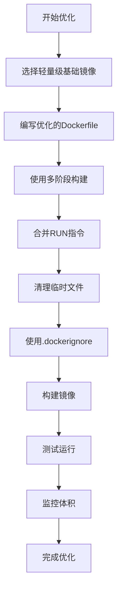

# Docker容器优化生产环境最佳实践：如何让容器变得更小

## 情境(Situation)

在容器化技术广泛应用的今天，Docker已经成为企业级应用部署的标准工具。然而，随着容器数量的增加，镜像体积过大的问题日益凸显。大型镜像不仅占用存储空间，还会影响传输速度和部署效率，同时也增加了安全攻击面。

作为SRE工程师，我们需要掌握容器优化的关键方法，通过合理的策略减小镜像体积，提高部署速度和安全性。本文将从SRE视角出发，详细介绍Docker容器优化的最佳实践。

## 冲突(Conflict)

在实际应用中，SRE工程师经常面临以下挑战：

- **镜像体积过大**：构建出的镜像体积庞大，占用存储空间，影响传输和部署速度
- **构建速度慢**：每次构建都需要重新下载依赖，浪费时间和资源
- **安全隐患**：大型镜像包含更多的软件包和依赖，增加了安全攻击面
- **部署效率低**：大型镜像部署时间长，影响CI/CD流水线的效率
- **存储成本高**：大型镜像占用更多的存储空间，增加了存储成本

## 问题(Question)

如何通过合理的优化策略，减小Docker容器的体积，提高部署效率和安全性？

## 答案(Answer)

本文将从SRE视角出发，详细介绍Docker容器优化的关键方法，提供一套完整的生产环境解决方案。核心方法论基于 [SRE面试题解析：如何让docker容器变得更小？](#44-如何让docker容器变得更小)。

---

## 一、容器优化概述

### 1.1 优化的重要性

**容器体积优化的重要性**：

- **存储空间**：减小镜像体积，节省存储空间
- **传输速度**：加快镜像拉取和推送速度
- **部署效率**：缩短容器启动时间，提高部署效率
- **安全攻击面**：减少镜像中的软件包和依赖，降低安全风险
- **CI/CD效率**：加快构建和部署速度，提高CI/CD流水线效率
- **成本节约**：减少存储和网络传输成本

### 1.2 优化方法对比

**Docker容器优化方法对比**：

| 方法 | 效果 | 实施难度 | 适用场景 |
|:------|:------|:----------|:----------|
| **轻量级基础镜像** | ⭐⭐⭐⭐⭐ | 低 | 所有场景 |
| **多阶段构建** | ⭐⭐⭐⭐⭐ | 中 | 复杂应用 |
| **合并RUN指令** | ⭐⭐⭐ | 低 | 所有场景 |
| **清理临时文件** | ⭐⭐⭐ | 低 | 所有场景 |
| **.dockerignore** | ⭐⭐⭐ | 低 | 所有场景 |
| **最小化安装** | ⭐⭐⭐⭐ | 中 | 生产环境 |
| **文件压缩** | ⭐⭐ | 低 | 静态文件 |
| **Docker Squash** | ⭐⭐⭐ | 中 | 最终优化 |

### 1.3 优化流程

**Docker容器优化流程**：



---

## 二、核心优化方法

### 2.1 选择轻量级基础镜像

**基础镜像对比**：

| 基础镜像 | 体积 | 特点 | 适用场景 |
|:----------|:------|:------|:----------|
| **Alpine** | ~5MB | 轻量，安全 | 大多数应用 |
| **BusyBox** | ~1MB | 极简，功能有限 | 简单应用 |
| **Distroless** | ~20MB | 无发行版，安全 | 生产环境 |
| **Scratch** | 0MB | 完全空 | 静态编译应用 |
| **Debian Slim** | ~20MB | 轻量，兼容性好 | 需要更多工具的应用 |
| **Ubuntu Minimal** | ~40MB | 轻量，兼容性好 | 需要Ubuntu生态的应用 |

**最佳实践**：
- 优先选择Alpine作为基础镜像
- 对于需要特定发行版的应用，选择对应的轻量版本
- 对于静态编译的应用，使用Scratch镜像
- 对于安全性要求高的应用，使用Distroless镜像

**示例**：

```dockerfile
# 推荐：使用Alpine基础镜像
FROM alpine:3.14

# 推荐：使用Distroless镜像
FROM gcr.io/distroless/base-debian10

# 推荐：使用Scratch镜像（静态编译应用）
FROM scratch
COPY myapp /
CMD ["/myapp"]
```

### 2.2 优化Dockerfile

#### 2.2.1 合并RUN指令

**原理**：每执行一条RUN指令，Docker会创建一层新的镜像层。合并RUN指令可以减少镜像层数，减小镜像体积。

**最佳实践**：
- 使用`&&`连接多条命令
- 在同一层中清理临时文件
- 避免不必要的分层

**示例**：

```dockerfile
# 优化前
RUN apt-get update
RUN apt-get install -y nginx
RUN apt-get clean

# 优化后
RUN apt-get update && \
    apt-get install -y nginx && \
    apt-get clean && \
    rm -rf /var/lib/apt/lists/*
```

#### 2.2.2 清理临时文件

**原理**：清理临时文件可以减小镜像体积，避免不必要的文件占用空间。

**最佳实践**：
- 清理包管理器缓存
- 清理构建临时文件
- 清理日志文件
- 清理编译过程中的中间文件

**示例**：

```dockerfile
# 清理apt缓存
RUN apt-get clean && rm -rf /var/lib/apt/lists/*

# 清理npm缓存
RUN npm install --production && npm cache clean --force

# 清理pip缓存
RUN pip install --no-cache-dir -r requirements.txt

# 清理yum缓存
RUN yum install -y nginx && \
    yum clean all && \
    rm -rf /var/cache/yum/*

# 清理apk缓存
RUN apk add --no-cache nginx
```

#### 2.2.3 多阶段构建

**原理**：多阶段构建可以分离构建环境和运行环境，只将必要的文件复制到最终镜像中。

**最佳实践**：
- 使用多个FROM指令
- 为每个阶段指定名称
- 使用`COPY --from`复制文件
- 只保留运行时必要的文件

**示例**：

```dockerfile
# 构建阶段
FROM node:14-alpine AS builder
WORKDIR /app
COPY package*.json ./
RUN npm install
COPY . .
RUN npm run build

# 运行阶段
FROM nginx:alpine
COPY --from=builder /app/build /usr/share/nginx/html
EXPOSE 80
CMD ["nginx", "-g", "daemon off;"]
```

**多阶段构建的优势**：
- 减小最终镜像体积
- 提高构建速度
- 分离构建和运行环境
- 减少安全攻击面

### 2.3 文件系统优化

#### 2.3.1 使用.dockerignore

**原理**：`.dockerignore`文件可以排除不需要复制到镜像中的文件，减小镜像体积。

**最佳实践**：
- 排除开发相关文件（如.git、node_modules）
- 排除测试文件
- 排除日志文件
- 排除临时文件

**示例**：

```dockerfile
# .dockerignore文件

# 排除版本控制文件
.git
.gitignore

# 排除开发依赖
node_modules
npm-debug.log*
yarn-debug.log*
yarn-error.log*

# 排除测试文件
test/
__tests__/

# 排除构建产物
build/
dist/

# 排除环境文件
.env
.env.local
.env.development.local
.env.test.local
.env.production.local

# 排除操作系统文件
.DS_Store
Thumbs.db

# 排除IDE文件
.vscode/
.idea/
```

#### 2.3.2 最小化文件复制

**原理**：只复制必要的文件到镜像中，避免复制不必要的文件。

**最佳实践**：
- 先复制依赖文件，再复制应用代码
- 使用明确的文件路径，避免使用通配符
- 只复制运行时必要的文件

**示例**：

```dockerfile
# 推荐：先复制依赖文件
COPY package*.json ./
RUN npm install

# 再复制应用代码
COPY src/ /app/src/
COPY public/ /app/public/

# 不推荐：使用通配符
# COPY . /app/
```

### 2.4 包管理优化

#### 2.4.1 最小化安装

**原理**：只安装必要的软件包，避免安装不必要的依赖。

**最佳实践**：
- 使用`--no-install-recommends`（Debian/Ubuntu）
- 使用`--no-cache`（Alpine）
- 只安装运行时依赖，不安装开发依赖
- 避免安装调试工具（在生产环境中）

**示例**：

```dockerfile
# Debian/Ubuntu
RUN apt-get update && \
    apt-get install --no-install-recommends -y nginx && \
    apt-get clean && \
    rm -rf /var/lib/apt/lists/*

# Alpine
RUN apk add --no-cache nginx

# 只安装运行时依赖
RUN npm install --production

# 只安装必要的Python包
RUN pip install --no-cache-dir -r requirements.txt
```

#### 2.4.2 优化依赖管理

**原理**：优化依赖管理，减少不必要的依赖。

**最佳实践**：
- 使用锁定文件（package-lock.json、Pipfile.lock等）
- 定期更新依赖
- 移除未使用的依赖
- 使用轻量级替代库

**示例**：

```bash
# 清理未使用的npm依赖
npm prune

# 清理未使用的pip依赖
pip uninstall -y $(pip list --format=freeze | grep -v "^-e" | cut -d= -f1 | xargs pip show -f | grep -E "(Location:|Files:)")

# 优化Composer依赖
composer install --no-dev --optimize-autoloader
```

### 2.5 高级优化方法

#### 2.5.1 文件压缩

**原理**：压缩静态文件，减小文件体积。

**最佳实践**：
- 压缩HTML、CSS、JavaScript文件
- 使用gzip或brotli压缩
- 在构建过程中进行压缩

**示例**：

```dockerfile
# 压缩静态文件
RUN apt-get update && \
    apt-get install -y gzip && \
    find /app -name "*.html" -o -name "*.css" -o -name "*.js" | xargs gzip -9

# 使用brotli压缩
RUN apt-get update && \
    apt-get install -y brotli && \
    find /app -name "*.html" -o -name "*.css" -o -name "*.js" | xargs brotli -9
```

#### 2.5.2 Docker Squash

**原理**：Docker Squash可以将多个镜像层压缩成一个层，减小镜像体积。

**最佳实践**：
- 在构建完成后使用Docker Squash
- 只对最终镜像进行压缩
- 注意：压缩层会丢失层缓存

**示例**：

```bash
# 安装docker-squash
pip install docker-squash

# 构建镜像
docker build -t myapp .

# 压缩镜像
docker-squash -t myapp:squashed myapp
```

#### 2.5.3 静态编译

**原理**：静态编译可以将所有依赖打包到可执行文件中，减少运行时依赖。

**最佳实践**：
- 使用Go、Rust等支持静态编译的语言
- 静态编译应用
- 使用Scratch镜像作为基础

**示例**：

```dockerfile
# 构建阶段
FROM golang:1.16-alpine AS builder
WORKDIR /app
COPY . .
RUN CGO_ENABLED=0 GOOS=linux go build -a -installsuffix cgo -o myapp .

# 运行阶段
FROM scratch
COPY --from=builder /app/myapp /
CMD ["/myapp"]
```

---

## 三、生产环境最佳实践

### 3.1 构建优化

**1. 构建缓存**：
- 按变化频率排序指令
- 先复制依赖文件，再复制应用代码
- 使用构建缓存提高构建速度

**2. 构建参数**：
- 使用`--build-arg`传递构建参数
- 避免硬编码配置
- 支持多环境构建

**3. 构建工具**：
- 使用Docker BuildKit提高构建速度
- 集成CI/CD流水线
- 自动化构建和部署

**示例**：

```bash
# 使用Docker BuildKit
export DOCKER_BUILDKIT=1
docker build -t myapp .

# 使用构建参数
docker build --build-arg VERSION=1.0 --build-arg NODE_ENV=production -t myapp .
```

### 3.2 镜像管理

**1. 标签管理**：
- 使用语义化版本标签
- 避免使用latest标签
- 定期清理旧镜像

**2. 镜像扫描**：
- 使用容器安全扫描工具
- 检测镜像中的漏洞
- 确保镜像安全性

**3. 镜像仓库**：
- 使用私有镜像仓库
- 配置镜像仓库缓存
- 优化镜像拉取速度

**示例**：

```bash
# 扫描镜像
trivy image myapp:1.0

# 清理旧镜像
docker image prune -a --filter "until=24h"

# 推送镜像到私有仓库
docker tag myapp:1.0 registry.example.com/myapp:1.0
docker push registry.example.com/myapp:1.0
```

### 3.3 运行时优化

**1. 资源限制**：
- 设置容器资源限制（CPU、内存）
- 避免容器过度使用资源
- 提高容器稳定性

**2. 网络优化**：
- 使用主机网络模式（适合高性能应用）
- 优化网络配置
- 减少网络延迟

**3. 存储优化**：
- 使用卷挂载持久化数据
- 避免在容器中存储大量数据
- 优化存储性能

**示例**：

```bash
# 设置资源限制
docker run -d --name myapp --cpus 1 --memory 512m myapp:1.0

# 使用主机网络模式
docker run -d --name myapp --network host myapp:1.0

# 挂载卷
docker run -d --name myapp -v /host/data:/app/data myapp:1.0
```

### 3.4 监控与维护

**1. 体积监控**：
- 监控镜像体积变化
- 设置体积阈值告警
- 定期分析镜像体积

**2. 性能监控**：
- 监控容器启动时间
- 监控镜像拉取时间
- 优化部署性能

**3. 定期维护**：
- 定期更新基础镜像
- 定期清理未使用的镜像
- 定期优化Dockerfile

**示例**：

```bash
# 监控镜像体积
docker image ls --format "{{.Repository}}:{{.Tag}} {{.Size}}"

# 监控容器启动时间
time docker run --rm myapp:1.0 echo "Hello World"

# 清理未使用的镜像
docker image prune -a
```

---

## 四、企业级解决方案

### 4.1 CI/CD集成

**1. GitLab CI/CD**：
- 自动化构建和部署
- 集成容器安全扫描
- 支持多环境部署

**示例配置**：

```yaml
# .gitlab-ci.yml
stages:
  - build
  - test
  - scan
  - deploy

build:
  stage: build
  script:
    - export DOCKER_BUILDKIT=1
    - docker build -t $CI_REGISTRY_IMAGE:$CI_COMMIT_SHORT_SHA .
    - docker push $CI_REGISTRY_IMAGE:$CI_COMMIT_SHORT_SHA

test:
  stage: test
  script:
    - docker run --rm $CI_REGISTRY_IMAGE:$CI_COMMIT_SHORT_SHA npm test

scan:
  stage: scan
  script:
    - trivy image $CI_REGISTRY_IMAGE:$CI_COMMIT_SHORT_SHA

deploy:
  stage: deploy
  script:
    - docker pull $CI_REGISTRY_IMAGE:$CI_COMMIT_SHORT_SHA
    - docker tag $CI_REGISTRY_IMAGE:$CI_COMMIT_SHORT_SHA $CI_REGISTRY_IMAGE:latest
    - docker push $CI_REGISTRY_IMAGE:latest
    - docker run -d --name myapp --cpus 1 --memory 512m -p 80:80 $CI_REGISTRY_IMAGE:latest
```

**2. Jenkins**：
- 丰富的Docker插件
- 支持复杂的构建流程
- 集成测试和部署

**3. GitHub Actions**：
- 基于事件的自动化
- 与GitHub代码仓库集成
- 简洁的配置语法

### 4.2 容器编排

**1. Kubernetes**：
- 强大的容器编排能力
- 支持滚动更新和回滚
- 集成健康检查和自动修复
- 优化资源利用

**2. Docker Swarm**：
- 原生Docker集群管理
- 简单易用，适合小型环境
- 与Docker命令兼容

**3. Rancher**：
- 容器管理平台
- 支持多集群管理
- 集成监控和告警

### 4.3 镜像管理平台

**1. Harbor**：
- 企业级镜像仓库
- 支持镜像扫描和签名
- 集成身份验证和授权

**2. Docker Registry**：
- 官方镜像仓库
- 简单易用
- 适合小型环境

**3. Nexus**：
- 通用仓库管理
- 支持多种包格式
- 集成缓存功能

---

## 五、最佳实践总结

### 5.1 核心原则

**1. 最小化原则**：
- 最小化镜像体积
- 最小化安装软件包
- 最小化容器权限

**2. 效率原则**：
- 提高构建速度
- 加快部署速度
- 优化运行性能

**3. 安全原则**：
- 减少安全攻击面
- 定期更新依赖
- 扫描安全漏洞

**4. 可维护性原则**：
- 标准化Dockerfile结构
- 清晰的注释和文档
- 版本控制和变更管理

### 5.2 配置建议

**生产环境配置清单**：
- [ ] 使用Alpine或Distroless作为基础镜像
- [ ] 按变化频率排序Dockerfile指令
- [ ] 合并RUN指令，清理临时文件
- [ ] 使用多阶段构建减小镜像体积
- [ ] 创建并使用.dockerignore文件
- [ ] 只安装运行时必要的依赖
- [ ] 使用非root用户运行容器
- [ ] 定期更新基础镜像和依赖
- [ ] 扫描镜像安全漏洞
- [ ] 监控镜像体积变化

**推荐命令**：
- **构建镜像**：`export DOCKER_BUILDKIT=1 && docker build -t myapp .`
- **扫描镜像**：`trivy image myapp`
- **查看镜像体积**：`docker image ls --format "{{.Repository}}:{{.Tag}} {{.Size}}"`
- **清理未使用的镜像**：`docker image prune -a`
- **推送镜像**：`docker push registry.example.com/myapp:1.0`

### 5.3 经验总结

**常见误区**：
- **使用大型基础镜像**：导致镜像体积过大
- **多层RUN指令**：增加镜像层数和体积
- **不清理临时文件**：残留不必要的文件
- **忽略.dockerignore**：复制不必要的文件
- **使用latest标签**：导致版本不确定

**成功经验**：
- **标准化流程**：建立统一的Dockerfile模板
- **自动化管理**：集成CI/CD流水线
- **持续优化**：定期分析和优化镜像
- **安全意识**：定期扫描和更新镜像
- **性能监控**：监控构建和部署性能

---

## 总结

Docker容器优化是SRE工程师的必备技能，通过合理的优化策略，可以显著减小镜像体积，提高部署效率和安全性。本文介绍了多种容器优化方法，从选择轻量级基础镜像到使用多阶段构建，从清理临时文件到使用.dockerignore，从文件压缩到静态编译，为SRE工程师提供了一套完整的生产环境最佳实践。

**核心要点**：

1. **选择轻量级基础镜像**：Alpine、BusyBox、Distroless、Scratch
2. **优化Dockerfile**：合并RUN指令、清理临时文件、多阶段构建
3. **文件系统优化**：使用.dockerignore、最小化文件复制
4. **包管理优化**：最小化安装、优化依赖管理
5. **高级优化方法**：文件压缩、Docker Squash、静态编译
6. **企业级解决方案**：CI/CD集成、容器编排、镜像管理平台

通过遵循这些最佳实践，我们可以构建出高效、安全、可维护的Docker镜像，提高容器化应用的部署效率和运行稳定性。

> **延伸学习**：更多面试相关的Docker容器优化知识，请参考 [SRE面试题解析：如何让docker容器变得更小？](#44-如何让docker容器变得更小)。

---

## 参考资料

- [Docker官方文档 - 镜像优化](https://docs.docker.com/develop/develop-images/optimizing/)
- [Docker官方文档 - 多阶段构建](https://docs.docker.com/develop/develop-images/multistage-build/)
- [Alpine Linux](https://alpinelinux.org/)
- [Distroless](https://github.com/GoogleContainerTools/distroless)
- [BusyBox](https://busybox.net/)
- [Docker BuildKit](https://docs.docker.com/develop/buildkit/)
- [Trivy](https://github.com/aquasecurity/trivy)
- [Harbor](https://goharbor.io/)
- [Kubernetes](https://kubernetes.io/)
- [Docker Swarm](https://docs.docker.com/engine/swarm/)
- [Rancher](https://rancher.com/)
- [GitLab CI/CD](https://docs.gitlab.com/ee/ci/)
- [Jenkins](https://www.jenkins.io/)
- [GitHub Actions](https://github.com/features/actions)
- [容器镜像优化最佳实践](https://www.docker.com/blog/container-image-optimization-best-practices/)
- [Docker Squash](https://github.com/jwilder/docker-squash)
- [Go静态编译](https://golang.org/doc/go1.16#compiler)
- [Rust静态编译](https://doc.rust-lang.org/cargo/reference/profiles.html)
- [.dockerignore文件](https://docs.docker.com/engine/reference/builder/#dockerignore-file)
- [包管理器缓存清理](https://docs.docker.com/develop/develop-images/dockerfile_best-practices/#run)
- [容器资源限制](https://docs.docker.com/config/containers/resource_constraints/)
- [容器网络优化](https://docs.docker.com/network/)
- [容器存储优化](https://docs.docker.com/storage/)
- [企业级容器管理](https://www.docker.com/products/docker-enterprise)
- [容器安全最佳实践](https://docs.docker.com/engine/security/)
- [容器监控](https://docs.docker.com/config/containers/monitoring/)
- [容器性能优化](https://www.docker.com/blog/container-performance-optimization/)
- [容器部署最佳实践](https://docs.docker.com/engine/swarm/deploying/)
- [容器故障排查](https://docs.docker.com/config/containers/logging/)
- [容器备份与恢复](https://docs.docker.com/storage/volumes/#back-up-restore-or-migrate-data-volumes)