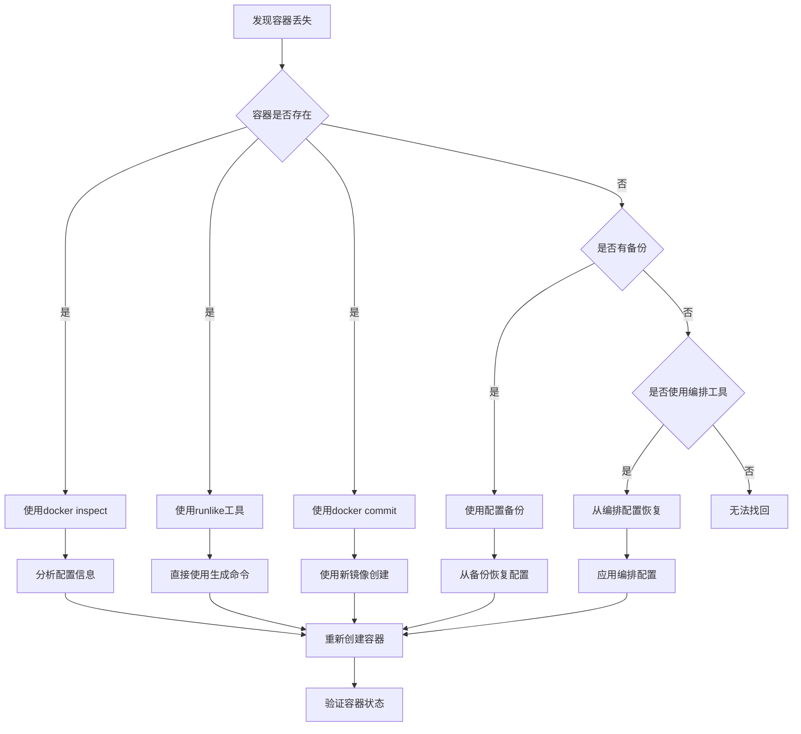

# Docker容器启动命令找回生产环境最佳实践：从应急到预防

## 情境(Situation)

在容器化技术广泛应用的今天，Docker已经成为企业级应用部署的标准工具。作为SRE工程师，我们经常需要管理大量的容器，包括创建、启动、停止和删除容器。然而，在日常操作中，我们可能会不小心删除一个重要的容器，或者需要重新创建一个已经删除的容器，但却忘记了当初的启动命令。

这种情况在生产环境中尤为常见，特别是当容器运行时间较长，或者当初的启动命令比较复杂时。如何快速找回容器的启动命令，重新创建容器，成为了SRE工程师必须掌握的技能。

## 冲突(Conflict)

在实际应用中，SRE工程师经常面临以下挑战：

- **信息丢失**：容器删除后，其配置信息也会被删除
- **命令复杂**：启动命令可能包含大量的参数，如环境变量、端口映射、卷挂载等
- **时间紧迫**：生产环境中的容器故障需要快速恢复
- **预防不足**：缺乏有效的配置管理和备份策略
- **工具限制**：不同环境下可用的工具和方法不同

## 问题(Question)

如何在容器被删除后，快速找回其启动命令并重新创建容器？同时，如何建立有效的预防措施，避免此类问题的发生？

## 答案(Answer)

本文将从SRE视角出发，详细介绍Docker容器启动命令的找回方法和预防措施，提供一套完整的生产环境最佳实践。核心方法论基于 [SRE面试题解析：不小心删除了一个很老的docker容器，如何找回当初的启动命令再重开一个？](#41-不小心删除了一个很老的docker容器如何找回当初的启动命令再重开一个)。

---

## 一、容器启动命令找回方法

### 1.1 容器存在时的找回方法

**当容器仍然存在时**，我们可以使用以下方法找回启动命令：

#### 1.1.1 使用 `docker inspect`

`docker inspect` 是Docker提供的内置命令，可以查看容器的详细配置信息，包括启动命令、环境变量、端口映射等。

**示例**：

```bash
# 查看容器的启动命令
docker inspect --format='{{.Config.Cmd}}' <容器ID或名称>

# 查看容器的完整配置
docker inspect <容器ID或名称>

# 查看容器的环境变量
docker inspect --format='{{.Config.Env}}' <容器ID或名称>

# 查看容器的端口映射
docker inspect --format='{{.HostConfig.PortBindings}}' <容器ID或名称>

# 查看容器的卷挂载
docker inspect --format='{{.Mounts}}' <容器ID或名称>
```

**优点**：
- 内置命令，无需安装额外工具
- 提供详细的配置信息
- 适用于所有Docker环境

**缺点**：
- 输出格式较为复杂，需要手动解析
- 无法直接生成完整的启动命令

#### 1.1.2 使用 `runlike` 工具

`runlike` 是一个第三方工具，可以自动生成完整的 `docker run` 命令，非常方便。

**安装**：

```bash
pip3 install runlike
```

**使用**：

```bash
# 生成启动命令
runlike <容器ID或名称>

# 示例输出
docker run --name=my-container --hostname=my-host -e "TZ=Asia/Shanghai" -p 80:80 -v /host/data:/container/data --restart=always nginx:latest
```

**优点**：
- 自动生成完整的启动命令
- 输出格式清晰，易于直接执行
- 支持大多数容器配置

**缺点**：
- 需要额外安装
- 可能无法捕获所有复杂的配置选项

#### 1.1.3 使用 `docker commit`

`docker commit` 可以将容器的当前状态保存为一个新的镜像，保留容器的文件系统。

**示例**：

```bash
# 将容器提交为新镜像
docker commit <容器ID或名称> <新镜像名:标签>

# 使用新镜像创建容器
docker run -d --name <新容器名> <新镜像名:标签>
```

**优点**：
- 保留容器的文件系统和状态
- 适用于需要保留容器内部修改的场景

**缺点**：
- 不保留容器的启动命令和配置
- 生成的镜像可能包含不必要的内容

### 1.2 容器删除后的找回方法

**当容器已经被删除时**，我们需要依赖之前的备份或配置文件：

#### 1.2.1 使用配置备份

如果之前有备份容器的配置信息，可以使用备份文件重建容器。

**备份方法**：

```bash
# 备份单个容器配置
docker inspect <容器ID或名称> > container-config.json

# 备份所有容器配置
docker ps -aq | while read container_id; do
  docker inspect $container_id > "container-${container_id}.json"
done

# 备份容器启动命令（使用runlike）
runlike <容器ID或名称> > container-run.sh
```

**恢复方法**：

```bash
# 从备份文件中提取配置信息
cat container-config.json | jq '.[0].Config'

# 使用备份的启动命令重建容器
chmod +x container-run.sh
./container-run.sh
```

#### 1.2.2 使用 `docker-compose`

如果使用 `docker-compose` 管理容器，可以直接使用配置文件重建容器。

**`docker-compose.yml` 示例**：

```yaml
version: '3'
services:
  web:
    image: nginx:latest
    container_name: my-nginx
    hostname: nginx-host
    environment:
      - TZ=Asia/Shanghai
    ports:
      - "80:80"
    volumes:
      - ./data:/usr/share/nginx/html
    restart: always
```

**使用方法**：

```bash
# 启动容器
docker-compose up -d

# 停止容器
docker-compose down
```

#### 1.2.3 使用容器编排工具

如果使用 Kubernetes 等容器编排工具，可以从编排配置中恢复容器。

**Kubernetes Deployment 示例**：

```yaml
apiVersion: apps/v1
kind: Deployment
metadata:
  name: nginx-deployment
  labels:
    app: nginx
spec:
  replicas: 1
  selector:
    matchLabels:
      app: nginx
  template:
    metadata:
      labels:
        app: nginx
    spec:
      containers:
      - name: nginx
        image: nginx:latest
        ports:
        - containerPort: 80
        env:
        - name: TZ
          value: "Asia/Shanghai"
        volumeMounts:
        - name: data
          mountPath: /usr/share/nginx/html
      volumes:
      - name: data
        hostPath:
          path: /host/data
```

**使用方法**：

```bash
# 应用配置
kubectl apply -f nginx-deployment.yaml

# 查看部署
kubectl get deployments
```

---

## 二、找回流程与最佳实践

### 2.1 找回流程

**容器启动命令找回流程**：



### 2.2 应急处理策略

**当容器被意外删除时**，应采取以下应急措施：

1. **快速评估影响**：
   - 确认容器的重要性和功能
   - 评估数据丢失的风险
   - 确定恢复时间窗口

2. **尝试找回配置**：
   - 检查是否有配置备份
   - 查看Docker日志，寻找启动记录
   - 检查CI/CD配置文件

3. **重建容器**：
   - 使用可用的配置信息重建
   - 优先恢复服务功能
   - 验证容器运行状态

4. **恢复数据**：
   - 从备份恢复数据卷
   - 验证数据完整性
   - 测试应用功能

### 2.3 自动化脚本

**容器配置备份脚本**：

```bash
#!/bin/bash

# Docker容器配置备份脚本

set -e

BACKUP_DIR="/data/docker-backups"
TIMESTAMP=$(date +%Y%m%d_%H%M%S)

# 创建备份目录
mkdir -p "$BACKUP_DIR/$TIMESTAMP"

echo "开始备份Docker容器配置..."
echo "备份目录: $BACKUP_DIR/$TIMESTAMP"

# 备份容器配置
CONTAINERS=$(docker ps -aq)

if [ -z "$CONTAINERS" ]; then
    echo "没有运行的容器"
    exit 0
fi

for CONTAINER in $CONTAINERS; do
    NAME=$(docker inspect --format '{{.Name}}' $CONTAINER | sed 's/^\///')
    echo "备份容器: $NAME"
    
    # 备份完整配置
    docker inspect $CONTAINER > "$BACKUP_DIR/$TIMESTAMP/${NAME}-config.json"
    
    # 尝试使用runlike备份启动命令
    if command -v runlike &> /dev/null; then
        runlike $CONTAINER > "$BACKUP_DIR/$TIMESTAMP/${NAME}-run.sh"
        chmod +x "$BACKUP_DIR/$TIMESTAMP/${NAME}-run.sh"
    fi
done

echo "备份完成!"
echo "备份文件: $(ls -la "$BACKUP_DIR/$TIMESTAMP/")"

# 清理过期备份（保留30天）
find "$BACKUP_DIR" -type d -mtime +30 -exec rm -rf {} \;
echo "已清理30天前的备份"
```

**容器启动命令生成脚本**：

```bash
#!/bin/bash

# 生成容器启动命令脚本

set -e

if [ $# -ne 1 ]; then
    echo "Usage: $0 <container-name or container-id>"
    exit 1
fi

CONTAINER=$1

# 检查容器是否存在
if ! docker ps -a | grep -q "$CONTAINER"; then
    echo "错误: 容器 $CONTAINER 不存在"
    exit 1
fi

# 尝试使用runlike
if command -v runlike &> /dev/null; then
    echo "使用runlike生成启动命令..."
    runlike $CONTAINER
    exit 0
fi

# 手动生成启动命令
echo "使用docker inspect生成启动命令..."
echo ""
echo "# 容器: $CONTAINER"
echo "# 生成时间: $(date)"
echo ""
echo "docker run \
--name=$(docker inspect --format '{{.Name}}' $CONTAINER | sed 's/^\///') \
--hostname=$(docker inspect --format '{{.Config.Hostname}}' $CONTAINER) \
$(docker inspect --format '{{range .Config.Env}}-e "{{.}}" \
{{end}}' $CONTAINER)\
$(docker inspect --format '{{range $p, $conf := .HostConfig.PortBindings}}{{range $conf}}-p {{.HostPort}}:{{$p}} \
{{end}}{{end}}' $CONTAINER)\
$(docker inspect --format '{{range .Mounts}}-v {{.Source}}:{{.Destination}} \
{{end}}' $CONTAINER)\
--restart=$(docker inspect --format '{{.HostConfig.RestartPolicy.Name}}' $CONTAINER) \
$(docker inspect --format '{{.Config.Image}}' $CONTAINER)"
```

---

## 三、预防措施与配置管理

### 3.1 预防措施

**为了避免容器启动命令丢失**，应采取以下预防措施：

| 措施 | 说明 | 实施难度 | 效果 |
|:------|:------|:----------|:------|
| **使用docker-compose** | 配置代码化，易于版本管理 | 低 | 高 |
| **定期备份配置** | 自动备份容器配置信息 | 低 | 中 |
| **使用容器编排** | Kubernetes等管理容器配置 | 中 | 高 |
| **文档记录** | 记录重要容器的启动命令 | 低 | 中 |
| **版本控制** | 将配置文件纳入版本控制系统 | 低 | 高 |
| **监控告警** | 监控容器状态，及时发现异常 | 中 | 中 |

### 3.2 配置管理最佳实践

**1. 使用 `docker-compose`**

- **优点**：
  - 配置文件化，易于管理
  - 支持版本控制
  - 一键启动多个容器
  - 环境变量管理方便

- **示例配置**：
  ```yaml
  version: '3'
  services:
    web:
      image: nginx:latest
      container_name: my-nginx
      ports:
        - "80:80"
      volumes:
        - ./html:/usr/share/nginx/html
        - ./conf/nginx.conf:/etc/nginx/nginx.conf
      environment:
        - TZ=Asia/Shanghai
      restart: always
    db:
      image: mysql:5.7
      container_name: my-mysql
      ports:
        - "3306:3306"
      volumes:
        - db-data:/var/lib/mysql
      environment:
        - MYSQL_ROOT_PASSWORD=secret
        - MYSQL_DATABASE=app
      restart: always
  volumes:
    db-data:
  ```

**2. 容器编排平台**

- **Kubernetes**：
  - 强大的容器编排能力
  - 声明式配置管理
  - 自动扩缩容和故障恢复
  - 完善的服务发现和负载均衡

- **Docker Swarm**：
  - 原生Docker集群管理
  - 简单易用，适合小型环境
  - 与Docker命令兼容

**3. 配置版本控制**

- **Git**：
  - 跟踪配置变更
  - 回滚到历史版本
  - 团队协作
  - CI/CD集成

- **示例工作流**：
  1. 创建配置仓库
  2. 提交 `docker-compose.yml` 或 Kubernetes 配置
  3. 配置CI/CD流水线
  4. 自动化部署和更新

**4. 监控与告警**

- **容器状态监控**：
  - 使用 Prometheus 和 Grafana 监控容器状态
  - 设置容器异常告警
  - 记录容器生命周期事件

- **日志管理**：
  - 集中化日志收集
  - 保留足够的日志时间
  - 日志分析和告警

---

## 四、常见问题与解决方案

### 4.1 容器配置丢失

**问题描述**：
- 容器被意外删除，没有备份配置
- 无法找到当初的启动命令

**解决方案**：

1. **检查Docker日志**：
   ```bash
   # 查看Docker守护进程日志
   journalctl -u docker.service | grep "docker run"
   
   # 查看容器创建事件
   docker events --filter 'event=create' --since '24h'
   ```

2. **检查历史命令**：
   ```bash
   # 查看历史命令
   history | grep "docker run"
   
   # 搜索特定容器相关命令
   history | grep "<容器名>"
   ```

3. **从镜像重建**：
   ```bash
   # 查看容器使用的镜像
   docker images
   
   # 使用默认配置启动容器
   docker run -d --name <新容器名> <镜像名>
   ```

4. **参考类似容器**：
   - 查看其他类似容器的配置
   - 参考应用文档中的部署指南

### 4.2 数据丢失

**问题描述**：
- 容器删除时，数据卷未备份
- 重要数据丢失

**解决方案**：

1. **检查数据卷**：
   ```bash
   # 查看所有数据卷
   docker volume ls
   
   # 检查数据卷是否存在
   docker volume inspect <卷名>
   ```

2. **数据恢复**：
   - 从备份恢复数据
   - 使用数据恢复工具
   - 检查文件系统快照

3. **预防措施**：
   - 定期备份数据卷
   - 使用持久化存储
   - 实施数据备份策略

### 4.3 依赖服务问题

**问题描述**：
- 容器依赖其他服务
- 重新创建后无法正常工作

**解决方案**：

1. **检查网络配置**：
   ```bash
   # 查看网络配置
   docker network inspect <网络名>
   
   # 确保容器加入正确的网络
   docker network connect <网络名> <容器名>
   ```

2. **检查环境变量**：
   - 确保所有必要的环境变量都已设置
   - 检查依赖服务的连接信息

3. **服务发现**：
   - 使用DNS或服务发现机制
   - 配置正确的服务地址

### 4.4 权限问题

**问题描述**：
- 重新创建的容器权限与原容器不同
- 无法访问某些资源

**解决方案**：

1. **检查用户权限**：
   ```bash
   # 查看容器用户
   docker inspect --format '{{.Config.User}}' <容器名>
   
   # 重新创建时指定用户
   docker run --user <用户> <镜像名>
   ```

2. **检查卷权限**：
   ```bash
   # 检查卷权限
   ls -la /path/to/volume
   
   # 调整权限
   chown -R <用户>:<组> /path/to/volume
   ```

3. **检查SELinux/AppArmor**：
   - 确保安全策略允许容器访问资源
   - 调整安全上下文

---

## 五、企业级解决方案

### 5.1 容器配置管理平台

**1. Harbor**
- 企业级容器镜像仓库
- 支持镜像版本管理
- 集成LDAP/AD认证
- 镜像扫描和安全分析

**2. Portainer**
- 容器管理界面
- 可视化配置管理
- 支持多环境管理
- 模板和应用商店

**3. Rancher**
- 容器管理平台
- 支持多Kubernetes集群
- 应用商店和模板
- 集成监控和告警

### 5.2 CI/CD集成

**1. GitLab CI/CD**
- 集成代码管理和CI/CD
- 自动化构建和部署
- 配置管理和版本控制
- 流水线可视化

**2. Jenkins**
- 强大的自动化工具
- 丰富的插件生态
- 支持复杂的构建流程
- 与Docker无缝集成

**3. GitHub Actions**
- 基于事件的自动化
- 与GitHub代码仓库集成
- 简洁的配置语法
- 丰富的市场动作

### 5.3 灾难恢复策略

**1. 备份策略**
- **配置备份**：定期备份容器配置
- **数据备份**：定期备份数据卷
- **镜像备份**：备份重要镜像
- **自动化备份**：使用脚本和定时任务

**2. 恢复流程**
- **快速恢复**：使用备份配置快速重建容器
- **数据恢复**：从备份恢复数据
- **验证流程**：确保恢复后的容器正常运行
- **文档化**：记录恢复流程和步骤

**3. 演练**
- 定期进行恢复演练
- 测试备份的有效性
- 优化恢复流程
- 培训团队成员

---

## 六、最佳实践总结

### 6.1 核心原则

**预防为主**：
- 建立完善的配置管理体系
- 定期备份容器配置和数据
- 使用容器编排工具管理容器
- 将配置纳入版本控制系统

**快速响应**：
- 建立应急响应流程
- 掌握多种找回方法
- 准备自动化脚本
- 定期演练恢复流程

**持续改进**：
- 定期审查配置管理策略
- 优化备份和恢复流程
- 培训团队成员
- 采用新的工具和技术

### 6.2 配置建议

**生产环境配置清单**：
- [ ] 使用 `docker-compose` 或 Kubernetes 管理容器
- [ ] 将配置文件纳入版本控制系统
- [ ] 定期备份容器配置和数据
- [ ] 部署监控和告警系统
- [ ] 建立容器管理文档
- [ ] 配置CI/CD流水线
- [ ] 定期进行恢复演练
- [ ] 培训团队成员掌握找回方法

**推荐工具**：
- **配置管理**：docker-compose, Kubernetes
- **备份工具**：自定义脚本, Velero
- **监控工具**：Prometheus, Grafana
- **日志管理**：ELK Stack, Loki
- **CI/CD**：GitLab CI, Jenkins, GitHub Actions

### 6.3 经验总结

**常见误区**：
- **配置分散**：容器配置没有集中管理
- **备份不足**：缺乏定期备份机制
- **文档缺失**：重要配置没有文档记录
- **培训不足**：团队成员不熟悉找回方法
- **演练缺乏**：没有定期进行恢复演练

**成功经验**：
- **标准化配置**：建立统一的容器配置标准
- **自动化管理**：使用脚本和工具自动化管理
- **版本控制**：将配置纳入Git管理
- **监控预警**：及时发现和处理问题
- **定期演练**：确保恢复流程的有效性

---

## 总结

Docker容器启动命令的找回是SRE工程师必备的技能之一。通过本文介绍的方法，我们可以在容器被删除后快速找回启动命令，重新创建容器，确保服务的连续性。

**核心要点**：

1. **容器存在时**：使用 `docker inspect`、`runlike` 工具或 `docker commit`
2. **容器删除后**：依赖配置备份、`docker-compose` 或容器编排工具
3. **预防措施**：使用 `docker-compose`、定期备份、容器编排、文档记录
4. **最佳实践**：配置管理、版本控制、定期备份、监控日志、密钥管理
5. **企业级方案**：容器配置管理平台、CI/CD集成、灾难恢复策略

通过建立完善的配置管理体系和备份策略，我们可以有效避免容器启动命令丢失的问题，提高系统的可靠性和可维护性。

> **延伸学习**：更多面试相关的容器启动命令找回知识，请参考 [SRE面试题解析：不小心删除了一个很老的docker容器，如何找回当初的启动命令再重开一个？](#41-不小心删除了一个很老的docker容器如何找回当初的启动命令再重开一个)。

---

## 参考资料

- [Docker官方文档 - docker inspect](https://docs.docker.com/engine/reference/commandline/inspect/)
- [Docker官方文档 - docker commit](https://docs.docker.com/engine/reference/commandline/commit/)
- [runlike工具](https://github.com/lavie/runlike)
- [Docker Compose](https://docs.docker.com/compose/)
- [Kubernetes](https://kubernetes.io/)
- [Docker Swarm](https://docs.docker.com/engine/swarm/)
- [Git版本控制](https://git-scm.com/)
- [Prometheus监控](https://prometheus.io/)
- [Grafana](https://grafana.com/)
- [ELK Stack](https://www.elastic.co/elastic-stack)
- [Loki日志管理](https://grafana.com/oss/loki/)
- [GitLab CI/CD](https://docs.gitlab.com/ee/ci/)
- [Jenkins](https://www.jenkins.io/)
- [GitHub Actions](https://github.com/features/actions)
- [Harbor](https://goharbor.io/)
- [Portainer](https://www.portainer.io/)
- [Rancher](https://rancher.com/)
- [Velero备份工具](https://velero.io/)
- [容器安全最佳实践](https://docs.docker.com/engine/security/)
- [Linux系统管理](https://www.linux.com/training-tutorials/linux-system-maintenance/)
- [灾难恢复策略](https://en.wikipedia.org/wiki/Disaster_recovery)
- [配置管理最佳实践](https://en.wikipedia.org/wiki/Configuration_management)
- [DevOps实践](https://en.wikipedia.org/wiki/DevOps)
- [SRE最佳实践](https://sre.google/)
- [容器编排最佳实践](https://kubernetes.io/docs/concepts/configuration/overview/)
- [Docker网络管理](https://docs.docker.com/network/)
- [Docker存储管理](https://docs.docker.com/storage/)
- [容器监控最佳实践](https://prometheus.io/docs/guides/cadvisor/)
- [日志管理最佳实践](https://www.elastic.co/guide/en/elasticsearch/reference/current/setup.html)
- [备份策略最佳实践](https://www.ibm.com/docs/en/spectrum-protect/8.1.10?topic=overview-backup-strategies)
- [恢复演练最佳实践](https://www.ibm.com/docs/en/spectrum-protect/8.1.10?topic=recovery-planning-testing)
- [企业级容器管理](https://www.docker.com/products/docker-enterprise)
- [容器安全扫描](https://docs.docker.com/engine/security/scan/)