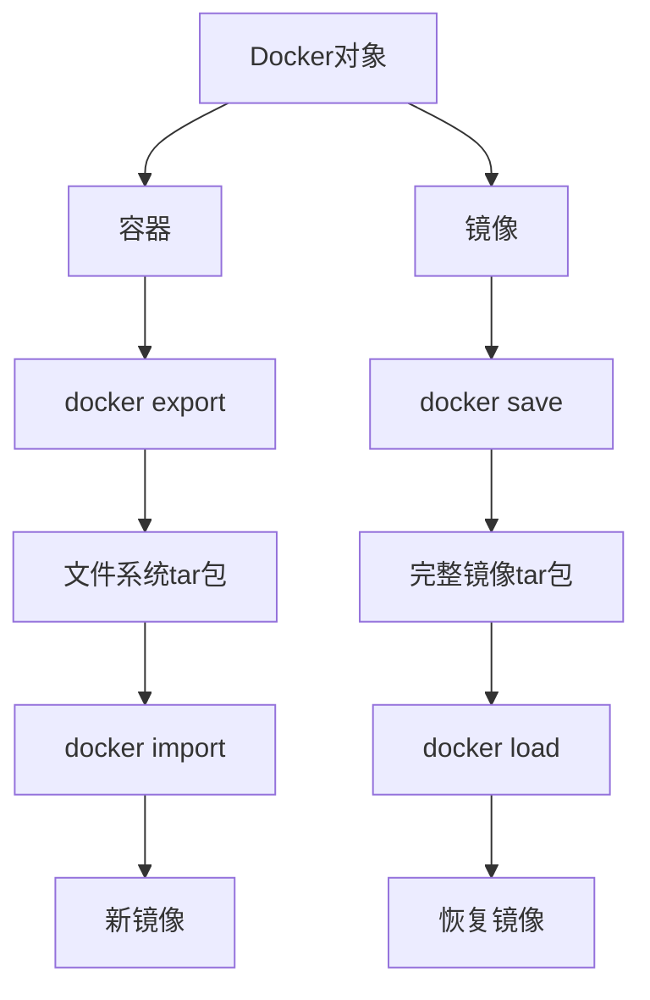
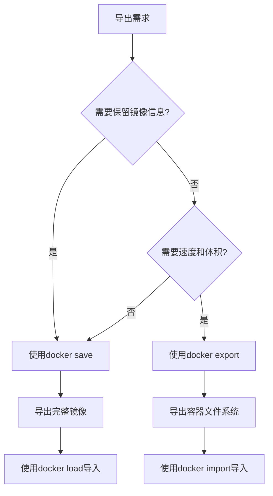

# Docker导出方法生产环境最佳实践：export vs save 深度解析

## 情境(Situation)

在容器化技术广泛应用的今天，Docker已经成为企业级应用部署的标准工具。在日常运维工作中，我们经常需要将Docker容器或镜像导出，用于备份、迁移、部署等场景。Docker提供了两种主要的导出方式：`docker export`和`docker save`。

作为SRE工程师，了解这两种导出方式的区别，掌握它们的使用场景和最佳实践，对于高效管理容器环境至关重要。

## 冲突(Conflict)

在实际应用中，SRE工程师经常面临以下挑战：

- **选择困难**：不知道何时使用`docker export`，何时使用`docker save`
- **性能问题**：导出文件过大，传输时间长
- **功能缺失**：导出后丢失重要信息，如元数据、历史记录
- **兼容性问题**：不同环境间导出导入失败
- **存储压力**：导出文件占用大量存储空间

## 问题(Question)

如何选择合适的Docker导出方法，在保证功能完整性的同时，提高导出效率，减少存储和传输成本？

## 答案(Answer)

本文将从SRE视角出发，详细介绍`docker export`和`docker save`的区别、工作原理和使用场景，提供一套完整的生产环境最佳实践。核心方法论基于 [SRE面试题解析：docker export 和docker save有啥区别？](#40-docker-export-和docker-save有啥区别)。

---

## 一、Docker导出方法概述

### 1.1 核心区别

**`docker export`和`docker save`的核心区别**：

| 维度 | docker export | docker save |
|:------|:--------------|:-------------|
| **操作对象** | 容器（container） | 镜像（image） |
| **导出格式** | 文件系统格式（tar） | 镜像格式（tar） |
| **包含内容** | 仅文件系统 | 完整镜像信息（层、元数据、历史） |
| **文件大小** | 较小 | 较大 |
| **导入命令** | `docker import` | `docker load` |
| **使用场景** | 创建基础镜像、备份文件系统 | 完整备份镜像、跨环境迁移 |

### 1.2 工作原理

**导出导入流程**：



**详细说明**：

1. **`docker export`**：
   - 操作对象：运行或停止的容器
   - 导出内容：容器的文件系统，不包含元数据和历史记录
   - 导入方式：使用`docker import`创建新镜像
   - 特点：体积小，速度快

2. **`docker save`**：
   - 操作对象：本地镜像
   - 导出内容：完整的镜像信息，包括所有层、元数据、历史记录
   - 导入方式：使用`docker load`恢复原有镜像
   - 特点：体积大，速度慢，但保留完整信息

---

## 二、命令详解与示例

### 2.1 `docker export` 命令

**基本语法**：
```bash
docker export [OPTIONS] CONTAINER
```

**常用选项**：
- `-o, --output`：指定输出文件

**示例**：

```bash
# 导出容器为tar包
docker export my-container > container.tar

# 或使用-o选项
docker export -o container.tar my-container

# 导入为新镜像
docker import container.tar my-nginx:exported

# 导入时添加提交信息
docker import --message "Imported from container" container.tar my-nginx:exported

# 从URL导入
docker import https://example.com/container.tar my-nginx:from-url
```

**使用场景**：
- 创建基础镜像
- 备份容器当前状态
- 快速传输容器文件系统
- 构建轻量级镜像

### 2.2 `docker save` 命令

**基本语法**：
```bash
docker save [OPTIONS] IMAGE [IMAGE...]
```

**常用选项**：
- `-o, --output`：指定输出文件

**示例**：

```bash
# 导出单个镜像
docker save -o nginx.tar nginx:latest

# 导出多个镜像
docker save -o images.tar image1 image2

# 导出镜像及其所有标签
docker save -o ubuntu.tar ubuntu

# 导入镜像
docker load -i nginx.tar

# 从标准输入导入
tar -c my-image | docker load
```

**使用场景**：
- 完整备份镜像
- 跨环境迁移镜像
- 保存镜像的完整历史和元数据
- 批量导出多个镜像

---

## 三、生产环境最佳实践

### 3.1 选择合适的导出方法

**根据场景选择**：

| 场景 | 推荐命令 | 原因 |
|:------|:----------|:------|
| **创建基础镜像** | `docker export` | 体积小，适合作为基础 |
| **备份容器状态** | `docker export` | 保存容器当前文件系统 |
| **完整镜像迁移** | `docker save` | 保留所有镜像信息 |
| **跨环境部署** | `docker save` | 确保镜像完整性 |
| **快速传输** | `docker export` | 文件体积小，传输快 |
| **版本控制** | `docker save` | 保留镜像历史记录 |
| **离线环境部署** | `docker save` | 包含所有依赖层 |

**决策流程**：



### 3.2 导出优化策略

**文件大小优化**：

1. **使用压缩**：
   ```bash
   # 导出并压缩
docker save nginx:latest | gzip > nginx.tar.gz

   # 导入
gunzip -c nginx.tar.gz | docker load

   # 对于export
docker export my-container | gzip > container.tar.gz

   # 导入
gunzip -c container.tar.gz | docker import -
   ```

2. **选择合适的基础镜像**：
   - 使用Alpine等轻量级基础镜像
   - 清理容器内不必要的文件
   - 移除临时文件和缓存

3. **分层导出**：
   - 对于大型镜像，考虑分层导出
   - 使用多阶段构建减小镜像体积

**传输优化**：

1. **使用传输工具**：
   - 使用rsync进行增量传输
   - 考虑使用scp或SFTP
   - 对于跨网络传输，使用压缩

2. **传输示例**：
   ```bash
   # 本地传输
docker save image | ssh user@remote "docker load"

   # 压缩传输
docker save image | gzip | ssh user@remote "gunzip | docker load"

   # 使用rsync
docker save -o image.tar image
rsync -avz image.tar user@remote:/path/
ssh user@remote "docker load -i /path/image.tar"
   ```

### 3.3 安全性考虑

**安全最佳实践**：

1. **加密导出文件**：
   ```bash
   # 使用GPG加密
docker save image | gpg --symmetric --cipher-algo AES256 > image.tar.gpg

   # 解密导入
gpg --decrypt image.tar.gpg | docker load
   ```

2. **验证镜像完整性**：
   ```bash
   # 导出时计算哈希
docker save image > image.tar
sha256sum image.tar > image.tar.sha256

# 导入前验证
sha256sum -c image.tar.sha256
docker load -i image.tar
   ```

3. **访问控制**：
   - 限制导出文件的访问权限
   - 使用安全的传输通道
   - 定期清理导出文件

### 3.4 自动化脚本

**导出脚本**：

```bash
#!/bin/bash

# Docker导出脚本
# 支持export和save两种方式

set -e

USAGE="Usage: $0 [export|save] [container|image] <name> <output-file>"

if [ $# -ne 4 ]; then
    echo "$USAGE"
    exit 1
fi

MODE=$1
TYPE=$2
NAME=$3
OUTPUT=$4

echo "开始Docker导出..."
echo "模式: $MODE"
echo "类型: $TYPE"
echo "名称: $NAME"
echo "输出: $OUTPUT"
echo ""

case "$MODE" in
    export)
        if [ "$TYPE" != "container" ]; then
            echo "错误: export模式只支持container类型"
            exit 1
        fi
        
        echo "导出容器..."
        docker export -o "$OUTPUT" "$NAME"
        ;;
    save)
        if [ "$TYPE" != "image" ]; then
            echo "错误: save模式只支持image类型"
            exit 1
        fi
        
        echo "导出镜像..."
        docker save -o "$OUTPUT" "$NAME"
        ;;
    *)
        echo "错误: 模式必须是export或save"
        echo "$USAGE"
        exit 1
        ;;
esac

echo ""
echo "导出完成!"
echo "文件大小: $(du -h "$OUTPUT" | cut -f1)"
echo "文件路径: $(realpath "$OUTPUT")"
```

**导入脚本**：

```bash
#!/bin/bash

# Docker导入脚本
# 支持import和load两种方式

set -e

USAGE="Usage: $0 [import|load] <input-file> [image-name]"

if [ $# -lt 2 ]; then
    echo "$USAGE"
    exit 1
fi

MODE=$1
INPUT=$2
IMAGE_NAME=$3

echo "开始Docker导入..."
echo "模式: $MODE"
echo "输入: $INPUT"
if [ -n "$IMAGE_NAME" ]; then
    echo "镜像名称: $IMAGE_NAME"
fi
echo ""

case "$MODE" in
    import)
        if [ -z "$IMAGE_NAME" ]; then
            echo "错误: import模式需要指定镜像名称"
            echo "$USAGE"
            exit 1
        fi
        
        echo "导入为新镜像..."
        docker import "$INPUT" "$IMAGE_NAME"
        ;;
    load)
        echo "加载镜像..."
        docker load -i "$INPUT"
        ;;
    *)
        echo "错误: 模式必须是import或load"
        echo "$USAGE"
        exit 1
        ;;
esac

echo ""
echo "导入完成!"
```

### 3.5 监控与管理

**导出文件管理**：

1. **定期清理**：
   - 设置导出文件的保留期限
   - 定期清理过期的导出文件

2. **存储管理**：
   - 使用专用存储存放导出文件
   - 监控存储使用情况
   - 实施配额管理

3. **版本控制**：
   - 为导出文件添加版本号
   - 建立导出文件的命名规范
   - 记录导出时间和相关信息

**监控示例**：

```bash
#!/bin/bash

# 监控导出文件大小

export_dir="/data/docker-exports"
max_size=100G

current_size=$(du -s "$export_dir" | cut -f1)
current_size_gb=$(echo "scale=2; $current_size / 1024 / 1024" | bc)

if (( $(echo "$current_size_gb > $max_size" | bc -l) )); then
    echo "警告: 导出文件目录超过${max_size}GB，当前大小: ${current_size_gb}GB"
    # 发送告警
    # mail -s "Docker导出文件目录空间告警" admin@example.com <<< "导出文件目录超过${max_size}GB，当前大小: ${current_size_gb}GB"
fi

echo "导出文件目录大小: ${current_size_gb}GB"
```

---

## 四、常见问题与解决方案

### 4.1 导出文件过大

**问题描述**：
- `docker save`导出的文件体积过大
- 传输时间长，占用存储空间

**解决方案**：

1. **使用压缩**：
   ```bash
   docker save image | gzip > image.tar.gz
   ```

2. **使用`docker export`**：
   - 对于不需要保留镜像历史的场景
   - 仅导出容器文件系统

3. **优化镜像**：
   - 使用多阶段构建
   - 清理镜像中的不必要文件
   - 使用轻量级基础镜像

4. **分层导出**：
   - 对于大型镜像，考虑分层导出
   - 只导出必要的层

### 4.2 导入失败

**问题描述**：
- 导入时出现错误
- 镜像无法正常加载

**解决方案**：

1. **检查文件完整性**：
   ```bash
   # 检查文件是否损坏
   tar -tf image.tar
   ```

2. **检查Docker版本**：
   - 确保源和目标环境的Docker版本兼容
   - 查看Docker版本：`docker version`

3. **检查权限**：
   - 确保有足够的权限导入镜像
   - 检查文件权限：`ls -la image.tar`

4. **使用正确的导入命令**：
   - `docker export`导出的文件使用`docker import`
   - `docker save`导出的文件使用`docker load`

### 4.3 丢失元数据

**问题描述**：
- 使用`docker export`导出后，丢失了镜像的元数据和历史记录
- 无法查看镜像的构建历史

**解决方案**：

1. **使用`docker save`**：
   - 对于需要保留元数据的场景
   - 完整导出镜像信息

2. **记录元数据**：
   - 导出前记录镜像的元数据
   - 使用`docker inspect`查看并保存元数据

3. **使用Dockerfile**：
   - 对于需要重建镜像的场景
   - 使用Dockerfile重新构建，保留完整历史

### 4.4 跨平台兼容性

**问题描述**：
- 在不同操作系统间导出导入失败
- 架构不兼容

**解决方案**：

1. **构建多架构镜像**：
   ```bash
   # 构建多架构镜像
docker buildx build --platform linux/amd64,linux/arm64 -t my-image:latest .
   ```

2. **检查架构**：
   ```bash
   # 查看镜像架构
docker image inspect --format '{{.Architecture}}' my-image
   ```

3. **使用兼容的基础镜像**：
   - 选择支持多架构的基础镜像
   - 避免使用平台特定的特性

4. **测试导入**：
   - 在目标环境测试导入
   - 确保镜像能够正常运行

---

## 五、企业级解决方案

### 5.1 镜像仓库管理

**私有镜像仓库**：
- 使用Harbor、Docker Registry等私有仓库
- 支持镜像版本管理和访问控制
- 提供镜像同步和复制功能

**镜像仓库配置**：

```bash
# 拉取镜像到本地
docker pull private-registry:5000/my-image:latest

# 推送镜像到私有仓库
docker tag my-image:latest private-registry:5000/my-image:latest
docker push private-registry:5000/my-image:latest
```

### 5.2 CI/CD集成

**CI/CD流程**：
- 在CI/CD流水线中集成镜像导出
- 自动化构建、测试、导出、部署

**示例配置**：

```yaml
# GitLab CI配置
stages:
  - build
  - test
  - export
  - deploy

build:
  stage: build
  script:
    - docker build -t my-image:latest .

test:
  stage: test
  script:
    - docker run --rm my-image:latest npm test

export:
  stage: export
  script:
    - docker save -o my-image.tar my-image:latest
    - gzip my-image.tar
  artifacts:
    paths:
      - my-image.tar.gz

deploy:
  stage: deploy
  script:
    - gunzip -c my-image.tar.gz | docker load
    - docker run -d --name my-app my-image:latest
```

### 5.3 灾难恢复

**备份策略**：
- 定期导出重要镜像
- 存储到安全的位置
- 建立镜像备份的版本控制

**恢复流程**：
1. **识别需要恢复的镜像**
2. **从备份中导入镜像**
3. **验证镜像完整性**
4. **部署恢复的镜像**

**示例脚本**：

```bash
#!/bin/bash

# 镜像备份脚本

backup_dir="/data/docker-backups"
timestamp=$(date +%Y%m%d_%H%M%S)

mkdir -p "$backup_dir/$timestamp"

echo "开始镜像备份..."
echo "备份目录: $backup_dir/$timestamp"

# 导出重要镜像
images=("nginx:latest" "mysql:5.7" "redis:6.0")

for image in "${images[@]}"; do
    echo "导出镜像: $image"
    filename=$(echo "$image" | tr ":/" "__")
    docker save -o "$backup_dir/$timestamp/${filename}.tar" "$image"
    gzip "$backup_dir/$timestamp/${filename}.tar"
done

echo "备份完成!"
echo "备份文件: $(ls -la "$backup_dir/$timestamp/")"

# 清理过期备份
find "$backup_dir" -type d -mtime +30 -exec rm -rf {} \;
echo "已清理30天前的备份"
```

---

## 六、最佳实践总结

### 6.1 核心原则

**选择合适的导出方法**：
- 根据需求选择`docker export`或`docker save`
- 权衡速度、体积和功能完整性

**优化导出过程**：
- 使用压缩减少文件大小
- 选择合适的传输方式
- 实施安全措施

**管理导出文件**：
- 建立导出文件的命名规范
- 定期清理过期文件
- 监控存储使用情况

**自动化操作**：
- 编写自动化脚本
- 集成到CI/CD流程
- 建立备份恢复机制

### 6.2 配置建议

**生产环境配置清单**：
- [ ] 根据场景选择合适的导出方法
- [ ] 使用压缩减少文件大小
- [ ] 实施安全措施保护导出文件
- [ ] 建立导出文件的管理策略
- [ ] 配置自动化脚本和CI/CD集成
- [ ] 定期备份重要镜像
- [ ] 测试导入过程确保兼容性
- [ ] 监控存储使用情况

**推荐命令**：
- **快速导出**：`docker export -o container.tar my-container`
- **完整导出**：`docker save -o image.tar my-image`
- **压缩导出**：`docker save my-image | gzip > image.tar.gz`
- **批量导出**：`docker save -o images.tar image1 image2`

### 6.3 经验总结

**常见误区**：
- **选择错误**：在需要保留元数据的场景使用`docker export`
- **忽视压缩**：未对导出文件进行压缩，导致传输时间长
- **缺乏管理**：导出文件随意存放，占用大量存储空间
- **安全意识不足**：未对导出文件进行加密和验证
- **版本混乱**：导出文件命名不规范，导致版本混乱

**成功经验**：
- **标准化流程**：建立统一的导出导入流程
- **自动化管理**：使用脚本和CI/CD实现自动化
- **安全第一**：实施加密和验证措施
- **监控预警**：及时发现和处理存储问题
- **持续优化**：根据实际情况调整导出策略

---

## 总结

`docker export`和`docker save`是Docker提供的两种重要导出方式，它们各有优缺点，适用于不同的场景。作为SRE工程师，掌握这两种导出方法的区别和使用场景，对于高效管理容器环境至关重要。

**核心要点**：

1. **`docker export`**：操作容器，导出文件系统，体积小，速度快，适合创建基础镜像和快速传输
2. **`docker save`**：操作镜像，导出完整信息，体积大，速度慢，适合完整备份和跨环境迁移
3. **选择原则**：根据需求选择合适的导出方法，权衡速度、体积和功能完整性
4. **最佳实践**：使用压缩、实施安全措施、建立管理策略、自动化操作
5. **企业级方案**：集成到CI/CD流程、使用私有镜像仓库、建立灾难恢复机制

通过本文的指导，希望能帮助SRE工程师建立一套完整的Docker导出管理体系，确保容器环境的高效运行。

> **延伸学习**：更多面试相关的Docker导出方法知识，请参考 [SRE面试题解析：docker export 和docker save有啥区别？](#40-docker-export-和docker-save有啥区别)。

---

## 参考资料

- [Docker官方文档 - docker export](https://docs.docker.com/engine/reference/commandline/export/)
- [Docker官方文档 - docker save](https://docs.docker.com/engine/reference/commandline/save/)
- [Docker官方文档 - docker import](https://docs.docker.com/engine/reference/commandline/import/)
- [Docker官方文档 - docker load](https://docs.docker.com/engine/reference/commandline/load/)
- [Docker镜像管理最佳实践](https://docs.docker.com/develop/develop-images/dockerfile_best-practices/)
- [Docker存储驱动](https://docs.docker.com/storage/storagedriver/)
- [Docker网络管理](https://docs.docker.com/network/)
- [Harbor私有镜像仓库](https://goharbor.io/)
- [Docker Registry](https://docs.docker.com/registry/)
- [GitLab CI/CD](https://docs.gitlab.com/ee/ci/)
- [Jenkins CI/CD](https://www.jenkins.io/)
- [Docker多架构镜像](https://docs.docker.com/buildx/working-with-buildx/)
- [容器安全最佳实践](https://docs.docker.com/engine/security/)
- [Linux压缩工具](https://linux.die.net/man/1/gzip)
- [Linux传输工具](https://linux.die.net/man/1/scp)
- [Docker镜像优化](https://docs.docker.com/develop/develop-images/optimizing/#minimize-the-number-of-layers)
- [多阶段构建](https://docs.docker.com/develop/develop-images/multistage-build/)
- [Docker文件系统](https://docs.docker.com/storage/)
- [容器编排平台](https://kubernetes.io/)
- [Docker Compose](https://docs.docker.com/compose/)
- [Docker Swarm](https://docs.docker.com/engine/swarm/)
- [镜像签名](https://docs.docker.com/engine/security/trust/)
- [Docker内容信任](https://docs.docker.com/engine/security/trust/content_trust/)
- [容器备份策略](https://docs.docker.com/storage/volumes/#back-up-restore-or-migrate-data-volumes)
- [Docker数据管理](https://docs.docker.com/storage/)
- [企业级容器管理](https://www.docker.com/products/docker-enterprise)