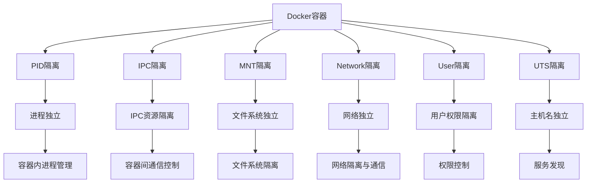

# Docker隔离机制生产环境最佳实践：从原理到应用

## 情境(Situation)

在容器化技术快速发展的今天，Docker已经成为企业级应用部署的标准工具。Docker的核心优势之一就是其强大的隔离机制，通过Linux内核的命名空间技术，实现了进程、网络、文件系统等多维度的隔离，为应用提供了安全、独立的运行环境。

作为SRE工程师，深入理解Docker的隔离机制，不仅能帮助我们更好地设计和部署容器化应用，还能提高系统的安全性和可靠性。

## 冲突(Conflict)

在实际应用中，SRE工程师经常面临以下挑战：

- **隔离与共享的平衡**：如何在保证隔离的同时，实现容器间的必要通信
- **安全性与性能的权衡**：隔离机制可能影响容器性能，如何优化
- **配置复杂性**：不同隔离空间的配置选项繁多，难以掌握
- **生产环境落地**：如何在生产环境中正确应用隔离机制
- **故障排查**：隔离环境下的问题定位更加困难

## 问题(Question)

如何深入理解Docker的隔离机制，掌握其在生产环境中的最佳实践，以构建安全、高效的容器化环境？

## 答案(Answer)

本文将从SRE视角出发，详细介绍Docker的6大隔离空间及其工作原理，提供一套完整的生产环境最佳实践。核心方法论基于 [SRE面试题解析：docker的6大隔离空间是啥，有啥作用](#38-docker的6大隔离空间是啥有啥作用)。

---

## 一、Docker隔离机制原理

### 1.1 隔离空间概述

**Docker的6大隔离空间**：

| 隔离空间 | 作用 | 实现技术 | 关键特性 |
|:---------|:------|:----------|:----------|
| **PID** | 进程ID隔离 | PID namespace | 容器内有独立PID 1 |
| **IPC** | 进程间通信隔离 | IPC namespace | 隔离共享内存、信号量 |
| **MNT** | 文件系统挂载隔离 | Mount namespace | 独立rootfs |
| **Network** | 网络栈隔离 | Network namespace | 独立IP、网络接口 |
| **User** | 用户ID隔离 | User namespace | 容器root映射为宿主机普通用户 |
| **UTS** | 主机名隔离 | UTS namespace | 独立hostname |

**隔离空间工作原理**：



### 1.2 命名空间技术

**Linux命名空间**：
- 命名空间是Linux内核提供的一种隔离机制
- 每个命名空间有自己独立的资源视图
- Docker通过系统调用创建和管理命名空间

**命名空间类型**：
- **PID namespace**：隔离进程ID
- **IPC namespace**：隔离进程间通信
- **Mount namespace**：隔离文件系统挂载点
- **Network namespace**：隔离网络栈
- **User namespace**：隔离用户和组ID
- **UTS namespace**：隔离主机名和域名

**命名空间操作**：

```bash
# 查看当前进程的命名空间
ls -la /proc/$$/ns/

# 创建新的命名空间（示例）
unshare --pid --mount-proc /bin/bash

# 查看容器的命名空间
docker inspect --format '{{ "{{" }}.State.Pid}}' <容器名>
ls -la /proc/<PID>/ns/
```

---

## 二、Docker隔离空间详解

### 2.1 PID隔离

**功能**：
- 容器内进程ID从1开始
- 容器内无法看到宿主机和其他容器的进程
- 实现容器内进程管理的独立性

**应用场景**：
- 容器内进程管理（如init进程）
- 防止容器间进程干扰
- 模拟完整的进程环境

**示例**：

```bash
# 运行容器
 docker run -d --name pid-isolation nginx

# 查看容器PID
docker inspect --format '{{ "{{" }}.State.Pid}}' pid-isolation

# 进入容器查看进程
docker exec -it pid-isolation ps aux
# 输出中nginx进程PID为1

# 宿主机查看容器进程
ps aux | grep nginx
# 看到的是宿主机PID，与容器内不同
```

**最佳实践**：
- 避免使用 `--pid=host` 模式，除非必要
- 使用init进程管理容器内进程（如tini）
- 合理设置进程限制

### 2.2 IPC隔离

**功能**：
- 隔离共享内存、信号量、消息队列
- 防止容器间IPC通信
- 增强容器安全性

**应用场景**：
- 多容器应用间的安全隔离
- 防止敏感信息通过IPC泄露

**示例**：

```bash
# 创建两个容器
 docker run -d --name ipc-container1 nginx
 docker run -d --name ipc-container2 nginx

# 尝试在容器1中创建共享内存
docker exec -it ipc-container1 ipcmk -M 1024

# 在容器2中查看共享内存
docker exec -it ipc-container2 ipcs -m
# 看不到容器1创建的共享内存

# 创建共享IPC的容器
docker run -d --name ipc-shared --ipc=container:ipc-container1 nginx

# 在共享容器中查看共享内存
docker exec -it ipc-shared ipcs -m
# 可以看到容器1创建的共享内存
```

**最佳实践**：
- 对需要IPC通信的应用使用共享IPC
- 生产环境中默认使用隔离的IPC
- 定期清理IPC资源

### 2.3 MNT隔离

**功能**：
- 容器拥有独立的root文件系统
- 挂载操作不影响宿主机
- 支持卷挂载持久化

**应用场景**：
- 应用环境隔离
- 数据持久化
- 配置文件管理

**示例**：

```bash
# 运行带卷挂载的容器
 docker run -d --name mnt-isolation -v /host/data:/container/data nginx

# 在容器内创建文件
docker exec -it mnt-isolation touch /container/data/test.txt

# 宿主机查看文件
ls -la /host/data/
# 可以看到test.txt文件

# 在容器内挂载新文件系统
docker exec -it mnt-isolation mount -t tmpfs tmpfs /mnt

# 宿主机查看挂载点
mount | grep tmpfs
# 看不到容器内的挂载
```

**最佳实践**：
- 使用卷挂载而非特权模式
- 合理规划卷的使用
- 注意卷权限管理

### 2.4 Network隔离

**功能**：
- 容器有独立的网络接口和IP
- 独立的路由表和防火墙规则
- 支持多种网络模式

**应用场景**：
- 容器间网络通信
- 服务发现
- 网络安全隔离

**示例**：

```bash
# 创建自定义网络
docker network create my-network

# 运行容器在自定义网络
docker run -d --name network-isolation --network my-network nginx

# 查看容器网络配置
docker inspect --format '{{ "{{" }}.NetworkSettings.Networks}}' network-isolation

# 测试网络隔离
 docker run --rm --network my-network busybox ping network-isolation
# 可以ping通

 docker run --rm busybox ping network-isolation
# 无法ping通（默认网络）
```

**最佳实践**：
- 使用自定义网络管理容器通信
- 合理配置网络模式
- 实施网络策略限制

### 2.5 User隔离

**功能**：
- 容器内root用户映射到宿主机普通用户
- 提高容器安全性
- 防止容器内特权提升

**应用场景**：
- 增强容器安全性
- 符合最小权限原则
- 防止容器逃逸

**示例**：

```bash
# 查看宿主机用户ID
id -u

# 运行容器指定用户
docker run -d --name user-isolation --user 1000:1000 nginx

# 进入容器查看用户
docker exec -it user-isolation whoami
# 输出：1000

# 尝试特权操作
docker exec -it user-isolation apt update
# 会失败，因为不是root用户
```

**最佳实践**：
- 非root用户运行容器
- 合理设置用户权限
- 结合SELinux/AppArmor增强安全性

### 2.6 UTS隔离

**功能**：
- 容器有独立的主机名
- 独立的域名
- 便于服务发现

**应用场景**：
- 服务发现
- 集群环境
- 应用配置

**示例**：

```bash
# 运行容器指定主机名
docker run -d --name uts-isolation --hostname my-container nginx

# 进入容器查看主机名
docker exec -it uts-isolation hostname
# 输出：my-container

# 宿主机查看主机名
hostname
# 输出：宿主机主机名
```

**最佳实践**：
- 设置有意义的主机名
- 结合服务发现机制
- 保持主机名一致性

---

## 三、Docker隔离与Cgroups结合

### 3.1 Cgroups资源限制

**Cgroups功能**：
- 限制容器的CPU、内存、磁盘I/O等资源
- 监控容器资源使用
- 记录容器资源使用情况

**与隔离空间的关系**：
- 隔离空间提供资源隔离
- Cgroups提供资源限制
- 两者结合实现完整的容器管理

**资源限制示例**：

```bash
# 运行容器并设置资源限制
 docker run -d \
  --name resource-limited \
  --memory 512m \
  --cpus 1 \
  --blkio-weight 500 \
  nginx

# 查看资源限制
docker inspect --format '{{ "{{" }}.HostConfig}}' resource-limited
```

### 3.2 安全增强

**容器安全策略**：
- **AppArmor**：限制容器的系统调用
- **SELinux**：强制访问控制
- **Capabilities**：细粒度的权限控制
- **Seccomp**：限制系统调用

**安全配置示例**：

```bash
# 运行容器时禁用特权
 docker run -d \
  --name secure-container \
  --cap-drop ALL \
  --cap-add NET_BIND_SERVICE \
  --security-opt apparmor=docker-default \
  nginx

# 查看容器安全配置
docker inspect --format '{{ "{{" }}.HostConfig.SecurityOpt}}' secure-container
```

---

## 四、生产环境最佳实践

### 4.1 隔离空间配置

**推荐配置**：

| 隔离空间 | 配置建议 | 适用场景 |
|:---------|:----------|:----------|
| **PID** | 默认隔离 | 所有场景 |
| **IPC** | 默认隔离，需要时共享 | 多容器协作 |
| **MNT** | 使用卷挂载 | 数据持久化 |
| **Network** | 自定义网络 | 生产环境 |
| **User** | 非root用户 | 提高安全性 |
| **UTS** | 有意义的主机名 | 服务发现 |

**示例配置**：

```bash
# 生产环境容器配置
 docker run -d \
  --name production-app \
  --hostname app-01 \
  --network app-network \
  --user 1000:1000 \
  --memory 1G \
  --cpus 2 \
  --cap-drop ALL \
  --cap-add NET_BIND_SERVICE \
  --security-opt apparmor=docker-default \
  -v /data/app:/app/data \
  -p 80:80 \
  myapp
```

### 4.2 隔离与共享的平衡

**容器间通信**：
- **网络通信**：使用自定义网络
- **共享存储**：使用卷挂载
- **IPC共享**：使用`--ipc=container:`选项
- **PID共享**：使用`--pid=container:`选项

**示例**：

```bash
# 创建共享网络
 docker network create app-network

# 运行数据库容器
 docker run -d \
  --name db \
  --network app-network \
  --hostname db \
  -v db-data:/var/lib/mysql \
  mysql

# 运行应用容器（连接到同一网络）
 docker run -d \
  --name app \
  --network app-network \
  --hostname app \
  --link db:db \
  myapp
```

### 4.3 性能优化

**隔离对性能的影响**：
- **PID隔离**：几乎无影响
- **IPC隔离**：几乎无影响
- **MNT隔离**：轻微影响（文件系统操作）
- **Network隔离**：一定影响（网络转发）
- **User隔离**：轻微影响（权限检查）
- **UTS隔离**：几乎无影响

**性能优化策略**：
- 合理选择网络模式（host模式性能最佳）
- 使用高效的存储驱动（如overlay2）
- 优化卷挂载（使用本地卷）
- 合理设置资源限制

**示例**：

```bash
# 高性能场景使用host网络
 docker run -d \
  --name high-performance \
  --network host \
  --memory 4G \
  --cpus 4 \
  high-performance-app
```

### 4.4 安全性最佳实践

**安全加固**：
1. **使用非root用户**：
   ```bash
   docker run --user 1000:1000 myapp
   ```

2. **限制容器权限**：
   ```bash
   docker run --cap-drop ALL --cap-add NET_BIND_SERVICE myapp
   ```

3. **使用只读文件系统**：
   ```bash
   docker run --read-only myapp
   ```

4. **设置安全上下文**：
   ```bash
   docker run --security-opt apparmor=docker-default myapp
   ```

5. **隔离网络**：
   ```bash
   docker network create --internal internal-network
   docker run --network internal-network myapp
   ```

### 4.5 监控与管理

**隔离空间监控**：
- **进程监控**：使用`docker stats`
- **网络监控**：使用`docker network inspect`
- **存储监控**：使用`docker system df`
- **安全监控**：使用安全扫描工具

**管理工具**：
- **Docker Compose**：多容器管理
- **Docker Swarm**：集群管理
- **Kubernetes**：容器编排
- **监控工具**：Prometheus、Grafana

**示例监控**：

```bash
# 监控容器资源使用
docker stats

# 查看容器网络使用
docker network inspect app-network

# 查看存储使用
docker system df
```

---

## 五、故障排查

### 5.1 隔离相关问题

**常见问题**：

| 问题 | 原因 | 解决方案 |
|:------|:------|:----------|
| 容器间无法通信 | 网络隔离 | 检查网络配置，确保在同一网络 |
| 权限被拒绝 | User隔离 | 检查用户权限，调整卷权限 |
| 进程管理问题 | PID隔离 | 使用init进程管理容器内进程 |
| 共享内存失败 | IPC隔离 | 使用共享IPC模式 |
| 主机名解析失败 | UTS隔离 | 检查主机名配置 |

**排查方法**：

```bash
# 检查容器网络配置
docker inspect --format '{{ "{{" }}.NetworkSettings}}' <容器名>

# 检查容器用户配置
docker inspect --format '{{ "{{" }}.Config.User}}' <容器名>

# 检查容器进程
docker exec -it <容器名> ps aux

# 检查容器挂载点
docker inspect --format '{{ "{{" }}.Mounts}}' <容器名>

# 检查容器主机名
docker inspect --format '{{ "{{" }}.Config.Hostname}}' <容器名>
```

### 5.2 故障案例分析

**案例1：网络隔离导致容器间通信失败**

**问题描述**：
- 应用容器无法连接到数据库容器
- 网络 ping 失败

**排查步骤**：
1. **检查容器网络**：
   ```bash
   docker network inspect app-network
   ```

2. **检查容器网络配置**：
   ```bash
   docker inspect --format '{{ "{{" }}.NetworkSettings.Networks}}' app
   docker inspect --format '{{ "{{" }}.NetworkSettings.Networks}}' db
   ```

3. **测试网络连通性**：
   ```bash
   docker run --rm --network app-network busybox ping db
   ```

**解决方案**：
- 确保容器在同一网络
- 检查网络配置和防火墙规则
- 验证服务端口是否开放

**案例2：User隔离导致权限问题**

**问题描述**：
- 容器内无法写入挂载卷
- 权限被拒绝错误

**排查步骤**：
1. **检查容器用户**：
   ```bash
   docker inspect --format '{{ "{{" }}.Config.User}}' <容器名>
   ```

2. **检查卷权限**：
   ```bash
   ls -la /host/data
   ```

3. **检查容器内权限**：
   ```bash
   docker exec -it <容器名> id
   docker exec -it <容器名> ls -la /container/data
   ```

**解决方案**：
- 调整宿主机目录权限
- 使用与宿主机相同的用户ID
- 配置卷权限映射

---

## 六、容器编排与隔离

### 6.1 Kubernetes中的隔离

**Kubernetes隔离机制**：
- 基于Docker的隔离机制
- 增强的网络策略
- Pod级别的隔离
- 命名空间级别的隔离

**网络策略**：

```yaml
# 网络策略示例
apiVersion: networking.k8s.io/v1
kind: NetworkPolicy
metadata:
  name: app-network-policy
  namespace: default
spec:
  podSelector:
    matchLabels:
      app: myapp
  policyTypes:
  - Ingress
  - Egress
  ingress:
  - from:
    - podSelector:
        matchLabels:
          app: frontend
    ports:
    - protocol: TCP
      port: 8080
  egress:
  - to:
    - podSelector:
        matchLabels:
          app: db
    ports:
    - protocol: TCP
      port: 3306
```

### 6.2 Docker Swarm中的隔离

**Swarm隔离机制**：
- 服务级别的隔离
- 覆盖网络
- 服务发现
- 负载均衡

**示例配置**：

```bash
# 创建Swarm服务
 docker service create \
  --name web \
  --network overlay-network \
  --replicas 3 \
  --restart-condition on-failure \
  --limit-cpu 1 \
  --limit-memory 512m \
  nginx
```

---

## 七、最佳实践总结

### 7.1 核心原则

**安全性优先**：
- 使用非root用户运行容器
- 限制容器权限
- 实施网络隔离

**性能优化**：
- 选择合适的网络模式
- 优化存储配置
- 合理设置资源限制

**可管理性**：
- 使用容器编排工具
- 实施监控和告警
- 自动化部署和管理

**隔离与共享平衡**：
- 根据应用需求选择隔离级别
- 实现必要的容器间通信
- 保持环境一致性

### 7.2 配置建议

**生产环境配置清单**：
- [ ] 使用非root用户运行容器
- [ ] 限制容器权限和 capabilities
- [ ] 使用自定义网络管理容器通信
- [ ] 配置资源限制和监控
- [ ] 实施网络策略和安全措施
- [ ] 使用卷挂载进行数据持久化
- [ ] 设置有意义的主机名
- [ ] 结合Cgroups进行资源管理
- [ ] 定期安全扫描和更新

### 7.3 经验总结

**常见误区**：
- **过度隔离**：不必要的隔离会增加复杂性
- **权限过大**：使用root用户和特权模式
- **忽视性能**：隔离配置影响容器性能
- **缺乏监控**：无法及时发现隔离相关问题
- **配置不一致**：不同环境隔离配置不同

**成功经验**：
- **标准化配置**：建立容器配置标准
- **自动化管理**：使用编排工具管理容器
- **安全第一**：优先考虑安全性
- **性能优化**：根据应用需求调整隔离配置
- **持续改进**：定期评估和优化隔离策略

---

## 总结

Docker的隔离机制是其核心特性之一，通过Linux命名空间技术实现了进程、网络、文件系统等多维度的隔离。掌握Docker的隔离机制，对于构建安全、高效的容器化环境至关重要。

**核心要点**：

1. **隔离空间**：PID、IPC、MNT、Network、User、UTS六大隔离空间
2. **工作原理**：基于Linux命名空间技术
3. **最佳实践**：结合Cgroups进行资源管理，实施安全措施
4. **生产应用**：根据应用需求选择合适的隔离配置
5. **故障排查**：熟悉隔离相关问题的排查方法

通过本文的指导，希望能帮助SRE工程师更深入理解Docker的隔离机制，掌握其在生产环境中的最佳实践，构建更加安全、高效的容器化环境。

> **延伸学习**：更多面试相关的Docker隔离机制知识，请参考 [SRE面试题解析：docker的6大隔离空间是啥，有啥作用](#38-docker的6大隔离空间是啥有啥作用)。

---

## 参考资料

- [Docker官方文档](https://docs.docker.com/)
- [Linux命名空间](https://man7.org/linux/man-pages/man7/namespaces.7.html)
- [Linux Cgroups](https://www.kernel.org/doc/Documentation/cgroup-v2.txt)
- [Docker安全最佳实践](https://docs.docker.com/engine/security/)
- [Kubernetes网络策略](https://kubernetes.io/docs/concepts/services-networking/network-policies/)
- [Docker网络模式](https://docs.docker.com/network/#network-drivers)
- [容器安全指南](https://www.nginx.com/blog/container-security-guide/)
- [Linux容器隔离技术](https://www.redhat.com/en/topics/containers/whats-a-linux-container)
- [Docker存储驱动](https://docs.docker.com/storage/storagedriver/)
- [容器性能优化](https://www.docker.com/blog/container-performance-optimization/)
- [容器编排最佳实践](https://kubernetes.io/docs/concepts/configuration/overview/)
- [Docker Compose](https://docs.docker.com/compose/)
- [Docker Swarm](https://docs.docker.com/engine/swarm/)
- [容器监控](https://prometheus.io/docs/guides/cadvisor/)
- [容器安全扫描](https://docs.docker.com/engine/security/scan/)
- [Linux安全模块](https://wiki.archlinux.org/title/Security)
- [容器逃逸防护](https://www.linux.com/news/container-security-preventing-container-escape/)
- [容器网络性能](https://www.docker.com/blog/container-networking-performance/)
- [容器用户权限](https://docs.docker.com/engine/reference/run/#user)
- [容器主机名配置](https://docs.docker.com/engine/reference/run/#hostname)
- [容器进程管理](https://docs.docker.com/engine/reference/run/#init)
- [容器IPC通信](https://docs.docker.com/engine/reference/run/#ipc)
- [容器挂载管理](https://docs.docker.com/storage/)
- [容器网络配置](https://docs.docker.com/network/)
- [容器安全上下文](https://docs.docker.com/engine/reference/run/#security-opt)