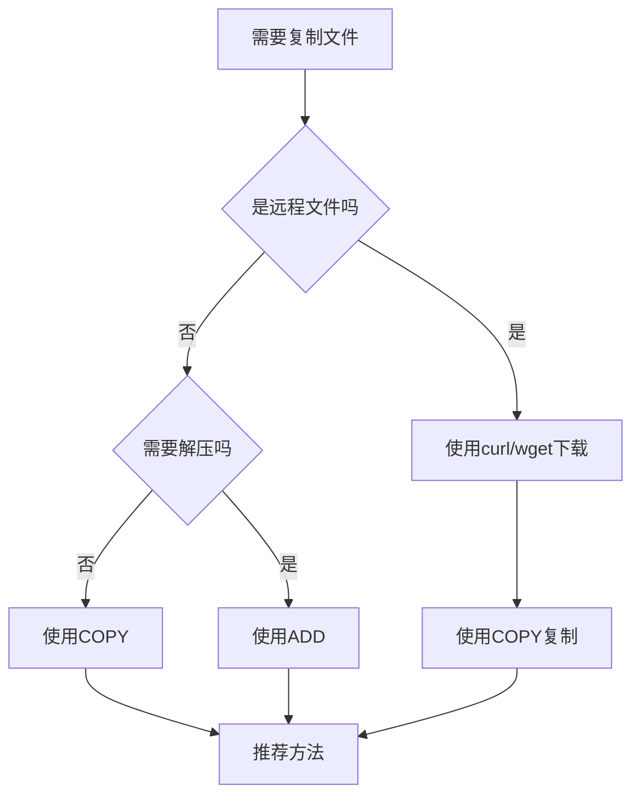

# Dockerfile中ADD和COPY指令的区别：生产环境最佳实践

## 情境(Situation)

在容器化技术广泛应用的今天，Docker已经成为企业级应用部署的标准工具。Dockerfile作为构建Docker镜像的脚本文件，包含一系列指令来定义镜像的构建过程。其中，ADD和COPY指令是两个常用的文件复制指令，用于将文件从构建上下文复制到镜像中。

然而，很多开发者对这两个指令的区别理解不够深入，导致在实际使用中出现选择困难、安全性问题和性能问题。作为SRE工程师，我们需要掌握这两个指令的区别及最佳实践，确保构建出高效、安全的Docker镜像。

## 冲突(Conflict)

在实际应用中，SRE工程师经常面临以下挑战：

- **选择困难**：不知道何时使用ADD，何时使用COPY
- **安全性问题**：使用ADD从URL下载文件带来的安全风险
- **不可预测性**：ADD自动解压功能可能导致意外行为
- **性能问题**：ADD的缓存机制不如COPY高效
- **最佳实践缺失**：不了解官方推荐的使用方式

## 问题(Question)

如何正确选择和使用ADD和COPY指令，避免常见错误，确保构建过程的安全性、可预测性和高效性？

## 答案(Answer)

本文将从SRE视角出发，详细介绍Dockerfile中ADD和COPY指令的区别及最佳实践，提供一套完整的生产环境解决方案。核心方法论基于 [SRE面试题解析：Dockerfile中Add和Copy指令的区别？](#45-dockerfile中add和copy指令的区别)。

---

## 一、核心区别对比

### 1.1 功能对比

**ADD和COPY指令的核心功能区别**：

| 特性 | ADD | COPY |
|:------|:-----|:------|
| **远程文件** | 支持从URL下载 | 不支持 |
| **自动解压** | 自动解压本地压缩文件 | 不解压 |
| **文件属性** | 可能丢失属性 | 保留原始属性 |
| **安全性** | 较低（URL下载风险） | 较高（仅本地文件） |
| **缓存友好** | 较差（URL每次重新下载） | 较好（基于文件内容） |
| **推荐度** | ⭐⭐ | ⭐⭐⭐⭐⭐ |

### 1.2 功能详解

**ADD指令**：
- **功能**：复制本地文件或从URL下载文件到镜像中，自动解压本地压缩文件
- **语法**：`ADD <源路径> <目标路径>`
- **特点**：功能丰富，但行为可能不可预测

**COPY指令**：
- **功能**：仅复制本地文件到镜像中，不解压压缩文件
- **语法**：`COPY <源路径> <目标路径>`
- **特点**：行为明确，可预测，安全性高

### 1.3 选择流程

**ADD和COPY指令选择流程**：



---

## 二、详细功能对比

### 2.1 适用场景对比

**ADD和COPY指令的适用场景**：

| 场景 | ADD | COPY |
|:------|:-----|:------|
| 复制本地文件 | ✅ | ✅ |
| 复制本地压缩文件 | ✅ 自动解压 | ✅ 不解压 |
| 从URL下载 | ✅ | ❌ |
| 保留文件属性 | ❌ 默认755 | ✅ 保持原样 |
| 从构建上下文复制 | ✅ | ✅ |
| 复制目录 | ✅ | ✅ |

### 2.2 安全性对比

**ADD和COPY指令的安全性对比**：

| 维度 | ADD | COPY |
|:------|:-----|:------|
| **来源** | 本地文件或URL | 仅本地文件 |
| **风险** | URL可能包含恶意代码 | 无外部风险 |
| **可预测性** | 自动解压可能导致意外 | 行为明确 |
| **文件验证** | 无内置验证机制 | 基于本地文件，更可控 |

### 2.3 性能对比

**ADD和COPY指令的性能对比**：

| 维度 | ADD | COPY |
|:------|:-----|:------|
| **缓存机制** | 基于指令内容，URL每次重新下载 | 基于文件内容，更高效 |
| **构建速度** | 可能较慢（URL下载） | 通常较快（本地复制） |
| **文件处理** | 可能需要额外处理（解压） | 直接复制，处理简单 |

---

## 三、最佳实践

### 3.1 为什么推荐使用COPY

**推荐使用COPY的原因**：

| 原因 | 说明 |
|:------|:------|
| **明确性** | 只做复制，不含其他功能 |
| **可预测性** | 不会自动解压，避免意外 |
| **安全性** | 避免URL下载带来的安全风险 |
| **缓存优化** | 基于文件内容缓存，更高效 |
| **官方推荐** | Docker官方推荐优先使用COPY |

### 3.2 具体使用场景

**ADD和COPY指令的具体使用场景**：

| 指令 | 适用场景 | 示例 |
|:------|:----------|:------|
| **ADD** | 复制并自动解压本地压缩包 | `ADD app.tar.gz /app/` |
| **ADD** | 从URL下载文件（不推荐） | `ADD https://example.com/app.zip /app/` |
| **COPY** | 复制本地文件 | `COPY app.jar /app/` |
| **COPY** | 复制目录 | `COPY config/ /app/config/` |
| **COPY** | 多阶段构建中复制文件 | `COPY --from=builder /app/build /usr/share/nginx/html` |

### 3.3 最佳实践建议

**Dockerfile文件复制最佳实践**：

1. **优先使用COPY**：
   - 大多数场景下使用COPY指令
   - 行为明确，可预测性高
   - 安全性更好

2. **仅在需要时使用ADD**：
   - 只有需要自动解压本地压缩包时才使用ADD
   - 明确注释使用ADD的原因
   - 避免使用ADD从URL下载文件

3. **URL下载的最佳实践**：
   - 使用RUN指令配合curl/wget下载
   - 验证文件完整性
   - 清理下载文件

4. **文件属性保持**：
   - 使用COPY保持文件原始属性
   - 如需修改权限，使用RUN指令

5. **多阶段构建**：
   - 使用COPY --from复制文件
   - 减小最终镜像体积

6. **构建上下文优化**：
   - 使用.dockerignore排除不需要的文件
   - 减小构建上下文大小

### 3.4 常见问题及解决方案

**常见问题及解决方案**：

| 问题 | 解决方案 |
|:------|:----------|
| **ADD从URL下载的文件权限问题** | 使用RUN+curl/wget，手动设置权限 |
| **ADD自动解压导致的文件结构问题** | 明确了解压缩包结构，或使用COPY+RUN解压 |
| **构建缓存失效** | 优化指令顺序，使用COPY而不是ADD |
| **安全性风险** | 避免使用ADD从URL下载，使用COPY从本地复制 |
| **文件属性丢失** | 使用COPY保持文件原始属性 |

---

## 四、详细示例

### 4.1 基本用法示例

**COPY指令示例**：

```dockerfile
# 复制单个文件
COPY app.jar /app/

# 复制目录
COPY config/ /app/config/

# 复制多个文件
COPY package.json package-lock.json /app/

# 使用通配符
COPY src/*.js /app/src/

# 多阶段构建中复制
FROM node:14-alpine as builder
WORKDIR /app
COPY package*.json ./
RUN npm install
COPY . .
RUN npm run build

FROM nginx:alpine
COPY --from=builder /app/build /usr/share/nginx/html
```

**ADD指令示例**：

```dockerfile
# 复制并解压本地压缩包
ADD app.tar.gz /app/

# 复制并解压本地压缩文件
ADD app.zip /app/

# 不推荐：从URL下载
# ADD https://example.com/app.zip /app/
```

### 4.2 最佳实践示例

**推荐的文件复制方式**：

```dockerfile
# 推荐：使用COPY复制文件
COPY app.jar /app/

# 推荐：使用RUN+curl下载文件
RUN curl -sSL https://example.com/app.jar -o /app/app.jar && \
    chmod 755 /app/app.jar

# 推荐：使用COPY复制目录
COPY config/ /app/config/

# 推荐：需要解压时使用ADD
ADD dependencies.tar.gz /app/

# 推荐：多阶段构建
FROM node:14-alpine as builder
WORKDIR /app
COPY package*.json ./
RUN npm install
COPY . .
RUN npm run build

FROM nginx:alpine
COPY --from=builder /app/build /usr/share/nginx/html
```

### 4.3 不推荐的用法

**不推荐的文件复制方式**：

```dockerfile
# 不推荐：使用ADD从URL下载
# ADD https://example.com/app.jar /app/

# 不推荐：使用ADD复制不需要解压的文件
# ADD app.jar /app/

# 不推荐：使用ADD复制目录
# ADD config/ /app/config/
```

---

## 五、企业级应用场景

### 5.1 CI/CD集成

**CI/CD中的文件复制最佳实践**：

1. **GitLab CI/CD**：
   - 使用COPY指令复制文件
   - 避免使用ADD从URL下载
   - 集成安全扫描

**示例配置**：

```yaml
# .gitlab-ci.yml
build:
  script:
    - docker build -t $CI_REGISTRY_IMAGE:$CI_COMMIT_SHORT_SHA .
    - docker push $CI_REGISTRY_IMAGE:$CI_COMMIT_SHORT_SHA
  only:
    - master
```

2. **Jenkins**：
   - 使用COPY指令复制文件
   - 优化构建缓存
   - 集成镜像扫描

3. **GitHub Actions**：
   - 使用COPY指令复制文件
   - 多阶段构建优化
   - 自动部署

### 5.2 大型项目应用

**大型项目中的文件复制策略**：

1. **分层构建**：
   - 使用多阶段构建
   - 分离依赖和应用代码
   - 减小最终镜像体积

2. **文件管理**：
   - 使用.dockerignore排除不需要的文件
   - 合理组织构建上下文
   - 优化文件复制顺序

3. **安全性考虑**：
   - 避免使用ADD从URL下载
   - 验证文件完整性
   - 定期扫描镜像

### 5.3 微服务架构

**微服务架构中的文件复制策略**：

1. **统一构建标准**：
   - 制定Dockerfile模板
   - 统一使用COPY指令
   - 标准化构建流程

2. **服务编排**：
   - 使用Kubernetes部署
   - 配置管理优化
   -  secrets管理

3. **监控与维护**：
   - 监控镜像体积
   - 定期更新基础镜像
   - 优化部署流程

---

## 六、性能优化

### 6.1 缓存优化

**文件复制的缓存优化**：

1. **指令顺序**：
   - 先复制依赖文件，再复制应用代码
   - 利用构建缓存
   - 提高构建速度

**示例**：

```dockerfile
# 推荐：优化指令顺序
FROM node:14-alpine
WORKDIR /app

# 先复制依赖文件
COPY package*.json ./
RUN npm install

# 再复制应用代码
COPY . .

# 构建应用
RUN npm run build

EXPOSE 3000
CMD ["npm", "start"]
```

2. **文件内容变化**：
   - 使用COPY基于文件内容缓存
   - 避免ADD的URL下载导致缓存失效
   - 合理使用构建参数

### 6.2 构建速度优化

**构建速度优化**：

1. **使用Docker BuildKit**：
   - 提高构建速度
   - 支持并行构建
   - 优化缓存机制

**示例**：

```bash
# 使用Docker BuildKit
export DOCKER_BUILDKIT=1
docker build -t myapp .
```

2. **减小构建上下文**：
   - 使用.dockerignore排除不需要的文件
   - 减小构建上下文大小
   - 提高构建速度

**示例**：

```dockerfile
# .dockerignore
.git
node_modules
npm-debug.log*
yarn-debug.log*
yarn-error.log*
test/
build/
```

3. **多阶段构建**：
   - 分离构建和运行环境
   - 减小最终镜像体积
   - 提高构建速度

---

## 七、最佳实践总结

### 7.1 核心原则

**ADD和COPY指令使用核心原则**：

1. **明确性**：
   - 优先使用COPY，行为明确可预测
   - 仅在需要自动解压时使用ADD

2. **安全性**：
   - 避免使用ADD从URL下载
   - 使用RUN+curl/wget下载并验证

3. **性能**：
   - 利用COPY的缓存机制
   - 优化指令顺序
   - 使用多阶段构建

4. **可维护性**：
   - 明确注释使用ADD的原因
   - 标准化Dockerfile结构
   - 遵循官方最佳实践

### 7.2 配置建议

**生产环境配置清单**：
- [ ] 优先使用COPY指令
- [ ] 仅在需要自动解压时使用ADD
- [ ] 避免使用ADD从URL下载
- [ ] 使用RUN+curl/wget下载文件
- [ ] 验证下载文件的完整性
- [ ] 使用.dockerignore排除不需要的文件
- [ ] 优化指令顺序，利用构建缓存
- [ ] 使用多阶段构建减小镜像体积
- [ ] 保持文件原始属性
- [ ] 定期扫描镜像安全性

**推荐命令**：
- **复制文件**：`COPY <源路径> <目标路径>`
- **复制并解压**：`ADD <压缩文件> <目标路径>`
- **下载文件**：`RUN curl -sSL <URL> -o <目标文件>`
- **构建镜像**：`docker build -t myapp .`
- **扫描镜像**：`trivy image myapp`

### 7.3 经验总结

**常见误区**：
- **过度使用ADD**：在不需要解压时使用ADD
- **使用ADD从URL下载**：带来安全风险和缓存问题
- **忽略文件属性**：导致权限问题
- **不使用.dockerignore**：增加构建上下文大小
- **指令顺序不合理**：影响构建缓存

**成功经验**：
- **标准化流程**：制定Dockerfile模板，统一使用COPY
- **安全性优先**：避免使用ADD从URL下载，验证文件完整性
- **性能优化**：利用构建缓存，使用多阶段构建
- **持续改进**：定期更新基础镜像，优化构建流程
- **团队协作**：建立Dockerfile最佳实践指南

---

## 总结

Dockerfile中ADD和COPY指令的选择是构建高效、安全镜像的重要环节。通过本文的指导，我们了解了这两个指令的核心区别、适用场景和最佳实践。

**核心要点**：

1. **COPY指令**：行为明确、可预测、安全性高，是大多数场景的首选
2. **ADD指令**：功能丰富但行为可能不可预测，仅在需要自动解压时使用
3. **最佳实践**：优先使用COPY，避免使用ADD从URL下载，使用RUN+curl/wget代替
4. **性能优化**：利用构建缓存，优化指令顺序，使用多阶段构建
5. **安全性**：验证文件完整性，避免使用不可信的URL

通过遵循这些最佳实践，我们可以构建出高效、安全、可维护的Docker镜像，提高容器化应用的部署效率和运行稳定性。

> **延伸学习**：更多面试相关的ADD和COPY指令知识，请参考 [SRE面试题解析：Dockerfile中Add和Copy指令的区别？](#45-dockerfile中add和copy指令的区别)。

---

## 参考资料

- [Docker官方文档 - ADD](https://docs.docker.com/engine/reference/builder/#add)
- [Docker官方文档 - COPY](https://docs.docker.com/engine/reference/builder/#copy)
- [Docker官方文档 - 最佳实践](https://docs.docker.com/develop/develop-images/dockerfile_best-practices/)
- [Docker多阶段构建](https://docs.docker.com/develop/develop-images/multistage-build/)
- [.dockerignore文件](https://docs.docker.com/engine/reference/builder/#dockerignore-file)
- [Docker BuildKit](https://docs.docker.com/develop/buildkit/)
- [Trivy](https://github.com/aquasecurity/trivy)
- [GitLab CI/CD](https://docs.gitlab.com/ee/ci/)
- [Jenkins](https://www.jenkins.io/)
- [GitHub Actions](https://github.com/features/actions)
- [Kubernetes](https://kubernetes.io/)
- [容器安全最佳实践](https://docs.docker.com/engine/security/)
- [容器镜像优化](https://docs.docker.com/develop/develop-images/optimizing/)
- [Dockerfile指令详解](https://docs.docker.com/engine/reference/builder/)
- [文件权限管理](https://linux.die.net/man/1/chmod)
- [curl命令](https://curl.haxx.se/docs/manpage.html)
- [wget命令](https://www.gnu.org/software/wget/manual/wget.html)
- [压缩文件处理](https://linux.die.net/man/1/tar)
- [企业级容器管理](https://www.docker.com/products/docker-enterprise)
- [微服务架构](https://microservices.io/)
- [容器编排](https://kubernetes.io/docs/concepts/overview/what-is-kubernetes/)
- [镜像仓库](https://goharbor.io/)
- [容器监控](https://docs.docker.com/config/containers/monitoring/)
- [容器部署](https://docs.docker.com/engine/swarm/deploying/)
- [容器故障排查](https://docs.docker.com/config/containers/logging/)
- [容器备份与恢复](https://docs.docker.com/storage/volumes/#back-up-restore-or-migrate-data-volumes)