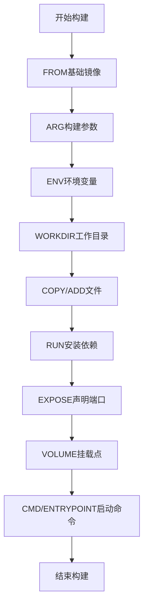

# Dockerfile指令生产环境最佳实践：从基础到高级

## 情境(Situation)

在容器化技术广泛应用的今天，Docker已经成为企业级应用部署的标准工具。Dockerfile作为构建Docker镜像的脚本文件，包含一系列指令来定义镜像的构建过程。编写高效、安全的Dockerfile是SRE工程师的必备技能。

一个好的Dockerfile不仅可以减小镜像体积、提高构建速度，还可以增强容器的安全性和可维护性。然而，在实际应用中，很多开发者对Dockerfile指令的理解不够深入，导致构建出的镜像体积过大、构建速度慢、安全性差等问题。

## 冲突(Conflict)

在实际应用中，SRE工程师经常面临以下挑战：

- **镜像体积过大**：构建出的镜像体积庞大，占用存储空间，影响传输和部署速度
- **构建速度慢**：每次构建都需要重新执行所有步骤，浪费时间和资源
- **安全性问题**：使用root用户运行容器，存在安全隐患
- **维护困难**：Dockerfile结构混乱，难以理解和维护
- **最佳实践缺失**：不了解Dockerfile的最佳实践，导致构建效率低下

## 问题(Question)

如何编写高效、安全、可维护的Dockerfile，掌握各种指令的使用方法和最佳实践，构建出高质量的Docker镜像？

## 答案(Answer)

本文将从SRE视角出发，详细介绍Dockerfile的常用指令及其最佳实践，提供一套完整的生产环境解决方案。核心方法论基于 [SRE面试题解析：你知道哪些dockerfile的指令？](#43-你知道哪些dockerfile的指令)。

---

## 一、Dockerfile指令概述

### 1.1 指令分类

**Dockerfile指令可以分为以下几类**：

| 分类 | 指令 | 作用 | 示例 |
|:------|:------|:------|:------|
| **基础指令** | FROM | 指定基础镜像 | `FROM ubuntu:20.04` |
|  | RUN | 执行构建命令 | `RUN apt-get update && apt-get install -y nginx` |
|  | CMD | 容器启动命令 | `CMD ["nginx", "-g", "daemon off;"]` |
|  | ENTRYPOINT | 容器入口点 | `ENTRYPOINT ["nginx"]` |
| **环境配置** | ENV | 设置环境变量 | `ENV NGINX_VERSION=1.18.0` |
|  | ARG | 定义构建参数 | `ARG VERSION=1.0` |
|  | WORKDIR | 设置工作目录 | `WORKDIR /app` |
|  | USER | 指定运行用户 | `USER nginx` |
| **文件操作** | COPY | 复制文件 | `COPY . /app` |
|  | ADD | 复制并解压 | `ADD nginx-1.18.0.tar.gz /usr/local/src` |
|  | EXPOSE | 声明端口 | `EXPOSE 80 443` |
|  | VOLUME | 创建挂载点 | `VOLUME /data` |
| **配置指令** | LABEL | 添加元数据 | `LABEL maintainer="example@example.com"` |
|  | HEALTHCHECK | 健康检查 | `HEALTHCHECK CMD curl -f http://localhost/ || exit 1` |
|  | STOPSIGNAL | 停止信号 | `STOPSIGNAL SIGTERM` |
|  | SHELL | 指定shell | `SHELL ["/bin/bash", "-c"]` |
|  | ONBUILD | 触发指令 | `ONBUILD COPY . /app` |

### 1.2 构建流程

**Dockerfile构建流程**：



---

## 二、核心指令详解

### 2.1 基础指令

#### 2.1.1 FROM

**功能**：指定基础镜像，是Dockerfile的第一条指令

**最佳实践**：
- 使用官方镜像作为基础
- 选择轻量级镜像（如Alpine）
- 指定具体版本，避免使用latest标签

**示例**：
```dockerfile
# 推荐：使用Alpine基础镜像
FROM alpine:3.14

# 推荐：指定具体版本
FROM ubuntu:20.04

# 不推荐：使用latest标签
# FROM ubuntu:latest
```

#### 2.1.2 RUN

**功能**：执行构建命令，每执行一次创建一层

**最佳实践**：
- 合并多条命令，减少镜像层数
- 清理临时文件，减小镜像体积
- 使用`&&`连接命令，确保命令执行失败时构建失败

**示例**：
```dockerfile
# 推荐：合并命令并清理缓存
RUN apt-get update && \
    apt-get install -y nginx && \
    apt-get clean && \
    rm -rf /var/lib/apt/lists/*

# 不推荐：多条RUN指令
# RUN apt-get update
# RUN apt-get install -y nginx
# RUN apt-get clean
```

#### 2.1.3 CMD

**功能**：定义容器启动命令，可被`docker run`覆盖

**最佳实践**：
- 使用exec格式（JSON数组）
- 只在Dockerfile中使用一次CMD
- 适合定义容器的默认行为

**示例**：
```dockerfile
# 推荐：exec格式
CMD ["nginx", "-g", "daemon off;"]

# 不推荐：shell格式
# CMD nginx -g "daemon off;"
```

#### 2.1.4 ENTRYPOINT

**功能**：定义容器入口点，不可被`docker run`覆盖

**最佳实践**：
- 与CMD配合使用，CMD作为参数
- 适合固定容器的主进程
- 使用exec格式

**示例**：
```dockerfile
# 推荐：ENTRYPOINT与CMD配合
ENTRYPOINT ["nginx"]
CMD ["-g", "daemon off;"]

# 不推荐：单独使用
# ENTRYPOINT ["nginx", "-g", "daemon off;"]
```

### 2.2 环境配置指令

#### 2.2.1 ENV

**功能**：设置环境变量，可在容器运行时使用

**最佳实践**：
- 使用环境变量替代硬编码
- 集中管理配置信息
- 便于容器配置和调试

**示例**：
```dockerfile
# 推荐：使用环境变量
ENV NGINX_VERSION=1.18.0
ENV TZ=Asia/Shanghai

# 使用环境变量
RUN apt-get install -y nginx=${NGINX_VERSION}
```

#### 2.2.2 ARG

**功能**：定义构建参数，仅在构建过程中使用

**最佳实践**：
- 用于构建时的配置
- 设置默认值
- 可通过`--build-arg`覆盖

**示例**：
```dockerfile
# 推荐：设置默认值
ARG VERSION=1.0

# 使用构建参数
RUN echo "Building version ${VERSION}"

# 构建时覆盖
# docker build --build-arg VERSION=2.0 .
```

#### 2.2.3 WORKDIR

**功能**：设置工作目录，后续命令的执行目录

**最佳实践**：
- 使用绝对路径
- 统一工作目录
- 避免使用`cd`命令

**示例**：
```dockerfile
# 推荐：使用绝对路径
WORKDIR /app

# 后续命令在/app目录执行
COPY . .
RUN npm install
```

#### 2.2.4 USER

**功能**：指定运行用户，提高容器安全性

**最佳实践**：
- 使用非root用户
- 在镜像中创建用户
- 避免权限问题

**示例**：
```dockerfile
# 推荐：使用非root用户
RUN useradd -r -s /bin/false appuser
USER appuser

# 不推荐：使用root用户
# USER root
```

### 2.3 文件操作指令

#### 2.3.1 COPY

**功能**：复制文件，只复制，不解压

**最佳实践**：
- 优先使用COPY
- 明确复制路径
- 使用`.dockerignore`排除不需要的文件

**示例**：
```dockerfile
# 推荐：明确路径
COPY package*.json ./
COPY src/ /app/src/

# 不推荐：使用通配符
# COPY * /app/
```

#### 2.3.2 ADD

**功能**：复制并解压文件，支持URL

**最佳实践**：
- 只在需要自动解压时使用
- 避免使用URL，使用RUN wget替代
- 明确复制路径

**示例**：
```dockerfile
# 推荐：需要解压时使用
ADD nginx-1.18.0.tar.gz /usr/local/src

# 不推荐：使用URL
# ADD https://example.com/file.tar.gz /app/
```

#### 2.3.3 EXPOSE

**功能**：声明容器监听的端口

**最佳实践**：
- 声明所有需要的端口
- 与`docker run -p`配合使用
- 提高容器可维护性

**示例**：
```dockerfile
# 推荐：声明所有端口
EXPOSE 80 443

# 构建时映射
# docker run -p 80:80 -p 443:443 image
```

#### 2.3.4 VOLUME

**功能**：创建挂载点，用于持久化数据

**最佳实践**：
- 用于持久化数据
- 与`docker run -v`配合使用
- 避免在Dockerfile中指定主机路径

**示例**：
```dockerfile
# 推荐：创建挂载点
VOLUME /data

# 运行时挂载
# docker run -v /host/data:/data image
```

### 2.4 配置指令

#### 2.4.1 LABEL

**功能**：添加元数据，如维护者、版本等

**最佳实践**：
- 添加必要的元数据
- 使用标准标签
- 提高镜像可维护性

**示例**：
```dockerfile
# 推荐：添加元数据
LABEL maintainer="example@example.com"
LABEL version="1.0"
LABEL description="Nginx web server"
```

#### 2.4.2 HEALTHCHECK

**功能**：定义健康检查命令，监控容器状态

**最佳实践**：
- 添加健康检查
- 合理设置检查间隔
- 确保检查命令有效

**示例**：
```dockerfile
# 推荐：添加健康检查
HEALTHCHECK --interval=30s --timeout=3s \
  CMD curl -f http://localhost/ || exit 1
```

#### 2.4.3 STOPSIGNAL

**功能**：指定容器停止信号

**最佳实践**：
- 使用SIGTERM信号
- 与应用的信号处理机制配合
- 确保容器优雅停止

**示例**：
```dockerfile
# 推荐：使用SIGTERM
STOPSIGNAL SIGTERM
```

#### 2.4.4 SHELL

**功能**：指定shell类型

**最佳实践**：
- 在Windows环境中使用
- 明确指定shell
- 提高跨平台兼容性

**示例**：
```dockerfile
# 推荐：明确指定shell
SHELL ["/bin/bash", "-c"]
```

#### 2.4.5 ONBUILD

**功能**：定义触发指令，在子镜像构建时执行

**最佳实践**：
- 用于基础镜像
- 触发构建步骤
- 提高镜像复用性

**示例**：
```dockerfile
# 推荐：在基础镜像中使用
ONBUILD COPY . /app
ONBUILD RUN npm install
```

---

## 三、生产环境最佳实践

### 3.1 镜像优化策略

**1. 选择合适的基础镜像**：
- **Alpine**：体积小，安全可靠
- **Debian/Ubuntu**：兼容性好，软件包丰富
- **Distroless**：最小化镜像，只包含应用和运行时

**2. 使用多阶段构建**：
- 分离构建环境和运行环境
- 减小最终镜像体积
- 提高构建速度

**示例**：
```dockerfile
# 多阶段构建示例
# 第一阶段：构建环境
FROM node:14-alpine as builder
WORKDIR /app
COPY package*.json ./
RUN npm install
COPY . .
RUN npm run build

# 第二阶段：生产环境
FROM nginx:alpine
WORKDIR /usr/share/nginx/html
COPY --from=builder /app/build .
EXPOSE 80
CMD ["nginx", "-g", "daemon off;"]
```

**3. 优化指令顺序**：
- 按变化频率排序指令
- 先复制依赖文件，再复制应用代码
- 充分利用构建缓存

**示例**：
```dockerfile
# 推荐：优化指令顺序
FROM node:14-alpine
WORKDIR /app

# 先复制依赖文件
COPY package*.json ./
RUN npm install

# 再复制应用代码
COPY . .

# 构建应用
RUN npm run build

EXPOSE 3000
CMD ["npm", "start"]
```

**4. 减小镜像体积**：
- 合并RUN指令
- 清理临时文件
- 使用`.dockerignore`
- 最小化安装

**示例**：
```dockerfile
# 推荐：减小镜像体积
FROM alpine:3.14

RUN apk add --no-cache nginx && \
    rm -rf /var/cache/apk/* && \
    mkdir -p /run/nginx

COPY nginx.conf /etc/nginx/nginx.conf
EXPOSE 80
CMD ["nginx", "-g", "daemon off;"]
```

### 3.2 安全性最佳实践

**1. 使用非root用户**：
- 创建专用用户
- 限制容器权限
- 减少安全攻击面

**示例**：
```dockerfile
# 推荐：使用非root用户
FROM alpine:3.14

RUN addgroup -g 1000 appgroup && \
    adduser -u 1000 -G appgroup -s /bin/false appuser

USER appuser
WORKDIR /app

COPY --chown=appuser:appgroup . .

EXPOSE 3000
CMD ["node", "app.js"]
```

**2. 最小化安装**：
- 只安装必要的软件包
- 避免安装开发依赖
- 减少潜在的安全漏洞

**示例**：
```dockerfile
# 推荐：最小化安装
FROM alpine:3.14

# 只安装必要的软件包
RUN apk add --no-cache nginx

# 不安装开发依赖
# RUN apk add --no-cache nginx gcc g++ make
```

**3. 定期更新**：
- 使用最新的基础镜像
- 定期更新软件包
- 修复安全漏洞

**示例**：
```dockerfile
# 推荐：使用最新的基础镜像
FROM alpine:3.14

# 定期更新软件包
RUN apk update && \
    apk upgrade && \
    apk add --no-cache nginx
```

**4. 安全扫描**：
- 使用容器安全扫描工具
- 检测镜像中的漏洞
- 确保镜像安全性

**示例**：
```bash
# 使用Trivy扫描镜像
docker build -t myapp .
trivy image myapp

# 使用Clair扫描镜像
docker run -d -p 6060:6060 quay.io/coreos/clair:latest
clair-scanner --ip 127.0.0.1 myapp
```

### 3.3 可维护性最佳实践

**1. 标准化Dockerfile**：
- 遵循统一的结构
- 使用清晰的注释
- 保持代码风格一致

**示例**：
```dockerfile
# 推荐：标准化Dockerfile
# 基础镜像
FROM alpine:3.14

# 元数据
LABEL maintainer="example@example.com"
LABEL version="1.0"
LABEL description="Web application"

# 环境变量
ENV NODE_ENV=production
ENV PORT=3000

# 安装依赖
RUN apk add --no-cache nodejs npm

# 创建用户
RUN addgroup -g 1000 appgroup && \
    adduser -u 1000 -G appgroup -s /bin/false appuser

# 设置工作目录
WORKDIR /app

# 复制文件
COPY package*.json ./
RUN npm install --production
COPY --chown=appuser:appgroup . .

# 切换用户
USER appuser

# 暴露端口
EXPOSE $PORT

# 健康检查
HEALTHCHECK --interval=30s --timeout=3s \
  CMD curl -f http://localhost:$PORT || exit 1

# 启动命令
CMD ["node", "app.js"]
```

**2. 版本控制**：
- 将Dockerfile纳入版本控制
- 跟踪变更历史
- 便于回滚和审计

**3. 构建缓存**：
- 合理利用构建缓存
- 提高构建速度
- 减少网络传输

**4. 文档化**：
- 记录Dockerfile的设计思路
- 说明构建参数和环境变量
- 提供使用示例

### 3.4 常见问题解决方案

**1. 镜像体积过大**：
- 使用多阶段构建
- 清理临时文件
- 使用轻量级基础镜像

**2. 构建速度慢**：
- 优化指令顺序
- 利用构建缓存
- 减少网络依赖

**3. 容器启动失败**：
- 检查CMD/ENTRYPOINT指令
- 确保端口映射正确
- 验证环境变量配置

**4. 权限问题**：
- 使用非root用户
- 正确设置文件权限
- 避免权限提升

**5. 环境变量不生效**：
- 使用ENV指令
- 检查变量名称
- 验证容器运行命令

---

## 四、企业级解决方案

### 4.1 CI/CD集成

**1. GitLab CI/CD**：
- 自动化构建和部署
- 集成容器安全扫描
- 支持多环境部署

**示例配置**：
```yaml
# .gitlab-ci.yml
stages:
  - build
  - test
  - deploy

build:
  stage: build
  script:
    - docker build -t $CI_REGISTRY_IMAGE:$CI_COMMIT_SHORT_SHA .
    - docker push $CI_REGISTRY_IMAGE:$CI_COMMIT_SHORT_SHA

test:
  stage: test
  script:
    - docker run --rm $CI_REGISTRY_IMAGE:$CI_COMMIT_SHORT_SHA npm test

deploy:
  stage: deploy
  script:
    - docker pull $CI_REGISTRY_IMAGE:$CI_COMMIT_SHORT_SHA
    - docker tag $CI_REGISTRY_IMAGE:$CI_COMMIT_SHORT_SHA $CI_REGISTRY_IMAGE:latest
    - docker push $CI_REGISTRY_IMAGE:latest
    - docker run -d --name myapp -p 80:80 $CI_REGISTRY_IMAGE:latest
```

**2. Jenkins**：
- 丰富的Docker插件
- 支持复杂的构建流程
- 集成测试和部署

**3. GitHub Actions**：
- 基于事件的自动化
- 与GitHub代码仓库集成
- 简洁的配置语法

### 4.2 镜像管理

**1. 私有镜像仓库**：
- Harbor：企业级镜像仓库
- Docker Registry：官方镜像仓库
- Nexus：通用仓库管理

**2. 镜像标签管理**：
- 使用语义化版本
- 避免使用latest标签
- 定期清理旧镜像

**3. 镜像扫描**：
- Trivy：容器安全扫描
- Clair：静态漏洞分析
- Aqua Security：企业级安全解决方案

### 4.3 容器编排

**1. Kubernetes**：
- 强大的容器编排能力
- 支持滚动更新和回滚
- 集成健康检查和自动修复

**2. Docker Swarm**：
- 原生Docker集群管理
- 简单易用，适合小型环境
- 与Docker命令兼容

**3. Rancher**：
- 容器管理平台
- 支持多集群管理
- 集成监控和告警

---

## 五、最佳实践总结

### 5.1 核心原则

**1. 最小化原则**：
- 最小化镜像体积
- 最小化安装软件包
- 最小化容器权限

**2. 安全性原则**：
- 使用非root用户
- 定期更新镜像
- 扫描安全漏洞

**3. 可维护性原则**：
- 标准化Dockerfile结构
- 清晰的注释和文档
- 版本控制和变更管理

**4. 效率原则**：
- 优化构建速度
- 利用构建缓存
- 自动化构建和部署

### 5.2 配置建议

**生产环境配置清单**：
- [ ] 使用官方Alpine镜像作为基础
- [ ] 按变化频率排序指令
- [ ] 合并RUN指令，清理临时文件
- [ ] 使用多阶段构建减小镜像体积
- [ ] 使用非root用户运行容器
- [ ] 添加健康检查和元数据
- [ ] 使用`.dockerignore`排除不需要的文件
- [ ] 定期更新基础镜像和软件包
- [ ] 扫描镜像安全漏洞
- [ ] 将Dockerfile纳入版本控制

**推荐命令**：
- **构建镜像**：`docker build -t myapp .`
- **扫描镜像**：`trivy image myapp`
- **运行容器**：`docker run -d --name myapp -p 80:80 myapp`
- **查看日志**：`docker logs myapp`
- **进入容器**：`docker exec -it myapp /bin/sh`

### 5.3 经验总结

**常见误区**：
- **使用latest标签**：导致镜像版本不确定
- **多层RUN指令**：增加镜像体积和层数
- **使用root用户**：存在安全隐患
- **忽略构建缓存**：构建速度慢
- **硬编码配置**：缺乏灵活性

**成功经验**：
- **标准化流程**：建立统一的Dockerfile模板
- **自动化管理**：集成CI/CD流水线
- **安全意识**：定期扫描和更新镜像
- **性能优化**：减小镜像体积，提高构建速度
- **持续学习**：关注Docker的新特性和最佳实践

---

## 总结

Dockerfile是构建Docker镜像的核心，掌握其指令和最佳实践对于SRE工程师至关重要。通过本文的指导，我们了解了Dockerfile的常用指令及其使用方法，掌握了生产环境中的最佳实践。

**核心要点**：

1. **指令分类**：基础指令、环境配置、文件操作、配置指令
2. **最佳实践**：使用轻量级基础镜像、多阶段构建、优化指令顺序、使用非root用户
3. **安全性**：最小化权限、定期更新、安全扫描
4. **可维护性**：标准化结构、版本控制、文档化
5. **企业级方案**：CI/CD集成、镜像管理、容器编排

通过遵循这些最佳实践，我们可以构建出高效、安全、可维护的Docker镜像，提高容器化应用的部署效率和运行稳定性。

> **延伸学习**：更多面试相关的Dockerfile指令知识，请参考 [SRE面试题解析：你知道哪些dockerfile的指令？](#43-你知道哪些dockerfile的指令)。

---

## 参考资料

- [Docker官方文档 - Dockerfile](https://docs.docker.com/engine/reference/builder/)
- [Dockerfile最佳实践](https://docs.docker.com/develop/develop-images/dockerfile_best-practices/)
- [多阶段构建](https://docs.docker.com/develop/develop-images/multistage-build/)
- [Alpine Linux](https://alpinelinux.org/)
- [Docker Security](https://docs.docker.com/engine/security/)
- [Trivy](https://github.com/aquasecurity/trivy)
- [Clair](https://github.com/quay/clair)
- [Harbor](https://goharbor.io/)
- [Kubernetes](https://kubernetes.io/)
- [Docker Swarm](https://docs.docker.com/engine/swarm/)
- [Rancher](https://rancher.com/)
- [GitLab CI/CD](https://docs.gitlab.com/ee/ci/)
- [Jenkins](https://www.jenkins.io/)
- [GitHub Actions](https://github.com/features/actions)
- [容器镜像优化](https://docs.docker.com/develop/develop-images/optimizing/)
- [容器安全扫描](https://docs.docker.com/engine/security/scan/)
- [Linux用户管理](https://linux.die.net/man/8/useradd)
- [Docker网络](https://docs.docker.com/network/)
- [Docker存储](https://docs.docker.com/storage/)
- [容器健康检查](https://docs.docker.com/engine/reference/builder/#healthcheck)
- [容器日志管理](https://docs.docker.com/config/containers/logging/)
- [容器资源管理](https://docs.docker.com/config/containers/resource_constraints/)
- [容器监控](https://docs.docker.com/config/containers/monitoring/)
- [容器备份](https://docs.docker.com/storage/volumes/#back-up-restore-or-migrate-data-volumes)
- [容器故障排查](https://docs.docker.com/config/containers/logging/)
- [容器性能优化](https://www.docker.com/blog/container-performance-optimization/)
- [企业级容器管理](https://www.docker.com/products/docker-enterprise)