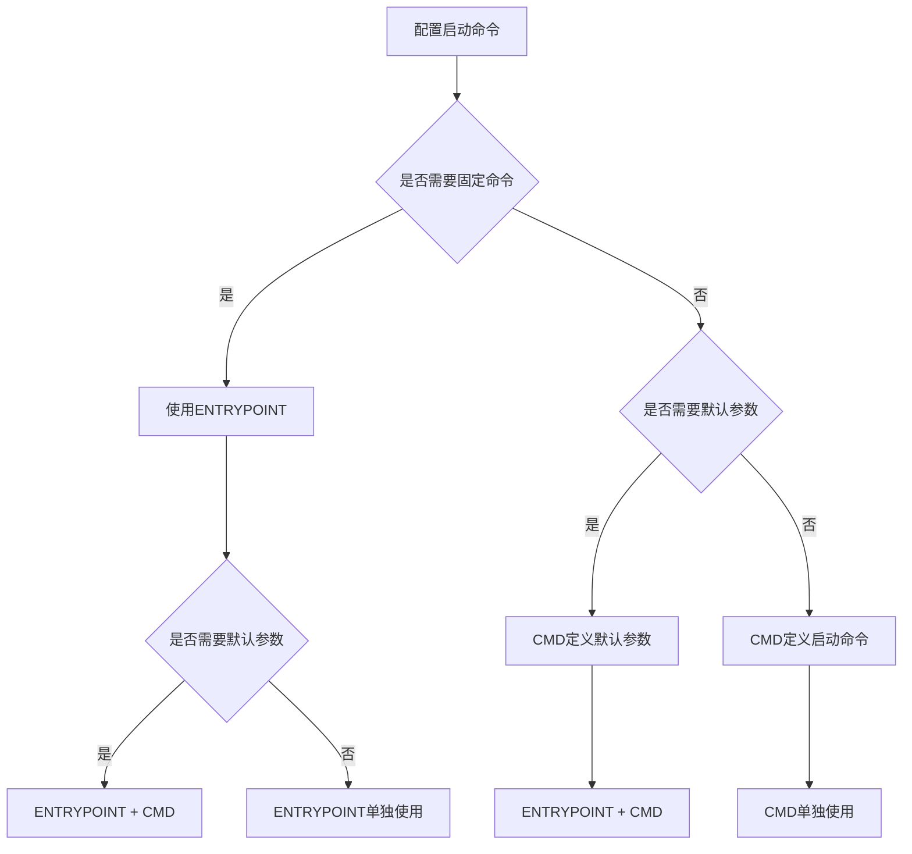

# Dockerfile中CMD和ENTRYPOINT指令的区别：生产环境最佳实践

## 情境(Situation)

在容器化技术广泛应用的今天，Docker已经成为企业级应用部署的标准工具。Dockerfile作为构建Docker镜像的脚本文件，包含一系列指令来定义镜像的构建过程。其中，CMD和ENTRYPOINT指令是两个常用的启动指令，用于指定容器启动时执行的命令。

然而，很多开发者对这两个指令的区别理解不够深入，导致在实际使用中出现启动行为不符合预期、信号传递问题、无法覆盖参数等问题。作为SRE工程师，我们需要掌握这两个指令的区别及最佳实践，确保容器的正确启动和运行。

## 冲突(Conflict)

在实际应用中，SRE工程师经常面临以下挑战：

- **启动行为不符合预期**：容器启动后立即退出或执行错误的命令
- **信号传递问题**：SIGTERM等信号无法正确传递到应用进程
- **无法覆盖参数**：无法通过docker run参数覆盖默认命令
- **进程管理问题**：应用不是容器的PID 1进程，导致信号处理异常
- **最佳实践缺失**：不了解CMD和ENTRYPOINT的最佳组合方式

## 问题(Question)

如何正确理解和使用CMD和ENTRYPOINT指令，确保容器启动行为符合预期，信号传递正确，并且能够灵活覆盖参数？

## 答案(Answer)

本文将从SRE视角出发，详细介绍Dockerfile中CMD和ENTRYPOINT指令的区别及最佳实践，提供一套完整的生产环境解决方案。核心方法论基于 [SRE面试题解析：Dockerfile中CMD和ENTRYPOINT指令的区别？](#46-dockerfile中cmd和entrypoint指令的区别)。

---

## 一、核心区别对比

### 1.1 基本区别

**CMD和ENTRYPOINT指令的核心区别**：

| 特性 | CMD | ENTRYPOINT |
|:------|:-----|:------------|
| **作用** | 指定默认启动命令 | 定义容器入口点 |
| **覆盖方式** | docker run参数覆盖 | --entrypoint参数覆盖 |
| **组合使用** | 作为ENTRYPOINT的参数 | 定义固定命令 |
| **推荐度** | ⭐⭐⭐ | ⭐⭐⭐⭐ |

### 1.2 语法形式

**CMD和ENTRYPOINT指令的语法形式**：

| 形式 | CMD | ENTRYPOINT |
|:------|:-----|:------------|
| **shell形式** | `CMD echo "Hello"` | `ENTRYPOINT echo "Hello"` |
| **exec形式** | `CMD ["echo", "Hello"]` | `ENTRYPOINT ["echo", "Hello"]` |
| **参数形式** | `CMD ["--port", "8080"]` | 不可用 |

### 1.3 选择流程

**CMD和ENTRYPOINT指令选择流程**：



---

## 二、详细功能对比

### 2.1 覆盖特性

**CMD和ENTRYPOINT指令的覆盖特性**：

| 操作 | CMD | ENTRYPOINT |
|:------|:-----|:------------|
| **docker run参数覆盖** | ✅ 自动追加到命令 | ❌ 被忽略 |
| **--entrypoint覆盖** | ❌ 不影响 | ✅ 完全覆盖 |
| **多指令时** | 执行最后一个 | 执行最后一个 |

### 2.2 组合使用

**CMD和ENTRYPOINT的组合使用**：

**最佳实践**：使用ENTRYPOINT定义固定命令，CMD提供默认参数

**示例**：

```dockerfile
# ENTRYPOINT定义固定命令，CMD提供默认参数
ENTRYPOINT ["nginx", "-g"]
CMD ["daemon off;"]

# docker run时覆盖CMD参数
# docker run myimage -g "daemon on;"
# 执行：nginx -g "daemon on;"
```

### 2.3 信号传递

**信号传递问题**：

- **shell形式**：命令在shell中执行，导致信号无法正确传递
- **exec形式**：命令直接执行，信号可以正确传递
- **PID 1**：应用需要成为容器的PID 1进程才能正确接收信号

**exec "$@"的作用**：

| 作用 | 说明 |
|:------|:------|
| **进程替换** | 用新进程替换当前shell进程 |
| **信号传递** | 确保SIGTERM等信号传递到应用 |
| **PID 1** | 确保应用成为容器PID 1 |

**示例**：

```bash
#!/bin/sh
echo "Initializing..."
exec "$@"  # 替换当前进程，执行传入的命令
```

---

## 三、最佳实践

### 3.1 推荐用法

**CMD和ENTRYPOINT指令的推荐用法**：

1. **单独使用CMD**：
   - 适合简单应用
   - 允许用户通过docker run参数覆盖

**示例**：

```dockerfile
# 单独使用CMD
CMD ["nginx", "-g", "daemon off;"]

# 用户可以覆盖
# docker run myimage echo "Hello"
```

2. **单独使用ENTRYPOINT**：
   - 适合需要固定命令的应用
   - 用户无法通过docker run参数覆盖，只能通过--entrypoint覆盖

**示例**：

```dockerfile
# 单独使用ENTRYPOINT
ENTRYPOINT ["nginx", "-g", "daemon off;"]

# 用户需要使用--entrypoint覆盖
# docker run --entrypoint echo myimage "Hello"
```

3. **组合使用ENTRYPOINT+CMD**：
   - 最佳实践
   - ENTRYPOINT定义固定命令，CMD提供默认参数
   - 用户可以通过docker run参数覆盖CMD

**示例**：

```dockerfile
# 组合使用ENTRYPOINT+CMD
ENTRYPOINT ["nginx", "-g"]
CMD ["daemon off;"]

# 用户可以覆盖CMD参数
# docker run myimage "daemon on;"
```

### 3.2 语法形式选择

**推荐使用exec形式**：

- **exec形式**：`CMD ["command", "arg1", "arg2"]`
- **优势**：
  - 信号可以正确传递
  - 应用成为容器PID 1
  - 避免shell解释带来的问题

**避免使用shell形式**：

- **shell形式**：`CMD command arg1 arg2`
- **问题**：
  - 信号无法正确传递
  - 应用不是容器PID 1
  - 可能导致进程管理问题

### 3.3 启动脚本最佳实践

**使用启动脚本的最佳实践**：

1. **使用exec "$@"**：
   - 确保应用成为容器PID 1
   - 确保信号正确传递

**示例**：

```bash
#!/bin/sh

# 初始化环境
echo "Initializing environment..."
# 执行初始化操作

# 替换当前进程，执行应用
exec "$@"
```

**Dockerfile示例**：

```dockerfile
FROM alpine:3.14

# 复制启动脚本
COPY entrypoint.sh /entrypoint.sh
RUN chmod +x /entrypoint.sh

# 组合使用ENTRYPOINT+CMD
ENTRYPOINT ["/entrypoint.sh"]
CMD ["nginx", "-g", "daemon off;"]
```

### 3.4 常见问题及解决方案

**常见问题及解决方案**：

| 问题 | 解决方案 |
|:------|:----------|
| **容器启动后立即退出** | 确保前台运行，使用daemon off |
| **信号无法传递** | 使用exec形式，启动脚本用exec "$@" |
| **无法覆盖参数** | 检查是否误用ENTRYPOINT |
| **多个CMD/ENTRYPOINT** | 只会执行最后一个 |
| **应用不是PID 1** | 使用exec形式或exec "$@" |

---

## 四、详细示例

### 4.1 基本用法示例

**CMD指令示例**：

```dockerfile
# shell形式
CMD echo "Hello World"

# exec形式
CMD ["echo", "Hello World"]

# 参数形式（与ENTRYPOINT配合）
CMD ["--port", "8080"]
```

**ENTRYPOINT指令示例**：

```dockerfile
# shell形式
ENTRYPOINT echo "Hello World"

# exec形式
ENTRYPOINT ["echo", "Hello World"]

# 与CMD配合
ENTRYPOINT ["nginx", "-g"]
CMD ["daemon off;"]
```

### 4.2 最佳实践示例

**推荐的启动配置**：

1. **简单应用**：

```dockerfile
# 简单应用
FROM nginx:alpine

# 使用exec形式
CMD ["nginx", "-g", "daemon off;"]
```

2. **需要固定命令的应用**：

```dockerfile
# 需要固定命令的应用
FROM node:14-alpine

# 固定命令
ENTRYPOINT ["node", "app.js"]

# 默认参数
CMD ["--port", "3000"]
```

3. **需要初始化的应用**：

```dockerfile
# 需要初始化的应用
FROM python:3.9-alpine

# 复制启动脚本
COPY entrypoint.sh /entrypoint.sh
RUN chmod +x /entrypoint.sh

# 组合使用
ENTRYPOINT ["/entrypoint.sh"]
CMD ["python", "app.py"]
```

**entrypoint.sh**：

```bash
#!/bin/sh

# 初始化数据库
echo "Initializing database..."
python init_db.py

# 替换当前进程，执行应用
exec "$@"
```

### 4.3 不推荐的用法

**不推荐的启动配置**：

1. **使用shell形式**：

```dockerfile
# 不推荐：使用shell形式
CMD nginx -g "daemon off;"

# 不推荐：使用shell形式
ENTRYPOINT nginx -g "daemon off;"
```

2. **多个CMD/ENTRYPOINT**：

```dockerfile
# 不推荐：多个CMD
CMD echo "First command"
CMD echo "Second command"  # 只会执行这一个

# 不推荐：多个ENTRYPOINT
ENTRYPOINT echo "First entrypoint"
ENTRYPOINT echo "Second entrypoint"  # 只会执行这一个
```

3. **错误的组合使用**：

```dockerfile
# 不推荐：CMD没有作为ENTRYPOINT的参数
ENTRYPOINT ["echo", "Hello"]
CMD ["World"]  # 正确：执行 echo Hello World

# 不推荐：ENTRYPOINT使用shell形式
ENTRYPOINT echo "Hello"
CMD ["World"]  # 错误：CMD会被忽略
```

---

## 五、企业级应用场景

### 5.1 CI/CD集成

**CI/CD中的启动配置最佳实践**：

1. **GitLab CI/CD**：
   - 使用exec形式的CMD或ENTRYPOINT
   - 组合使用ENTRYPOINT+CMD
   - 集成健康检查

**示例配置**：

```yaml
# .gitlab-ci.yml
build:
  script:
    - docker build -t $CI_REGISTRY_IMAGE:$CI_COMMIT_SHORT_SHA .
    - docker push $CI_REGISTRY_IMAGE:$CI_COMMIT_SHORT_SHA
  only:
    - master

deploy:
  script:
    - docker run -d --name myapp -p 80:80 $CI_REGISTRY_IMAGE:$CI_COMMIT_SHORT_SHA
  only:
    - master
```

2. **Jenkins**：
   - 使用启动脚本和exec "$@"
   - 集成监控和告警
   - 自动化部署

3. **GitHub Actions**：
   - 使用多阶段构建
   - 组合使用ENTRYPOINT+CMD
   - 自动部署

### 5.2 微服务架构

**微服务架构中的启动配置**：

1. **服务启动一致性**：
   - 统一使用ENTRYPOINT+CMD
   - 标准化启动脚本
   - 确保信号传递正确

2. **服务发现**：
   - 使用环境变量配置
   - 启动脚本中注册服务
   - 健康检查集成

3. **配置管理**：
   - 使用CMD传递配置参数
   - 环境变量覆盖
   - 配置文件挂载

### 5.3 高可用部署

**高可用部署中的启动配置**：

1. **优雅启动和停止**：
   - 使用exec形式确保信号传递
   - 启动脚本中进行健康检查
   - 优雅关闭处理

2. **负载均衡**：
   - 标准化服务端口
   - 健康检查端点
   - 自动注册服务

3. **故障恢复**：
   - 启动脚本中进行状态检查
   - 数据恢复机制
   - 监控集成

---

## 六、性能优化

### 6.1 启动速度优化

**容器启动速度优化**：

1. **减少启动时间**：
   - 简化启动脚本
   - 避免不必要的初始化
   - 使用轻量级基础镜像

2. **并行启动**：
   - 优化依赖关系
   - 使用编排工具的健康检查
   - 合理设置启动顺序

### 6.2 信号处理优化

**信号处理优化**：

1. **确保信号传递**：
   - 使用exec形式
   - 启动脚本使用exec "$@"
   - 避免shell形式

2. **优雅关闭**：
   - 处理SIGTERM信号
   - 设置合理的超时时间
   - 确保数据一致性

**示例**：

```bash
#!/bin/sh

# 捕获信号
 trap 'echo "Received SIGTERM, shutting down..."; exit 0' SIGTERM

# 初始化
echo "Initializing..."

# 执行应用
exec "$@"
```

---

## 七、最佳实践总结

### 7.1 核心原则

**CMD和ENTRYPOINT指令使用核心原则**：

1. **明确性**：
   - 优先使用exec形式
   - 组合使用ENTRYPOINT+CMD
   - 明确启动行为

2. **信号传递**：
   - 使用exec "$@"确保信号传递
   - 避免shell形式
   - 确保应用成为PID 1

3. **灵活性**：
   - 使用CMD提供默认参数
   - 允许用户覆盖参数
   - 标准化启动配置

4. **可维护性**：
   - 统一启动脚本
   - 标准化配置
   - 清晰的注释

### 7.2 配置建议

**生产环境配置清单**：
- [ ] 优先使用exec形式的CMD或ENTRYPOINT
- [ ] 组合使用ENTRYPOINT+CMD（固定命令+默认参数）
- [ ] 启动脚本使用exec "$@"确保信号传递
- [ ] 避免使用shell形式
- [ ] 确保应用前台运行（如nginx的daemon off）
- [ ] 处理信号，实现优雅关闭
- [ ] 集成健康检查
- [ ] 标准化启动配置
- [ ] 定期测试启动行为

**推荐命令**：
- **exec形式**：`CMD ["command", "arg1", "arg2"]`
- **组合使用**：`ENTRYPOINT ["command"]` + `CMD ["arg1", "arg2"]`
- **启动脚本**：`exec "$@"`
- **覆盖参数**：`docker run myimage arg1 arg2`
- **覆盖entrypoint**：`docker run --entrypoint command myimage arg1 arg2`

### 7.3 经验总结

**常见误区**：
- **使用shell形式**：导致信号传递问题
- **多个CMD/ENTRYPOINT**：只会执行最后一个
- **错误的组合使用**：CMD没有作为ENTRYPOINT的参数
- **启动脚本不使用exec "$@"**：导致信号无法传递
- **容器启动后立即退出**：没有前台运行

**成功经验**：
- **标准化配置**：统一使用ENTRYPOINT+CMD
- **信号处理**：使用exec形式和exec "$@"
- **灵活性**：允许用户覆盖参数
- **可维护性**：清晰的注释和文档
- **测试验证**：定期测试启动行为

---

## 总结

Dockerfile中CMD和ENTRYPOINT指令的选择和使用是构建高效、可靠容器的重要环节。通过本文的指导，我们了解了这两个指令的核心区别、适用场景和最佳实践。

**核心要点**：

1. **CMD指令**：定义默认启动命令，可被docker run参数覆盖
2. **ENTRYPOINT指令**：定义固定入口点，需要--entrypoint参数覆盖
3. **最佳实践**：组合使用ENTRYPOINT+CMD，用ENTRYPOINT定义固定命令，CMD提供默认参数
4. **语法形式**：优先使用exec形式，避免shell形式
5. **信号传递**：启动脚本使用exec "$@"，确保信号正确传递
6. **企业级应用**：集成CI/CD，标准化启动配置，实现高可用部署

通过遵循这些最佳实践，我们可以确保容器启动行为符合预期，信号传递正确，并且能够灵活覆盖参数，从而构建出高效、可靠的容器化应用。

> **延伸学习**：更多面试相关的CMD和ENTRYPOINT指令知识，请参考 [SRE面试题解析：Dockerfile中CMD和ENTRYPOINT指令的区别？](#46-dockerfile中cmd和entrypoint指令的区别)。

---

## 参考资料

- [Docker官方文档 - CMD](https://docs.docker.com/engine/reference/builder/#cmd)
- [Docker官方文档 - ENTRYPOINT](https://docs.docker.com/engine/reference/builder/#entrypoint)
- [Docker官方文档 - 最佳实践](https://docs.docker.com/develop/develop-images/dockerfile_best-practices/)
- [Docker信号处理](https://docs.docker.com/engine/reference/run/#foreground)
- [exec命令](https://linux.die.net/man/1/exec)
- [信号处理](https://man7.org/linux/man-pages/man7/signal.7.html)
- [GitLab CI/CD](https://docs.gitlab.com/ee/ci/)
- [Jenkins](https://www.jenkins.io/)
- [GitHub Actions](https://github.com/features/actions)
- [Kubernetes](https://kubernetes.io/)
- [容器健康检查](https://docs.docker.com/engine/reference/builder/#healthcheck)
- [容器网络](https://docs.docker.com/network/)
- [容器存储](https://docs.docker.com/storage/)
- [企业级容器管理](https://www.docker.com/products/docker-enterprise)
- [微服务架构](https://microservices.io/)
- [容器编排](https://kubernetes.io/docs/concepts/overview/what-is-kubernetes/)
- [镜像仓库](https://goharbor.io/)
- [容器监控](https://docs.docker.com/config/containers/monitoring/)
- [容器部署](https://docs.docker.com/engine/swarm/deploying/)
- [容器故障排查](https://docs.docker.com/config/containers/logging/)
- [容器备份与恢复](https://docs.docker.com/storage/volumes/#back-up-restore-or-migrate-data-volumes)
- [Dockerfile指令详解](https://docs.docker.com/engine/reference/builder/)
- [容器安全最佳实践](https://docs.docker.com/engine/security/)
- [容器性能优化](https://www.docker.com/blog/container-performance-optimization/)
- [容器启动时间优化](https://www.docker.com/blog/optimizing-docker-container-startup-time/)
- [信号传递最佳实践](https://www.ctl.io/developers/blog/post/gracefully-stopping-docker-containers/)
- [PID 1问题](https://blog.phusion.nl/2015/01/20/docker-and-the-pid-1-zombie-reaping-problem/)