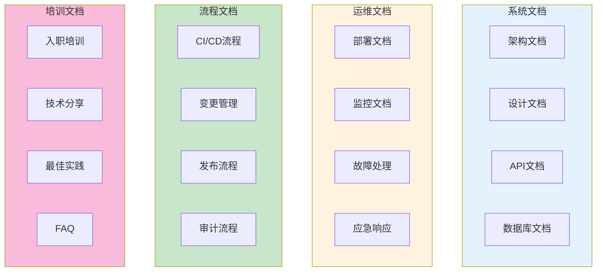
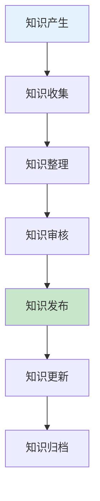

# 文档与知识管理生产环境最佳实践

## 情境(Situation)

在DevOps/SRE团队中，文档和知识管理是确保团队高效协作和知识传承的关键。完善的文档体系能够帮助新成员快速上手，减少知识流失，提高问题解决效率。

## 冲突(Conflict)

许多团队在文档与知识管理方面面临以下挑战：
- **文档缺失**：关键流程和配置缺乏文档记录
- **文档过期**：文档内容与实际情况不符
- **文档分散**：信息分散在多个地方，难以查找
- **知识流失**：关键知识只存在于老员工脑海中
- **缺乏维护**：文档创建后无人更新维护

## 问题(Question)

如何建立和维护一套有效的DevOps文档体系，确保知识的有效传承和利用？

## 答案(Answer)

本文将基于真实生产案例，提供一套完整的文档与知识管理最佳实践指南。

---

## 一、文档体系架构

### 1.1 文档分类架构



### 1.2 文档类型说明

| 类型 | 内容 | 维护频率 | 责任人 |
|:----:|------|----------|--------|
| **架构文档** | 系统架构设计 | 架构变更时 | 架构师 |
| **设计文档** | 功能设计说明 | 功能开发前 | 开发负责人 |
| **API文档** | 接口规范说明 | API变更时 | 开发人员 |
| **部署文档** | 部署步骤说明 | 部署流程变更时 | SRE工程师 |
| **监控文档** | 监控配置说明 | 监控变更时 | SRE工程师 |
| **故障处理** | 故障排查指南 | 故障复盘后 | SRE工程师 |
| **流程文档** | 标准操作流程 | 流程变更时 | 流程负责人 |
| **培训文档** | 培训资料 | 定期更新 | 技术负责人 |

---

## 二、文档管理工具

### 2.1 工具选择矩阵

| 工具 | 用途 | 优点 | 适用场景 |
|:----:|------|------|----------|
| **Confluence** | 企业级Wiki | 功能强大、集成度高 | 大型团队 |
| **Notion** | 协作平台 | 灵活、美观 | 中小型团队 |
| **GitHub Wiki** | 代码文档 | 与代码版本同步 | 开源项目 |
| **Read the Docs** | 技术文档 | 专业文档格式 | 技术文档 |
| **Markdown** | 轻量级文档 | 简洁、易编辑 | 快速文档 |

### 2.2 文档目录结构

```
docs/
├── architecture/          # 架构文档
│   ├── system-architecture.md
│   ├── network-diagram.md
│   └── security-design.md
├── api/                   # API文档
│   ├── v1/
│   │   ├── users.md
│   │   └── orders.md
│   └── v2/
│       └── api-changes.md
├── operations/            # 运维文档
│   ├── deployment/
│   │   ├── deploy-guide.md
│   │   └── rollback-guide.md
│   ├── monitoring/
│   │   ├── alert-rules.md
│   │   └── dashboard-guide.md
│   └── troubleshooting/
│       ├── common-issues.md
│       └── incident-handbook.md
├── processes/             # 流程文档
│   ├── ci-cd-process.md
│   ├── change-management.md
│   └── release-process.md
├── training/              # 培训文档
│   ├── onboarding.md
│   ├── best-practices.md
│   └── faq.md
└── README.md
```

---

## 三、文档编写规范

### 3.1 文档模板

```markdown
# 文档标题

## 1. 概述
简要描述文档内容和目的。

## 2. 适用范围
说明文档适用的场景和对象。

## 3. 前提条件
列出阅读或执行本文档所需的前置条件。

## 4. 详细内容
### 4.1 章节标题
详细内容描述...

### 4.2 章节标题
详细内容描述...

## 5. 相关文档
- [相关文档1](link)
- [相关文档2](link)

## 6. 版本历史
| 版本 | 日期 | 作者 | 变更说明 |
|------|------|------|----------|
| v1.0 | 2024-01-01 | 张三 | 初始版本 |
| v1.1 | 2024-01-15 | 李四 | 更新配置说明 |
```

### 3.2 文档质量标准

| 标准 | 说明 | 检查方法 |
|:----:|------|----------|
| **准确性** | 内容与实际一致 | 定期审核 |
| **完整性** | 覆盖所有必要内容 | 文档评审 |
| **清晰性** | 易于理解 | 可读性检查 |
| **时效性** | 内容保持最新 | 版本管理 |
| **可操作性** | 步骤可执行 | 实操验证 |

---

## 四、知识管理流程

### 4.1 知识沉淀流程



### 4.2 知识管理流程说明

| 阶段 | 描述 | 责任人 | 工具 |
|:----:|------|--------|------|
| **知识产生** | 日常工作中产生的经验和知识 | 所有成员 | 即时通讯工具 |
| **知识收集** | 收集有价值的知识内容 | 知识管理员 | 文档工具 |
| **知识整理** | 整理和结构化知识内容 | 知识贡献者 | 文档工具 |
| **知识审核** | 审核知识的准确性和完整性 | 技术负责人 | 文档工具 |
| **知识发布** | 发布到知识库供团队使用 | 知识管理员 | 知识库平台 |
| **知识更新** | 根据反馈更新知识内容 | 知识所有者 | 文档工具 |
| **知识归档** | 归档不再使用的知识 | 知识管理员 | 归档系统 |

---

## 五、文档协作与维护

### 5.1 文档协作流程

```yaml
# 文档协作流程
workflow:
  create:
    - 确定文档需求
    - 分配文档负责人
    - 创建文档草稿
    - 同行评审
    - 技术负责人审核
    - 发布文档
  
  update:
    - 识别文档更新需求
    - 更新文档内容
    - 通知相关人员
    - 审核更新内容
    - 发布更新版本
  
  review:
    - 定期检查文档
    - 识别过期内容
    - 安排更新任务
    - 执行更新
    - 记录版本历史
  
  archive:
    - 评估文档价值
    - 确认归档需求
    - 备份文档
    - 归档到历史库
```

### 5.2 文档维护策略

```yaml
# 文档维护策略
maintenance:
  review_frequency:
    critical: "每月一次"
    important: "每季度一次"
    general: "每年一次"
  
  ownership:
    - 每个文档指定负责人
    - 负责人负责文档更新
    - 定期轮换负责人
  
  notification:
    - 文档更新时通知相关人员
    - 重要变更发送提醒
    - 定期发送文档更新汇总
  
  metrics:
    - document_coverage: "覆盖所有核心流程"
    - document_accuracy: "95%以上准确"
    - document_usage: "定期访问统计"
```

---

## 六、知识库平台搭建

### 6.1 Confluence配置

```yaml
# Confluence空间配置
spaces:
  sre-knowledge:
    name: "SRE知识库"
    description: "SRE团队知识共享平台"
    permissions:
      - group: "sre-team"
        permissions: ["read", "write", "comment"]
      - group: "dev-team"
        permissions: ["read", "comment"]
      - group: "management"
        permissions: ["read"]
  
  docs-architecture:
    name: "架构文档"
    description: "系统架构设计文档"
    permissions:
      - group: "architecture-team"
        permissions: ["read", "write"]
      - group: "all-users"
        permissions: ["read"]
```

### 6.2 文档搜索优化

```yaml
# 文档搜索优化
search_optimization:
  indexing:
    - enable_full_text_search: true
    - update_frequency: "实时"
    - include_attachments: true
  
  tagging:
    - mandatory_tags: ["category", "status", "owner"]
    - recommended_tags: ["version", "priority"]
  
  navigation:
    - create_hierarchy: true
    - add_shortcuts: true
    - enable_breadcrumbs: true
  
  analytics:
    - track_views: true
    - track_updates: true
    - identify_popular_docs: true
```

---

## 七、知识分享与培训

### 7.1 知识分享机制

```yaml
# 知识分享机制
knowledge_sharing:
  tech_talks:
    frequency: "每周一次"
    duration: "60分钟"
    format: "在线分享"
    topics:
      - "技术深度分享"
      - "故障复盘"
      - "最佳实践"
  
  brown_bag:
    frequency: "每月一次"
    duration: "30分钟"
    format: "午餐分享"
    topics:
      - "新技术介绍"
      - "工具使用技巧"
      - "工作经验交流"
  
  documentation_drive:
    frequency: "每季度一次"
    duration: "1天"
    goal: "文档完善和更新"
  
  mentorship:
    - pair_programming: true
    - shadowing: true
    - knowledge_transfer: true
```

### 7.2 培训体系

```yaml
# 培训体系
training:
  onboarding:
    duration: "2周"
    modules:
      - "团队介绍"
      - "基础设施概览"
      - "工具使用培训"
      - "流程介绍"
      - "导师带教"
  
  skill_development:
    - cloud_architecture: "AWS/GCP/阿里云认证"
    - kubernetes: "CKA/CKS认证"
    - automation: "Python/Go开发"
    - security: "安全意识培训"
  
  certification:
    - required: ["AWS Solutions Architect"]
    - recommended: ["CKA", "CISSP"]
```

---

## 八、最佳实践总结

### 8.1 文档与知识管理原则

| 原则 | 说明 | 实践建议 |
|:----:|------|----------|
| **文档即代码** | 文档与代码同等重要 | 使用版本控制管理文档 |
| **持续更新** | 文档需要及时更新 | 建立文档维护机制 |
| **可访问性** | 确保文档易于查找 | 使用搜索和标签 |
| **协作编写** | 多人协作完成文档 | 使用协作工具 |
| **知识沉淀** | 确保知识不流失 | 建立知识库 |

### 8.2 常见问题与解决方案

| 问题 | 症状 | 解决方案 |
|:-----|:-----|:----------|
| **文档缺失** | 关键流程无文档 | 制定文档覆盖计划 |
| **文档过期** | 内容与实际不符 | 定期审查更新 |
| **查找困难** | 找不到需要的文档 | 优化搜索和分类 |
| **知识流失** | 关键知识随人员流失 | 建立知识沉淀机制 |
| **维护不足** | 文档无人维护 | 指定文档负责人 |

---

## 总结

文档与知识管理是DevOps团队高效运作的基础。通过建立完善的文档体系、使用合适的工具、实施有效的维护策略和知识分享机制，可以确保团队知识的有效传承和利用。

> **延伸阅读**：更多文档管理相关面试题，请参考 [SRE面试题解析：基于JD与简历匹配分析]()。

---

## 参考资料

- [Confluence官方文档](https://support.atlassian.com/confluence-cloud/docs/)
- [Notion使用指南](https://www.notion.so/help)
- [GitHub Wiki文档](https://docs.github.com/en/communities/documenting-your-project-with-wikis)
- [技术文档写作指南](https://www.writethedocs.org/)
