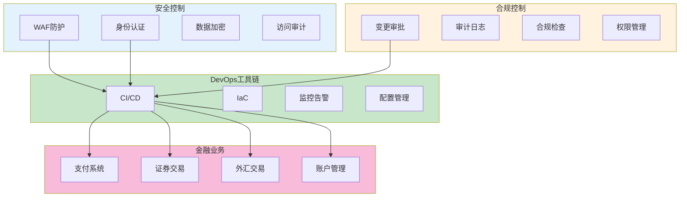
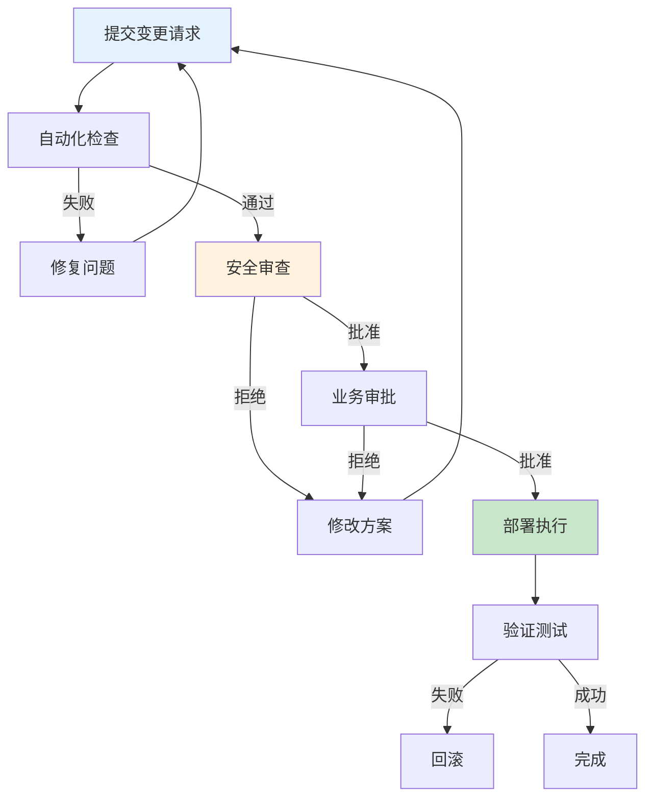

# 金融行业DevOps经验（HSBC/UBS项目）生产环境最佳实践

## 情境(Situation)

金融行业对系统稳定性、安全性和合规性有极高要求。在金融机构实施DevOps需要平衡敏捷交付与严格的合规控制，确保业务连续性和数据安全。

## 冲突(Conflict)

金融行业DevOps面临以下挑战：
- **合规要求严格**：满足PCI DSS、SOX等合规标准
- **安全风险高**：处理敏感金融数据
- **业务连续性要求**：7×24小时不间断服务
- **变更管控严格**：审批流程复杂
- **审计要求高**：完整的审计追踪

## 问题(Question)

如何在金融行业实施DevOps，在保证安全合规的前提下实现敏捷交付？

## 答案(Answer)

本文将基于HSBC和UBS项目的真实经验，提供一套完整的金融行业DevOps最佳实践指南。

---

## 一、金融DevOps架构设计

### 1.1 安全合规架构



### 1.2 金融行业合规标准

| 标准 | 适用范围 | 关键要求 |
|:----:|----------|----------|
| **PCI DSS** | 支付卡数据 | 数据加密、访问控制、审计日志 |
| **SOX** | 财务报告 | 内部控制、审计追踪 |
| **GDPR** | 用户数据 | 数据隐私、用户权利 |
| **SOC 2** | 服务组织 | 安全性、可用性、处理完整性 |

---

## 二、安全控制实践

### 2.1 数据加密

```yaml
# 数据加密配置
data_encryption:
  at_rest:
    - name: "数据库加密"
      algorithm: "AES-256"
      scope: ["用户数据", "交易数据", "敏感配置"]
    
    - name: "存储加密"
      algorithm: "AES-256"
      scope: ["备份数据", "日志文件"]
  
  in_transit:
    - name: "TLS加密"
      version: "TLS 1.3"
      scope: ["API通信", "数据库连接", "内部通信"]
  
  key_management:
    - name: "密钥轮换"
      frequency: "90天"
      storage: "HSM"
```

### 2.2 访问控制

```yaml
# 访问控制配置
access_control:
  authentication:
    - name: "多因素认证"
      enabled: true
      factors: ["密码", "硬件令牌", "生物识别"]
    
    - name: "SSO单点登录"
      enabled: true
      providers: ["Azure AD", "Okta"]
  
  authorization:
    - name: "RBAC角色管理"
      enabled: true
      roles:
        - "admin"
        - "developer"
        - "operator"
        - "auditor"
    
    - name: "最小权限原则"
      enabled: true
      review_frequency: "30天"
  
  privileged_access:
    - name: "PAM管理"
      enabled: true
      tools: ["CyberArk", "BeyondTrust"]
    
    - name: "临时访问"
      enabled: true
      max_duration: "4小时"
```

---

## 三、合规自动化

### 3.1 合规检查集成

```yaml
# 合规检查配置
compliance_checks:
  pre_deployment:
    - name: "代码安全扫描"
      tool: "SonarQube"
      severity: "block"
    
    - name: "依赖漏洞扫描"
      tool: "Snyk"
      severity: "critical"
    
    - name: "配置合规检查"
      tool: "Checkov"
      severity: "block"
    
    - name: "敏感信息检测"
      tool: "git-secrets"
      severity: "block"
  
  post_deployment:
    - name: "安全基线检查"
      tool: "CIS Benchmarks"
      frequency: "daily"
    
    - name: "合规报告生成"
      tool: "AWS Config"
      frequency: "weekly"
```

### 3.2 审计日志配置

```yaml
# 审计日志配置
audit_logging:
  enabled: true
  
  retention:
    application: "365天"
    security: "730天"
    compliance: "永久"
  
  fields:
    - "timestamp"
    - "user_id"
    - "action"
    - "resource"
    - "result"
    - "ip_address"
    - "request_id"
  
  destinations:
    - name: "SIEM"
      tool: "Splunk"
      level: "all"
    
    - name: "合规存储"
      tool: "S3 Glacier"
      level: "compliance"
```

---

## 四、变更管理

### 4.1 变更审批流程



### 4.2 变更模板

```markdown
# 变更请求模板

## 基本信息
- **变更编号**: CR-2024-001
- **变更类型**: [功能新增/ Bug修复/ 配置变更/ 紧急修复]
- **优先级**: [P0紧急/ P1高/ P2中/ P3低]
- **影响范围**: [系统A/ 系统B/ 全系统]

## 变更描述
详细描述变更内容

## 风险评估

| 风险 | 概率 | 影响 | 缓解措施 |
|------|------|------|----------|
| 数据库连接失败 | 低 | 高 | 回滚方案已准备 |
| 性能下降 | 中 | 中 | 性能测试已通过 |

## 回滚计划
详细描述回滚步骤

## 审批记录

| 审批环节 | 审批人 | 状态 | 日期 |
|----------|--------|------|------|
| 技术审查 | Zhang San | 批准 | 2024-01-15 |
| 安全审查 | Li Si | 批准 | 2024-01-15 |
| 业务审批 | Wang Wu | 批准 | 2024-01-15 |
```

---

## 五、金融级CI/CD流水线

### 5.1 流水线配置

```groovy
// Jenkinsfile - 金融级CI/CD流水线
pipeline {
    agent any
    
    stages {
        stage('Checkout') {
            steps {
                checkout scm
            }
        }
        
        stage('Security Scan') {
            steps {
                script {
                    // SonarQube扫描
                    sh 'sonar-scanner'
                    
                    // Snyk漏洞扫描
                    sh 'snyk test --severity-threshold=critical'
                }
            }
        }
        
        stage('Build') {
            steps {
                sh 'mvn clean package -DskipTests'
            }
        }
        
        stage('Test') {
            steps {
                sh 'mvn test'
                sh 'mvn integration-test'
            }
        }
        
        stage('Compliance Check') {
            steps {
                sh 'checkov -d . --compact'
            }
        }
        
        stage('Approval') {
            steps {
                input message: '请审批此变更', submitter: 'admin'
            }
        }
        
        stage('Deploy to Staging') {
            steps {
                sh 'kubectl apply -f staging/deployment.yaml'
            }
        }
        
        stage('UAT') {
            steps {
                sh 'mvn verify -Denv=staging'
            }
        }
        
        stage('Deploy to Production') {
            steps {
                input message: '请确认部署到生产环境', submitter: 'manager'
                sh 'kubectl apply -f production/deployment.yaml'
            }
        }
        
        stage('Post Deployment') {
            steps {
                sh './post-deployment-checks.sh'
            }
        }
    }
    
    post {
        success {
            slackSend channel: '#deployments', message: "部署成功: ${env.JOB_NAME}"
        }
        failure {
            slackSend channel: '#alerts', message: "部署失败: ${env.JOB_NAME}"
            sh 'kubectl rollout undo deployment/myapp'
        }
    }
}
```

### 5.2 蓝绿部署配置

```yaml
# Kubernetes蓝绿部署
apiVersion: v1
kind: Service
metadata:
  name: myapp
spec:
  selector:
    app: myapp
    version: blue
  ports:
  - port: 80
    targetPort: 8080

---
apiVersion: apps/v1
kind: Deployment
metadata:
  name: myapp-blue
spec:
  replicas: 3
  selector:
    matchLabels:
      app: myapp
      version: blue
  template:
    metadata:
      labels:
        app: myapp
        version: blue
    spec:
      containers:
      - name: myapp
        image: myapp:v1.0.0
        ports:
        - containerPort: 8080

---
apiVersion: apps/v1
kind: Deployment
metadata:
  name: myapp-green
spec:
  replicas: 0
  selector:
    matchLabels:
      app: myapp
      version: green
  template:
    metadata:
      labels:
        app: myapp
        version: green
    spec:
      containers:
      - name: myapp
        image: myapp:v1.1.0
        ports:
        - containerPort: 8080
```

---

## 六、业务连续性保障

### 6.1 高可用架构

```yaml
# 高可用配置
high_availability:
  redundancy:
    - name: "多可用区部署"
      enabled: true
      zones: 3
    
    - name: "多区域部署"
      enabled: true
      regions: 2
  
  failover:
    - name: "自动故障转移"
      enabled: true
      timeout: "30秒"
    
    - name: "DNS故障切换"
      enabled: true
      ttl: "30秒"
  
  disaster_recovery:
    - name: "异地灾备"
      enabled: true
      rto: "15分钟"
      rpo: "5分钟"
```

### 6.2 故障演练配置

```yaml
# 故障演练配置
dr_exercise:
  frequency: "每季度"
  
  scenarios:
    - name: "数据中心故障"
      duration: "4小时"
      objectives:
        - "验证故障切换"
        - "测试数据恢复"
    
    - name: "网络故障"
      duration: "2小时"
      objectives:
        - "验证网络冗余"
        - "测试流量切换"
    
    - name: "数据库故障"
      duration: "3小时"
      objectives:
        - "验证主从切换"
        - "测试数据一致性"
```

---

## 七、监控与告警

### 7.1 金融级监控配置

```yaml
# 监控指标配置
monitoring:
  business_metrics:
    - name: "交易成功率"
      target: "> 99.99%"
      alert_threshold: "99.9%"
    
    - name: "交易延迟"
      target: "< 200ms"
      alert_threshold: "500ms"
    
    - name: "系统可用性"
      target: "> 99.99%"
      alert_threshold: "99.9%"
  
  security_metrics:
    - name: "异常登录次数"
      target: "< 5次/小时"
      alert_threshold: "10次/小时"
    
    - name: "访问拒绝率"
      target: "< 1%"
      alert_threshold: "5%"
```

### 7.2 告警升级策略

```yaml
# 告警升级策略
alert_escalation:
  level1:
    delay: "5分钟"
    recipients: ["oncall@example.com"]
    channels: ["slack"]
  
  level2:
    delay: "15分钟"
    recipients: ["senior-oncall@example.com"]
    channels: ["slack", "pagerduty"]
  
  level3:
    delay: "30分钟"
    recipients: ["manager@example.com"]
    channels: ["pagerduty", "phone"]
  
  level4:
    delay: "60分钟"
    recipients: ["executive@example.com"]
    channels: ["phone", "sms"]
```

---

## 八、最佳实践总结

### 8.1 金融DevOps原则

| 原则 | 说明 | 实践建议 |
|:----:|------|----------|
| **安全优先** | 安全是金融系统的底线 | 左移安全、自动化检查 |
| **合规嵌入** | 将合规融入DevOps流程 | 合规即代码 |
| **审计追踪** | 完整的操作记录 | 自动化审计日志 |
| **最小权限** | 只授予必要权限 | RBAC+PAM |
| **业务连续性** | 7×24小时服务 | 多活架构+灾备 |

### 8.2 常见问题与解决方案

| 问题 | 症状 | 解决方案 |
|:-----|:-----|:----------|
| **合规延迟** | 审批流程慢 | 自动化合规检查 |
| **安全漏洞** | 代码存在漏洞 | 安全扫描集成CI/CD |
| **数据泄露** | 敏感数据暴露 | 数据加密+访问控制 |
| **系统中断** | 业务不可用 | 高可用架构+自动故障转移 |
| **审计困难** | 审计追踪不完整 | 自动化日志记录 |

---

## 总结

金融行业DevOps需要在敏捷交付和安全合规之间找到平衡。通过建立安全优先的文化、自动化合规检查、严格的变更管理和完善的监控体系，可以实现金融级的DevOps实践。

> **延伸阅读**：更多金融DevOps相关面试题，请参考 [SRE面试题解析：基于JD与简历匹配分析]()。

---

## 参考资料

- [PCI DSS标准](https://www.pcisecuritystandards.org/)
- [SOX法案](https://www.sec.gov/spotlight/sarbanes-oxley)
- [GDPR](https://gdpr.eu/)
- [金融DevOps白皮书](https://www.devopsinstitute.com/resources/white-papers/)
