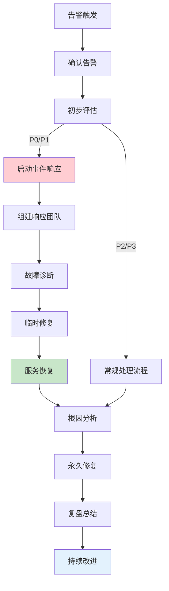
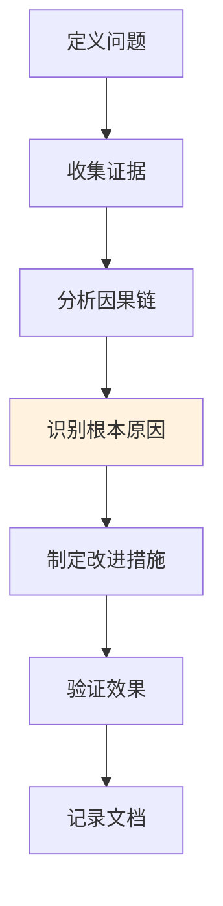
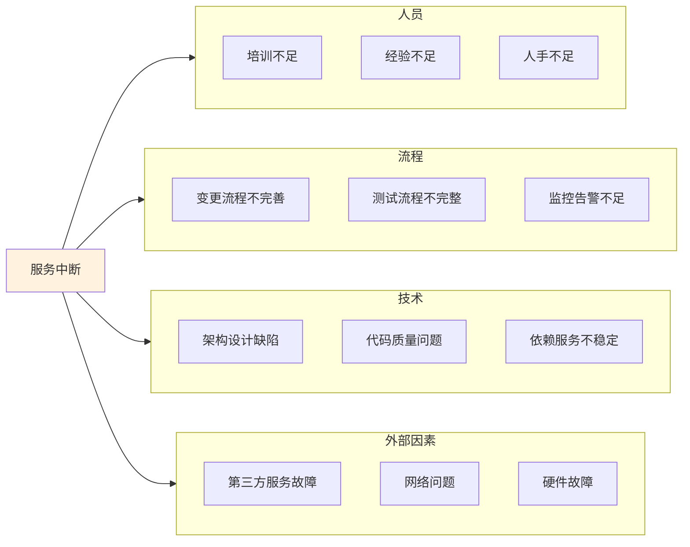

# 事件响应与SLA管理生产环境最佳实践

## 情境(Situation)

在生产环境中，故障是不可避免的。如何快速响应、有效处理并从中学习，是SRE工程师的核心能力。事件响应和SLA管理是保障服务可靠性的关键环节。

## 冲突(Conflict)

许多团队在事件响应中面临以下挑战：
- **响应不及时**：缺乏明确的响应流程和升级机制
- **根因分析不彻底**：只解决表面问题，未能预防复发
- **SLA难以达成**：服务可用性达不到承诺标准
- **复盘流于形式**：缺乏有效的复盘机制和改进措施
- **沟通不畅**：跨团队协作效率低下

## 问题(Question)

如何建立一套高效的事件响应流程，确保快速恢复服务并持续改进？

## 答案(Answer)

本文将基于真实生产案例，提供一套完整的事件响应与SLA管理最佳实践指南。

---

## 一、事件响应流程设计

### 1.1 事件响应流程概览



### 1.2 事件响应角色定义

| 角色 | 职责 | 必备技能 |
|:----:|------|----------|
| **Incident Commander** | 整体协调、决策指挥 | 全局视野、决策能力 |
| **Tech Lead** | 技术方案制定、技术决策 | 深度技术知识 |
| **Communications Lead** | 内外部沟通、状态更新 | 沟通能力、文档能力 |
| **Operations Lead** | 执行操作、实施修复 | 操作经验、工具熟练 |
| **Subject Matter Expert** | 领域专家支持 | 特定领域深度知识 |

---

## 二、事件分类与优先级

### 2.1 事件分级标准

| 级别 | 定义 | 影响范围 | 响应时间目标 |
|:----:|------|----------|--------------|
| **P0** | 系统完全不可用 | 核心业务中断 | 立即响应 |
| **P1** | 关键功能异常 | 部分业务受影响 | 10分钟内 |
| **P2** | 非核心功能异常 | 有限用户影响 | 30分钟内 |
| **P3** | 信息性问题 | 无直接业务影响 | 24小时内 |

### 2.2 事件分类示例

| 类型 | 示例 | 级别 |
|:----:|------|:----:|
| **基础设施故障** | 数据中心断电、网络中断 | P0 |
| **服务宕机** | 核心API无响应 | P0 |
| **性能下降** | 响应时间超过SLA目标 | P1 |
| **数据丢失** | 数据库数据损坏 | P0 |
| **安全事件** | 未授权访问、数据泄露 | P0 |
| **配置错误** | 错误配置导致服务异常 | P1 |

---

## 三、根因分析(RCA)方法

### 3.1 RCA流程



### 3.2 5个为什么分析法

```
问题：API响应时间超过500ms

为什么1：API响应慢？
→ 数据库查询时间长

为什么2：数据库查询慢？
→ 缺少索引

为什么3：缺少索引？
→ 上线前未进行性能测试

为什么4：未进行性能测试？
→ 测试流程不完整

为什么5：测试流程不完整？
→ 没有明确的性能测试规范

根本原因：缺乏性能测试规范和流程
```

### 3.3 鱼骨图分析法



---

## 四、SLA管理最佳实践

### 4.1 SLA定义与监控

```yaml
# SLA目标定义
sla_targets:
  api_availability:
    target: 99.95%
    metric: "100 - (sum(rate(http_requests_total{status_code=~\"5..\"}[30d])) / sum(rate(http_requests_total[30d])) * 100)"
    alert_threshold: 99.9
    description: "API服务可用性"
  
  api_latency_p95:
    target: 150ms
    metric: "histogram_quantile(0.95, sum(rate(http_request_duration_seconds_bucket[5m])) by (le))"
    alert_threshold: 200ms
    description: "API P95响应时间"
  
  database_replication_lag:
    target: 30s
    metric: "mysql_slave_lag_seconds"
    alert_threshold: 60s
    description: "数据库复制延迟"
```

### 4.2 SLA仪表盘配置

```json
{
  "title": "SLA Dashboard",
  "panels": [
    {
      "type": "stat",
      "title": "API Availability (30d)",
      "targets": [
        {
          "expr": "100 - (sum(rate(http_requests_total{status_code=~\"5..\"}[30d])) / sum(rate(http_requests_total[30d])) * 100)",
          "legendFormat": "Availability"
        }
      ],
      "thresholds": "99.5,99.9",
      "colorMode": "value",
      "backgroundColor": {
        "mode": "thresholds"
      }
    },
    {
      "type": "graph",
      "title": "API Latency Trend",
      "targets": [
        {
          "expr": "histogram_quantile(0.95, sum(rate(http_request_duration_seconds_bucket[5m])) by (le))",
          "legendFormat": "P95"
        },
        {
          "expr": "histogram_quantile(0.50, sum(rate(http_request_duration_seconds_bucket[5m])) by (le))",
          "legendFormat": "P50"
        }
      ],
      "yAxis": {
        "label": "Seconds",
        "min": 0,
        "max": 0.5
      }
    },
    {
      "type": "stat",
      "title": "MTTR (7d)",
      "targets": [
        {
          "expr": "avg(incident_resolution_time_seconds[7d]) / 60",
          "legendFormat": "Minutes"
        }
      ],
      "thresholds": "30,60"
    }
  ]
}
```

---

## 五、PagerDuty配置实践

### 5.1 服务配置

```yaml
# PagerDuty服务配置
service:
  name: "API Service"
  description: "核心API服务"
  escalation_policy: "SRE Escalation"
  alert_grouping:
    type: "intelligent"
    timeout: 10
  incident_urgency_rule:
    type: "constant"
    urgency: "high"
  auto_resolve_timeout: 14400
```

### 5.2 升级策略配置

```yaml
# PagerDuty升级策略
escalation_policy:
  name: "SRE Escalation"
  escalation_rules:
  - targets:
    - type: "user"
      id: "user1"
    delay_in_minutes: 0
  - targets:
    - type: "schedule"
      id: "sre-on-call"
    delay_in_minutes: 5
  - targets:
    - type: "user"
      id: "manager"
    delay_in_minutes: 15
  - targets:
    - type: "user"
      id: "director"
    delay_in_minutes: 30
```

---

## 六、事件响应自动化

### 6.1 自动响应脚本

```bash
#!/bin/bash
# incident_response.sh - 事件响应自动化脚本

INCIDENT_ID=$1
INCIDENT_SEVERITY=$2
INCIDENT_SERVICE=$3
LOG_FILE="/var/log/incident_response.log"

log() {
    echo "[$(date '+%Y-%m-%d %H:%M:%S')] $*" >> "$LOG_FILE"
}

notify_team() {
    log "通知团队: $INCIDENT_SERVICE 发生 $INCIDENT_SEVERITY 级事件"
    curl -X POST "https://hooks.slack.com/services/XXX" \
        -H "Content-Type: application/json" \
        -d "{\"text\": \"🚨 *$INCIDENT_SEVERITY级事件*: $INCIDENT_SERVICE 服务异常 (Incident ID: $INCIDENT_ID)\"}"
}

check_status() {
    log "检查服务状态..."
    # 检查服务健康状态
    HEALTH_STATUS=$(curl -s http://$INCIDENT_SERVICE/api/health)
    log "服务状态: $HEALTH_STATUS"
}

trigger_remediation() {
    log "触发自动修复..."
    case "$INCIDENT_SERVICE" in
        "api-service")
            log "重启API服务..."
            kubectl rollout restart deployment api-service
            ;;
        "database")
            log "切换到备用数据库..."
            kubectl patch service database -p '{"spec":{"selector":{"version":"standby"}}}'
            ;;
        *)
            log "无自动修复方案"
            ;;
    esac
}

create_incident() {
    log "创建事件记录..."
    # 在Jira或其他系统中创建事件记录
}

main() {
    log "========== 事件响应开始 =========="
    log "事件ID: $INCIDENT_ID"
    log "严重级别: $INCIDENT_SEVERITY"
    log "服务名称: $INCIDENT_SERVICE"
    
    notify_team
    check_status
    
    if [ "$INCIDENT_SEVERITY" == "P0" ] || [ "$INCIDENT_SEVERITY" == "P1" ]; then
        trigger_remediation
    fi
    
    create_incident
    
    log "========== 事件响应结束 =========="
}

main
```

---

## 七、复盘与持续改进

### 7.1 复盘会议流程

| 阶段 | 时间 | 内容 | 责任人 |
|:----:|------|------|--------|
| **准备** | 事件后24小时内 | 收集日志、指标、时间线 | SRE团队 |
| **召开会议** | 事件后48小时内 | 回顾事件、分析根因 | Incident Commander |
| **编写报告** | 会议后24小时内 | 整理RCA报告 | Tech Lead |
| **跟踪改进** | 持续 | 跟踪改进措施实施 | SRE团队 |

### 7.2 RCA报告模板

```markdown
# 事件复盘报告

## 基本信息
- **事件ID**: INC-2024-001
- **发生时间**: 2024-01-15 08:30:00
- **恢复时间**: 2024-01-15 09:15:00
- **持续时间**: 45分钟
- **严重级别**: P1
- **受影响服务**: API服务

## 事件概述
简要描述事件发生的情况和影响范围。

## 时间线
| 时间 | 事件 | 负责人 |
|------|------|--------|
| 08:30 | 告警触发 | 监控系统 |
| 08:32 | 确认告警 | SRE On-Call |
| 08:35 | 启动响应 | Incident Commander |
| 08:45 | 定位根因 | Tech Lead |
| 09:00 | 实施修复 | Operations Lead |
| 09:15 | 服务恢复 | 团队 |

## 根因分析
使用5个为什么或鱼骨图分析根本原因。

**直接原因**: 
**根本原因**: 

## 影响评估
- 用户影响: X%用户受影响
- 业务影响: 损失预估
- SLA影响: 可用性下降Y%

## 改进措施
| 措施 | 优先级 | 责任人 | 预计完成时间 | 状态 |
|------|:------:|--------|--------------|------|
| 增加监控告警 | P0 | John | 2024-01-20 | 进行中 |
| 修复代码缺陷 | P0 | Jane | 2024-01-22 | 待开始 |
| 更新文档 | P2 | Bob | 2024-01-25 | 待开始 |

## 经验教训
总结从事件中学到的经验教训。

## 附件
- 相关日志
- 监控图表
- 会议记录
```

---

## 八、最佳实践总结

### 8.1 事件响应原则

| 原则 | 说明 | 实践建议 |
|:----:|------|----------|
| **快速响应** | 分钟级响应时间 | 配置自动告警和升级 |
| **清晰沟通** | 及时、准确的信息同步 | 指定Communications Lead |
| **根因分析** | 深入分析根本原因 | 使用5个为什么和鱼骨图 |
| **持续改进** | 从事件中学习 | 定期复盘和跟踪改进 |
| **自动化** | 减少人工干预 | 实现自动修复和响应 |

### 8.2 常见问题与解决方案

| 问题 | 症状 | 解决方案 |
|:-----|:-----|:----------|
| **响应延迟** | 事件发生后长时间无人响应 | 配置多级升级策略 |
| **根因不明** | 重复发生同类事件 | 严格执行RCA流程 |
| **SLA不达标** | 服务可用性低于目标 | 增加监控覆盖，优化架构 |
| **复盘无效** | 改进措施未落实 | 跟踪改进措施状态 |
| **沟通混乱** | 信息不一致 | 指定唯一信息发布人 |

---

## 总结

事件响应和SLA管理是SRE工程师的核心能力。通过建立清晰的响应流程、有效的根因分析方法、完善的SLA监控体系和持续改进机制，可以显著提高服务的可靠性和可用性。

> **延伸阅读**：更多事件响应相关面试题，请参考 [SRE面试题解析：基于JD与简历匹配分析]()。

---

## 参考资料

- [PagerDuty官方文档](https://support.pagerduty.com/docs/)
- [Google SRE手册](https://sre.google/books/)
- [ITIL事件管理指南](https://www.itil.org/)
- [RCA最佳实践](https://www.atlassian.com/incident-management/what-is-rca)
- [SLA管理指南](https://www.atlassian.com/incident-management/kpis/sla-alerting)
