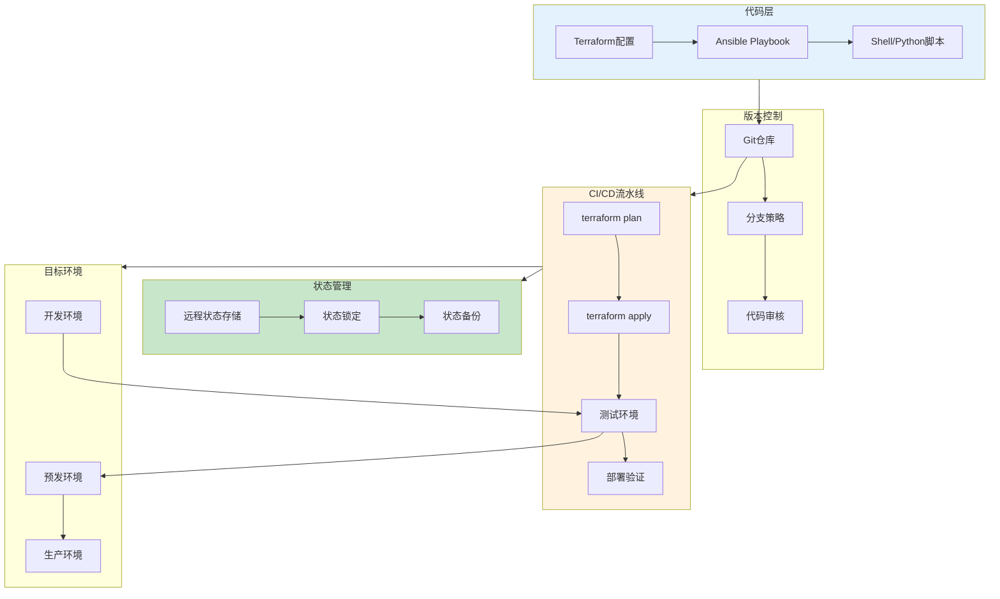

# Infrastructure as Code生产环境最佳实践

## 情境(Situation)

Infrastructure as Code（IaC）是DevOps的核心实践之一，它将基础设施配置转化为可版本控制的代码。通过IaC，团队可以实现基础设施的自动化部署、版本管理和一致性保障，显著提高运维效率和可靠性。

## 冲突(Conflict)

许多团队在IaC实践中面临以下挑战：
- **配置混乱**：缺乏标准化的目录结构和命名规范
- **状态管理困难**：Terraform状态文件管理复杂
- **安全风险**：敏感信息泄露
- **测试不足**：基础设施变更前缺乏充分测试
- **协作问题**：多人协作时容易产生冲突

## 问题(Question)

如何设计和实施一套高效、安全、可扩展的Infrastructure as Code方案？

## 答案(Answer)

本文将基于真实生产案例，提供一套完整的IaC最佳实践指南。

---

## 一、IaC工具选型与架构设计

### 1.1 主流IaC工具对比

| 工具 | 类型 | 适用场景 | 优势 | 劣势 |
|:----:|------|----------|------|------|
| **Terraform** | 声明式 | 多云基础设施 | 多云支持、状态管理、模块化 | 学习曲线较陡 |
| **Ansible** | 命令式 | 配置管理 | 简单易用、Agentless | 状态管理较弱 |
| **CloudFormation** | 声明式 | AWS专有 | 深度集成AWS、原生支持 | 仅限AWS |
| **Pulumi** | 声明式 | 多语言支持 | 支持Python/Go/TypeScript | 生态相对较小 |

### 1.2 IaC架构设计



---

## 二、Terraform最佳实践

### 2.1 目录结构规范

```
infrastructure/
├── environments/           # 环境配置
│   ├── dev/
│   │   ├── main.tf
│   │   ├── variables.tf
│   │   └── terraform.tfvars
│   ├── staging/
│   │   ├── main.tf
│   │   ├── variables.tf
│   │   └── terraform.tfvars
│   └── prod/
│       ├── main.tf
│       ├── variables.tf
│       └── terraform.tfvars
├── modules/                # 可复用模块
│   ├── vpc/
│   │   ├── main.tf
│   │   ├── variables.tf
│   │   └── outputs.tf
│   ├── ec2/
│   │   ├── main.tf
│   │   ├── variables.tf
│   │   └── outputs.tf
│   └── rds/
│       ├── main.tf
│       ├── variables.tf
│       └── outputs.tf
├── providers/              # Provider配置
│   └── aws.tf
└── README.md
```

### 2.2 Terraform模块设计

```hcl
# modules/vpc/main.tf
resource "aws_vpc" "main" {
  cidr_block           = var.cidr_block
  enable_dns_support   = true
  enable_dns_hostnames = true
  tags = merge(
    {
      Name        = "${var.name}-vpc"
      Environment = var.environment
    },
    var.tags
  )
}

resource "aws_subnet" "public" {
  count             = length(var.public_subnet_cidrs)
  vpc_id            = aws_vpc.main.id
  cidr_block        = var.public_subnet_cidrs[count.index]
  availability_zone = element(var.availability_zones, count.index)
  map_public_ip_on_launch = true
  tags = {
    Name        = "${var.name}-public-${count.index + 1}"
    Environment = var.environment
  }
}

resource "aws_subnet" "private" {
  count             = length(var.private_subnet_cidrs)
  vpc_id            = aws_vpc.main.id
  cidr_block        = var.private_subnet_cidrs[count.index]
  availability_zone = element(var.availability_zones, count.index)
  map_public_ip_on_launch = false
  tags = {
    Name        = "${var.name}-private-${count.index + 1}"
    Environment = var.environment
  }
}

resource "aws_internet_gateway" "main" {
  vpc_id = aws_vpc.main.id
  tags = {
    Name        = "${var.name}-igw"
    Environment = var.environment
  }
}

resource "aws_route_table" "public" {
  vpc_id = aws_vpc.main.id
  route {
    cidr_block = "0.0.0.0/0"
    gateway_id = aws_internet_gateway.main.id
  }
  tags = {
    Name        = "${var.name}-public-rt"
    Environment = var.environment
  }
}

resource "aws_route_table_association" "public" {
  count          = length(aws_subnet.public)
  subnet_id      = aws_subnet.public[count.index].id
  route_table_id = aws_route_table.public.id
}
```

```hcl
# modules/vpc/variables.tf
variable "name" {
  description = "Name prefix for resources"
  type        = string
}

variable "environment" {
  description = "Environment name (dev/staging/prod)"
  type        = string
  validation {
    condition     = contains(["dev", "staging", "prod"], var.environment)
    error_message = "Environment must be one of: dev, staging, prod"
  }
}

variable "cidr_block" {
  description = "VPC CIDR block"
  type        = string
  default     = "10.0.0.0/16"
}

variable "public_subnet_cidrs" {
  description = "List of public subnet CIDRs"
  type        = list(string)
  default     = ["10.0.1.0/24", "10.0.2.0/24"]
}

variable "private_subnet_cidrs" {
  description = "List of private subnet CIDRs"
  type        = list(string)
  default     = ["10.0.10.0/24", "10.0.11.0/24"]
}

variable "availability_zones" {
  description = "List of availability zones"
  type        = list(string)
}

variable "tags" {
  description = "Additional tags"
  type        = map(string)
  default     = {}
}
```

```hcl
# modules/vpc/outputs.tf
output "vpc_id" {
  description = "VPC ID"
  value       = aws_vpc.main.id
}

output "public_subnet_ids" {
  description = "Public subnet IDs"
  value       = aws_subnet.public[*].id
}

output "private_subnet_ids" {
  description = "Private subnet IDs"
  value       = aws_subnet.private[*].id
}

output "public_route_table_id" {
  description = "Public route table ID"
  value       = aws_route_table.public.id
}
```

### 2.3 Terraform状态管理

```hcl
# environments/prod/backend.tf
terraform {
  backend "s3" {
    bucket         = "my-terraform-state-prod"
    key            = "prod/terraform.tfstate"
    region         = "ap-east-1"
    encrypt        = true
    dynamodb_table = "terraform-lock"
  }
}
```

```yaml
# DynamoDB状态锁表配置
Resources:
  TerraformLockTable:
    Type: AWS::DynamoDB::Table
    Properties:
      TableName: terraform-lock
      AttributeDefinitions:
        - AttributeName: LockID
          AttributeType: S
      KeySchema:
        - AttributeName: LockID
          KeyType: HASH
      ProvisionedThroughput:
        ReadCapacityUnits: 5
        WriteCapacityUnits: 5
```

---

## 三、Ansible最佳实践

### 3.1 Ansible目录结构

```
ansible/
├── inventories/            # 主机清单
│   ├── dev/
│   │   ├── hosts.ini
│   │   └── group_vars/
│   │       └── all.yml
│   └── prod/
│       ├── hosts.ini
│       └── group_vars/
│           └── all.yml
├── playbooks/              # Playbook
│   ├── common.yml
│   ├── webserver.yml
│   └── database.yml
├── roles/                  # 角色
│   ├── base/
│   │   ├── tasks/
│   │   ├── handlers/
│   │   ├── templates/
│   │   └── vars/
│   ├── nginx/
│   │   ├── tasks/
│   │   ├── handlers/
│   │   ├── templates/
│   │   └── vars/
│   └── mysql/
│       ├── tasks/
│       ├── handlers/
│       ├── templates/
│       └── vars/
└── ansible.cfg
```

### 3.2 Ansible Playbook示例

```yaml
# playbooks/webserver.yml
- name: Configure web servers
  hosts: webservers
  become: true
  vars:
    nginx_version: "1.24.0"
    app_env: "{{ env }}"
  
  roles:
    - role: base
    - role: nginx
  
  tasks:
    - name: Install required packages
      ansible.builtin.yum:
        name:
          - git
          - python3
          - gcc
        state: present
    
    - name: Create application directory
      ansible.builtin.file:
        path: /opt/myapp
        state: directory
        owner: appuser
        group: appuser
        mode: '0755'
    
    - name: Clone application repository
      ansible.builtin.git:
        repo: 'https://github.com/example/myapp.git'
        dest: /opt/myapp
        version: "{{ app_version }}"
        force: yes
    
    - name: Install Python dependencies
      ansible.builtin.pip:
        requirements: /opt/myapp/requirements.txt
        virtualenv: /opt/myapp/venv
        virtualenv_python: python3
    
    - name: Start application service
      ansible.builtin.systemd:
        name: myapp
        state: started
        enabled: yes
        daemon_reload: yes
```

### 3.3 Ansible角色设计

```yaml
# roles/nginx/tasks/main.yml
- name: Install nginx
  ansible.builtin.yum:
    name: nginx
    state: present

- name: Create nginx configuration directory
  ansible.builtin.file:
    path: /etc/nginx/conf.d
    state: directory
    mode: '0755'

- name: Copy nginx configuration
  ansible.builtin.template:
    src: nginx.conf.j2
    dest: /etc/nginx/conf.d/myapp.conf
    mode: '0644'
  notify: Reload nginx

- name: Ensure nginx is running
  ansible.builtin.systemd:
    name: nginx
    state: started
    enabled: yes
```

```yaml
# roles/nginx/handlers/main.yml
- name: Reload nginx
  ansible.builtin.systemd:
    name: nginx
    state: reloaded
```

---

## 四、安全最佳实践

### 4.1 敏感信息管理

```hcl
# Terraform敏感变量
variable "database_password" {
  description = "Database password"
  type        = string
  sensitive   = true
}

# 使用Vault获取敏感信息
data "vault_generic_secret" "db_credentials" {
  path = "secret/data/prod/database"
}

resource "aws_db_instance" "main" {
  # ...其他配置
  password = data.vault_generic_secret.db_credentials.data["password"]
}
```

```yaml
# Ansible Vault示例
# 加密文件
ansible-vault encrypt group_vars/all/secrets.yml

# 在playbook中引用
- name: Deploy application
  hosts: all
  vars_files:
    - group_vars/all/secrets.yml
  tasks:
    - name: Set database password
      ansible.builtin.set_fact:
        db_password: "{{ vault_db_password }}"
```

### 4.2 最小权限原则

```hcl
# IAM角色配置
resource "aws_iam_role" "app_role" {
  name = "myapp-role"
  
  assume_role_policy = jsonencode({
    Version = "2012-10-17"
    Statement = [{
      Action = "sts:AssumeRole"
      Effect = "Allow"
      Principal = {
        Service = "ec2.amazonaws.com"
      }
    }]
  })
}

resource "aws_iam_role_policy" "app_policy" {
  name   = "myapp-policy"
  role   = aws_iam_role.app_role.id
  policy = jsonencode({
    Version = "2012-10-17"
    Statement = [{
      Action   = ["s3:GetObject", "s3:ListBucket"]
      Effect   = "Allow"
      Resource = [
        "arn:aws:s3:::myapp-bucket",
        "arn:aws:s3:::myapp-bucket/*"
      ]
    }]
  })
}
```

---

## 五、测试与验证

### 5.1 Terraform测试

```bash
# 格式化检查
terraform fmt -check

# 语法验证
terraform validate

# 计划预览
terraform plan -out=plan.tfplan

# 静态分析
tflint --config .tflint.hcl

# 安全扫描
tfsec .
```

```hcl
# .tflint.hcl配置
plugin "aws" {
  enabled = true
  version = "0.21.0"
  source  = "github.com/terraform-linters/tflint-ruleset-aws"
}

rule "aws_instance_type" {
  enabled = true
}

rule "aws_security_group_rule" {
  enabled = true
}
```

### 5.2 基础设施测试框架

```python
# test_infrastructure.py - 使用Terratest
import (
    "testing"
    "github.com/gruntwork-io/terratest/modules/terraform"
)

func TestVPCModule(t *testing.T) {
    terraformOptions := &terraform.Options{
        TerraformDir: "../modules/vpc",
        Vars: map[string]interface{}{
            "name":            "test-vpc",
            "environment":     "dev",
            "cidr_block":      "10.0.0.0/16",
            "availability_zones": []string{"ap-east-1a", "ap-east-1b"},
        },
    }

    defer terraform.Destroy(t, terraformOptions)
    terraform.InitAndApply(t, terraformOptions)

    vpcID := terraform.Output(t, terraformOptions, "vpc_id")
    assert.NotEmpty(t, vpcID)
    
    publicSubnetIDs := terraform.OutputList(t, terraformOptions, "public_subnet_ids")
    assert.Equal(t, 2, len(publicSubnetIDs))
}
```

---

## 六、CI/CD集成

### 6.1 Terraform流水线

```groovy
// Jenkinsfile - Terraform流水线
pipeline {
    agent any
    
    stages {
        stage('Checkout') {
            steps {
                git branch: 'main', url: 'https://github.com/example/infrastructure.git'
            }
        }
        
        stage('Terraform Init') {
            steps {
                sh 'terraform init -backend-config=backend-prod.tf'
            }
        }
        
        stage('Terraform Format') {
            steps {
                sh 'terraform fmt -check'
            }
        }
        
        stage('Terraform Validate') {
            steps {
                sh 'terraform validate'
            }
        }
        
        stage('Terraform Plan') {
            steps {
                sh 'terraform plan -out=plan.tfplan'
            }
        }
        
        stage('Manual Approval') {
            steps {
                input message: 'Approve Terraform plan?'
            }
        }
        
        stage('Terraform Apply') {
            steps {
                sh 'terraform apply plan.tfplan'
            }
        }
        
        stage('Test Infrastructure') {
            steps {
                sh 'go test -v ./tests/'
            }
        }
    }
}
```

---

## 七、最佳实践总结

### 7.1 IaC设计原则

| 原则 | 说明 | 实践建议 |
|:----:|------|----------|
| **模块化** | 将基础设施拆分为可复用模块 | 创建VPC、EC2、RDS等独立模块 |
| **参数化** | 使用变量和输出 | 通过变量控制环境差异 |
| **状态管理** | 使用远程状态存储 | S3 + DynamoDB锁 |
| **安全性** | 敏感信息加密存储 | 使用Vault或Secrets Manager |
| **测试验证** | 变更前进行测试 | 使用Terratest、tflint |
| **版本控制** | 代码纳入版本管理 | Git + PR审核流程 |

### 7.2 常见问题与解决方案

| 问题 | 症状 | 解决方案 |
|:-----|:-----|:----------|
| **状态文件冲突** | 多人协作时状态文件被覆盖 | 使用远程状态+DynamoDB锁 |
| **敏感信息泄露** | 密码等敏感信息明文存储 | 使用Vault或Terraform敏感变量 |
| **环境不一致** | 不同环境配置差异大 | 使用变量和模块化设计 |
| **部署失败** | 基础设施变更导致服务中断 | 使用terraform plan预览变更 |
| **测试不足** | 部署后发现配置错误 | 集成基础设施测试 |

---

## 总结

Infrastructure as Code是现代化运维的核心实践，通过代码化管理基础设施，可以实现自动化部署、版本控制和一致性保障。遵循模块化、参数化、安全优先的原则，结合CI/CD流水线，可以构建高效、可靠的基础设施管理体系。

> **延伸阅读**：更多IaC相关面试题，请参考 [SRE面试题解析：基于JD与简历匹配分析]()。

---

## 参考资料

- [Terraform官方文档](https://developer.hashicorp.com/terraform/docs)
- [Ansible官方文档](https://docs.ansible.com/)
- [AWS CloudFormation文档](https://docs.aws.amazon.com/cloudformation/)
- [Terratest测试框架](https://terratest.gruntwork.io/)
- [tflint静态分析工具](https://github.com/terraform-linters/tflint)
