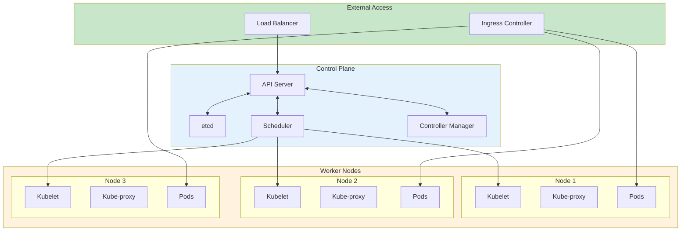

# Kubernetes容器编排生产环境最佳实践

## 情境(Situation)

Kubernetes已成为容器编排的事实标准，是构建云原生应用的核心平台。作为DevOps/SRE工程师，掌握Kubernetes的设计、部署和运维是必备技能。

## 冲突(Conflict)

许多团队在Kubernetes实践中面临以下挑战：
- **集群稳定性问题**：节点故障导致服务中断
- **资源管理困难**：Pod资源争用影响性能
- **网络配置复杂**：Service、Ingress、NetworkPolicy配置不当
- **存储管理挑战**：持久化存储与状态应用部署
- **大规模集群运维**：管理数百个节点和数千个Pod

## 问题(Question)

如何设计和管理一个稳定、高效、可扩展的Kubernetes集群？

## 答案(Answer)

本文将基于真实生产案例，提供一套完整的Kubernetes容器编排最佳实践指南。

---

## 一、Kubernetes集群架构设计

### 1.1 集群架构概览



### 1.2 控制平面高可用配置

```yaml
# 控制平面节点配置示例
apiVersion: kubeadm.k8s.io/v1beta3
kind: ClusterConfiguration
kubernetesVersion: v1.28.0
controlPlaneEndpoint: "k8s-api.example.com:6443"
etcd:
  local:
    dataDir: /var/lib/etcd
    extraArgs:
      listen-client-urls: "https://127.0.0.1:2379,https://${HOST_IP}:2379"
      advertise-client-urls: "https://${HOST_IP}:2379"
      listen-peer-urls: "https://${HOST_IP}:2380"
      initial-advertise-peer-urls: "https://${HOST_IP}:2380"
      peer-cert-file: /etc/kubernetes/pki/etcd/peer.crt
      peer-key-file: /etc/kubernetes/pki/etcd/peer.key
      peer-client-cert-auth: "true"
      client-cert-auth: "true"
      trusted-ca-file: /etc/kubernetes/pki/etcd/ca.crt
      cert-file: /etc/kubernetes/pki/etcd/server.crt
      key-file: /etc/kubernetes/pki/etcd/server.key
networking:
  podSubnet: "10.244.0.0/16"
  serviceSubnet: "10.96.0.0/12"
```

---

## 二、Pod与容器设计最佳实践

### 2.1 Pod设计模式

| 模式 | 适用场景 | 示例 |
|:----:|----------|------|
| **Sidecar** | 日志收集、监控代理 | Fluentd、Envoy |
| **Ambassador** | 网络代理、服务发现 | MySQL代理 |
| **Adapter** | 指标转换、格式适配 | Prometheus Exporter |
| **Init Container** | 初始化任务、依赖准备 | 数据库迁移、配置下载 |

```yaml
# Sidecar模式示例
apiVersion: v1
kind: Pod
metadata:
  name: app-with-sidecar
spec:
  containers:
  - name: main-app
    image: myapp:latest
    ports:
    - containerPort: 8080
    volumeMounts:
    - name: logs
      mountPath: /var/log/myapp
  - name: fluentd-sidecar
    image: fluent/fluentd:latest
    volumeMounts:
    - name: logs
      mountPath: /var/log/myapp
    env:
    - name: FLUENTD_CONF
      value: "fluentd.conf"
  volumes:
  - name: logs
    emptyDir: {}
```

### 2.2 资源管理配置

```yaml
# Pod资源请求和限制
apiVersion: v1
kind: Pod
metadata:
  name: resource-demo
spec:
  containers:
  - name: main
    image: myapp:latest
    resources:
      requests:
        memory: "256Mi"
        cpu: "250m"
      limits:
        memory: "512Mi"
        cpu: "500m"
    env:
    - name: JAVA_OPTS
      value: "-Xms256m -Xmx512m"
```

### 2.3 健康检查配置

```yaml
# Liveness和Readiness探针
apiVersion: v1
kind: Pod
metadata:
  name: health-check-demo
spec:
  containers:
  - name: main
    image: myapp:latest
    ports:
    - containerPort: 8080
    livenessProbe:
      httpGet:
        path: /health/live
        port: 8080
      initialDelaySeconds: 30
      periodSeconds: 10
      timeoutSeconds: 5
      failureThreshold: 3
    readinessProbe:
      httpGet:
        path: /health/ready
        port: 8080
      initialDelaySeconds: 10
      periodSeconds: 5
      timeoutSeconds: 3
      failureThreshold: 2
    startupProbe:
      httpGet:
        path: /health/startup
        port: 8080
      failureThreshold: 30
      periodSeconds: 10
```

---

## 三、Deployment与ReplicaSet最佳实践

### 3.1 Deployment配置

```yaml
# Deployment配置示例
apiVersion: apps/v1
kind: Deployment
metadata:
  name: myapp-deployment
  labels:
    app: myapp
spec:
  replicas: 3
  strategy:
    type: RollingUpdate
    rollingUpdate:
      maxSurge: 1
      maxUnavailable: 0
  selector:
    matchLabels:
      app: myapp
  template:
    metadata:
      labels:
        app: myapp
        version: v1.0.0
    spec:
      affinity:
        podAntiAffinity:
          requiredDuringSchedulingIgnoredDuringExecution:
          - labelSelector:
              matchExpressions:
              - key: app
                operator: In
                values:
                - myapp
            topologyKey: "kubernetes.io/hostname"
      containers:
      - name: myapp
        image: registry.example.com/myapp:v1.0.0
        ports:
        - containerPort: 8080
        resources:
          requests:
            memory: "256Mi"
            cpu: "250m"
          limits:
            memory: "512Mi"
            cpu: "500m"
        envFrom:
        - configMapRef:
            name: myapp-config
        - secretRef:
            name: myapp-secrets
        volumeMounts:
        - name: data
          mountPath: /data
      volumes:
      - name: data
        persistentVolumeClaim:
          claimName: myapp-pvc
```

### 3.2 部署策略对比

| 策略 | 适用场景 | 特点 | 风险 |
|:----:|----------|------|------|
| **RollingUpdate** | 常规更新 | 渐进式更新，零停机 | 可能影响部分用户 |
| **Recreate** | 状态应用更新 | 先销毁再创建 | 服务中断 |
| **Blue/Green** | 关键业务发布 | 完整切换，快速回滚 | 资源需求翻倍 |
| **Canary** | 新功能验证 | 小流量验证 | 需要流量控制 |

---

## 四、Service与网络配置

### 4.1 Service类型对比

| 类型 | 适用场景 | 特点 |
|:----:|----------|------|
| **ClusterIP** | 集群内部通信 | 默认类型，仅集群内访问 |
| **NodePort** | 外部简单访问 | 每个节点暴露端口 |
| **LoadBalancer** | 云平台负载均衡 | 自动创建LB |
| **ExternalName** | 外部服务访问 | 别名方式 |

```yaml
# Service配置示例
apiVersion: v1
kind: Service
metadata:
  name: myapp-service
  annotations:
    service.beta.kubernetes.io/aws-load-balancer-type: "nlb"
    service.beta.kubernetes.io/aws-load-balancer-internal: "true"
spec:
  type: LoadBalancer
  selector:
    app: myapp
  ports:
  - port: 80
    targetPort: 8080
    protocol: TCP
  sessionAffinity: ClientIP
  sessionAffinityConfig:
    clientIP:
      timeoutSeconds: 10800
```

### 4.2 Ingress配置

```yaml
# Ingress配置示例
apiVersion: networking.k8s.io/v1
kind: Ingress
metadata:
  name: myapp-ingress
  annotations:
    nginx.ingress.kubernetes.io/ssl-redirect: "true"
    nginx.ingress.kubernetes.io/use-regex: "true"
    nginx.ingress.kubernetes.io/proxy-body-size: "50m"
spec:
  tls:
  - hosts:
    - api.example.com
    secretName: api-tls
  rules:
  - host: api.example.com
    http:
      paths:
      - path: /api/v1/
        pathType: Prefix
        backend:
          service:
            name: myapp-service
            port:
              number: 80
```

### 4.3 NetworkPolicy配置

```yaml
# NetworkPolicy配置示例
apiVersion: networking.k8s.io/v1
kind: NetworkPolicy
metadata:
  name: myapp-network-policy
spec:
  podSelector:
    matchLabels:
      app: myapp
  policyTypes:
  - Ingress
  - Egress
  ingress:
  - from:
    - podSelector:
        matchLabels:
          role: frontend
    - ipBlock:
        cidr: 10.0.0.0/24
        except:
        - 10.0.0.5/32
    ports:
    - protocol: TCP
      port: 8080
  egress:
  - to:
    - podSelector:
        matchLabels:
          app: database
    ports:
    - protocol: TCP
      port: 3306
```

---

## 五、存储与持久化

### 5.1 PV/PVC配置

```yaml
# PersistentVolume配置
apiVersion: v1
kind: PersistentVolume
metadata:
  name: myapp-pv
spec:
  capacity:
    storage: 10Gi
  accessModes:
    - ReadWriteOnce
  persistentVolumeReclaimPolicy: Retain
  awsElasticBlockStore:
    volumeID: vol-1234567890abcdef0
    fsType: ext4

# PersistentVolumeClaim配置
apiVersion: v1
kind: PersistentVolumeClaim
metadata:
  name: myapp-pvc
spec:
  accessModes:
    - ReadWriteOnce
  resources:
    requests:
      storage: 10Gi
  storageClassName: gp2
```

### 5.2 StorageClass配置

```yaml
# StorageClass配置
apiVersion: storage.k8s.io/v1
kind: StorageClass
metadata:
  name: gp2
provisioner: kubernetes.io/aws-ebs
parameters:
  type: gp2
  fsType: ext4
  encrypted: "true"
reclaimPolicy: Retain
allowVolumeExpansion: true
```

---

## 六、大规模集群运维

### 6.1 集群监控配置

```yaml
# Prometheus ServiceMonitor配置
apiVersion: monitoring.coreos.com/v1
kind: ServiceMonitor
metadata:
  name: kubernetes-services
  labels:
    release: prometheus
spec:
  endpoints:
  - port: http-metrics
    interval: 30s
  selector:
    matchLabels:
      k8s-app: kube-state-metrics
```

### 6.2 集群自动扩缩容

```yaml
# Horizontal Pod Autoscaler配置
apiVersion: autoscaling/v2
kind: HorizontalPodAutoscaler
metadata:
  name: myapp-hpa
spec:
  scaleTargetRef:
    apiVersion: apps/v1
    kind: Deployment
    name: myapp-deployment
  minReplicas: 3
  maxReplicas: 10
  metrics:
  - type: Resource
    resource:
      name: cpu
      target:
        type: Utilization
        averageUtilization: 70
  - type: Resource
    resource:
      name: memory
      target:
        type: Utilization
        averageUtilization: 80
```

### 6.3 节点管理

```bash
# 节点管理命令
kubectl cordon node-01                    # 标记节点不可调度
kubectl drain node-01 --ignore-daemonsets # 驱逐节点上的Pod
kubectl uncordon node-01                  # 取消节点不可调度标记

# 节点标签管理
kubectl label nodes node-01 zone=east
kubectl label nodes node-01 tier=production

# 节点污点管理
kubectl taint nodes node-01 dedicated=production:NoSchedule
kubectl taint nodes node-01 dedicated=production:PreferNoSchedule
```

---

## 七、安全最佳实践

### 7.1 RBAC配置

```yaml
# Role配置
apiVersion: rbac.authorization.k8s.io/v1
kind: Role
metadata:
  namespace: myapp
  name: pod-reader
rules:
- apiGroups: [""]
  resources: ["pods"]
  verbs: ["get", "watch", "list"]

# RoleBinding配置
apiVersion: rbac.authorization.k8s.io/v1
kind: RoleBinding
metadata:
  name: read-pods
  namespace: myapp
subjects:
- kind: User
  name: jane
  apiGroup: rbac.authorization.k8s.io
roleRef:
  kind: Role
  name: pod-reader
  apiGroup: rbac.authorization.k8s.io
```

### 7.2 Pod安全标准

| 策略 | 限制级别 | 适用场景 |
|:----:|----------|----------|
| **Restricted** | 最严格 | 生产环境 |
| **Baseline** | 中等 | 测试环境 |
| **Privileged** | 无限制 | 开发环境 |

```yaml
# Pod安全准入配置
apiVersion: apiserver.config.k8s.io/v1
kind: AdmissionConfiguration
plugins:
- name: PodSecurity
  configuration:
    defaults:
      enforce: "restricted"
      enforce-version: "latest"
      audit: "restricted"
      audit-version: "latest"
      warn: "restricted"
      warn-version: "latest"
```

---

## 八、最佳实践总结

### 8.1 Kubernetes设计原则

| 原则 | 说明 | 实践建议 |
|:----:|------|----------|
| **高可用** | 消除单点故障 | 多Master节点、Pod反亲和性 |
| **弹性伸缩** | 根据负载自动调整 | HPA + VPA |
| **网络隔离** | 控制Pod间通信 | NetworkPolicy |
| **资源管理** | 合理分配资源 | Requests/Limits配置 |
| **安全优先** | 最小权限原则 | RBAC + Pod安全标准 |
| **可观测性** | 全面监控 | Prometheus + Grafana |

### 8.2 常见问题与解决方案

| 问题 | 症状 | 解决方案 |
|:-----|:-----|:----------|
| **Pod调度失败** | Pending状态 | 检查资源不足、节点污点、亲和性配置 |
| **服务不可访问** | Connection refused | 检查Service、Pod状态、网络策略 |
| **Pod频繁重启** | CrashLoopBackOff | 检查日志、资源限制、健康检查 |
| **存储挂载失败** | FailedMount | 检查PV/PVC状态、存储类配置 |
| **网络延迟高** | 响应慢 | 检查网络插件、Service类型 |

---

## 总结

Kubernetes是一个复杂但强大的容器编排平台。通过合理的架构设计、资源配置、网络管理和安全策略，可以构建一个稳定、高效、可扩展的生产环境集群。

> **延伸阅读**：更多Kubernetes相关面试题，请参考 [SRE面试题解析：基于JD与简历匹配分析]()。

---

## 参考资料

- [Kubernetes官方文档](https://kubernetes.io/docs/)
- [Kubernetes最佳实践指南](https://kubernetes.io/docs/setup/best-practices/)
- [CNCF Kubernetes安全白皮书](https://github.com/cncf/tag-security/tree/main/security-whitepaper)
- [kubeadm官方文档](https://kubernetes.io/docs/setup/production-environment/tools/kubeadm/)
