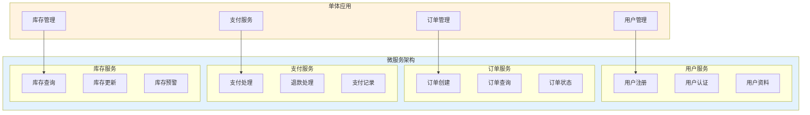
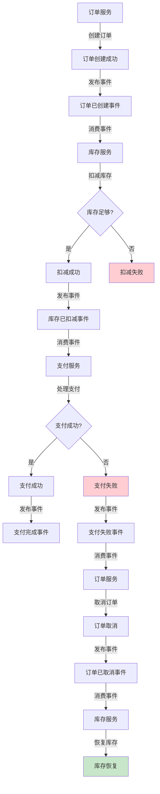

# 微服务架构实践生产环境最佳实践

## 情境(Situation)

微服务架构已成为构建大型复杂应用的主流模式。将单体应用拆分为多个独立的微服务，可以提高开发效率、增强系统可扩展性和可维护性。

## 冲突(Conflict)

许多团队在微服务实践中面临以下挑战：
- **服务拆分困难**：如何合理划分服务边界
- **服务间通信复杂**：服务调用链长，故障排查困难
- **分布式事务**：跨服务的数据一致性难以保证
- **服务发现**：动态环境下的服务定位
- **监控复杂**：多服务监控和追踪

## 问题(Question)

如何设计和运维一个高效、可靠的微服务架构？

## 答案(Answer)

本文将基于真实生产案例，提供一套完整的微服务架构实践最佳实践指南。

---

## 一、微服务架构设计原则

### 1.1 架构设计原则

| 原则 | 说明 | 实践建议 |
|:----:|------|----------|
| **单一职责** | 每个服务只做一件事 | 按业务边界拆分 |
| **松耦合** | 服务间依赖最小化 | 定义清晰的API边界 |
| **高内聚** | 相关功能放在一起 | 领域驱动设计 |
| **自治性** | 服务独立开发部署 | 独立技术栈 |
| **可观测性** | 完善的监控和追踪 | 分布式追踪系统 |

### 1.2 服务拆分策略



---

## 二、服务间通信模式

### 2.1 同步通信

```yaml
# gRPC服务定义
syntax = "proto3";

package order;

service OrderService {
  rpc CreateOrder(CreateOrderRequest) returns (CreateOrderResponse);
  rpc GetOrder(GetOrderRequest) returns (GetOrderResponse);
  rpc ListOrders(ListOrdersRequest) returns (ListOrdersResponse);
}

message CreateOrderRequest {
  string user_id = 1;
  repeated OrderItem items = 2;
  string shipping_address = 3;
}

message OrderItem {
  string product_id = 1;
  int32 quantity = 2;
  double price = 3;
}

message CreateOrderResponse {
  string order_id = 1;
  string status = 2;
  double total_amount = 3;
}
```

### 2.2 异步通信

```yaml
# Kafka消息配置
apiVersion: kafka.strimzi.io/v1beta2
kind: KafkaTopic
metadata:
  name: order-events
spec:
  partitions: 6
  replicas: 3
  config:
    retention.ms: 86400000
    segment.bytes: 1073741824

---
apiVersion: kafka.strimzi.io/v1beta2
kind: KafkaTopic
metadata:
  name: payment-events
spec:
  partitions: 6
  replicas: 3
  config:
    retention.ms: 86400000
    segment.bytes: 1073741824
```

### 2.3 API网关配置

```yaml
# Kong API网关配置
services:
  - name: user-service
    url: http://user-service:8080
    routes:
      - name: user-route
        paths:
          - /api/v1/users
        methods:
          - GET
          - POST
          - PUT
          - DELETE

  - name: order-service
    url: http://order-service:8080
    routes:
      - name: order-route
        paths:
          - /api/v1/orders
        methods:
          - GET
          - POST

plugins:
  - name: rate-limiting
    config:
      minute: 100
      hour: 1000
```

---

## 三、分布式事务处理

### 3.1 Saga模式



### 3.2 事件驱动架构

```python
# 订单服务事件处理器
class OrderEventHandler:
    def __init__(self, kafka_producer):
        self.kafka_producer = kafka_producer
    
    def handle_order_created(self, event):
        """处理订单创建事件"""
        # 验证订单数据
        self._validate_order(event.data)
        
        # 发布订单已创建事件
        self.kafka_producer.send(
            topic='order-events',
            value={
                'event_type': 'ORDER_CREATED',
                'order_id': event.data['order_id'],
                'user_id': event.data['user_id'],
                'items': event.data['items'],
                'total_amount': event.data['total_amount'],
                'timestamp': datetime.now().isoformat()
            }
        )
    
    def handle_payment_completed(self, event):
        """处理支付完成事件"""
        # 更新订单状态
        order = Order.objects.get(id=event.data['order_id'])
        order.status = 'PAID'
        order.save()
        
        # 发布订单已支付事件
        self.kafka_producer.send(
            topic='order-events',
            value={
                'event_type': 'ORDER_PAID',
                'order_id': event.data['order_id'],
                'timestamp': datetime.now().isoformat()
            }
        )
    
    def handle_payment_failed(self, event):
        """处理支付失败事件"""
        # 取消订单
        order = Order.objects.get(id=event.data['order_id'])
        order.status = 'CANCELLED'
        order.save()
        
        # 发布订单已取消事件
        self.kafka_producer.send(
            topic='order-events',
            value={
                'event_type': 'ORDER_CANCELLED',
                'order_id': event.data['order_id'],
                'reason': 'Payment failed',
                'timestamp': datetime.now().isoformat()
            }
        )
```

---

## 四、服务发现与负载均衡

### 4.1 服务发现配置

```yaml
# Consul服务注册配置
services:
  user-service:
    name: user-service
    tags:
      - v1
      - stable
    port: 8080
    check:
      http: http://localhost:8080/health
      interval: 10s
      timeout: 5s
      deregister_critical_service_after: 30s

  order-service:
    name: order-service
    tags:
      - v1
      - stable
    port: 8080
    check:
      http: http://localhost:8080/health
      interval: 10s
      timeout: 5s
      deregister_critical_service_after: 30s
```

### 4.2 负载均衡配置

```yaml
# Nginx负载均衡配置
http {
    upstream user-service {
        least_conn;
        server user-service-01:8080;
        server user-service-02:8080;
        server user-service-03:8080;
    }
    
    upstream order-service {
        ip_hash;
        server order-service-01:8080;
        server order-service-02:8080;
    }
    
    server {
        listen 80;
        
        location /api/v1/users/ {
            proxy_pass http://user-service;
            proxy_set_header Host $host;
            proxy_set_header X-Real-IP $remote_addr;
        }
        
        location /api/v1/orders/ {
            proxy_pass http://order-service;
            proxy_set_header Host $host;
            proxy_set_header X-Real-IP $remote_addr;
        }
    }
}
```

---

## 五、微服务监控与追踪

### 5.1 分布式追踪配置

```yaml
# Jaeger配置
apiVersion: jaegertracing.io/v1
kind: Jaeger
metadata:
  name: jaeger
spec:
  strategy: allInOne
  allInOne:
    image: jaegertracing/all-in-one:latest
    options:
      query:
        base-path: /jaeger
  ingress:
    enabled: true
    hosts:
      - jaeger.example.com
```

### 5.2 服务指标监控

```yaml
# Prometheus ServiceMonitor配置
apiVersion: monitoring.coreos.com/v1
kind: ServiceMonitor
metadata:
  name: user-service-monitor
  labels:
    release: prometheus
spec:
  selector:
    matchLabels:
      app: user-service
  endpoints:
    - port: http-metrics
      interval: 30s
      path: /actuator/prometheus

---
apiVersion: monitoring.coreos.com/v1
kind: ServiceMonitor
metadata:
  name: order-service-monitor
  labels:
    release: prometheus
spec:
  selector:
    matchLabels:
      app: order-service
  endpoints:
    - port: http-metrics
      interval: 30s
      path: /actuator/prometheus
```

---

## 六、微服务部署与运维

### 6.1 Kubernetes部署配置

```yaml
# 用户服务Deployment
apiVersion: apps/v1
kind: Deployment
metadata:
  name: user-service
  labels:
    app: user-service
spec:
  replicas: 3
  selector:
    matchLabels:
      app: user-service
  template:
    metadata:
      labels:
        app: user-service
      annotations:
        prometheus.io/scrape: "true"
        prometheus.io/port: "8080"
        prometheus.io/path: "/actuator/prometheus"
    spec:
      containers:
        - name: user-service
          image: registry.example.com/user-service:v1.0.0
          ports:
            - containerPort: 8080
          env:
            - name: SPRING_PROFILES_ACTIVE
              value: "prod"
            - name: DB_HOST
              valueFrom:
                secretKeyRef:
                  name: db-secret
                  key: host
          resources:
            requests:
              memory: "256Mi"
              cpu: "250m"
            limits:
              memory: "512Mi"
              cpu: "500m"
          livenessProbe:
            httpGet:
              path: /actuator/health/liveness
              port: 8080
            initialDelaySeconds: 30
            periodSeconds: 10
          readinessProbe:
            httpGet:
              path: /actuator/health/readiness
              port: 8080
            initialDelaySeconds: 10
            periodSeconds: 5
```

### 6.2 服务网格配置

```yaml
# Istio VirtualService配置
apiVersion: networking.istio.io/v1alpha3
kind: VirtualService
metadata:
  name: user-service
spec:
  hosts:
    - user-service
  http:
    - route:
        - destination:
            host: user-service
            subset: v1
          weight: 90
        - destination:
            host: user-service
            subset: v2
          weight: 10
```

---

## 七、最佳实践总结

### 7.1 微服务架构原则

| 原则 | 说明 | 实践建议 |
|:----:|------|----------|
| **服务边界清晰** | 按业务领域划分服务 | 领域驱动设计 |
| **API契约优先** | 先定义API再实现 | OpenAPI规范 |
| **事件驱动** | 使用事件进行松耦合通信 | Kafka/RabbitMQ |
| **最终一致性** | 接受最终一致性而非强一致性 | Saga模式 |
| **自动化运维** | CI/CD自动化部署 | ArgoCD/GitOps |

### 7.2 常见问题与解决方案

| 问题 | 症状 | 解决方案 |
|:-----|:-----|:----------|
| **服务间耦合** | 修改一个服务影响多个服务 | 定义清晰的API边界 |
| **分布式事务** | 跨服务数据不一致 | 使用Saga模式 |
| **服务发现困难** | 动态环境下服务定位 | 使用Consul/Etcd |
| **监控盲区** | 难以追踪请求链路 | 分布式追踪系统 |
| **部署复杂** | 服务数量多部署困难 | 自动化CI/CD |

---

## 总结

微服务架构是构建大型复杂应用的有效方式，但也带来了新的挑战。通过合理的服务拆分、选择合适的通信模式、实现分布式事务处理、建立完善的监控体系，可以构建一个高效、可靠的微服务架构。

> **延伸阅读**：更多微服务相关面试题，请参考 [SRE面试题解析：基于JD与简历匹配分析]()。

---

## 参考资料

- [微服务设计](https://www.amazon.com/Microservices-Patterns-Designing-Fine-Grained-Systems/dp/1617294543)
- [Istio官方文档](https://istio.io/docs/)
- [Jaeger官方文档](https://www.jaegertracing.io/docs/)
- [Kafka官方文档](https://kafka.apache.org/documentation/)
- [Spring Cloud官方文档](https://spring.io/projects/spring-cloud)
