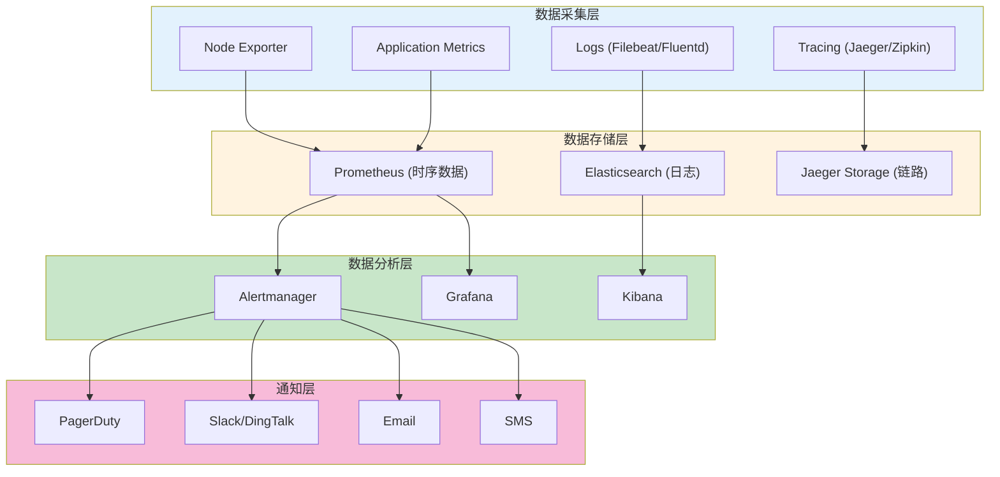

# 监控与告警体系建设生产环境最佳实践

## 情境(Situation)

监控与告警是SRE工程师的生命线。一个完善的监控体系能够实时感知系统状态，及时发现潜在问题，保障服务的高可用性和稳定性。

## 冲突(Conflict)

许多团队在监控体系建设中面临以下挑战：
- **告警风暴**：大量重复告警导致告警疲劳
- **监控盲区**：关键指标未被监控
- **SLA难以衡量**：缺乏明确的SLA指标和监控
- **告警响应不及时**：缺乏有效的升级机制
- **数据孤岛**：监控数据分散在多个系统中

## 问题(Question)

如何构建一个高效、智能、SLA驱动的监控与告警体系？

## 答案(Answer)

本文将基于真实生产案例，提供一套完整的监控与告警体系建设最佳实践指南。

---

## 一、监控体系架构设计

### 1.1 监控架构概览



### 1.2 监控指标分类

| 指标类型 | 监控内容 | 关键指标 |
|:--------:|----------|----------|
| **基础设施指标** | CPU、内存、磁盘、网络 | CPU使用率、内存使用率、磁盘I/O、网络延迟 |
| **应用指标** | 请求量、响应时间、错误率 | QPS、P50/P95/P99延迟、错误率 |
| **业务指标** | 业务成功率、转化率 | 订单成功率、支付成功率、页面转化率 |
| **SLA指标** | 服务可用性、性能达标率 | SLA达成率、MTTR、MTBF |

---

## 二、Prometheus监控配置实践

### 2.1 Exporter配置

```yaml
# Node Exporter配置
apiVersion: v1
kind: Service
metadata:
  name: node-exporter
  labels:
    app: node-exporter
spec:
  selector:
    app: node-exporter
  ports:
  - name: metrics
    port: 9100
    targetPort: 9100
---
apiVersion: apps/v1
kind: DaemonSet
metadata:
  name: node-exporter
spec:
  selector:
    matchLabels:
      app: node-exporter
  template:
    metadata:
      labels:
        app: node-exporter
    spec:
      containers:
      - name: node-exporter
        image: quay.io/prometheus/node-exporter:latest
        args:
        - --path.rootfs=/host
        volumeMounts:
        - name: rootfs
          mountPath: /host
          readOnly: true
      volumes:
      - name: rootfs
        hostPath:
          path: /
```

### 2.2 Prometheus配置

```yaml
# prometheus.yml配置
global:
  scrape_interval: 15s
  evaluation_interval: 15s

rule_files:
  - "rules/*.yml"

scrape_configs:
  - job_name: 'prometheus'
    static_configs:
    - targets: ['localhost:9090']
  
  - job_name: 'node-exporter'
    kubernetes_sd_configs:
    - role: node
    relabel_configs:
    - source_labels: [__address__]
      regex: '(.*):10250'
      replacement: '${1}:9100'
      target_label: __address__
  
  - job_name: 'kubernetes-pods'
    kubernetes_sd_configs:
    - role: pod
    relabel_configs:
    - source_labels: [__meta_kubernetes_pod_annotation_prometheus_io_scrape]
      action: keep
      regex: true
    - source_labels: [__meta_kubernetes_pod_annotation_prometheus_io_path]
      action: replace
      target_label: __metrics_path__
      regex: (.+)
    - source_labels: [__address__, __meta_kubernetes_pod_annotation_prometheus_io_port]
      action: replace
      regex: ([^:]+)(?::\d+)?;(\d+)
      replacement: ${1}:${2}
      target_label: __address__
```

### 2.3 告警规则配置

```yaml
# rules/alerts.yml
groups:
  - name: infrastructure_alerts
    rules:
    - alert: HighCpuUsage
      expr: 100 - (avg by(instance) (irate(node_cpu_seconds_total{mode="idle"}[5m])) * 100) > 90
      for: 5m
      labels:
        severity: critical
        team: sre
      annotations:
        summary: "High CPU Usage"
        description: "{{ $labels.instance }} CPU usage is above 90% (current: {{ $value }}%)"
    
    - alert: HighMemoryUsage
      expr: (node_memory_MemTotal_bytes - node_memory_MemAvailable_bytes) / node_memory_MemTotal_bytes * 100 > 90
      for: 5m
      labels:
        severity: critical
        team: sre
      annotations:
        summary: "High Memory Usage"
        description: "{{ $labels.instance }} Memory usage is above 90% (current: {{ $value }}%)"
    
    - alert: DiskSpaceLow
      expr: (node_filesystem_size_bytes{mountpoint="/"} - node_filesystem_free_bytes{mountpoint="/"}) / node_filesystem_size_bytes{mountpoint="/"} * 100 > 85
      for: 10m
      labels:
        severity: warning
        team: sre
      annotations:
        summary: "Low Disk Space"
        description: "{{ $labels.instance }} disk usage is above 85% (current: {{ $value }}%)"
```

---

## 三、SLA监控与保障

### 3.1 SLA指标定义

```yaml
# SLA指标告警规则
groups:
  - name: sla_alerts
    rules:
    - alert: ApiLatencySlaBreach
      expr: histogram_quantile(0.95, sum(rate(http_request_duration_seconds_bucket[5m])) by (le, service)) > 0.15
      for: 5m
      labels:
        severity: critical
        team: sre
        sla: "api-latency"
      annotations:
        summary: "API Latency SLA Breach"
        description: "{{ $labels.service }} P95 latency is {{ $value }}s, exceeding 150ms target"
    
    - alert: ApiSuccessRateSlaBreach
      expr: sum(rate(http_requests_total{status_code=~"5.."}[5m])) / sum(rate(http_requests_total[5m])) * 100 > 0.5
      for: 5m
      labels:
        severity: critical
        team: sre
        sla: "api-success-rate"
      annotations:
        summary: "API Success Rate SLA Breach"
        description: "API error rate is {{ $value }}%, exceeding 0.5% target"
```

### 3.2 SLA仪表盘配置

```json
// Grafana仪表盘JSON配置片段
{
  "title": "SLA Dashboard",
  "panels": [
    {
      "type": "stat",
      "title": "API Availability",
      "targets": [
        {
          "expr": "100 - (sum(rate(http_requests_total{status_code=~\"5..\"}[24h])) / sum(rate(http_requests_total[24h])) * 100)",
          "legendFormat": "Availability"
        }
      ],
      "thresholds": "99.5,99.9",
      "colorMode": "value"
    },
    {
      "type": "graph",
      "title": "API Latency (P95)",
      "targets": [
        {
          "expr": "histogram_quantile(0.95, sum(rate(http_request_duration_seconds_bucket[5m])) by (le))",
          "legendFormat": "P95 Latency"
        }
      ],
      "yAxis": {
        "label": "Seconds",
        "min": 0,
        "max": 0.5
      }
    }
  ]
}
```

---

## 四、告警管理最佳实践

### 4.1 Alertmanager配置

```yaml
# alertmanager.yml
global:
  resolve_timeout: 5m
  smtp_smarthost: 'smtp.example.com:587'
  smtp_from: 'alerts@example.com'

route:
  group_by: ['alertname', 'instance', 'severity']
  group_wait: 30s
  group_interval: 5m
  repeat_interval: 4h
  receiver: 'team-sre'
  routes:
  - match:
      severity: critical
    receiver: 'team-sre-critical'
    group_wait: 10s
  - match:
      severity: warning
    receiver: 'team-sre-warning'
    group_wait: 20s

receivers:
- name: 'team-sre'
  email_configs:
  - to: 'sre@example.com'
    send_resolved: true
  webhook_configs:
  - url: 'https://hooks.slack.com/services/XXX'
    send_resolved: true

- name: 'team-sre-critical'
  email_configs:
  - to: 'sre@example.com'
    send_resolved: true
  webhook_configs:
  - url: 'https://hooks.slack.com/services/XXX'
    send_resolved: true
  pagerduty_configs:
  - service_key: 'your-pagerduty-key'
    send_resolved: true

inhibit_rules:
  - source_match:
      severity: 'critical'
    target_match:
      severity: 'warning'
    equal: ['alertname', 'instance']
```

### 4.2 告警分级体系

| 级别 | 定义 | 响应时间 | 通知方式 |
|:----:|------|----------|----------|
| **P0** | 系统完全不可用 | 立即 | 电话 + SMS + 钉钉 + 邮件 |
| **P1** | 关键功能异常 | 10分钟内 | 钉钉 + 邮件 |
| **P2** | 非核心功能异常 | 30分钟内 | 钉钉 + 邮件 |
| **P3** | 信息性提醒 | 24小时内 | 邮件 |

---

## 五、日志管理最佳实践

### 5.1 EFK Stack配置

```yaml
# Elasticsearch StatefulSet
apiVersion: apps/v1
kind: StatefulSet
metadata:
  name: elasticsearch
spec:
  serviceName: elasticsearch
  replicas: 3
  selector:
    matchLabels:
      app: elasticsearch
  template:
    metadata:
      labels:
        app: elasticsearch
    spec:
      containers:
      - name: elasticsearch
        image: docker.elastic.co/elasticsearch/elasticsearch:8.11.0
        env:
        - name: discovery.type
          value: single-node
        - name: ES_JAVA_OPTS
          value: "-Xms512m -Xmx512m"
        ports:
        - containerPort: 9200
        volumeMounts:
        - name: data
          mountPath: /usr/share/elasticsearch/data
  volumeClaimTemplates:
  - metadata:
      name: data
    spec:
      accessModes: [ "ReadWriteOnce" ]
      resources:
        requests:
          storage: 10Gi
```

### 5.2 Fluentd配置

```yaml
# fluentd.conf
<source>
  @type tail
  path /var/log/containers/*.log
  pos_file /var/log/fluentd-containers.log.pos
  tag kubernetes.*
  read_from_head true
  <parse>
    @type json
    time_format %Y-%m-%dT%H:%M:%S.%NZ
  </parse>
</source>

<filter kubernetes.**>
  @type kubernetes_metadata
</filter>

<match kubernetes.**>
  @type elasticsearch
  host elasticsearch
  port 9200
  logstash_format true
  logstash_prefix kubernetes
</match>
```

---

## 六、链路追踪配置

### 6.1 Jaeger配置

```yaml
# Jaeger Deployment
apiVersion: apps/v1
kind: Deployment
metadata:
  name: jaeger
spec:
  selector:
    matchLabels:
      app: jaeger
  template:
    metadata:
      labels:
        app: jaeger
    spec:
      containers:
      - name: jaeger
        image: jaegertracing/all-in-one:latest
        ports:
        - containerPort: 6831
          protocol: UDP
        - containerPort: 16686
        - containerPort: 14268
        env:
        - name: COLLECTOR_ZIPKIN_HOST_PORT
          value: ":9411"
```

---

## 七、监控可视化最佳实践

### 7.1 Grafana仪表盘设计

```json
// 系统概览仪表盘
{
  "title": "System Overview",
  "templating": {
    "list": [
      {
        "name": "instance",
        "type": "query",
        "query": "label_values(node_cpu_seconds_total, instance)"
      }
    ]
  },
  "panels": [
    {
      "gridPos": { "x": 0, "y": 0, "w": 8, "h": 4 },
      "type": "graph",
      "title": "CPU Usage",
      "targets": [
        {
          "expr": "100 - (avg by(instance) (irate(node_cpu_seconds_total{mode=\"idle\", instance=~\"$instance\"}[5m])) * 100)",
          "legendFormat": "{{ instance }}"
        }
      ]
    },
    {
      "gridPos": { "x": 8, "y": 0, "w": 8, "h": 4 },
      "type": "graph",
      "title": "Memory Usage",
      "targets": [
        {
          "expr": "(node_memory_MemTotal_bytes - node_memory_MemAvailable_bytes) / node_memory_MemTotal_bytes * 100",
          "legendFormat": "{{ instance }}"
        }
      ]
    }
  ]
}
```

---

## 八、最佳实践总结

### 8.1 监控体系设计原则

| 原则 | 说明 | 实践建议 |
|:----:|------|----------|
| **全面覆盖** | 监控所有关键指标 | 基础设施+应用+业务指标 |
| **SLA驱动** | 以SLA为核心 | 定义明确的SLA指标 |
| **告警收敛** | 减少告警噪声 | 使用抑制规则和聚合 |
| **可观测性** | 统一数据平台 | Prometheus + Elasticsearch + Jaeger |
| **自动化** | 自动发现和配置 | Kubernetes自动发现 |

### 8.2 常见问题与解决方案

| 问题 | 症状 | 解决方案 |
|:-----|:-----|:----------|
| **告警风暴** | 大量重复告警 | 配置group_by和inhibit_rules |
| **监控盲区** | 关键问题未发现 | 定期审计监控覆盖率 |
| **SLA不达标** | 服务可用性低 | 建立SLA监控和告警 |
| **告警响应慢** | 问题处理不及时 | 配置升级策略 |
| **数据分散** | 难以定位问题 | 统一监控平台 |

---

## 总结

监控与告警体系是保障服务可靠性的关键。通过构建SLA驱动的监控体系、配置合理的告警规则、实现告警收敛和自动化响应，可以显著提高系统的可观测性和故障处理效率。

> **延伸阅读**：更多监控相关面试题，请参考 [SRE面试题解析：基于JD与简历匹配分析]()。

---

## 参考资料

- [Prometheus官方文档](https://prometheus.io/docs/)
- [Grafana官方文档](https://grafana.com/docs/)
- [Alertmanager官方文档](https://prometheus.io/docs/alerting/latest/alertmanager/)
- [Jaeger官方文档](https://www.jaegertracing.io/docs/)
- [EFK Stack文档](https://www.elastic.co/guide/en/elastic-stack/current/index.html)
