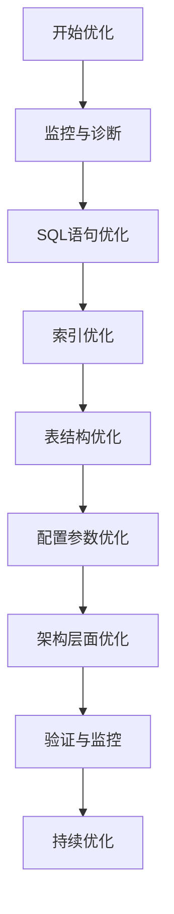

# MySQL生产环境优化指南：从SQL到架构

## 情境(Situation)

在现代互联网应用中，MySQL作为最流行的关系型数据库之一，承载着关键业务数据。随着业务规模的增长，数据库性能成为系统瓶颈的情况屡见不鲜。如何系统地优化MySQL，提升其在生产环境中的表现，是每个SRE/DevOps工程师必须掌握的技能。

作为SRE工程师，我们需要掌握MySQL优化的最佳实践，通过合理的优化策略提升数据库性能，确保系统的稳定运行。

## 冲突(Conflict)

在实际应用中，SRE工程师经常面临以下挑战：

- **性能瓶颈**：SQL执行慢，查询响应时间长
- **资源浪费**：内存、CPU利用率不合理
- **可靠性问题**：数据丢失风险，主从延迟
- **扩展性挑战**：单库性能无法满足业务增长
- **维护困难**：数据库管理复杂度高，故障排查困难

## 问题(Question)

如何通过系统化的优化策略，提升MySQL在生产环境中的性能和可靠性，同时降低维护成本？

## 答案(Answer)

本文将从SRE视角出发，详细介绍MySQL生产环境的全面优化策略，提供一套完整的解决方案。核心方法论基于 [SRE面试题解析：MySQL怎么优化？](#50-mysql怎么优化)。

---

## 一、MySQL优化概述

### 1.1 优化层次

**MySQL优化的主要层次**：

| 层次 | 效果 | 成本 | 优先级 | 适用场景 |
|:------|:------|:------|:--------|:----------|
| **SQL优化** | ⭐⭐⭐⭐⭐ | 低 | 最高 | 所有场景 |
| **索引优化** | ⭐⭐⭐⭐⭐ | 低 | 最高 | 所有场景 |
| **表结构优化** | ⭐⭐⭐⭐ | 中 | 高 | 设计阶段 |
| **配置优化** | ⭐⭐⭐⭐ | 中 | 中 | 部署阶段 |
| **架构优化** | ⭐⭐⭐⭐⭐ | 高 | 低 | 大规模系统 |

### 1.2 优化流程

**MySQL优化流程**：



---

## 二、监控与诊断

### 2.1 慢查询日志

**配置与使用**：

```sql
-- 开启慢查询日志
SET GLOBAL slow_query_log = 'ON';
SET GLOBAL slow_query_log_file = '/var/log/mysql/slow-query.log';
SET GLOBAL long_query_time = 1; -- 1秒以上的查询
SET GLOBAL log_queries_not_using_indexes = 'ON';

-- 查看慢查询日志配置
SHOW VARIABLES LIKE '%slow%';
```

**分析工具**：

```bash
# 使用mysqldumpslow分析慢查询
mysqldumpslow -s t /var/log/mysql/slow-query.log

# 使用pt-query-digest分析慢查询（推荐）
pt-query-digest /var/log/mysql/slow-query.log > slow_report.txt
```

**慢查询分析报告**：
- 识别执行时间最长的查询
- 分析查询频率
- 找出未使用索引的查询
- 发现重复执行的查询

### 2.2 Performance Schema

**关键表**：

| 表名 | 作用 | 适用场景 |
|:------|:------|:----------|
| `events_statements_history` | 语句执行历史 | 分析SQL执行情况 |
| `events_waits_history` | 等待事件历史 | 分析锁等待 |
| `table_io_waits_summary_by_table` | 表IO等待统计 | 分析表访问模式 |
| `index_io_waits_summary_by_index` | 索引IO等待统计 | 分析索引使用情况 |

**使用示例**：

```sql
-- 查看执行时间最长的SQL
SELECT * FROM performance_schema.events_statements_history 
ORDER BY timer_wait DESC LIMIT 10;

-- 查看表IO统计
SELECT * FROM performance_schema.table_io_waits_summary_by_table 
ORDER BY sum_timer_wait DESC LIMIT 10;
```

### 2.3 其他监控工具

**常用监控工具**：
- **MySQL Enterprise Monitor**：官方监控工具
- **Prometheus + Grafana**：开源监控方案
- **Zabbix**：综合监控系统
- **Nagios**：传统监控工具
- **云厂商监控**：如AWS CloudWatch、阿里云监控

**关键监控指标**：
- QPS/TPS：每秒查询/事务数
- 连接数：活跃连接数、最大连接数
- 缓冲池命中率：InnoDB缓冲池使用情况
- 锁等待：锁等待时间和次数
- 慢查询数：每秒慢查询数量
- 主从延迟：从库落后主库的时间

---

## 三、SQL语句优化

### 3.1 基础优化原则

**避免全表扫描**：
- 使用索引覆盖查询
- 避免SELECT *
- 合理使用WHERE条件

**JOIN优化**：
- 小表驱动大表
- 使用STRAIGHT_JOIN指定连接顺序
- 避免复杂的多表JOIN

**子查询优化**：
- 用JOIN替代子查询
- 避免相关子查询
- 使用临时表存储中间结果

### 3.2 高级SQL技巧

**分页优化**：

```sql
-- 传统分页（低效）
SELECT * FROM users ORDER BY id LIMIT 1000000, 10;

-- 优化后（高效）
SELECT * FROM users WHERE id > 1000000 ORDER BY id LIMIT 10;

-- 进一步优化（适合非连续ID）
SELECT * FROM users 
WHERE id >= (SELECT id FROM users ORDER BY id LIMIT 1000000, 1) 
ORDER BY id LIMIT 10;
```

**批量操作**：

```sql
-- 多次插入（低效）
INSERT INTO users(name) VALUES('user1');
INSERT INTO users(name) VALUES('user2');

-- 批量插入（高效）
INSERT INTO users(name) VALUES('user1'),('user2');

-- 批量更新
UPDATE users SET status=1 WHERE id IN (1,2,3,4,5);

-- 使用CASE语句批量更新不同值
UPDATE users SET status = CASE id 
    WHEN 1 THEN 1 
    WHEN 2 THEN 2 
    ELSE status 
END WHERE id IN (1,2,3);
```

**条件优化**：

```sql
-- 低效：使用函数
SELECT * FROM users WHERE YEAR(created_at) = 2024;

-- 高效：使用范围查询
SELECT * FROM users WHERE created_at >= '2024-01-01' AND created_at < '2025-01-01';

-- 低效：使用NOT IN
SELECT * FROM users WHERE id NOT IN (1,2,3);

-- 高效：使用NOT EXISTS
SELECT * FROM users u WHERE NOT EXISTS (SELECT 1 FROM blacklist b WHERE b.user_id = u.id);

-- 低效：使用OR
SELECT * FROM users WHERE status=1 OR status=2;

-- 高效：使用IN
SELECT * FROM users WHERE status IN (1,2);
```

** GROUP BY 优化**：

```sql
-- 低效：使用临时表
SELECT status, COUNT(*) FROM users GROUP BY status;

-- 高效：使用索引
-- 确保status列有索引
SELECT status, COUNT(*) FROM users GROUP BY status;

-- 进一步优化：使用索引覆盖
SELECT status, COUNT(*) FROM users USE INDEX(status) GROUP BY status;
```

### 3.3 EXPLAIN分析

**EXPLAIN输出解读**：

| 字段 | 含义 | 关注要点 |
|:------|:------|:----------|
| `id` | 查询ID | 多表查询时的执行顺序 |
| `select_type` | 查询类型 | SIMPLE、PRIMARY、SUBQUERY等 |
| `table` | 表名 | 访问的表 |
| `type` | 访问类型 | ALL（全表扫描）、index、range、ref、eq_ref、const、system |
| `possible_keys` | 可能使用的索引 | 是否有合适的索引 |
| `key` | 实际使用的索引 | 是否使用了索引 |
| `key_len` | 索引长度 | 索引使用的字节数 |
| `ref` | 索引参考值 | 索引的引用方式 |
| `rows` | 估计行数 | 扫描的行数 |
| `Extra` | 额外信息 | Using index、Using where、Using temporary、Using filesort等 |

**分析示例**：

```sql
-- 分析查询
EXPLAIN SELECT * FROM users WHERE status=1 AND created_at > '2024-01-01';

-- 查看执行计划
SHOW EXPLAIN FOR CONNECTION 123;
```

---

## 四、索引优化

### 4.1 索引设计原则

**B-Tree索引**：
- 适合范围查询
- 适合排序操作
- 支持最左前缀匹配

**唯一索引**：
- 保证数据唯一性
- 提高查询性能
- 加速INSERT/UPDATE操作

**覆盖索引**：
- 包含查询所需的所有字段
- 避免回表操作
- 提高查询性能

**全文索引**：
- 适合文本搜索
- 支持自然语言搜索
- 适用于MyISAM和InnoDB

### 4.2 联合索引设计

**最左前缀原则**：
- 联合索引(a,b,c)可以匹配a、a+b、a+b+c
- 不能匹配b、c、b+c

**字段顺序**：
- 区分度高的字段放在前面
- 频繁使用的字段放在前面
- 长度短的字段放在前面

**示例**：

```sql
-- 联合索引设计
CREATE INDEX idx_status_created ON users(status, created_at);

-- 可以使用索引的查询
SELECT * FROM users WHERE status=1;
SELECT * FROM users WHERE status=1 AND created_at > '2024-01-01';

-- 无法使用索引的查询
SELECT * FROM users WHERE created_at > '2024-01-01';
```

### 4.3 索引维护

**定期分析索引**：

```sql
-- 分析表统计信息
ANALYZE TABLE users;

-- 检查表状态
CHECK TABLE users;

-- 优化表（重建索引）
OPTIMIZE TABLE users;
```

**索引使用监控**：

```sql
-- 查看索引使用情况
SELECT * FROM performance_schema.table_io_waits_summary_by_index
WHERE object_schema = 'mydb' AND object_name = 'users';

-- 查看未使用的索引
SELECT * FROM sys.schema_unused_indexes
WHERE table_schema = 'mydb';
```

**索引失效场景**：
- 索引列使用函数或计算
- 以%开头的模糊查询
- OR连接无索引字段
- NOT IN、!=、IS NOT NULL
- 类型不匹配
- 联合索引违反最左前缀原则

---

## 五、表结构优化

### 5.1 数据类型选择

**整数类型**：

| 类型 | 字节 | 范围 | 适用场景 |
|:------|:------|:------|:----------|
| `TINYINT` | 1 | -128~127 | 状态、性别等小范围值 |
| `SMALLINT` | 2 | -32768~32767 | 小整数 |
| `MEDIUMINT` | 3 | -8388608~8388607 | 中等整数 |
| `INT` | 4 | -2147483648~2147483647 | 常用整数 |
| `BIGINT` | 8 | -9223372036854775808~9223372036854775807 | 大整数、自增ID |

**字符串类型**：

| 类型 | 特点 | 适用场景 |
|:------|:------|:----------|
| `CHAR` | 固定长度 | 短字符串、枚举值 |
| `VARCHAR` | 可变长度 | 变长字符串 |
| `TEXT` | 大文本 | 长文本、文章内容 |
| `BLOB` | 二进制数据 | 图片、文件等 |

**时间类型**：

| 类型 | 字节 | 范围 | 特点 |
|:------|:------|:------|:------|
| `DATETIME` | 8 | 1000-01-01~9999-12-31 | 范围广，不依赖时区 |
| `TIMESTAMP` | 4 | 1970-01-01~2038-01-19 | 自动更新，依赖时区 |
| `DATE` | 3 | 1000-01-01~9999-12-31 | 只存储日期 |
| `TIME` | 3 | -838:59:59~838:59:59 | 只存储时间 |
| `YEAR` | 1 | 1901~2155 | 只存储年份 |

### 5.2 表设计最佳实践

**主键设计**：
- 推荐自增BIGINT
- 避免使用UUID（影响索引性能）
- 避免复合主键（除非必要）
- 主键长度不宜过长

**字段设计**：
- 所有字段NOT NULL，使用默认值
- 合理设置字段长度
- 避免使用TEXT/BLOB作为查询条件
- 使用ENUM存储枚举值
- 使用DECIMAL存储金额

**范式与反范式**：
- OLTP系统：遵循第三范式
- OLAP系统：适当反范式，提高查询性能
- 合理使用冗余字段减少JOIN操作

**分表策略**：
- 水平分表：按范围、哈希、地理位置
- 垂直分表：按字段热度拆分
- 分表阈值：一般超过1000万行考虑分表

**示例**：

```sql
-- 水平分表（按年份）
CREATE TABLE orders_2024 LIKE orders;
CREATE TABLE orders_2025 LIKE orders;

-- 垂直分表
CREATE TABLE user_basic (id BIGINT PRIMARY KEY, name VARCHAR(50), email VARCHAR(100));
CREATE TABLE user_detail (user_id BIGINT PRIMARY KEY, address TEXT, bio TEXT);
```

---

## 六、配置参数优化

### 6.1 内存配置

**8GB内存服务器**：

```ini
# my.cnf
[mysqld]
# 内存配置
innodb_buffer_pool_size = 6G    # 物理内存的70%
innodb_buffer_pool_instances = 6 # 每1G一个实例
key_buffer_size = 128M           # MyISAM索引缓存
tmp_table_size = 256M            # 临时表大小
max_heap_table_size = 256M       # 内存表大小
query_cache_size = 0              # 禁用查询缓存（8.0已移除）
```

**16GB内存服务器**：

```ini
innodb_buffer_pool_size = 12G
innodb_buffer_pool_instances = 12
key_buffer_size = 256M
tmp_table_size = 512M
max_heap_table_size = 512M
```

**内存配置原则**：
- innodb_buffer_pool_size：物理内存的50%-70%
- 预留足够内存给操作系统和其他进程
- 根据实际负载调整

### 6.2 并发配置

```ini
# 连接配置
max_connections = 1000            # 最大连接数
max_connect_errors = 10000        # 连接错误限制
wait_timeout = 300                # 非活动连接超时
interactive_timeout = 300         # 交互式连接超时

# 线程配置
thread_cache_size = 100           # 线程缓存大小
innodb_thread_concurrency = 0     # 0表示无限制
thread_pool_size = 16             # 线程池大小（5.6+）
```

**并发配置原则**：
- max_connections：根据服务器资源和应用需求设置
- 避免连接数过大导致资源耗尽
- 使用连接池管理连接

### 6.3 IO配置

```ini
# 日志配置
innodb_log_file_size = 2G         # 日志文件大小
innodb_log_files_in_group = 2     # 日志文件组数
innodb_flush_log_at_trx_commit = 1 # 安全模式（1=每次提交刷盘，0=每秒刷盘，2=提交到OS缓存）
innodb_flush_method = O_DIRECT    # 直接IO

# 其他IO配置
innodb_file_per_table = 1         # 独立表空间
innodb_autoextend_increment = 64  # 表空间自动扩展大小
innodb_io_capacity = 2000         # IO容量（根据存储性能调整）
innodb_io_capacity_max = 4000     # 最大IO容量
```

**IO配置原则**：
- innodb_log_file_size：推荐256M-2G
- innodb_flush_log_at_trx_commit：安全要求高用1，性能要求高用0或2
- 根据存储类型（SSD/HDD）调整IO参数

### 6.4 其他重要配置

```ini
# 字符集
character_set_server = utf8mb4
collation_server = utf8mb4_unicode_ci

# 安全
skip_name_resolve = 1             # 跳过主机名解析
max_allowed_packet = 64M          # 最大包大小

# 复制
server-id = 1                     # 服务器ID
log-bin = mysql-bin               # 开启二进制日志
binlog-format = ROW               # 二进制日志格式

# 性能
sort_buffer_size = 2M             # 排序缓冲区大小
read_buffer_size = 1M             # 顺序读取缓冲区大小
read_rnd_buffer_size = 2M         # 随机读取缓冲区大小
join_buffer_size = 2M             # 连接缓冲区大小
```

---

## 七、架构优化

### 7.1 读写分离

**架构设计**：
- 主库：处理写操作
- 从库：处理读操作
- 中间件：MyCat、Sharding-JDBC、ProxySQL

**配置示例**：

```bash
# 主库my.cnf
server-id = 1
log-bin = mysql-bin
binlog-format = ROW

enforce_gtid_consistency = 1
gtid_mode = ON

# 从库my.cnf
server-id = 2
relay-log = relay-bin
read-only = 1

# 从库连接主库
CHANGE MASTER TO
  MASTER_HOST='master_ip',
  MASTER_PORT=3306,
  MASTER_USER='repl',
  MASTER_PASSWORD='password',
  MASTER_AUTO_POSITION=1;

START SLAVE;

# 查看复制状态
SHOW SLAVE STATUS\G;
```

**读写分离优势**：
- 提高系统吞吐量
- 减轻主库压力
- 提高系统可用性

### 7.2 缓存策略

**Redis缓存**：
- 热点数据缓存
- 会话数据存储
- 计数器缓存
- 分布式锁

**缓存策略**：
- 旁路缓存模式（Cache-Aside）
- 读写穿透模式（Read/Write Through）
- 写入回退模式（Write Behind）

**防止缓存雪崩**：
- 设置随机过期时间
- 多级缓存
- 限流熔断
- 缓存预热

**示例**：

```python
# Python示例：使用Redis缓存
import redis
import mysql.connector

# 连接Redis
r = redis.Redis(host='localhost', port=6379, db=0)

# 缓存查询
def get_user(user_id):
    # 先从缓存获取
    user = r.get(f"user:{user_id}")
    if user:
        return eval(user)
    
    # 缓存未命中，从数据库查询
    conn = mysql.connector.connect(host='localhost', user='root', password='password', database='mydb')
    cursor = conn.cursor(dictionary=True)
    cursor.execute("SELECT * FROM users WHERE id = %s", (user_id,))
    user = cursor.fetchone()
    
    # 存入缓存
    if user:
        r.setex(f"user:{user_id}", 3600, str(user))
    
    cursor.close()
    conn.close()
    return user
```

### 7.3 分库分表

**水平分表**：
- 按范围分表：适合时间序列数据
- 按哈希分表：适合均匀分布数据
- 按地理位置分表：适合区域性数据

**分库策略**：
- 垂直分库：按业务模块拆分
- 水平分库：按数据量拆分

**工具选择**：
- **Sharding-JDBC**：客户端分库分表
- **MyCat**：中间件分库分表
- **Vitess**：大规模分库分表
- **ProxySQL**：数据库代理

**分库分表示例**：

```yaml
# Sharding-JDBC配置
spring:
  shardingsphere:
    datasource:
      names: ds0,ds1
      ds0:
        url: jdbc:mysql://localhost:3306/db0
        username: root
        password: password
      ds1:
        url: jdbc:mysql://localhost:3306/db1
        username: root
        password: password
    sharding:
      tables:
        user:
          actual-data-nodes: ds$->{0..1}.user$->{0..1}
          database-strategy:
            inline:
              sharding-column: id
              algorithm-expression: ds$->{id % 2}
          table-strategy:
            inline:
              sharding-column: id
              algorithm-expression: user$->{id % 2}
```

### 7.4 高可用架构

**主从复制**：
- 异步复制：性能好，可能数据丢失
- 半同步复制：数据安全，性能略有影响
- 组复制：多主架构，高可用

**故障转移**：
- MHA（Master High Availability）
- Orchestrator
- Keepalived + VIP
- 云厂商托管服务

**集群方案**：
- **MySQL Cluster**：原生集群方案
- **Percona XtraDB Cluster**：基于Galera的集群
- **MariaDB Galera Cluster**：多主集群

---

## 八、备份与恢复

### 8.1 备份策略

**全量备份**：

```bash
# 使用mysqldump备份
mysqldump -u root -p --all-databases --single-transaction --master-data=2 > full_backup.sql

# 使用xtrabackup备份（推荐）
xtrabackup --backup --target-dir=/backup/full --user=root --password=password
```

**增量备份**：

```bash
# 使用xtrabackup增量备份
xtrabackup --backup --target-dir=/backup/incremental1 --incremental-basedir=/backup/full --user=root --password=password
```

**备份策略建议**：
- 每天一次全量备份
- 每小时一次增量备份
- 备份文件异地存储
- 定期测试备份恢复

### 8.2 恢复策略

**从全量备份恢复**：

```bash
# 使用mysqldump恢复
mysql -u root -p < full_backup.sql

# 使用xtrabackup恢复
xtrabackup --prepare --target-dir=/backup/full
xtrabackup --copy-back --target-dir=/backup/full --datadir=/var/lib/mysql
```

**从增量备份恢复**：

```bash
# 准备全量备份
xtrabackup --prepare --apply-log-only --target-dir=/backup/full

# 应用增量备份
xtrabackup --prepare --apply-log-only --target-dir=/backup/full --incremental-dir=/backup/incremental1

# 恢复数据
xtrabackup --copy-back --target-dir=/backup/full --datadir=/var/lib/mysql
```

**Point-in-Time Recovery (PITR)**：

```bash
# 从备份恢复到某个时间点
mysql -u root -p < full_backup.sql
mysqlbinlog --start-datetime='2024-01-01 10:00:00' --stop-datetime='2024-01-01 11:00:00' mysql-bin.000001 | mysql -u root -p
```

### 8.3 灾难恢复

**灾备方案**：
- 异地备份：定期将备份文件复制到异地
- 主从复制：跨机房部署从库
- 多活架构：多区域部署，负载均衡

**恢复演练**：
- 定期进行恢复演练
- 记录恢复时间
- 优化恢复流程
- 制定详细的灾难恢复计划

---

## 九、监控与维护

### 9.1 日常维护

**定期任务**：
- 备份：全量备份+增量备份
- 优化表：`OPTIMIZE TABLE`
- 分析表：`ANALYZE TABLE`
- 清理日志：binlog、慢查询日志
- 检查表：`CHECK TABLE`

**维护脚本示例**：

```bash
#!/bin/bash

# 备份数据库
mysqldump -u root -p --all-databases --single-transaction > /backup/mysql_$(date +%Y%m%d).sql

# 优化表
mysql -u root -p -e "OPTIMIZE TABLE users, orders, products;"

# 分析表
mysql -u root -p -e "ANALYZE TABLE users, orders, products;"

# 清理过期binlog
mysql -u root -p -e "PURGE BINARY LOGS BEFORE DATE_SUB(NOW(), INTERVAL 7 DAY);"

# 清理慢查询日志
> /var/log/mysql/slow-query.log
```

### 9.2 性能监控

**关键监控指标**：

| 指标 | 描述 | 告警阈值 |
|:------|:------|:----------|
| `QPS` | 每秒查询数 | 根据业务需求设置 |
| `TPS` | 每秒事务数 | 根据业务需求设置 |
| `连接数` | 当前连接数 | 超过max_connections的80% |
| `缓冲池命中率` | InnoDB缓冲池命中率 | < 95% |
| `慢查询数` | 每秒慢查询数量 | > 5 |
| `锁等待时间` | 锁等待平均时间 | > 100ms |
| `主从延迟` | 从库落后主库的时间 | > 30s |
| `磁盘空间` | 数据目录磁盘使用率 | > 80% |

**监控工具配置**：

```yaml
# Prometheus配置示例
scrape_configs:
  - job_name: 'mysql'
    static_configs:
      - targets: ['mysql:9104']
    metrics_path: /metrics
    scrape_interval: 15s

# Grafana仪表盘
# 导入MySQL监控模板（ID: 7362）
```

### 9.3 故障排查

**常见问题排查**：

| 问题 | 可能原因 | 排查方法 |
|:------|:------|:----------|
| 连接数过多 | 应用连接池配置不当 | `SHOW PROCESSLIST;`，检查连接状态 |
| 慢查询 | SQL或索引问题 | 分析慢查询日志，使用EXPLAIN |
| 主从延迟 | 网络或主库写入压力大 | `SHOW SLAVE STATUS\G;`，检查Seconds_Behind_Master |
| 死锁 | 事务并发冲突 | `SHOW ENGINE INNODB STATUS;`，查看死锁信息 |
| 内存不足 | 缓冲池配置过大 | 监控内存使用，调整配置 |
| 磁盘IO高 | 大量读写操作 | 监控IOPS，优化SQL |

**排查工具**：
- **pt-query-digest**：分析慢查询
- **pt-deadlock-logger**：监控死锁
- **pt-stalk**：当出现问题时收集诊断信息
- **MySQL Workbench**：图形化管理工具
- **phpMyAdmin**：Web管理工具

---

## 十、最佳实践总结

### 10.1 核心原则

**MySQL优化核心原则**：

1. **监控先行**：建立完善的监控体系，及时发现问题
2. **分层优化**：从SQL→索引→表结构→配置→架构的顺序优化
3. **测试验证**：优化前备份，优化后压测验证
4. **持续优化**：定期评估和调整优化策略
5. **安全第一**：确保数据安全和系统稳定

### 10.2 配置建议

**生产环境配置清单**：
- [ ] 开启慢查询日志，设置合理的long_query_time
- [ ] 配置合适的innodb_buffer_pool_size（物理内存的50%-70%）
- [ ] 选择合适的索引策略，避免过度索引
- [ ] 使用自增BIGINT主键，所有字段NOT NULL
- [ ] 实施定期备份策略，包括全量和增量备份
- [ ] 配置监控和告警，及时发现问题
- [ ] 合理设置max_connections，避免连接数过多
- [ ] 优化IO配置，根据存储类型调整参数
- [ ] 实施读写分离，提高系统吞吐量
- [ ] 定期进行数据库维护和优化

**推荐命令**：
- **查看状态**：`SHOW GLOBAL STATUS;`
- **查看变量**：`SHOW GLOBAL VARIABLES;`
- **分析查询**：`EXPLAIN SELECT * FROM users WHERE id=1;`
- **优化表**：`OPTIMIZE TABLE users;`
- **分析表**：`ANALYZE TABLE users;`
- **查看进程**：`SHOW PROCESSLIST;`
- **查看慢查询**：`pt-query-digest /var/log/mysql/slow-query.log`

### 10.3 经验总结

**常见误区**：
- **过度索引**：索引过多影响写入性能
- **忽略慢查询**：不重视慢查询优化
- **配置参数随意设置**：没有根据实际情况调整
- **备份策略缺失**：没有定期备份和恢复演练
- **监控不足**：无法及时发现问题
- **架构设计不合理**：单库性能无法满足业务需求

**成功经验**：
- **标准化流程**：建立统一的数据库管理规范
- **自动化管理**：使用脚本自动化日常维护
- **性能基准**：建立性能基准，定期对比
- **知识共享**：团队内分享优化经验
- **持续学习**：关注MySQL新版本特性和最佳实践

---

## 总结

MySQL优化是一个持续的过程，需要根据业务需求和系统状态不断调整。通过本文介绍的系统化优化策略，您可以构建一个高性能、高可靠的MySQL生产环境。

**核心要点**：

1. **监控与诊断**：建立完善的监控体系，及时发现问题
2. **SQL优化**：优化查询语句，避免性能瓶颈
3. **索引优化**：合理设计索引，提高查询性能
4. **表结构优化**：选择合适的数据类型，优化表设计
5. **配置优化**：根据服务器资源调整配置参数
6. **架构优化**：实施读写分离、缓存、分库分表等策略
7. **备份与恢复**：建立完善的备份策略，确保数据安全
8. **监控与维护**：定期维护和监控，确保系统稳定

通过遵循这些最佳实践，我们可以显著提升MySQL的性能和可靠性，为企业级应用提供坚实的数据库基础。

> **延伸学习**：更多面试相关的MySQL优化知识，请参考 [SRE面试题解析：MySQL怎么优化？](#50-mysql怎么优化)。

---

## 参考资料

- [MySQL官方文档](https://dev.mysql.com/doc/)
- [Percona官方文档](https://www.percona.com/doc/)
- [MySQL性能调优指南](https://dev.mysql.com/doc/refman/8.0/en/optimization.html)
- [高性能MySQL](https://www.oreilly.com/library/view/high-performance-mysql/9781449332471/)
- [MySQL索引设计与优化](https://dev.mysql.com/doc/refman/8.0/en/optimization-indexes.html)
- [InnoDB存储引擎](https://dev.mysql.com/doc/refman/8.0/en/innodb-storage-engine.html)
- [MySQL复制](https://dev.mysql.com/doc/refman/8.0/en/replication.html)
- [MySQL备份与恢复](https://dev.mysql.com/doc/refman/8.0/en/backup-and-recovery.html)
- [Percona XtraBackup](https://www.percona.com/doc/percona-xtrabackup/LATEST/index.html)
- [MySQL监控](https://dev.mysql.com/doc/refman/8.0/en/monitoring.html)
- [MySQL故障排查](https://dev.mysql.com/doc/refman/8.0/en/debugging-server.html)
- [Sharding-JDBC](https://shardingsphere.apache.org/document/current/en/features/sharding/)
- [MyCat](http://www.mycat.org.cn/)
- [ProxySQL](https://proxysql.com/)
- [Vitess](https://vitess.io/)
- [Prometheus](https://prometheus.io/)
- [Grafana](https://grafana.com/)
- [Redis](https://redis.io/)
- [MHA](https://code.google.com/archive/p/mysql-master-ha/)
- [Orchestrator](https://github.com/openark/orchestrator)
- [Percona XtraDB Cluster](https://www.percona.com/software/mysql-database/percona-xtradb-cluster)
- [MariaDB Galera Cluster](https://mariadb.com/kb/en/mariadb-galera-cluster/)
- [MySQL Cluster](https://dev.mysql.com/doc/refman/8.0/en/mysql-cluster.html)