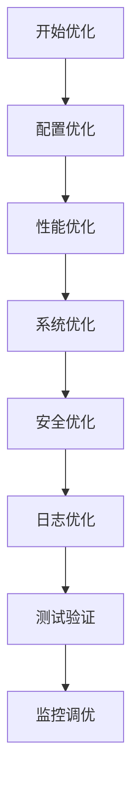

# Nginx优化生产环境最佳实践：从配置到系统调优

## 情境(Situation)

在现代Web应用架构中，Nginx已成为高性能Web服务器和反向代理的标准选择。作为SRE工程师，我们经常需要面对高并发、大流量的场景，如何优化Nginx配置以提高性能、增强安全性、确保稳定性，成为日常工作中的重要挑战。

Nginx的优化涉及多个维度，包括配置优化、性能优化、系统优化、安全优化和日志优化等。合理的优化策略可以显著提升Nginx的性能和可靠性，确保服务在高负载下稳定运行。

## 冲突(Conflict)

在实际应用中，SRE工程师经常面临以下挑战：

- **性能瓶颈**：高并发场景下Nginx响应缓慢
- **安全漏洞**：配置不当导致的安全风险
- **资源浪费**：系统资源利用不合理
- **日志管理**：日志过大导致磁盘空间不足
- **系统限制**：内核参数和文件描述符限制影响性能

## 问题(Question)

如何通过合理的Nginx优化策略，提高性能、增强安全性、确保稳定性，应对高并发、大流量的生产环境挑战？

## 答案(Answer)

本文将从SRE视角出发，详细介绍Nginx优化的关键策略，提供一套完整的生产环境解决方案。核心方法论基于 [SRE面试题解析：nginx做了哪些优化？](#48-nginx做了哪些优化)。

---

## 一、Nginx优化概述

### 1.1 优化维度

**Nginx优化的主要维度**：

| 维度 | 目标 | 关键策略 | 效果 |
|:------|:------|:----------|:------|
| **配置优化** | 高并发 | worker_processes、events | ⭐⭐⭐⭐⭐ |
| **性能优化** | 快速响应 | gzip压缩、缓存、sendfile | ⭐⭐⭐⭐⭐ |
| **系统优化** | 高承载 | 文件描述符、内核参数 | ⭐⭐⭐⭐ |
| **安全优化** | 防攻击 | 版本隐藏、频率限制 | ⭐⭐⭐⭐ |
| **日志优化** | 可追溯 | 日志格式、轮转 | ⭐⭐⭐ |

### 1.2 优化流程

**Nginx优化流程**：



---

## 二、配置优化

### 2.1 核心配置优化

**Nginx核心配置优化**：

| 参数 | 推荐值 | 说明 |
|:------|:--------|:------|
| **worker_processes** | auto | 自动检测CPU核心数 |
| **worker_connections** | 65536 | 单进程最大连接数 |
| **use epoll** | on | 高效事件模型 |
| **multi_accept** | on | 同时接受多个连接 |
| **worker_rlimit_nofile** | 65535 | 进程文件描述符限制 |

**主配置文件示例**：

```nginx
# /etc/nginx/nginx.conf

user nginx;
worker_processes auto;
worker_rlimit_nofile 65535;

events {
    use epoll;
    worker_connections 65536;
    multi_accept on;
}

http {
    # HTTP配置
}
```

### 2.2 事件模块优化

**events模块配置**：

```nginx
events {
    use epoll;                  # 使用epoll事件模型
    worker_connections 65536;   # 单进程最大连接数
    multi_accept on;            # 同时接受多个连接
    accept_mutex off;           # 关闭accept互斥锁，提高并发性能
}
```

**关键参数说明**：
- **use epoll**：使用epoll事件模型，适用于Linux系统，性能优于select和poll
- **worker_connections**：单进程最大连接数，根据系统资源调整
- **multi_accept**：同时接受多个连接，提高连接处理速度
- **accept_mutex**：关闭互斥锁，减少锁竞争，提高并发性能

### 2.3 HTTP模块优化

**HTTP模块基础配置**：

```nginx
http {
    include       /etc/nginx/mime.types;
    default_type  application/octet-stream;
    
    # 日志配置
    log_format  main  '$remote_addr - $remote_user [$time_local] "$request" '
                      '$status $body_bytes_sent "$http_referer" '
                      '"$http_user_agent" "$http_x_forwarded_for" '
                      '$request_time $upstream_response_time';
    
    access_log  /var/log/nginx/access.log  main;
    error_log   /var/log/nginx/error.log   warn;
    
    # 高效传输
    sendfile        on;
    tcp_nopush      on;
    tcp_nodelay     on;
    keepalive_timeout  65;
    keepalive_requests 100;
    
    # 其他配置
    include /etc/nginx/conf.d/*.conf;
}
```

---

## 三、性能优化

### 3.1 高效传输配置

**高效传输配置**：

```nginx
http {
    # 高效文件传输
    sendfile on;              # 启用sendfile，减少用户空间到内核空间的拷贝
    tcp_nopush on;            # 启用tcp_nopush，与sendfile配合使用
    tcp_nodelay on;           # 启用tcp_nodelay，减少网络延迟
    
    # 连接管理
    keepalive_timeout 65;     # 长连接超时时间
    keepalive_requests 100;    # 长连接最大请求数
    
    # 连接超时
    client_body_timeout 60;    # 客户端请求体超时
    client_header_timeout 60;  # 客户端请求头超时
    send_timeout 60;           # 发送响应超时
}
```

### 3.2 gzip压缩配置

**gzip压缩配置**：

```nginx
http {
    # gzip压缩
    gzip on;                  # 启用gzip压缩
    gzip_vary on;             # 启用Vary: Accept-Encoding响应头
    gzip_min_length 1024;     # 最小压缩文件大小
    gzip_comp_level 6;        # 压缩级别（1-9，6为平衡点）
    gzip_types text/plain text/css application/json application/javascript text/xml application/xml application/xml+rss text/javascript;  # 压缩文件类型
    gzip_buffers 16 8k;       # 压缩缓冲区
    gzip_http_version 1.1;    # 压缩使用的HTTP版本
    
    # 禁用IE6 gzip
    gzip_disable "MSIE [1-6]\\.";  
}
```

### 3.3 缓存配置

**静态文件缓存**：

```nginx
http {
    # 静态文件缓存
    location ~* \.(jpg|jpeg|png|gif|ico|css|js|woff|woff2|ttf|eot|svg)$ {
        expires 30d;                  # 缓存30天
        add_header Cache-Control "public, immutable";  # 缓存控制
        access_log off;               # 关闭访问日志
        gzip on;                      # 启用gzip压缩
    }
    
    # 代理缓存
    proxy_cache_path /var/cache/nginx levels=1:2 keys_zone=my_cache:10m max_size=10g inactive=60m;
    
    location /api/ {
        proxy_pass http://backend;
        proxy_cache my_cache;
        proxy_cache_valid 200 304 10m;
        proxy_cache_valid any 1m;
        proxy_cache_min_uses 1;
        proxy_cache_use_stale error timeout updating http_500 http_502 http_503 http_504;
        proxy_cache_lock on;
        add_header X-Cache-Status $upstream_cache_status;
    }
}
```

### 3.4 负载均衡配置

**负载均衡配置**：

```nginx
http {
    # 上游服务器
    upstream backend {
        least_conn;  # 最少连接数负载均衡
        server 127.0.0.1:8080 max_fails=3 fail_timeout=30s;
        server 127.0.0.1:8081 max_fails=3 fail_timeout=30s;
        server 127.0.0.1:8082 max_fails=3 fail_timeout=30s;
    }
    
    # 代理配置
    location / {
        proxy_pass http://backend;
        proxy_set_header Host $host;
        proxy_set_header X-Real-IP $remote_addr;
        proxy_set_header X-Forwarded-For $proxy_add_x_forwarded_for;
        proxy_set_header X-Forwarded-Proto $scheme;
        
        # 代理超时
        proxy_connect_timeout 30s;
        proxy_read_timeout 60s;
        proxy_send_timeout 60s;
        
        # 缓冲区
        proxy_buffers 16 16k;
        proxy_buffer_size 32k;
    }
}
```

---

## 四、系统优化

### 4.1 文件描述符限制

**文件描述符限制**：

```bash
# /etc/security/limits.conf
* soft nofile 65536
* hard nofile 65536

# /etc/systemd/system/nginx.service.d/limits.conf
[Service]
LimitNOFILE=65536
```

**生效命令**：
```bash
# 立即生效
ulimit -n 65536

# 重启nginx
systemctl restart nginx
```

### 4.2 内核参数优化

**内核参数优化**：

```bash
# /etc/sysctl.conf

# 网络参数优化
net.core.somaxconn = 65535          # 最大连接数
net.ipv4.tcp_max_syn_backlog = 65535  # SYN队列长度
net.ipv4.tcp_tw_reuse = 1            # 重用TIME_WAIT连接
net.ipv4.tcp_fin_timeout = 30        # FIN超时时间
net.ipv4.ip_local_port_range = 1024 65535  # 本地端口范围
net.core.netdev_max_backlog = 65535   # 网络设备接收队列

# 内存参数优化
vm.swappiness = 10                    # 减少交换
vm.overcommit_memory = 1              # 允许内存过度提交

# 文件系统参数优化
fs.file-max = 65535                   # 系统最大文件描述符
```

**生效命令**：
```bash
sysctl -p
```

### 4.3 系统服务优化

**Nginx服务优化**：

```bash
# /etc/systemd/system/nginx.service.d/custom.conf
[Service]
# 进程数
LimitNOFILE=65536
# 重启策略
Restart=always
RestartSec=5
# 启动超时
TimeoutStartSec=30
# 停止超时
TimeoutStopSec=30
```

**重载配置**：
```bash
systemctl daemon-reload
systemctl restart nginx
```

---

## 五、安全优化

### 5.1 基础安全配置

**基础安全配置**：

```nginx
http {
    # 隐藏版本号
    server_tokens off;
    
    # 限制请求方法
    if ($request_method !~ ^(GET|HEAD|POST)$ ) {
        return 405;
    }
    
    # 客户端限制
    client_max_body_size 50m;          # 限制请求体大小
    client_body_buffer_size 16k;       # 请求体缓冲区大小
    
    # 防止点击劫持
    add_header X-Frame-Options SAMEORIGIN;
    
    # 防止XSS攻击
    add_header X-XSS-Protection "1; mode=block";
    
    # 强制HTTPS
    add_header Strict-Transport-Security "max-age=31536000; includeSubDomains" always;
    
    # 内容安全策略
    add_header Content-Security-Policy "default-src 'self'; script-src 'self' 'unsafe-inline' 'unsafe-eval'; style-src 'self' 'unsafe-inline'; img-src 'self' data:; font-src 'self';";
}
```

### 5.2 访问频率限制

**访问频率限制**：

```nginx
http {
    # 定义限制区域
    limit_req_zone $binary_remote_addr zone=one:10m rate=10r/s;
    
    # 应用限制
    location / {
        limit_req zone=one burst=20 nodelay;
    }
    
    # API接口限制
    location /api/ {
        limit_req zone=one burst=10 nodelay;
    }
}
```

### 5.3 防盗链配置

**防盗链配置**：

```nginx
http {
    # 图片防盗链
    location ~* \.(jpg|jpeg|png|gif|webp)$ {
        valid_referers none blocked example.com *.example.com;
        if ($invalid_referer) {
            return 403;
        }
    }
}
```

### 5.4 HTTPS配置

**HTTPS配置**：

```nginx
server {
    listen 443 ssl http2;
    server_name example.com;
    
    # SSL配置
    ssl_certificate /etc/nginx/ssl/example.com.crt;
    ssl_certificate_key /etc/nginx/ssl/example.com.key;
    
    # SSL优化
    ssl_protocols TLSv1.2 TLSv1.3;
    ssl_prefer_server_ciphers on;
    ssl_ciphers 'ECDHE-ECDSA-AES256-GCM-SHA384:ECDHE-RSA-AES256-GCM-SHA384:ECDHE-ECDSA-CHACHA20-POLY1305:ECDHE-RSA-CHACHA20-POLY1305:ECDHE-ECDSA-AES128-GCM-SHA256:ECDHE-RSA-AES128-GCM-SHA256:ECDHE-ECDSA-AES256-SHA384:ECDHE-RSA-AES256-SHA384:ECDHE-ECDSA-AES128-SHA256:ECDHE-RSA-AES128-SHA256';
    ssl_session_cache shared:SSL:10m;
    ssl_session_timeout 10m;
    ssl_session_tickets off;
    ssl_stapling on;
    ssl_stapling_verify on;
    resolver 8.8.8.8 8.8.4.4 valid=300s;
    resolver_timeout 5s;
    
    # 其他配置
    location / {
        root /usr/share/nginx/html;
        index index.html index.htm;
    }
}

# 重定向HTTP到HTTPS
server {
    listen 80;
    server_name example.com;
    return 301 https://$host$request_uri;
}
```

---

## 六、日志优化

### 6.1 日志格式配置

**日志格式配置**：

```nginx
http {
    # 主日志格式
    log_format main '$remote_addr - $remote_user [$time_local] "$request" '
                    '$status $body_bytes_sent "$http_referer" '
                    '"$http_user_agent" "$http_x_forwarded_for" '
                    '$request_time $upstream_response_time';
    
    # 访问日志
    access_log /var/log/nginx/access.log main;
    
    # 错误日志
    error_log /var/log/nginx/error.log warn;
    
    # 关闭静态文件日志
    location ~* \.(jpg|jpeg|png|gif|ico|css|js)$ {
        access_log off;
    }
}
```

### 6.2 日志轮转配置

**日志轮转配置**：

```bash
# /etc/logrotate.d/nginx
/var/log/nginx/*.log {
    daily
    rotate 14
    compress
    delaycompress
    missingok
    notifempty
    create 0640 nginx nginx
    postrotate
        if [ -f /var/run/nginx.pid ]; then
            kill -USR1 `cat /var/run/nginx.pid`
        fi
    endscript
}
```

### 6.3 日志分析

**日志分析工具**：
- **GoAccess**：实时Web日志分析工具
- **ELK Stack**：Elasticsearch + Logstash + Kibana
- **Graylog**：集中式日志管理

**GoAccess配置示例**：

```bash
# 安装GoAccess
apt install goaccess

# 分析日志
goaccess /var/log/nginx/access.log -o /var/www/html/report.html --log-format=COMBINED
```

---

## 七、企业级解决方案

### 7.1 集群部署

**Nginx集群部署**：

1. **负载均衡**：
   - 使用Nginx作为前端负载均衡
   - 后端部署多个应用服务器
   - 配置健康检查

2. **高可用**：
   - 使用Keepalived实现主备切换
   - 配置VRRP协议
   - 实现自动故障转移

**示例配置**：

```nginx
# 负载均衡配置
upstream backend {
    least_conn;
    server 10.0.0.1:8080 max_fails=3 fail_timeout=30s;
    server 10.0.0.2:8080 max_fails=3 fail_timeout=30s;
    server 10.0.0.3:8080 max_fails=3 fail_timeout=30s;
}

server {
    listen 80;
    server_name example.com;
    
    location / {
        proxy_pass http://backend;
        proxy_set_header Host $host;
        proxy_set_header X-Real-IP $remote_addr;
        proxy_set_header X-Forwarded-For $proxy_add_x_forwarded_for;
    }
}
```

### 7.2 监控与告警

**Nginx监控**：

1. **Prometheus + Grafana**：
   - 使用nginx-prometheus-exporter
   - 配置Prometheus采集指标
   - 构建Grafana仪表盘

2. **Nginx Amplify**：
   - 官方监控工具
   - 实时性能分析
   - 自动告警

3. **自定义监控**：
   - 监控Nginx进程状态
   - 监控端口可用性
   - 监控响应时间

**监控指标**：
- 连接数（活跃连接、等待连接）
- 请求数（每秒请求数、错误率）
- 响应时间（平均响应时间、P95/P99）
- 带宽使用（入站/出站流量）
- 健康状态（后端服务器状态）

### 7.3 CI/CD集成

**CI/CD集成**：

1. **GitLab CI/CD**：
   - 自动化部署Nginx配置
   - 集成测试
   - 滚动更新

2. **Jenkins**：
   - 流水线部署
   - 配置验证
   - 回滚机制

3. **GitHub Actions**：
   - 基于事件的自动化
   - 多环境部署
   - 配置检查

**示例GitLab CI配置**：

```yaml
# .gitlab-ci.yml
stages:
  - test
  - deploy

test:
  stage: test
  script:
    - nginx -t -c /etc/nginx/nginx.conf

deploy:
  stage: deploy
  script:
    - scp nginx.conf root@server:/etc/nginx/
    - ssh root@server "nginx -t && systemctl reload nginx"
  only:
    - master
```

---

## 八、最佳实践总结

### 8.1 核心原则

**Nginx优化核心原则**：

1. **性能优先**：
   - 合理配置worker进程和连接数
   - 启用高效传输和压缩
   - 优化缓存策略

2. **安全第一**：
   - 隐藏版本号
   - 限制访问频率
   - 配置HTTPS
   - 防止常见攻击

3. **稳定性**：
   - 优化系统参数
   - 合理设置超时
   - 实现高可用

4. **可维护性**：
   - 标准化配置
   - 完善日志管理
   - 自动化部署

### 8.2 配置建议

**生产环境配置清单**：
- [ ] 配置worker_processes为auto
- [ ] 设置worker_connections为65536
- [ ] 启用epoll事件模型
- [ ] 启用sendfile、tcp_nopush、tcp_nodelay
- [ ] 配置gzip压缩
- [ ] 优化静态文件缓存
- [ ] 配置代理缓存
- [ ] 调整文件描述符限制
- [ ] 优化内核参数
- [ ] 隐藏版本号
- [ ] 配置访问频率限制
- [ ] 启用HTTPS
- [ ] 配置日志轮转
- [ ] 监控Nginx状态

**推荐命令**：
- **检查配置**：`nginx -t`
- **重载配置**：`nginx -s reload`
- **查看状态**：`nginx -V`
- **查看进程**：`ps aux | grep nginx`
- **查看连接**：`netstat -an | grep :80`
- **查看日志**：`tail -f /var/log/nginx/access.log`

### 8.3 经验总结

**常见误区**：
- **过度优化**：配置参数超出系统能力
- **忽略安全**：未配置HTTPS或访问限制
- **日志管理不当**：日志过大导致磁盘空间不足
- **监控缺失**：无法及时发现问题
- **配置不一致**：不同环境配置不同

**成功经验**：
- **渐进式优化**：逐步调整参数，测试效果
- **标准化配置**：建立统一的配置模板
- **自动化管理**：集成CI/CD流水线
- **持续监控**：实时监控性能指标
- **定期评估**：定期Review配置和性能

---

## 总结

Nginx优化是一个系统工程，涉及配置、性能、系统、安全和日志等多个维度。通过本文的指导，我们了解了Nginx优化的关键策略和最佳实践，可以帮助SRE工程师构建高性能、安全、稳定的Nginx服务。

**核心要点**：

1. **配置优化**：合理设置worker进程、连接数和事件模型
2. **性能优化**：启用高效传输、gzip压缩和缓存策略
3. **系统优化**：调整文件描述符和内核参数
4. **安全优化**：隐藏版本号、限制访问频率、配置HTTPS
5. **日志优化**：合理配置日志格式和轮转
6. **企业级解决方案**：集群部署、监控与告警、CI/CD集成

通过遵循这些最佳实践，我们可以显著提升Nginx的性能和可靠性，确保服务在高并发、大流量的生产环境中稳定运行。

> **延伸学习**：更多面试相关的Nginx优化知识，请参考 [SRE面试题解析：nginx做了哪些优化？](#48-nginx做了哪些优化)。

---

## 参考资料

- [Nginx官方文档](https://nginx.org/en/docs/)
- [Nginx优化最佳实践](https://www.nginx.com/blog/tuning-nginx/)
- [Nginx性能调优](https://www.digitalocean.com/community/tutorials/how-to-optimize-nginx-configuration)
- [Nginx安全配置](https://www.nginx.com/blog/nginx-security-tips/)
- [Linux内核参数调优](https://wiki.kernel.org/index.php/Performance_Tuning)
- [Prometheus监控Nginx](https://github.com/nginxinc/nginx-prometheus-exporter)
- [GoAccess日志分析](https://goaccess.io/)
- [ELK Stack](https://www.elastic.co/elk-stack)
- [Graylog](https://www.graylog.org/)
- [Keepalived高可用](https://www.keepalived.org/)
- [GitLab CI/CD](https://docs.gitlab.com/ee/ci/)
- [Jenkins](https://www.jenkins.io/)
- [GitHub Actions](https://github.com/features/actions)
- [HTTPS最佳实践](https://letsencrypt.org/docs/best-practices/)
- [Nginx Amplify](https://amplify.nginx.com/)
- [负载均衡配置](https://docs.nginx.com/nginx/admin-guide/load-balancer/)
- [缓存配置](https://docs.nginx.com/nginx/admin-guide/content-cache/)
- [限流配置](https://docs.nginx.com/nginx/admin-guide/security-controls/controlling-access/)
- [日志配置](https://docs.nginx.com/nginx/admin-guide/monitoring/logging/)
- [SSL配置](https://docs.nginx.com/nginx/admin-guide/security-controls/terminating-ssl-http/)
- [Nginx模块](https://nginx.org/en/docs/modules/)
- [Nginx变量](https://nginx.org/en/docs/varindex.html)
- [Nginx指令](https://nginx.org/en/docs/dirindex.html)