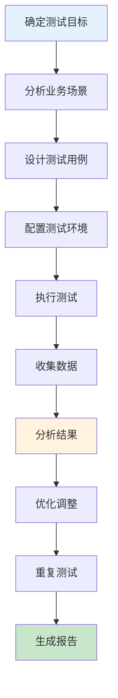
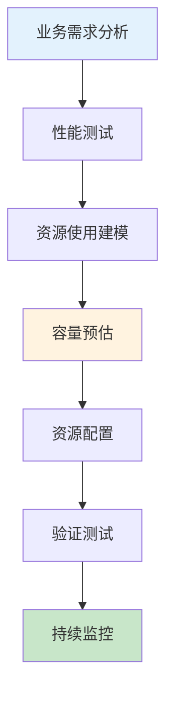

# 性能测试与容量规划生产环境最佳实践

## 情境(Situation)

性能测试和容量规划是确保系统能够在高负载下稳定运行的关键环节。在生产环境中，系统需要处理大量并发用户请求，性能问题可能导致用户体验下降甚至系统崩溃。

## 冲突(Conflict)

许多团队在性能测试和容量规划方面面临以下挑战：
- **缺乏性能基准**：没有明确的性能目标和基准线
- **测试场景不真实**：测试负载与实际生产负载不符
- **容量预估不准确**：导致资源浪费或资源不足
- **性能问题发现晚**：上线后才发现性能瓶颈
- **缺乏持续性能监控**：无法及时发现性能退化

## 问题(Question)

如何进行有效的性能测试和容量规划，确保系统满足业务需求？

## 答案(Answer)

本文将基于真实生产案例，提供一套完整的性能测试与容量规划最佳实践指南。

---

## 一、性能测试策略

### 1.1 性能测试类型

| 测试类型 | 目的 | 适用场景 | 工具 |
|:--------:|------|----------|------|
| **负载测试** | 评估系统在预期负载下的性能 | 常规性能验证 | JMeter, k6 |
| **压力测试** | 确定系统的极限容量 | 容量规划 | JMeter, k6 |
| **稳定性测试** | 验证系统长期运行稳定性 | 上线前验证 | JMeter, Locust |
| **基准测试** | 建立性能基准线 | 性能对比 | k6, Gatling |
| **尖峰测试** | 测试系统应对突发流量的能力 | 促销活动 | JMeter, k6 |

### 1.2 性能测试流程



---

## 二、性能测试工具

### 2.1 k6性能测试脚本

```javascript
// k6性能测试脚本
import http from 'k6/http';
import { check, sleep, group } from 'k6';

export const options = {
  stages: [
    { duration: '5m', target: 100 },   // 5分钟内逐步增加到100用户
    { duration: '10m', target: 100 },  // 维持100用户10分钟
    { duration: '5m', target: 200 },   // 5分钟内增加到200用户
    { duration: '10m', target: 200 },  // 维持200用户10分钟
    { duration: '5m', target: 300 },   // 5分钟内增加到300用户
    { duration: '10m', target: 300 },  // 维持300用户10分钟
    { duration: '5m', target: 0 },     // 5分钟内减少到0用户
  ],
  thresholds: {
    http_req_duration: ['p(95)<500', 'p(99)<1000'],  // P95 < 500ms, P99 < 1000ms
    http_req_failed: ['rate<0.01'],                   // 错误率 < 1%
    checks: ['rate>0.99'],                            // 检查通过率 > 99%
  },
};

export default function () {
  group('API请求', function () {
    // 获取用户列表
    let res = http.get('https://api.example.com/users');
    check(res, {
      '用户列表请求成功': (r) => r.status === 200,
      '响应时间<500ms': (r) => r.timings.duration < 500,
    });
    
    sleep(1);
    
    // 创建订单
    res = http.post('https://api.example.com/orders', JSON.stringify({
      items: [{ productId: '123', quantity: 2 }],
      userId: 'user-123',
    }), {
      headers: { 'Content-Type': 'application/json' },
    });
    check(res, {
      '订单创建成功': (r) => r.status === 201,
    });
    
    sleep(2);
  });
}
```

### 2.2 JMeter测试计划配置

```xml
<?xml version="1.0" encoding="UTF-8"?>
<jmeterTestPlan version="1.2" properties="5.0">
  <hashTree>
    <TestPlan guiclass="TestPlanGui" testclass="TestPlan" testname="性能测试计划" enabled="true">
      <stringProp name="TestPlan.comments"></stringProp>
      <boolProp name="TestPlan.functional_mode">false</boolProp>
      <boolProp name="TestPlan.serialize_threadgroups">false</boolProp>
      <elementProp name="TestPlan.user_defined_variables" elementType="Arguments">
        <collectionProp name="Arguments.arguments">
          <elementProp name="base_url" elementType="Argument">
            <stringProp name="Argument.name">base_url</stringProp>
            <stringProp name="Argument.value">https://api.example.com</stringProp>
          </elementProp>
        </collectionProp>
      </elementProp>
    </TestPlan>
    
    <hashTree>
      <ThreadGroup guiclass="ThreadGroupGui" testclass="ThreadGroup" testname="用户模拟" enabled="true">
        <stringProp name="ThreadGroup.on_sample_error">continue</stringProp>
        <elementProp name="ThreadGroup.main_controller" elementType="LoopController">
          <boolProp name="LoopController.continue_forever">false</boolProp>
          <stringProp name="LoopController.loops">-1</stringProp>
        </elementProp>
        <stringProp name="ThreadGroup.num_threads">100</stringProp>
        <stringProp name="ThreadGroup.ramp_time">60</stringProp>
        <longProp name="ThreadGroup.duration">1800</longProp>
      </ThreadGroup>
      
      <hashTree>
        <HTTPSamplerProxy guiclass="HttpTestSampleGui" testclass="HTTPSamplerProxy" testname="获取用户列表" enabled="true">
          <stringProp name="HTTPSampler.domain">${base_url}</stringProp>
          <stringProp name="HTTPSampler.port">443</stringProp>
          <stringProp name="HTTPSampler.protocol">https</stringProp>
          <stringProp name="HTTPSampler.path">/users</stringProp>
          <stringProp name="HTTPSampler.method">GET</stringProp>
        </HTTPSamplerProxy>
        
        <hashTree>
          <ResponseAssertion guiclass="ResponseAssertionGui" testclass="ResponseAssertion" enabled="true">
            <collectionProp name="Asserion.test_strings">
              <stringProp name="1">200</stringProp>
            </collectionProp>
            <stringProp name="Assertion.field_to_test">Response Code</stringProp>
            <stringProp name="Assertion.test_type">Equals</stringProp>
          </ResponseAssertion>
        </hashTree>
        
        <ConstantTimer guiclass="ConstantTimerGui" testclass="ConstantTimer" testname="等待1秒" enabled="true">
          <stringProp name="ConstantTimer.delay">1000</stringProp>
        </ConstantTimer>
        
        <HTTPSamplerProxy guiclass="HttpTestSampleGui" testclass="HTTPSamplerProxy" testname="创建订单" enabled="true">
          <stringProp name="HTTPSampler.domain">${base_url}</stringProp>
          <stringProp name="HTTPSampler.port">443</stringProp>
          <stringProp name="HTTPSampler.protocol">https</stringProp>
          <stringProp name="HTTPSampler.path">/orders</stringProp>
          <stringProp name="HTTPSampler.method">POST</stringProp>
          <elementProp name="HTTPsampler.Arguments" elementType="Arguments">
            <collectionProp name="Arguments.arguments">
              <elementProp name="0" elementType="Argument">
                <stringProp name="Argument.name"></stringProp>
                <stringProp name="Argument.value">{
                  "items": [{"productId": "123", "quantity": 2}],
                  "userId": "user-${__Random(1, 1000)}"
                }</stringProp>
                <stringProp name="Argument.metadata">application/json</stringProp>
              </elementProp>
            </collectionProp>
          </elementProp>
        </HTTPSamplerProxy>
        
        <ConstantTimer guiclass="ConstantTimerGui" testclass="ConstantTimer" testname="等待2秒" enabled="true">
          <stringProp name="ConstantTimer.delay">2000</stringProp>
        </ConstantTimer>
      </hashTree>
    </hashTree>
    
    <hashTree>
      <SummaryReport guiclass="SummaryReportGui" testclass="SummaryReport" testname="汇总报告" enabled="true">
        <stringProp name="filename">results/summary_report.csv</stringProp>
      </SummaryReport>
      
      <AggregateReport guiclass="AggregateReportGui" testclass="AggregateReport" testname="聚合报告" enabled="true">
        <stringProp name="filename">results/aggregate_report.csv</stringProp>
      </AggregateReport>
      
      <ViewResultsTree guiclass="ViewResultsTreeGui" testclass="ViewResultsTree" testname="结果树" enabled="false">
        <stringProp name="filename"></stringProp>
        <boolProp name="ViewResultsTree.show_sample_labels">true</boolProp>
      </ViewResultsTree>
    </hashTree>
  </hashTree>
</jmeterTestPlan>
```

---

## 三、性能指标分析

### 3.1 关键性能指标

| 指标 | 定义 | 单位 | 目标值 |
|:----:|------|------|--------|
| **吞吐量** | 单位时间处理的请求数 | req/s | 根据业务需求 |
| **响应时间** | 请求从发出到收到响应的时间 | ms | P95 < 500ms |
| **错误率** | 失败请求占总请求的比例 | % | < 1% |
| **CPU使用率** | CPU使用百分比 | % | < 80% |
| **内存使用率** | 内存使用百分比 | % | < 85% |
| **数据库连接池** | 数据库连接使用情况 | % | < 80% |

### 3.2 性能仪表盘配置

```json
{
  "title": "性能监控仪表盘",
  "panels": [
    {
      "type": "graph",
      "title": "吞吐量",
      "targets": [
        {
          "expr": "sum(rate(http_requests_total[5m]))",
          "legendFormat": "Requests/sec"
        }
      ],
      "yAxis": {
        "label": "req/s",
        "min": 0
      }
    },
    {
      "type": "graph",
      "title": "响应时间",
      "targets": [
        {
          "expr": "histogram_quantile(0.50, sum(rate(http_request_duration_seconds_bucket[5m])) by (le))",
          "legendFormat": "P50"
        },
        {
          "expr": "histogram_quantile(0.95, sum(rate(http_request_duration_seconds_bucket[5m])) by (le))",
          "legendFormat": "P95"
        },
        {
          "expr": "histogram_quantile(0.99, sum(rate(http_request_duration_seconds_bucket[5m])) by (le))",
          "legendFormat": "P99"
        }
      ],
      "yAxis": {
        "label": "Seconds",
        "min": 0,
        "max": 2
      }
    },
    {
      "type": "stat",
      "title": "错误率",
      "targets": [
        {
          "expr": "sum(rate(http_requests_total{status_code=~\"5..\"}[5m])) / sum(rate(http_requests_total[5m])) * 100",
          "legendFormat": "Error Rate"
        }
      ],
      "thresholds": "1,5",
      "colorMode": "value"
    },
    {
      "type": "graph",
      "title": "CPU使用率",
      "targets": [
        {
          "expr": "100 - (avg by(instance) (irate(node_cpu_seconds_total{mode=\"idle\"}[5m])) * 100)",
          "legendFormat": "{{ instance }}"
        }
      ],
      "yAxis": {
        "label": "%",
        "min": 0,
        "max": 100
      }
    },
    {
      "type": "graph",
      "title": "内存使用率",
      "targets": [
        {
          "expr": "(node_memory_MemTotal_bytes - node_memory_MemAvailable_bytes) / node_memory_MemTotal_bytes * 100",
          "legendFormat": "{{ instance }}"
        }
      ],
      "yAxis": {
        "label": "%",
        "min": 0,
        "max": 100
      }
    }
  ]
}
```

---

## 四、容量规划

### 4.1 容量规划流程



### 4.2 容量计算公式

```python
# 容量规划计算
def calculate_capacity(current_requests, current_response_time, target_requests, target_response_time):
    """
    计算所需的服务器数量
    
    参数:
    current_requests: 当前每秒请求数
    current_response_time: 当前平均响应时间(ms)
    target_requests: 目标每秒请求数
    target_response_time: 目标平均响应时间(ms)
    
    返回:
    所需服务器数量
    """
    
    # 计算当前服务器的处理能力
    current_capacity = current_requests * (current_response_time / 1000)
    
    # 计算目标服务器的处理能力
    target_capacity = target_requests * (target_response_time / 1000)
    
    # 计算所需服务器数量(向上取整)
    servers_needed = math.ceil(target_capacity / current_capacity)
    
    return servers_needed

# 示例计算
import math

current_rps = 1000
current_response_time = 200
target_rps = 5000
target_response_time = 250

servers = calculate_capacity(current_rps, current_response_time, target_rps, target_response_time)
print(f"所需服务器数量: {servers}")
```

### 4.3 容量规划配置

```yaml
# 容量规划配置
capacity_plan:
  business_requirements:
    peak_requests: 10000        # 峰值请求数 (req/s)
    target_response_time: 500   # 目标响应时间 (ms)
    availability: 99.99%        # 可用性目标
  
  current_state:
    servers: 10
    current_rps: 2000
    current_response_time: 200
  
  projections:
    - scenario: "日常流量"
      rps: 3000
      servers_needed: 15
      scaling_policy: "auto"
    
    - scenario: "促销活动"
      rps: 10000
      servers_needed: 50
      scaling_policy: "manual"
    
    - scenario: "故障场景"
      rps: 5000
      servers_needed: 30
      scaling_policy: "auto + manual"
  
  resources:
    cpu:
      per_server: 8
      utilization_threshold: 70%
    
    memory:
      per_server: 16GB
      utilization_threshold: 80%
    
    storage:
      per_server: 100GB
      growth_rate: 10%/month
```

---

## 五、性能优化策略

### 5.1 优化优先级矩阵

| 优先级 | 优化类型 | 预期收益 | 实现难度 |
|:------:|----------|----------|----------|
| **P0** | 数据库索引优化 | 高 | 低 |
| **P0** | 缓存层添加 | 高 | 中 |
| **P1** | 代码优化 | 中 | 中 |
| **P1** | 异步处理 | 中 | 中 |
| **P2** | 垂直扩展 | 低 | 低 |
| **P2** | 水平扩展 | 中 | 高 |

### 5.2 性能优化检查清单

```yaml
# 性能优化检查清单
optimization_checklist:
  database:
    - name: "索引优化"
      description: "确认所有查询都有合适的索引"
      check: "EXPLAIN ANALYZE 查询"
      pass_criteria: "没有全表扫描"
    
    - name: "连接池配置"
      description: "确认连接池大小合理"
      check: "监控连接池使用情况"
      pass_criteria: "连接池使用率 < 80%"
    
    - name: "查询优化"
      description: "优化慢查询"
      check: "查看慢查询日志"
      pass_criteria: "没有超过1秒的查询"
  
  application:
    - name: "缓存策略"
      description: "确认缓存层配置正确"
      check: "检查缓存命中率"
      pass_criteria: "命中率 > 90%"
    
    - name: "异步处理"
      description: "确认非关键操作已异步化"
      check: "检查同步阻塞操作"
      pass_criteria: "没有长时间阻塞"
    
    - name: "资源使用"
      description: "确认资源使用合理"
      check: "监控CPU/内存使用"
      pass_criteria: "使用率 < 80%"
  
  infrastructure:
    - name: "负载均衡"
      description: "确认负载均衡配置正确"
      check: "检查请求分布"
      pass_criteria: "均匀分布"
    
    - name: "CDN配置"
      description: "确认静态资源已缓存"
      check: "检查CDN命中率"
      pass_criteria: "命中率 > 95%"
```

---

## 六、最佳实践总结

### 6.1 性能测试原则

| 原则 | 说明 | 实践建议 |
|:----:|------|----------|
| **真实场景** | 使用真实的测试数据和场景 | 复制生产数据 |
| **持续测试** | 性能测试集成到CI/CD | 自动化性能测试 |
| **基准对比** | 建立性能基准线 | 定期对比 |
| **全链路测试** | 测试完整的请求链路 | 端到端测试 |
| **容量预留** | 预留20-30%的容量 | 应对突发流量 |

### 6.2 常见问题与解决方案

| 问题 | 症状 | 解决方案 |
|:-----|:-----|:----------|
| **响应时间慢** | P95/P99响应时间高 | 分析瓶颈，优化代码/数据库 |
| **吞吐量不足** | 请求排队严重 | 水平扩展或优化处理能力 |
| **资源耗尽** | CPU/内存使用率高 | 优化资源使用或扩容 |
| **数据库瓶颈** | 查询慢、连接池满 | 索引优化、读写分离 |
| **缓存失效** | 缓存命中率低 | 优化缓存策略 |

---

## 总结

性能测试和容量规划是确保系统稳定性和可扩展性的关键环节。通过建立明确的性能目标、设计真实的测试场景、进行准确的容量预估和持续的性能监控，可以确保系统能够满足业务需求。

> **延伸阅读**：更多性能测试相关面试题，请参考 [SRE面试题解析：基于JD与简历匹配分析]()。

---

## 参考资料

- [k6官方文档](https://k6.io/docs/)
- [JMeter官方文档](https://jmeter.apache.org/)
- [Gatling官方文档](https://gatling.io/docs/)
- [性能测试指南](https://www.blazemeter.com/blog/)
- [容量规划最佳实践](https://www.oreilly.com/library/view/cloud-capacity-planning/9781449343508/)
