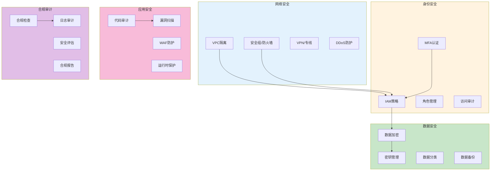
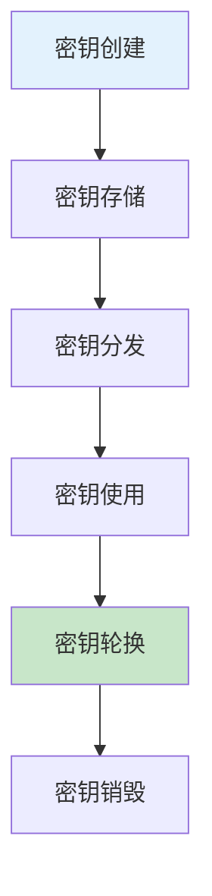

# 安全与合规实践生产环境最佳实践

## 情境(Situation)

在云原生时代，安全与合规是DevOps/SRE工程师必须关注的核心领域。随着数据泄露和安全事件的频发，建立完善的安全体系成为保障业务稳定运行的关键。

## 冲突(Conflict)

许多团队在安全与合规方面面临以下挑战：
- **安全配置复杂**：云环境中的安全配置繁琐且容易出错
- **密钥管理困难**：敏感信息泄露风险高
- **合规要求严格**：满足行业合规标准难度大
- **安全审计耗时**：手动审计效率低下
- **持续安全监控**：缺乏有效的安全监控机制

## 问题(Question)

如何建立一套完整的云安全与合规体系，确保基础设施和应用的安全性？

## 答案(Answer)

本文将基于真实生产案例，提供一套完整的安全与合规最佳实践指南。

---

## 一、安全架构设计

### 1.1 安全架构概览



### 1.2 安全原则

| 原则 | 说明 | 实践建议 |
|:----:|------|----------|
| **最小权限** | 只授予必要的权限 | IAM角色精细化配置 |
| **纵深防御** | 多层安全防护 | 网络+应用+数据多重防护 |
| **加密传输** | 数据传输加密 | TLS/SSL配置 |
| **加密存储** | 静态数据加密 | 加密存储卷 |
| **审计追踪** | 记录所有操作 | 启用云审计日志 |

---

## 二、IAM与访问控制

### 2.1 IAM策略配置

```yaml
# AWS IAM策略示例
{
    "Version": "2012-10-17",
    "Statement": [
        {
            "Effect": "Allow",
            "Action": [
                "ec2:DescribeInstances",
                "ec2:DescribeVolumes"
            ],
            "Resource": "*",
            "Condition": {
                "IpAddress": {
                    "aws:SourceIp": ["192.168.1.0/24"]
                }
            }
        },
        {
            "Effect": "Deny",
            "Action": [
                "ec2:TerminateInstances",
                "ec2:DeleteVolumes"
            ],
            "Resource": "*"
        }
    ]
}
```

### 2.2 角色配置

```yaml
# AWS IAM角色配置
AWSTemplateFormatVersion: "2010-09-09"
Resources:
  EC2ReadOnlyRole:
    Type: AWS::IAM::Role
    Properties:
      AssumeRolePolicyDocument:
        Version: "2012-10-17"
        Statement:
          - Effect: Allow
            Principal:
              Service:
                - ec2.amazonaws.com
            Action:
              - sts:AssumeRole
      Path: /
      Policies:
        - PolicyName: EC2ReadOnlyPolicy
          PolicyDocument:
            Version: "2012-10-17"
            Statement:
              - Effect: Allow
                Action:
                  - ec2:Describe*
                Resource: "*"
```

### 2.3 访问密钥轮换策略

```yaml
# 密钥轮换策略
key_rotation_policy:
  max_key_age: 90 days
  rotation_frequency: 30 days
  alert_before_expiry: 7 days
  emergency_rotation:
    enabled: true
    trigger_conditions:
      - key_compromised
      - policy_violation
      - audit_failure
```

---

## 三、密钥管理

### 3.1 HashiCorp Vault配置

```yaml
# Vault配置示例
listener "tcp" {
  address = "0.0.0.0:8200"
  tls_disable = false
  tls_cert_file = "/etc/vault/tls/server.crt"
  tls_key_file = "/etc/vault/tls/server.key"
}

storage "consul" {
  address = "consul:8500"
  path = "vault/"
}

seal "awskms" {
  region     = "us-east-1"
  kms_key_id = "arn:aws:kms:us-east-1:1234567890:key/my-key"
}

ui = true
```

### 3.2 密钥管理流程



### 3.3 Vault使用示例

```bash
#!/bin/bash
# vault_operations.sh - Vault密钥管理脚本

# 初始化Vault
vault operator init -key-shares=5 -key-threshold=3

# 解锁Vault
vault operator unseal <key1>
vault operator unseal <key2>
vault operator unseal <key3>

# 登录Vault
vault login <root_token>

# 创建密钥
vault kv put secret/myapp/db password="supersecret"

# 获取密钥
vault kv get secret/myapp/db

# 动态生成数据库凭证
vault write database/creds/myapp-role

# 撤销凭证
vault revoke database/creds/myapp-role/<lease_id>
```

---

## 四、数据加密

### 4.1 静态数据加密

```yaml
# AWS S3加密配置
Resources:
  MySecureBucket:
    Type: AWS::S3::Bucket
    Properties:
      BucketName: my-secure-bucket
      BucketEncryption:
        ServerSideEncryptionConfiguration:
          - ServerSideEncryptionByDefault:
              SSEAlgorithm: AES256
          - ServerSideEncryptionRule:
              ApplyServerSideEncryptionByDefault:
                SSEAlgorithm: aws:kms
                KMSMasterKeyID: !Ref MyKMSKey

  MyKMSKey:
    Type: AWS::KMS::Key
    Properties:
      Description: "S3加密密钥"
      KeyPolicy:
        Version: "2012-10-17"
        Statement:
          - Effect: Allow
            Principal:
              AWS: !Sub "arn:aws:iam::${AWS::AccountId}:root"
            Action: kms:*
            Resource: "*"
```

### 4.2 传输加密

```yaml
# Nginx TLS配置
server {
    listen 443 ssl;
    server_name api.example.com;
    
    ssl_certificate /etc/nginx/certs/api.crt;
    ssl_certificate_key /etc/nginx/certs/api.key;
    
    ssl_protocols TLSv1.2 TLSv1.3;
    ssl_ciphers HIGH:!aNULL:!MD5;
    ssl_prefer_server_ciphers on;
    
    ssl_session_cache shared:SSL:1m;
    ssl_session_timeout 5m;
    
    location / {
        proxy_pass http://backend;
        proxy_set_header Host $host;
        proxy_set_header X-Real-IP $remote_addr;
    }
}
```

---

## 五、安全审计与监控

### 5.1 云审计配置

```yaml
# AWS CloudTrail配置
Resources:
  MyTrail:
    Type: AWS::CloudTrail::Trail
    Properties:
      TrailName: my-security-trail
      S3BucketName: !Ref MyAuditBucket
      IsLogging: true
      IsMultiRegionTrail: true
      EnableLogFileValidation: true
      IncludeGlobalServiceEvents: true

  MyAuditBucket:
    Type: AWS::S3::Bucket
    Properties:
      BucketName: my-audit-logs-bucket
      AccessControl: Private
      BucketEncryption:
        ServerSideEncryptionConfiguration:
          - ServerSideEncryptionByDefault:
              SSEAlgorithm: AES256
```

### 5.2 安全监控规则

```yaml
# CloudWatch安全告警规则
security_alerts:
  - name: "RootAccountUsage"
    description: "检测根账户活动"
    metric_filter:
      pattern: '{$.userIdentity.type = "Root" && $.userIdentity.invokedBy NOT EXISTS}'
    alarm:
      threshold: 1
      period: 300
      evaluation_periods: 1
      actions:
        - sns:security-alerts
        - pagerduty:critical

  - name: "UnusualLogin"
    description: "检测异常登录行为"
    metric_filter:
      pattern: '{$.eventName = "ConsoleLogin" && $.sourceIPAddress NOT IN ["192.168.1.0/24", "10.0.0.0/8"]}'
    alarm:
      threshold: 1
      period: 60
      evaluation_periods: 1
      actions:
        - sns:security-alerts
```

---

## 六、合规检查

### 6.1 合规检查清单

```yaml
# 安全合规检查清单
compliance_checklist:
  network:
    - name: "VPC隔离"
      description: "确认VPC配置正确"
      check: "aws ec2 describe-vpcs"
      pass_criteria: "至少2个私有子网"
    
    - name: "安全组限制"
      description: "确认安全组只允许必要端口"
      check: "aws ec2 describe-security-groups"
      pass_criteria: "没有开放所有端口的安全组"
  
  identity:
    - name: "MFA启用"
      description: "确认所有用户启用MFA"
      check: "aws iam list-users"
      pass_criteria: "所有用户已启用MFA"
    
    - name: "AccessKey轮换"
      description: "确认AccessKey定期轮换"
      check: "aws iam list-access-keys"
      pass_criteria: "所有密钥年龄<90天"
  
  data:
    - name: "S3加密"
      description: "确认S3存储桶加密"
      check: "aws s3api get-bucket-encryption"
      pass_criteria: "所有存储桶启用加密"
    
    - name: "RDS加密"
      description: "确认RDS数据库加密"
      check: "aws rds describe-db-instances"
      pass_criteria: "所有实例启用加密"
```

### 6.2 合规扫描脚本

```bash
#!/bin/bash
# compliance_scan.sh - 安全合规扫描脚本

set -e

echo "=== 安全合规扫描 ==="

# 检查安全组
echo ""
echo "1. 检查安全组配置"
echo "------------------"
open_security_groups=$(aws ec2 describe-security-groups --query \
  'SecurityGroups[?IpPermissions[?IpRanges[?CidrIp==`0.0.0.0/0`]]].GroupId' \
  --output text)

if [ -n "$open_security_groups" ]; then
  echo "❌ 发现开放的安全组: $open_security_groups"
  exit 1
else
  echo "✅ 所有安全组配置正确"
fi

# 检查MFA配置
echo ""
echo "2. 检查MFA配置"
echo "--------------"
users_without_mfa=$(aws iam list-users --query \
  'Users[?not_null(MfaDevices)] == []].UserName' \
  --output text)

if [ -n "$users_without_mfa" ]; then
  echo "❌ 以下用户未启用MFA: $users_without_mfa"
  exit 1
else
  echo "✅ 所有用户已启用MFA"
fi

# 检查S3加密
echo ""
echo "3. 检查S3加密"
echo "-------------"
unencrypted_buckets=$(aws s3api list-buckets --query \
  'Buckets[].Name' --output text | while read bucket; do
  encryption=$(aws s3api get-bucket-encryption --bucket "$bucket" 2>/dev/null || echo "NONE")
  if [ "$encryption" = "NONE" ]; then
    echo "$bucket"
  fi
done)

if [ -n "$unencrypted_buckets" ]; then
  echo "❌ 以下存储桶未加密: $unencrypted_buckets"
  exit 1
else
  echo "✅ 所有存储桶已加密"
fi

echo ""
echo "=== 扫描完成 ==="
exit 0
```

---

## 七、CI/CD安全集成

### 7.1 安全扫描集成

```groovy
// Jenkinsfile安全扫描集成
pipeline {
    agent any
    
    stages {
        stage('Build') {
            steps {
                sh 'mvn clean package -DskipTests'
            }
        }
        
        stage('Static Analysis') {
            steps {
                // SonarQube代码质量检查
                sonarQubeEnv('SonarQube')
                sh 'mvn sonar:sonar'
            }
        }
        
        stage('Dependency Check') {
            steps {
                // OWASP依赖检查
                dependencyCheck additionalArguments: '--format HTML --out ./reports', 
                              odcInstallation: 'DependencyCheck'
            }
        }
        
        stage('Container Security') {
            steps {
                // Trivy容器镜像扫描
                sh 'trivy image --severity HIGH,CRITICAL --exit-code 1 myapp:latest'
            }
        }
        
        stage('Deploy') {
            when {
                expression {
                    // 只有安全检查通过才部署
                    currentBuild.result == null || currentBuild.result == 'SUCCESS'
                }
            }
            steps {
                sh 'kubectl apply -f deployment.yaml'
            }
        }
    }
}
```

---

## 八、最佳实践总结

### 8.1 安全合规原则

| 原则 | 说明 | 实践建议 |
|:----:|------|----------|
| **零信任架构** | 不相信任何实体 | 验证每个访问请求 |
| **最小权限** | 只授予必要权限 | IAM角色精细化配置 |
| **持续监控** | 实时安全监控 | CloudWatch/Security Hub |
| **自动合规** | 自动化合规检查 | 定期扫描脚本 |
| **安全左移** | 在开发阶段引入安全 | CI/CD集成安全扫描 |

### 8.2 常见问题与解决方案

| 问题 | 症状 | 解决方案 |
|:-----|:-----|:----------|
| **密钥泄露** | 敏感信息被泄露 | 使用Vault管理密钥 |
| **权限滥用** | 过度授权 | 最小权限原则 |
| **合规差距** | 不符合监管要求 | 定期合规扫描 |
| **安全事件发现延迟** | 安全事件未及时发现 | 实时安全监控 |
| **配置错误** | 安全配置不当 | 自动化配置验证 |

---

## 总结

安全与合规是DevOps/SRE工作的重中之重。通过建立完整的安全架构、实施严格的访问控制、使用专业的密钥管理工具、定期进行安全审计和合规检查，可以有效保障基础设施和应用的安全性。

> **延伸阅读**：更多安全相关面试题，请参考 [SRE面试题解析：基于JD与简历匹配分析]()。

---

## 参考资料

- [AWS IAM最佳实践](https://docs.aws.amazon.com/IAM/latest/UserGuide/best-practices.html)
- [HashiCorp Vault文档](https://www.vaultproject.io/docs/)
- [OWASP安全指南](https://owasp.org/www-community/attacks/)
- [CIS安全基准](https://www.cisecurity.org/cis-benchmarks/)
- [NIST网络安全框架](https://www.nist.gov/cyberframework)
