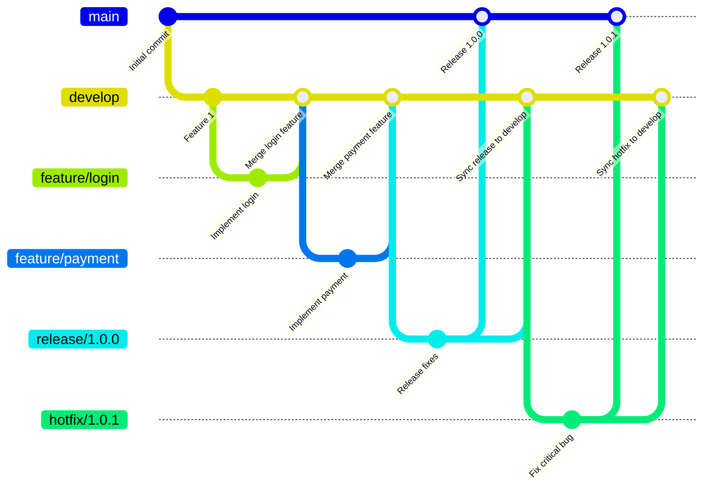
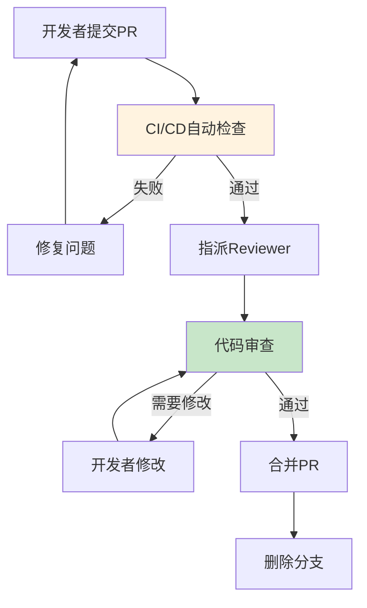

# 版本控制与代码管理生产环境最佳实践

## 情境(Situation)

版本控制是现代软件开发的基础，有效的代码管理能够提高团队协作效率，保障代码质量，支持持续集成和持续部署。

## 冲突(Conflict)

许多团队在版本控制和代码管理方面面临以下挑战：
- **分支管理混乱**：分支策略不清晰，合并冲突频繁
- **代码质量不高**：缺乏代码审查机制
- **提交信息不规范**：难以追踪代码变更
- **版本发布困难**：缺乏明确的发布流程
- **代码重复**：缺乏代码复用机制

## 问题(Question)

如何建立一套有效的版本控制和代码管理体系，确保团队高效协作和代码质量？

## 答案(Answer)

本文将基于真实生产案例，提供一套完整的版本控制与代码管理最佳实践指南。

---

## 一、分支策略

### 1.1 Git Flow策略



### 1.2 Trunk-Based Development策略


### 1.3 分支策略对比

| 策略 | 适用场景 | 优点 | 缺点 |
|:----:|----------|------|------|
| **Git Flow** | 大型项目、复杂发布 | 结构清晰、版本管理完善 | 分支复杂、学习成本高 |
| **GitHub Flow** | 小型团队、快速迭代 | 简单灵活、易于理解 | 缺乏正式发布流程 |
| **Trunk-Based** | 持续部署、高频发布 | 简化分支管理、减少冲突 | 需要严格的CI/CD支持 |

---

## 二、代码提交规范

### 2.1 Conventional Commits格式

```
<类型>(<范围>): <描述>

[可选的正文]

[可选的页脚]
```

### 2.2 提交类型说明

| 类型 | 说明 | 示例 |
|:----:|------|------|
| **feat** | 新增功能 | `feat(auth): add login with OAuth` |
| **fix** | 修复bug | `fix(api): resolve null pointer in user endpoint` |
| **docs** | 文档更新 | `docs(readme): update installation guide` |
| **style** | 代码格式 | `style: format code with prettier` |
| **refactor** | 代码重构 | `refactor(utils): simplify date parsing` |
| **test** | 测试更新 | `test: add unit tests for auth service` |
| **chore** | 构建/工具更新 | `chore(deps): update dependencies` |

### 2.3 提交模板配置

```yaml
# .gitmessage文件
# <类型>(<范围>): <简短描述>
# 
# 详细描述（可选）
# 
# 相关Issue（可选）
# Fixes: #123
# Related: #456

# 提交类型：
# - feat: 新增功能
# - fix: 修复bug
# - docs: 文档更新
# - style: 代码格式
# - refactor: 代码重构
# - test: 测试更新
# - chore: 构建/工具更新
```

```bash
# .gitconfig配置
[commit]
    template = .gitmessage
```

---

## 三、代码审查流程

### 3.1 Code Review流程



### 3.2 Code Review检查清单

```yaml
# Code Review检查清单
code_review_checklist:
  code_quality:
    - name: "代码可读性"
      description: "变量、函数命名清晰"
      pass_criteria: "符合命名规范"
    
    - name: "代码简洁性"
      description: "避免冗余代码"
      pass_criteria: "无重复代码"
    
    - name: "错误处理"
      description: "异常处理完整"
      pass_criteria: "所有异常都有处理"
    
    - name: "注释质量"
      description: "关键代码有注释"
      pass_criteria: "逻辑清晰的注释"
  
  security:
    - name: "注入攻击"
      description: "防止SQL/命令注入"
      pass_criteria: "使用参数化查询"
    
    - name: "敏感信息"
      description: "不暴露敏感信息"
      pass_criteria: "无硬编码密钥"
    
    - name: "权限检查"
      description: "访问控制正确"
      pass_criteria: "所有操作有权限检查"
  
  testing:
    - name: "测试覆盖"
      description: "新增代码有测试"
      pass_criteria: "测试覆盖率>=80%"
    
    - name: "测试质量"
      description: "测试用例有效"
      pass_criteria: "测试覆盖主要场景"
  
  documentation:
    - name: "API文档"
      description: "API变更有文档"
      pass_criteria: "文档同步更新"
    
    - name: "代码文档"
      description: "公共API有文档"
      pass_criteria: "函数/类有文档注释"
```

---

## 四、代码质量保障

### 4.1 自动化检查配置

```yaml
# .pre-commit-config.yaml
repos:
  - repo: https://github.com/pre-commit/pre-commit-hooks
    rev: v4.6.0
    hooks:
      - id: trailing-whitespace
      - id: end-of-file-fixer
      - id: check-yaml
      - id: check-json
      - id: check-merge-conflict
  
  - repo: https://github.com/psf/black
    rev: 24.2.0
    hooks:
      - id: black
  
  - repo: https://github.com/pycqa/flake8
    rev: 6.0.0
    hooks:
      - id: flake8
        args: ["--max-line-length=120"]
  
  - repo: https://github.com/pre-commit/mirrors-mypy
    rev: v1.8.0
    hooks:
      - id: mypy
        args: ["--strict"]
```

### 4.2 CI/CD集成代码检查

```groovy
// Jenkinsfile代码质量检查
pipeline {
    agent any
    
    stages {
        stage('Checkout') {
            steps {
                checkout scm
            }
        }
        
        stage('Lint') {
            steps {
                sh 'pre-commit run --all-files'
            }
        }
        
        stage('Test') {
            steps {
                sh 'pytest --cov=app --cov-report=xml'
            }
        }
        
        stage('SonarQube') {
            steps {
                withSonarQubeEnv('SonarQube') {
                    sh 'mvn sonar:sonar'
                }
            }
        }
        
        stage('Deploy') {
            when {
                expression {
                    currentBuild.result == null || currentBuild.result == 'SUCCESS'
                }
            }
            steps {
                sh 'kubectl apply -f deployment.yaml'
            }
        }
    }
}
```

---

## 五、版本发布管理

### 5.1 版本号规范

```
MAJOR.MINOR.PATCH

- MAJOR: 不兼容的API变更
- MINOR: 向后兼容的功能新增
- PATCH: 向后兼容的bug修复

示例:
- 1.0.0: 初始版本
- 1.0.1: bug修复
- 1.1.0: 新增功能
- 2.0.0: 不兼容的API变更
```

### 5.2 发布流程

```yaml
# 发布流程配置
release_process:
  preparation:
    - 检查CHANGELOG
    - 更新版本号
    - 运行完整测试
    - 创建发布分支
  
  review:
    - 代码审查
    - 安全审计
    - 性能测试
    - 文档检查
  
  deployment:
    - 部署到预发环境
    - 验证功能
    - 部署到生产环境
    - 监控发布
  
  post_release:
    - 更新文档
    - 通知相关团队
    - 创建发布说明
    - 归档发布分支
```

### 5.3 CHANGELOG管理

```markdown
# CHANGELOG

## [1.2.0] - 2024-01-15

### Added
- 新增用户注册功能
- 新增支付模块
- 新增API文档

### Changed
- 优化登录流程
- 更新依赖版本

### Fixed
- 修复用户列表查询bug
- 修复订单创建失败问题

## [1.1.0] - 2024-01-01

### Added
- 新增订单管理功能
- 新增邮件通知

### Fixed
- 修复登录失败问题

## [1.0.0] - 2023-12-15

### Added
- 初始版本
- 用户认证功能
- 基础API接口
```

---

## 六、代码仓库管理

### 6.1 仓库结构

```
repository/
├── .github/
│   ├── workflows/
│   │   └── ci.yml
│   └── PULL_REQUEST_TEMPLATE.md
├── .gitignore
├── .pre-commit-config.yaml
├── CHANGELOG.md
├── CONTRIBUTING.md
├── README.md
├── app/
│   ├── __init__.py
│   ├── main.py
│   ├── api/
│   └── utils/
├── tests/
│   ├── test_api.py
│   └── test_utils.py
└── requirements.txt
```

### 6.2 权限管理

```yaml
# GitHub权限配置
teams:
  - name: "developers"
    permissions:
      - read
      - write
    repositories:
      - app-backend
      - app-frontend
  
  - name: "reviewers"
    permissions:
      - read
      - write
      - pull_request_review
    repositories:
      - app-backend
      - app-frontend
  
  - name: "maintainers"
    permissions:
      - read
      - write
      - admin
    repositories:
      - app-backend
      - app-frontend
```

---

## 七、最佳实践总结

### 7.1 版本控制原则

| 原则 | 说明 | 实践建议 |
|:----:|------|----------|
| **频繁提交** | 小而频繁的提交 | 每个提交只做一件事 |
| **清晰描述** | 提交信息清晰 | 使用Conventional Commits |
| **及时合并** | 避免长生命周期分支 | 定期合并PR |
| **代码审查** | 所有代码必须审查 | 至少两位reviewer |
| **自动化检查** | CI自动检查质量 | pre-commit hooks |

### 7.2 常见问题与解决方案

| 问题 | 症状 | 解决方案 |
|:-----|:-----|:----------|
| **合并冲突** | PR合并时冲突频繁 | 定期同步主分支 |
| **代码质量低** | bug频发 | 严格Code Review |
| **发布困难** | 发布流程复杂 | 自动化发布流程 |
| **文档缺失** | API变更无文档 | 文档同步审查 |
| **权限混乱** | 权限管理复杂 | RBAC权限模型 |

---

## 总结

版本控制与代码管理是团队协作的基础。通过建立清晰的分支策略、规范的提交格式、严格的代码审查流程和自动化的质量检查，可以确保代码质量和团队效率。

> **延伸阅读**：更多版本控制相关面试题，请参考 [SRE面试题解析：基于JD与简历匹配分析]()。

---

## 参考资料

- [Git官方文档](https://git-scm.com/docs)
- [Conventional Commits](https://www.conventionalcommits.org/)
- [Git Flow](https://nvie.com/posts/a-successful-git-branching-model/)
- [GitHub Flow](https://docs.github.com/en/get-started/quickstart/github-flow)
- [Trunk-Based Development](https://trunkbaseddevelopment.com/)
