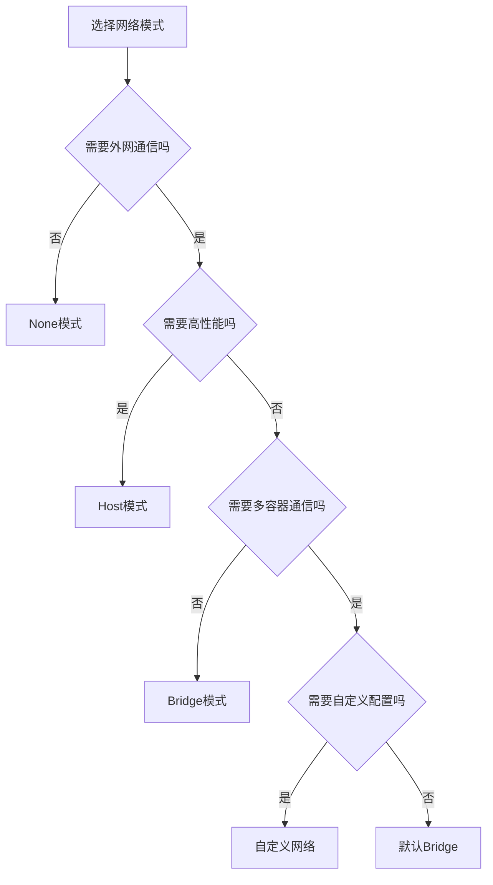

# Docker网络模式深度解析：从基础到企业级应用

## 情境(Situation)

在容器化技术广泛应用的今天，Docker已经成为企业级应用部署的标准工具。然而，Docker网络配置往往是许多SRE工程师的痛点。不同的网络模式适用于不同的场景，选择合适的网络配置直接影响到容器的性能、安全性和可维护性。

作为SRE工程师，我们需要深入理解Docker的网络模式，掌握网络配置的最佳实践，确保容器之间的通信顺畅、安全和高效。

## 冲突(Conflict)

在实际应用中，SRE工程师经常面临以下挑战：

- **网络隔离**：如何在保证容器隔离的同时实现容器间通信
- **性能瓶颈**：网络延迟和带宽限制影响应用性能
- **端口管理**：端口映射和冲突问题
- **多主机通信**：跨主机容器网络通信
- **安全隐患**：网络配置不当导致的安全风险

## 问题(Question)

如何选择和配置合适的Docker网络模式，以满足不同场景的需求，同时确保网络性能和安全性？

## 答案(Answer)

本文将从SRE视角出发，详细介绍Docker网络模式的工作原理、适用场景和最佳实践，提供一套完整的企业级网络配置解决方案。核心方法论基于 [SRE面试题解析：Docker的5种网络模式？](#51-docker的5种网络模式)。

---

## 一、Docker网络概述

### 1.1 网络模式对比

**Docker网络模式**：

| 模式 | 命令 | 隔离级别 | 性能 | 端口映射 | 推荐度 | 适用场景 |
|:------|:------|:----------|:------|:----------|:--------|:----------|
| **Bridge** | `--network bridge` | 高 | 中 | 需要-p | ⭐⭐⭐⭐⭐ | Web服务、数据库、默认部署 |
| **Host** | `--network host` | 低 | 高 | 无需-p | ⭐⭐⭐ | 高性能服务、监控代理 |
| **None** | `--network none` | 极高 | 零 | 无 | ⭐⭐ | 离线任务、安全沙箱 |
| **Container** | `--network container:name` | 中 | 低 | 共享目标 | ⭐⭐⭐ | Sidecar模式、日志收集器 |
| **自定义网络** | `--network mynet` | 可配置 | 中 | 需要-p | ⭐⭐⭐⭐⭐ | 微服务架构、多容器应用 |

### 1.2 网络选择流程

**网络模式选择流程**：



---

## 二、Bridge模式详解

### 2.1 工作原理

**Bridge模式**是Docker的默认网络模式，它通过创建一个虚拟网桥（docker0）来实现容器之间的通信。每个容器会获得一个独立的IP地址，并通过NAT实现与宿主机和外部网络的通信。

**网络结构**：
- 宿主机上创建docker0虚拟网桥
- 每个容器创建一对veth接口
- 容器端连接到docker0网桥
- 宿主机端作为网络接口
- 通过iptables实现NAT和端口映射

### 2.2 配置与使用

**基本使用**：

```bash
# 默认Bridge模式
docker run -d --name myapp nginx

# 端口映射
docker run -d -p 8080:80 --name myapp nginx

# 查看网络信息
docker network inspect bridge
```

**高级配置**：

```bash
# 创建自定义Bridge网络
docker network create --driver bridge --subnet 172.20.0.0/16 --gateway 172.20.0.1 mybridge

# 运行容器使用自定义Bridge
docker run -d --network mybridge --name myapp nginx

# 容器间通信（使用容器名）
docker run -d --network mybridge --name app1 nginx
docker run -d --network mybridge --name app2 busybox ping app1
```

### 2.3 优缺点分析

**优点**：
- 隔离性好，容器有独立网络环境
- 安全性高，默认不开放端口
- 配置简单，默认模式
- 容器间可通过容器名通信（自定义Bridge）

**缺点**：
- 性能略差，有NAT开销
- 需要端口映射才能从外部访问
- 网络配置有限

---

## 三、Host模式详解

### 3.1 工作原理

**Host模式**让容器直接使用宿主机的网络命名空间，容器与宿主机共享同一个网络栈。容器不会获得独立的IP地址，而是直接使用宿主机的IP地址。

**网络结构**：
- 容器共享宿主机网络命名空间
- 容器使用宿主机的IP地址
- 容器端口直接映射到宿主机
- 无NAT转换，性能最高

### 3.2 配置与使用

**基本使用**：

```bash
# Host模式
docker run -d --network host --name myapp nginx

# 查看网络信息
ip addr
```

**注意事项**：
- Windows和macOS不支持Host模式
- 端口冲突风险高
- 安全性较低，容器直接暴露在宿主机网络

### 3.3 优缺点分析

**优点**：
- 性能最高，无NAT开销
- 配置简单，无需端口映射
- 适合对网络性能要求高的场景

**缺点**：
- 隔离性差，容器与宿主机共享网络
- 端口冲突风险高
- 不支持Windows和macOS
- 安全性较低

---

## 四、None模式详解

### 4.1 工作原理

**None模式**为容器提供一个完全隔离的网络环境，容器只有一个loopback接口（127.0.0.1），没有网络连接能力。

**网络结构**：
- 容器只有lo接口
- 无网络连接能力
- 完全隔离

### 4.2 配置与使用

**基本使用**：

```bash
# None模式
docker run -d --network none --name myapp busybox sleep 3600

# 查看网络信息
docker exec myapp ip addr
```

**适用场景**：
- 离线任务处理
- 安全沙箱
- 不需要网络通信的批处理任务

### 4.3 优缺点分析

**优点**：
- 完全隔离，安全性最高
- 无网络干扰

**缺点**：
- 无网络连接能力
- 适用场景有限

---

## 五、Container模式详解

### 5.1 工作原理

**Container模式**让一个容器共享另一个容器的网络命名空间，两个容器可以共享同一个IP地址和端口空间。

**网络结构**：
- 两个容器共享网络命名空间
- 共享IP地址和端口
- 可以直接通过localhost通信

### 5.2 配置与使用

**基本使用**：

```bash
# 创建主容器
docker run -d --name main-container nginx

# 创建共享网络的容器
docker run -d --network container:main-container --name sidecar busybox sleep 3600

# 查看网络信息
docker exec sidecar ip addr
```

**适用场景**：
- Sidecar模式（日志收集、监控等）
- 多进程容器（不同进程运行在不同容器）
- 需要共享网络栈的场景

### 5.3 优缺点分析

**优点**：
- 容器间通信无需网络开销
- 配置简单
- 适合Sidecar模式

**缺点**：
- 依赖目标容器的生命周期
- 端口冲突风险
- 隔离性较差

---

## 六、自定义网络详解

### 6.1 网络驱动类型

**Docker网络驱动**：

| 驱动 | 类型 | 特点 | 适用场景 |
|:------|:------|:------|:----------|
| **bridge** | 内置 | 单主机网络 | 单主机多容器应用 |
| **overlay** | 内置 | 多主机网络 | 跨主机容器通信 |
| **macvlan** | 内置 | 物理网络直接连接 | 需要直接访问物理网络的场景 |
| **ipvlan** | 内置 | L2/L3网络 | 高级网络配置 |
| **host** | 内置 | 共享宿主机网络 | 高性能场景 |
| **none** | 内置 | 无网络 | 完全隔离场景 |
| **第三方驱动** | 外部 | 各种特殊场景 | 特定网络需求 |

### 6.2 自定义Bridge网络

**创建与配置**：

```bash
# 创建自定义Bridge网络
docker network create \
  --driver bridge \
  --subnet 172.30.0.0/16 \
  --gateway 172.30.0.1 \
  --ip-range 172.30.1.0/24 \
  mybridge

# 运行容器
docker run -d --network mybridge --name app1 nginx
docker run -d --network mybridge --name app2 busybox

# 容器间通信（使用容器名）
docker exec app2 ping app1
```

**优势**：
- 自动DNS解析（容器名→IP）
- 更好的隔离性
- 可自定义网络配置
- 支持容器间通信

### 6.3 Overlay网络

**创建与配置**：

```bash
# 初始化Swarm集群
docker swarm init

# 创建Overlay网络
docker network create --driver overlay --attachable myoverlay

# 在不同节点运行容器
docker service create --network myoverlay --name app nginx

# 跨节点容器通信
docker run -it --network myoverlay busybox ping app
```

**适用场景**：
- 跨主机容器通信
- Docker Swarm集群
- 微服务架构

### 6.4 Macvlan网络

**创建与配置**：

```bash
# 创建Macvlan网络
docker network create \
  --driver macvlan \
  --subnet 192.168.1.0/24 \
  --gateway 192.168.1.1 \
  --opt parent=eth0 \
  mymacvlan

# 运行容器
docker run -d --network mymacvlan --name app nginx
```

**适用场景**：
- 需要直接访问物理网络的场景
- 遗留应用迁移
- 网络设备管理

---

## 七、网络性能优化

### 7.1 网络性能对比

**不同网络模式性能**：

| 模式 | 延迟 | 吞吐量 | CPU使用率 | 适用场景 |
|:------|:------|:------|:----------|:----------|
| **Host** | 最低 | 最高 | 最低 | 高性能服务 |
| **Container** | 低 | 高 | 低 | Sidecar模式 |
| **自定义Bridge** | 中 | 中 | 中 | 一般应用 |
| **默认Bridge** | 中高 | 中 | 中高 | 默认部署 |
| **Overlay** | 高 | 低 | 高 | 跨主机通信 |

### 7.2 优化策略

**网络栈优化**：

```bash
# 调整内核参数
cat >> /etc/sysctl.conf << EOF
# 网络优化
net.core.somaxconn = 65535
net.ipv4.tcp_max_syn_backlog = 65535
net.ipv4.tcp_fin_timeout = 30
net.ipv4.tcp_tw_reuse = 1
net.ipv4.ip_local_port_range = 1024 65535
EOF

# 应用参数
sysctl -p
```

**Docker网络配置优化**：

```bash
# 禁用IPV6（如果不需要）
docker daemon --ipv6=false

# 调整默认MTU
docker daemon --mtu=1400

# 使用更快的网络驱动
docker network create --driver bridge --opt com.docker.network.bridge.enable_icc=true mynetwork
```

**容器网络优化**：

```bash
# 使用Host模式提高性能
docker run --network host --name high-performance-app nginx

# 调整容器网络参数
docker run --sysctl net.core.somaxconn=65535 --name optimized-app nginx
```

### 7.3 网络监控

**监控工具**：
- **Docker stats**：容器网络使用情况
- **Netdata**：实时网络监控
- **Prometheus + Grafana**：网络指标监控
- **tcpdump**：网络数据包分析

**关键监控指标**：
- 网络吞吐量
- 网络延迟
- 连接数
- 丢包率
- 网络错误

---

## 八、网络安全

### 8.1 安全最佳实践

**网络隔离**：
- 使用自定义网络隔离不同应用
- 限制容器间通信
- 最小化网络暴露

**访问控制**：
- 使用防火墙限制网络访问
- 配置网络策略
- 限制容器网络权限

**加密通信**：
- 使用TLS加密容器间通信
- 配置SSL证书
- 避免明文传输敏感数据

### 8.2 安全配置

**Docker网络安全配置**：

```bash
# 创建隔离网络
docker network create --driver bridge --opt com.docker.network.bridge.enable_icc=false isolated-net

# 限制容器网络访问
docker run --network isolated-net --name secure-app nginx

# 使用端口映射限制访问
docker run -p 127.0.0.1:8080:80 --name restricted-app nginx
```

**防火墙配置**：

```bash
# iptables规则
iptables -A DOCKER-USER -s 192.168.1.0/24 -j ACCEPT
iptables -A DOCKER-USER -j DROP

# 保存规则
iptables-save > /etc/iptables/rules.v4
```

### 8.3 常见安全问题

**安全隐患**：
- 容器端口暴露到公网
- 容器间无隔离通信
- 网络配置错误导致的访问控制失效
- 明文传输敏感数据

**解决方案**：
- 使用自定义网络隔离应用
- 配置适当的端口映射
- 实施网络访问控制
- 使用TLS加密通信
- 定期安全审计

---

## 九、企业级网络解决方案

### 9.1 Docker Swarm网络

**Swarm网络模式**：
- **ingress**：服务发现和负载均衡
- **overlay**：跨节点容器通信
- **host**：高性能场景
- **bridge**：单节点网络

**配置示例**：

```bash
# 初始化Swarm
docker swarm init

# 创建Overlay网络
docker network create --driver overlay --attachable my-swarm-network

# 部署服务
docker service create \
  --name web \
  --network my-swarm-network \
  --replicas 3 \
  --publish 80:80 \
  nginx
```

### 9.2 Kubernetes网络

**Kubernetes网络模型**：
- **Pod网络**：Pod内容器共享网络
- **Service网络**：服务发现和负载均衡
- **Ingress**：外部访问入口

**常用网络插件**：
- **Calico**：基于BGP的网络方案
- **Flannel**：简单高效的网络方案
- **Cilium**：基于eBPF的网络方案
- **Weave Net**：简单易用的网络方案

### 9.3 多容器应用网络设计

**微服务架构网络设计**：
- 服务间通信：使用自定义网络
- 外部访问：使用负载均衡
- 服务发现：使用DNS或服务注册表
- 网络隔离：按服务类型隔离网络

**示例架构**：

```yaml
# Docker Compose网络配置
version: "3.8"
services:
  web:
    image: nginx
    networks:
      - frontend
    ports:
      - "80:80"
  api:
    image: api-server
    networks:
      - frontend
      - backend
  db:
    image: mysql
    networks:
      - backend
    volumes:
      - db_data:/var/lib/mysql

networks:
  frontend:
    driver: bridge
  backend:
    driver: bridge
    internal: true

volumes:
  db_data:
```

---

## 十、网络故障排查

### 10.1 常见网络问题

| 问题 | 可能原因 | 解决方案 |
|:------|:------|:----------|
| 容器无法访问外网 | DNS配置错误、防火墙阻止 | 检查DNS配置、查看iptables规则 |
| 容器间通信失败 | 不在同一网络、网络隔离 | 确保容器在同一网络、检查网络配置 |
| 端口映射失效 | 端口冲突、防火墙阻止 | 检查端口占用、查看防火墙规则 |
| 网络性能差 | 网络模式选择不当、配置问题 | 选择合适的网络模式、优化网络配置 |
| 跨主机通信失败 | 网络配置错误、防火墙阻止 | 检查Overlay网络配置、查看防火墙规则 |

### 10.2 排查工具

**网络诊断工具**：
- **ping**：检查网络连通性
- **traceroute**：跟踪网络路径
- **netstat**：查看网络连接
- **ss**：查看网络套接字
- **tcpdump**：网络数据包分析
- **curl**：HTTP请求测试
- **dig**：DNS查询

**Docker网络命令**：
- `docker network ls`：查看网络列表
- `docker network inspect`：查看网络详情
- `docker network connect`：连接容器到网络
- `docker network disconnect`：断开容器网络
- `docker network prune`：清理未使用网络

### 10.3 排查步骤

**网络问题排查流程**：
1. **检查容器状态**：`docker ps`
2. **检查网络配置**：`docker network inspect`
3. **测试容器间通信**：`docker exec container ping other-container`
4. **测试外部网络**：`docker exec container ping google.com`
5. **检查端口映射**：`docker port container`
6. **查看网络日志**：`docker logs container`
7. **分析网络数据包**：`docker exec container tcpdump`

---

## 十一、最佳实践总结

### 11.1 核心原则

**Docker网络核心原则**：

1. **选择合适的网络模式**：根据应用需求选择网络模式
2. **网络隔离**：使用自定义网络隔离不同应用
3. **性能优化**：高并发场景使用Host模式
4. **安全第一**：限制网络访问，使用加密通信
5. **监控与管理**：实时监控网络状态，定期维护

### 11.2 配置建议

**生产环境配置清单**：
- [ ] 根据应用需求选择合适的网络模式
- [ ] 使用自定义网络隔离不同应用
- [ ] 配置适当的端口映射
- [ ] 实施网络访问控制
- [ ] 优化网络性能参数
- [ ] 监控网络状态
- [ ] 定期备份网络配置
- [ ] 制定网络故障应急预案

**推荐命令**：
- **创建网络**：`docker network create --driver bridge --subnet 172.20.0.0/16 mynetwork`
- **运行容器**：`docker run --network mynetwork --name app nginx`
- **查看网络**：`docker network inspect mynetwork`
- **清理网络**：`docker network prune`
- **监控网络**：`docker stats`

### 11.3 经验总结

**常见误区**：
- **使用默认Bridge网络**：隔离性差，不适合多应用场景
- **过度使用Host模式**：安全性低，端口冲突风险高
- **忽略网络监控**：无法及时发现网络问题
- **网络配置不当**：导致性能问题或安全隐患
- **缺乏网络规划**：容器网络混乱，难以管理

**成功经验**：
- **标准化网络配置**：建立统一的网络命名和配置规范
- **网络隔离**：按应用类型和安全级别隔离网络
- **性能优化**：根据应用特点选择合适的网络模式
- **安全加固**：实施网络访问控制和加密通信
- **监控与告警**：建立网络监控体系，及时发现问题

---

## 总结

Docker网络是容器化应用的重要组成部分，选择合适的网络模式和配置直接影响到应用的性能、安全性和可维护性。通过本文介绍的最佳实践，您可以构建一个高效、安全、可靠的容器网络环境。

**核心要点**：

1. **网络模式选择**：根据应用需求选择合适的网络模式
2. **网络隔离**：使用自定义网络隔离不同应用
3. **性能优化**：高并发场景使用Host模式，一般场景使用自定义Bridge
4. **安全配置**：限制网络访问，使用加密通信
5. **企业级解决方案**：Docker Swarm和Kubernetes网络配置
6. **故障排查**：掌握网络诊断工具和排查流程
7. **监控与管理**：建立网络监控体系，定期维护

通过遵循这些最佳实践，我们可以确保容器网络的稳定运行，为企业级应用提供可靠的网络基础。

> **延伸学习**：更多面试相关的Docker网络知识，请参考 [SRE面试题解析：Docker的5种网络模式？](#51-docker的5种网络模式)。

---

## 参考资料

- [Docker官方文档 - 网络](https://docs.docker.com/network/)
- [Docker官方文档 - Bridge网络](https://docs.docker.com/network/bridge/)
- [Docker官方文档 - Overlay网络](https://docs.docker.com/network/overlay/)
- [Docker官方文档 - Macvlan网络](https://docs.docker.com/network/macvlan/)
- [Docker网络模式详解](https://docs.docker.com/network/#network-drivers)
- [Kubernetes网络模型](https://kubernetes.io/docs/concepts/services-networking/)
- [Calico网络方案](https://www.projectcalico.org/)
- [Flannel网络方案](https://github.com/coreos/flannel)
- [Cilium网络方案](https://cilium.io/)
- [Weave Net网络方案](https://www.weave.works/oss/net/)
- [Linux网络性能优化](https://www.kernel.org/doc/Documentation/networking/)
- [容器网络安全最佳实践](https://docs.docker.com/engine/security/)
- [Docker Swarm网络](https://docs.docker.com/engine/swarm/networking/)
- [容器网络故障排查](https://docs.docker.com/config/containers/runmetrics/)
- [网络性能测试工具](https://github.com/alexandershov/network-performance-tests)
- [Docker网络性能优化](https://www.docker.com/blog/container-networking-performance/)
- [企业级容器网络设计](https://www.redhat.com/en/topics/containers/container-networking)
- [微服务架构网络设计](https://microservices.io/patterns/microservices.html)