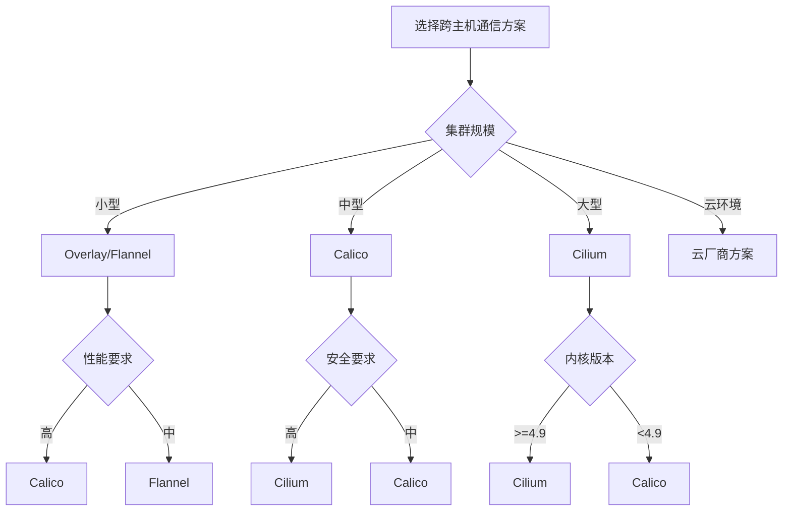

# Docker跨主机通信全攻略：从Overlay到eBPF

## 情境(Situation)

在容器化技术广泛应用的今天，单节点Docker已经无法满足企业级应用的需求。随着业务规模的增长，容器需要跨主机部署，如何实现容器之间的跨主机通信成为SRE工程师必须解决的问题。

作为SRE工程师，我们需要掌握各种Docker跨主机通信方案的工作原理、配置方法和最佳实践，确保容器在分布式环境中能够高效、安全地通信。

## 冲突(Conflict)

在实际应用中，SRE工程师经常面临以下挑战：

- **性能问题**：跨主机通信延迟高，影响应用性能
- **配置复杂**：网络配置繁琐，难以维护
- **扩展性差**：随着节点增加，网络管理难度增大
- **安全性**：跨主机网络存在安全隐患
- **兼容性**：不同环境下的网络方案选择

## 问题(Question)

如何选择和配置合适的Docker跨主机通信方案，确保容器在分布式环境中高效、安全地通信？

## 答案(Answer)

本文将从SRE视角出发，详细介绍Docker跨主机通信的各种方案，提供一套完整的企业级网络配置解决方案。核心方法论基于 [SRE面试题解析：docker容器之间跨主机的通讯怎么做的？](#54-docker容器之间跨主机的通讯怎么做的)。

---

## 一、Docker跨主机通信概述

### 1.1 方案对比

**Docker跨主机通信方案**：

| 方案 | 性能 | 复杂性 | 扩展性 | 安全性 | 推荐度 | 适用场景 |
|:------|:------|:------|:------|:------|:--------|:----------|
| **二层网络** | 高 | 高 | 低 | 中 | ⭐⭐ | 小型环境、性能要求高 |
| **三层网络** | 高 | 中 | 低 | 中 | ⭐⭐⭐ | 小型环境、简单部署 |
| **Overlay** | 中 | 低 | 中 | 中 | ⭐⭐⭐⭐ | Swarm集群、中型环境 |
| **Flannel** | 中 | 低 | 中 | 中 | ⭐⭐⭐ | 小型K8s集群、简单网络 |
| **Calico** | 高 | 中 | 高 | 高 | ⭐⭐⭐⭐⭐ | 中大型环境、企业级应用 |
| **Cilium** | 最高 | 高 | 高 | 高 | ⭐⭐⭐⭐ | 大型环境、高性能要求 |
| **云厂商方案** | 中 | 低 | 高 | 高 | ⭐⭐⭐⭐ | 云环境部署 |

### 1.2 选择流程

**跨主机通信方案选择流程**：



---

## 二、二层网络

### 2.1 工作原理

**二层网络**通过创建虚拟网桥，将不同主机上的容器连接到同一个二层网络中，实现容器之间的直接通信。

**工作原理**：
- 在每个主机上创建虚拟网桥
- 将容器连接到虚拟网桥
- 配置VLAN或直接桥接到物理网络
- 容器获得同一网段的IP地址
- 通过MAC地址直接通信

### 2.2 配置方法

**基本配置**：

```bash
# 主机A
# 创建网桥
brctl addbr br0

# 桥接物理网卡
brctl addif br0 eth1

# 配置IP地址
ifconfig br0 10.0.0.101/24 up

# 启用IP转发
echo 1 > /proc/sys/net/ipv4/ip_forward

# 主机B
# 创建网桥
brctl addbr br0

# 桥接物理网卡
brctl addif br0 eth1

# 配置IP地址
ifconfig br0 10.0.0.102/24 up

# 启用IP转发
echo 1 > /proc/sys/net/ipv4/ip_forward
```

**Docker配置**：

```bash
# 创建网络
docker network create --driver bridge --subnet 10.0.1.0/24 --gateway 10.0.1.1 bridge-net

# 运行容器
docker run -d --name container1 --network bridge-net nginx
docker run -d --name container2 --network bridge-net nginx
```

### 2.3 优缺点分析

**优点**：
- 性能高，接近物理网络速度
- 配置简单，直接使用MAC地址通信
- 无需额外封装，延迟低

**缺点**：
- 扩展性差，需要VLAN支持
- 广播域大，可能导致网络拥塞
- 跨机房部署困难
- 安全性较低，同一网段的容器可直接通信

---

## 三、三层网络

### 3.1 工作原理

**三层网络**通过在不同主机之间添加路由规则，实现容器之间的跨主机通信。

**工作原理**：
- 每个主机上的容器使用不同的网段
- 在主机之间添加路由规则
- 容器通过路由表找到目标容器所在的主机
- 主机之间通过三层网络通信

### 3.2 配置方法

**基本配置**：

```bash
# 主机A（IP：10.0.0.101）
# 容器网段：172.17.0.0/16
# 添加到主机B容器网段的路由
route add -net 172.27.0.0/16 gw 10.0.0.102

# 主机B（IP：10.0.0.102）
# 容器网段：172.27.0.0/16
# 添加到主机A容器网段的路由
route add -net 172.17.0.0/16 gw 10.0.0.101

# 启用IP转发
echo 1 > /proc/sys/net/ipv4/ip_forward
```

**Docker配置**：

```bash
# 主机A
docker network create --driver bridge --subnet 172.17.0.0/16 --gateway 172.17.0.1 bridge-net

# 主机B
docker network create --driver bridge --subnet 172.27.0.0/16 --gateway 172.27.0.1 bridge-net
```

### 3.3 优缺点分析

**优点**：
- 配置简单，无需特殊网络设备
- 性能较高，无额外封装开销
- 广播域小，网络更稳定

**缺点**：
- 需要手动维护路由表
- 扩展性差，节点增加时需要手动添加路由
- 跨网络环境部署困难
- 安全性较低，依赖网络层安全措施

---

## 四、Overlay网络

### 4.1 工作原理

**Overlay网络**是Docker Swarm默认的跨主机通信方案，基于VXLAN技术实现。

**工作原理**：
- 使用VXLAN隧道技术封装数据包
- 在UDP上传输二层以太网帧
- 自动管理网络地址和路由
- 支持服务发现和负载均衡

### 4.2 配置方法

**基本配置**：

```bash
# 初始化Swarm集群
# 主节点
docker swarm init --advertise-addr 10.0.0.101

# 其他节点加入
docker swarm join --token <token> 10.0.0.101:2377

# 创建Overlay网络
docker network create -d overlay --attachable my_overlay

# 运行服务
docker service create --name web --network my_overlay -p 80:80 nginx

# 运行独立容器
docker run -d --name container1 --network my_overlay nginx
docker run -d --name container2 --network my_overlay nginx
```

**高级配置**：

```bash
# 创建加密的Overlay网络
docker network create -d overlay --opt encrypted my_overlay_encrypted

# 创建带子网的Overlay网络
docker network create -d overlay --subnet 10.0.0.0/24 --gateway 10.0.0.1 my_overlay_subnet
```

### 4.3 优缺点分析

**优点**：
- 配置简单，Docker Swarm自动管理
- 支持服务发现和负载均衡
- 跨主机通信无需手动配置
- 支持加密通信

**缺点**：
- VXLAN封装开销，性能略差
- 依赖Docker Swarm集群
- 大规模集群性能可能下降
- 网络故障排查较复杂

---

## 五、Flannel

### 5.1 工作原理

**Flannel**是Kubernetes集群中常用的网络插件，也可用于Docker跨主机通信。

**工作原理**：
- 为每个主机分配一个子网
- 使用UDP、VXLAN或Host-gw模式传输数据包
- 通过etcd存储网络配置和子网信息
- 自动管理路由表

### 5.2 配置方法

**基本配置**：

```bash
# 安装etcd
apt-get install etcd

# 启动etcd
systemctl start etcd

# 安装Flannel
wget https://github.com/coreos/flannel/releases/download/v0.20.2/flannel-v0.20.2-linux-amd64.tar.gz
tar -xzf flannel-v0.20.2-linux-amd64.tar.gz
cp flannel-v0.20.2-linux-amd64/flanneld /usr/local/bin/

# 配置Flannel
cat > /etc/flannel/config.json << EOF
{
  "Network": "10.0.0.0/16",
  "SubnetLen": 24,
  "Backend": {
    "Type": "vxlan"
  }
}
EOF

# 写入etcd
etcdctl put /coreos.com/network/config < /etc/flannel/config.json

# 启动Flannel
flanneld --etcd-endpoints=http://localhost:2379

# 配置Docker使用Flannel网络
cat > /etc/docker/daemon.json << EOF
{
  "bip": "10.0.1.1/24",
  "mtu": 1450
}
EOF

systemctl restart docker
```

**不同后端配置**：

```bash
# UDP后端
{
  "Network": "10.0.0.0/16",
  "Backend": {
    "Type": "udp"
  }
}

# VXLAN后端
{
  "Network": "10.0.0.0/16",
  "Backend": {
    "Type": "vxlan"
  }
}

# Host-gw后端（性能最佳）
{
  "Network": "10.0.0.0/16",
  "Backend": {
    "Type": "host-gw"
  }
}
```

### 5.3 优缺点分析

**优点**：
- 配置简单，易于部署
- 支持多种后端模式
- 与Kubernetes集成良好
- 自动管理网络配置

**缺点**：
- 性能一般，尤其是UDP后端
- 功能相对简单，无网络策略支持
- 依赖etcd存储网络配置
- 大规模集群性能可能下降

---

## 六、Calico

### 6.1 工作原理

**Calico**是一种基于BGP协议的三层网络方案，提供高性能、可扩展的容器网络。

**工作原理**：
- 使用BGP协议在主机之间交换路由信息
- 每个容器获得一个可路由的IP地址
- 基于Linux内核的iptables实现网络策略
- 支持网络隔离和访问控制

### 6.2 配置方法

**基本配置**：

```bash
# 安装Calico
curl -O https://projectcalico.docs.tigera.io/manifests/calico.yaml
kubectl apply -f calico.yaml

# 单独使用Calico（非K8s环境）
# 安装calicoctl
curl -O https://github.com/projectcalico/calicoctl/releases/download/v3.25.0/calicoctl-linux-amd64
chmod +x calicoctl-linux-amd64
mv calicoctl-linux-amd64 /usr/local/bin/calicoctl

# 配置Calico
cat > calico.yaml << EOF
apiVersion: projectcalico.org/v3
kind: CalicoAPIConfig
metadata:

spec:
  datastoreType: "etcdv3"
  etcdEndpoints: "http://localhost:2379"
EOF

export CALICO_DATASTORE_TYPE=etcdv3
export CALICO_ETCD_ENDPOINTS=http://localhost:2379

# 初始化Calico
calicoctl create -f - << EOF
apiVersion: projectcalico.org/v3
kind: IPPool
metadata:
  name: default-ipv4-ippool
spec:
  cidr: 192.168.0.0/16
  ipipMode: Never
  natOutgoing: true
EOF

# 创建Calico网络
docker network create --driver calico --ipam-driver calico-ipam calico-net

# 运行容器
docker run -d --name container1 --network calico-net nginx
docker run -d --name container2 --network calico-net nginx
```

**网络策略配置**：

```yaml
# calico-network-policy.yaml
apiVersion: projectcalico.org/v3
kind: NetworkPolicy
metadata:
  name: allow-nginx
spec:
  selector: app == "nginx"
  ingress:
  - action: Allow
    protocol: TCP
    source:
      selector: app == "frontend"
    destination:
      ports:
      - 80
```

### 6.3 优缺点分析

**优点**：
- 高性能，基于BGP协议
- 支持网络策略，提供细粒度访问控制
- 可扩展性强，适合大型集群
- 与Kubernetes集成良好
- 支持IPv4和IPv6

**缺点**：
- 配置相对复杂
- 需要BGP支持
- 学习曲线较陡
- 依赖etcd存储配置

---

## 七、Cilium

### 7.1 工作原理

**Cilium**是基于eBPF技术的新一代容器网络方案，提供高性能、安全的网络服务。

**工作原理**：
- 使用eBPF技术在Linux内核中实现网络功能
- 支持透明的服务发现和负载均衡
- 基于身份的网络策略
- 支持Kubernetes网络策略
- 提供服务网格功能

### 7.2 配置方法

**基本配置**：

```bash
# 安装Cilium
curl -L https://github.com/cilium/cilium-cli/releases/download/v0.13.0/cilium-linux-amd64.tar.gz | tar xz
sudo mv cilium /usr/local/bin/

# 初始化Cilium（K8s环境）
cilium install

# 验证安装
cilium status

# 单独使用Cilium（非K8s环境）
# 安装Docker插件
curl -L https://github.com/cilium/cilium/releases/download/v1.13.0/cilium-linux-amd64.tar.gz | tar xz
sudo mv cilium /usr/local/bin/

# 启动Cilium守护进程
cilium agent --kvstore etcd --kvstore-opt etcd.address=http://localhost:2379

# 创建Cilium网络
docker network create --driver cilium --ipam-driver cilium cilium-net

# 运行容器
docker run -d --name container1 --network cilium-net nginx
docker run -d --name container2 --network cilium-net nginx
```

**网络策略配置**：

```yaml
# cilium-network-policy.yaml
apiVersion: cilium.io/v2
kind: CiliumNetworkPolicy
metadata:
  name: allow-nginx
spec:
  endpointSelector:
    matchLabels:
      app: nginx
  ingress:
  - fromEndpoints:
    - matchLabels:
        app: frontend
    toPorts:
    - ports:
      - port: "80"
        protocol: TCP
```

### 7.3 优缺点分析

**优点**：
- 性能最优，基于eBPF技术
- 支持细粒度网络策略
- 提供服务网格功能
- 与Kubernetes深度集成
- 支持透明的服务发现和负载均衡

**缺点**：
- 内核版本要求高（>=4.9）
- 配置复杂
- 学习曲线较陡
- 资源消耗相对较高

---

## 八、云厂商方案

### 8.1 阿里云VPC

**阿里云VPC**提供了容器服务的网络解决方案，与阿里云基础设施深度集成。

**配置方法**：

```bash
# 创建VPC
aliyun vpc CreateVpc --VpcName docker-vpc --CidrBlock 192.168.0.0/16

# 创建交换机
aliyun vpc CreateVSwitch --VpcId <vpc-id> --ZoneId cn-hangzhou-a --CidrBlock 192.168.1.0/24

# 部署ECS实例
aliyun ecs CreateInstance --ImageId <image-id> --InstanceType ecs.t5-lc1m2.small --VSwitchId <vswitch-id>

# 安装Docker
curl -fsSL https://get.docker.com | bash -s docker --mirror Aliyun

# 配置Docker使用VPC网络
docker network create --driver bridge --subnet 192.168.1.0/24 --gateway 192.168.1.1 vpc-net
```

### 8.2 AWS VPC

**AWS VPC**提供了容器服务的网络解决方案，支持ECS和EKS。

**配置方法**：

```bash
# 创建VPC
aws ec2 create-vpc --cidr-block 192.168.0.0/16

# 创建子网
aws ec2 create-subnet --vpc-id <vpc-id> --cidr-block 192.168.1.0/24 --availability-zone us-west-2a

# 部署EC2实例
aws ec2 run-instances --image-id <ami-id> --instance-type t2.micro --subnet-id <subnet-id>

# 安装Docker
sudo amazon-linux-extras install docker
sudo service docker start

# 配置Docker使用VPC网络
docker network create --driver bridge --subnet 192.168.1.0/24 --gateway 192.168.1.1 vpc-net
```

### 8.3 腾讯云VPC

**腾讯云VPC**提供了容器服务的网络解决方案，与腾讯云基础设施深度集成。

**配置方法**：

```bash
# 创建VPC
tccli vpc CreateVpc --VpcName docker-vpc --CidrBlock 192.168.0.0/16

# 创建子网
tccli vpc CreateSubnet --VpcId <vpc-id> --SubnetName docker-subnet --CidrBlock 192.168.1.0/24 --Zone ap-guangzhou-1

# 部署CVM实例
tccli cvm RunInstances --ImageId <image-id> --InstanceType S1.SMALL1 --SubnetId <subnet-id>

# 安装Docker
curl -fsSL https://get.docker.com | bash -s docker

# 配置Docker使用VPC网络
docker network create --driver bridge --subnet 192.168.1.0/24 --gateway 192.168.1.1 vpc-net
```

---

## 九、性能优化

### 9.1 性能对比

**不同网络方案性能对比**：

| 方案 | 延迟 | 吞吐量 | CPU使用率 | 适用场景 |
|:------|:------|:------|:----------|:----------|
| **二层网络** | 低 | 高 | 低 | 性能要求高的场景 |
| **三层网络** | 低 | 高 | 低 | 性能要求高的场景 |
| **Overlay** | 中 | 中 | 中 | 中等规模集群 |
| **Flannel (UDP)** | 高 | 低 | 高 | 小型集群 |
| **Flannel (VXLAN)** | 中 | 中 | 中 | 小型集群 |
| **Flannel (Host-gw)** | 低 | 高 | 低 | 同网段集群 |
| **Calico (BGP)** | 低 | 高 | 低 | 中大型集群 |
| **Cilium (eBPF)** | 最低 | 最高 | 中 | 大型集群 |

### 9.2 优化策略

**网络性能优化**：

1. **选择合适的网络方案**：根据集群规模和性能要求选择合适的网络方案
2. **调整MTU**：根据网络环境调整MTU大小，减少分片
3. **优化VXLAN**：如果使用VXLAN，调整VXLAN参数
4. **使用高性能后端**：Flannel使用Host-gw后端，Calico使用BGP
5. **调整内核参数**：优化网络相关的内核参数
6. **使用多队列网卡**：启用网卡多队列，提高并发处理能力
7. **负载均衡**：合理分配容器到不同主机，避免网络热点

**内核参数优化**：

```bash
# 网络优化参数
cat >> /etc/sysctl.conf << EOF
# 网络性能优化
net.core.somaxconn = 65535
net.ipv4.tcp_max_syn_backlog = 65535
net.ipv4.tcp_tw_reuse = 1
net.ipv4.ip_local_port_range = 1024 65535
net.core.netdev_max_backlog = 250000
net.core.rmem_default = 262144
net.core.wmem_default = 262144
net.core.rmem_max = 16777216
net.core.wmem_max = 16777216
EOF

# 应用参数
sysctl -p
```

---

## 十、安全最佳实践

### 10.1 网络安全

**网络安全最佳实践**：

1. **网络隔离**：使用网络策略隔离不同应用
2. **访问控制**：配置细粒度的网络访问控制
3. **加密通信**：使用TLS加密容器间通信
4. **防火墙规则**：配置适当的防火墙规则
5. **网络监控**：监控网络流量，发现异常行为
6. **定期审计**：定期审计网络配置和访问控制

**Calico网络策略示例**：

```yaml
apiVersion: projectcalico.org/v3
kind: NetworkPolicy
metadata:
  name: default-deny
spec:
  selector: all()
  ingress:
  - action: Deny

---

apiVersion: projectcalico.org/v3
kind: NetworkPolicy
metadata:
  name: allow-web
spec:
  selector: app == "web"
  ingress:
  - action: Allow
    protocol: TCP
    destination:
      ports:
      - 80
      - 443

---

apiVersion: projectcalico.org/v3
kind: NetworkPolicy
metadata:
  name: allow-db
spec:
  selector: app == "db"
  ingress:
  - action: Allow
    protocol: TCP
    source:
      selector: app == "web"
    destination:
      ports:
      - 3306
```

### 10.2 安全配置

**安全配置建议**：

1. **使用命名空间隔离**：在Kubernetes中使用命名空间隔离不同应用
2. **限制网络访问**：只允许必要的网络访问
3. **使用服务账户**：为容器分配最小权限的服务账户
4. **启用网络策略**：在支持的网络方案中启用网络策略
5. **定期更新**：定期更新网络插件和相关组件
6. **安全审计**：定期进行网络安全审计

---

## 十一、监控与故障排查

### 11.1 监控工具

**网络监控工具**：
- **Prometheus + Grafana**：监控网络性能和状态
- **Calico Monitor**：监控Calico网络状态
- **Cilium Hubble**：监控Cilium网络状态
- **Netdata**：实时网络监控
- **tcpdump**：网络数据包分析
- **ping**：网络连通性测试
- **traceroute**：网络路径分析

**Prometheus监控配置**：

```yaml
# prometheus.yml
scrape_configs:
  - job_name: 'docker-network'
    static_configs:
      - targets: ['localhost:9100']
    metrics_path: /metrics
    scrape_interval: 15s
```

### 11.2 故障排查

**常见网络问题**：

| 问题 | 可能原因 | 解决方案 |
|:------|:------|:----------|
| 容器无法跨主机通信 | 网络配置错误 | 检查网络配置和路由表 |
| 通信延迟高 | 网络方案选择不当 | 选择性能更好的网络方案 |
| 网络不通 | 防火墙规则阻止 | 检查防火墙规则 |
| 容器IP冲突 | IP地址分配问题 | 检查IP地址分配配置 |
| 网络插件故障 | 网络插件配置错误 | 检查网络插件日志 |

**排查步骤**：
1. **检查网络连接**：使用ping测试容器间连通性
2. **检查网络配置**：查看网络配置和路由表
3. **检查防火墙**：检查主机和容器的防火墙规则
4. **检查网络插件**：查看网络插件日志和状态
5. **分析网络流量**：使用tcpdump分析网络数据包
6. **检查DNS**：检查容器DNS配置
7. **重启网络服务**：尝试重启网络相关服务

**排查命令**：

```bash
# 测试容器间连通性
docker exec container1 ping container2

# 查看网络配置
docker network inspect <network-name>

# 查看容器IP
docker inspect container1 | grep IPAddress

# 查看路由表
docker exec container1 ip route

# 查看防火墙规则
iptables -vnL

# 分析网络流量
docker exec container1 tcpdump -i eth0

# 查看网络插件日志
journalctl -u calico-node
```

---

## 十二、最佳实践总结

### 12.1 核心原则

**Docker跨主机通信核心原则**：

1. **选择合适的网络方案**：根据集群规模、性能要求和技术栈选择合适的网络方案
2. **性能优先**：在满足业务需求的前提下，优先选择性能更好的网络方案
3. **安全性**：实施网络隔离和访问控制，保障网络安全
4. **可扩展性**：选择可扩展的网络方案，适应业务增长
5. **可维护性**：选择易于配置和维护的网络方案
6. **监控与告警**：建立网络监控体系，及时发现和解决问题
7. **备份与恢复**：定期备份网络配置，制定故障恢复方案

### 12.2 配置建议

**生产环境配置清单**：
- [ ] 根据集群规模选择合适的网络方案
- [ ] 配置网络插件的高可用
- [ ] 实施网络隔离和访问控制
- [ ] 优化网络性能参数
- [ ] 建立网络监控体系
- [ ] 定期备份网络配置
- [ ] 制定网络故障应急预案
- [ ] 定期进行网络安全审计

**推荐配置**：
- **小型集群**（<10节点）：Overlay或Flannel
- **中型集群**（10-100节点）：Calico
- **大型集群**（>100节点）：Cilium
- **云环境**：云厂商方案

### 12.3 经验总结

**常见误区**：
- **选择不当**：选择不适合业务需求的网络方案
- **配置错误**：网络配置不当导致通信失败
- **忽视安全**：未实施网络隔离和访问控制
- **监控不足**：缺乏网络监控，无法及时发现问题
- **维护困难**：网络配置复杂，难以维护

**成功经验**：
- **方案评估**：在选择网络方案前进行充分评估和测试
- **标准化配置**：建立统一的网络配置标准
- **自动化管理**：使用自动化工具管理网络配置
- **定期维护**：定期检查和更新网络配置
- **持续优化**：根据业务需求和性能数据持续优化网络配置

---

## 总结

Docker跨主机通信是容器化环境中的重要组成部分，选择合适的网络方案对系统性能和安全性至关重要。通过本文介绍的最佳实践，您可以构建一个高效、安全、可扩展的容器网络环境。

**核心要点**：

1. **方案选择**：根据集群规模和性能要求选择合适的网络方案
2. **性能优化**：选择性能更好的网络方案和配置
3. **安全配置**：实施网络隔离和访问控制
4. **监控与维护**：建立网络监控体系，定期维护
5. **故障排查**：掌握网络故障排查方法和工具
6. **最佳实践**：遵循行业最佳实践，确保网络稳定运行

通过遵循这些最佳实践，我们可以确保容器在分布式环境中高效、安全地通信，为业务应用提供可靠的网络基础。

> **延伸学习**：更多面试相关的Docker跨主机通信知识，请参考 [SRE面试题解析：docker容器之间跨主机的通讯怎么做的？](#54-docker容器之间跨主机的通讯怎么做的)。

---

## 参考资料

- [Docker官方文档 - 网络](https://docs.docker.com/network/)
- [Docker Swarm网络](https://docs.docker.com/engine/swarm/networking/)
- [Flannel官方文档](https://github.com/flannel-io/flannel)
- [Calico官方文档](https://projectcalico.docs.tigera.io/)
- [Cilium官方文档](https://docs.cilium.io/en/stable/)
- [Kubernetes网络模型](https://kubernetes.io/docs/concepts/services-networking/)
- [VXLAN技术详解](https://tools.ietf.org/html/rfc7348)
- [BGP协议详解](https://tools.ietf.org/html/rfc4271)
- [eBPF技术详解](https://ebpf.io/)
- [容器网络性能测试](https://github.com/cloudnative/networking-perf-tests)
- [Docker网络最佳实践](https://docs.docker.com/network/#network-drivers)
- [Kubernetes网络插件对比](https://kubernetes.io/docs/concepts/cluster-administration/networking/)
- [云厂商网络解决方案](https://aws.amazon.com/ecs/features/)
- [网络安全最佳实践](https://www.cisecurity.org/cis-benchmarks/)
- [网络监控工具](https://prometheus.io/)
- [容器网络故障排查](https://docs.docker.com/config/containers/runmetrics/)
- [企业级容器网络设计](https://www.redhat.com/en/topics/containers/container-networking)
- [微服务架构网络设计](https://microservices.io/patterns/microservices.html)