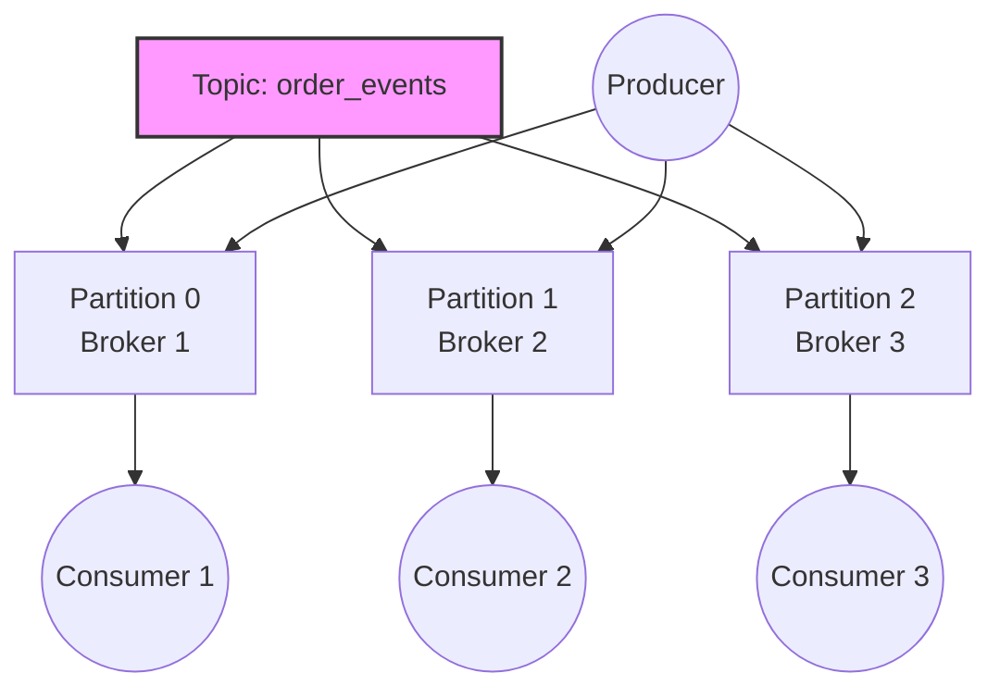

# Kafka 分区与副本：生产环境最佳实践指南

在分布式消息系统设计中，Apache Kafka 的**分区（Partition）**和**副本（Replica）**机制是实现高吞吐、高可用和容错的核心支柱。在真实复杂的生产环境中，仅了解概念是远远不够的。不合理的配置往往会导致数据倾斜、集群雪崩甚至严重的数据丢失。

本文将从“为什么需要（Why）”、“是什么（What）”以及“生产环境如何做（How）”的黄金圈法则出发，带你深度拆解分区与副本机制，并提供可直接落地到生产环境的代码与配置指南。

---

## 一、分区（Partition）：实现高吞吐的基石

### 1. 为什么需要分区？（Why & What）

如果一个 Topic 的数据只存储在一台机器上，吞吐量必然受限于单机的磁盘 I/O 和网络带宽。Kafka 通过将 Topic 物理划分为多个 Partition，使得数据可以分散存储在不同的 Broker 上，从而实现了**水平扩展**。



**特点与优势（FAB分析）**：
- **Features（特点）**：每个 Partition 是一个追加写入的有序日志。
- **Advantages（优势）**：允许多个 Producer 和 Consumer 并发读写不同的 Partition。
- **Benefits（利益）**：打破单机性能瓶颈，实现极高吞吐量。

### 2. 生产环境最佳实践（How）

#### 最佳实践 1：合理计算并控制分区数
分区数决定了并发度，但过多的分区会导致元数据过大、Controller 选举变慢以及文件句柄耗尽。
- **计算公式**：目标吞吐量为 `T`，单 Producer 吞吐 `P`，单 Consumer 吞吐 `C`。初始分区数 `N = max(T/P, T/C)`。
- **红线指标**：单台 Broker 上的总分区数建议严格控制在 **2000-4000** 个以内。

#### 最佳实践 2：避免数据倾斜（代码级控制）
如果所有消息都挤在少数几个 Partition 中，会导致个别 Broker 负载打满。为了保证相同实体（如同一个 UserID 或 OrderID）的消息顺序，我们通常在 Producer 侧通过 Key 进行路由。

**Java Producer 代码示例：使用 Key 进行 Hash 路由**
```java
Properties props = new Properties();
props.put(ProducerConfig.BOOTSTRAP_SERVERS_CONFIG, "broker1:9092,broker2:9092");
props.put(ProducerConfig.KEY_SERIALIZER_CLASS_CONFIG, StringSerializer.class.getName());
props.put(ProducerConfig.VALUE_SERIALIZER_CLASS_CONFIG, StringSerializer.class.getName());

KafkaProducer<String, String> producer = new KafkaProducer<>(props);

// 业务场景：保证同一订单(OrderId)的状态变更消息发送到同一个Partition
String orderId = "ORD-20260505-1001";
String eventPayload = "{\"status\": \"PAID\"}";

// 传入 orderId 作为 Key。Kafka 默认使用 murmur2 算法对 Key 计算 Hash 后取模分配 Partition
ProducerRecord<String, String> record = new ProducerRecord<>("order_events", orderId, eventPayload);

producer.send(record, (metadata, exception) -> {
    if (exception == null) {
        System.out.printf("发送成功: Partition=%d, Offset=%d%n", metadata.partition(), metadata.offset());
    } else {
        exception.printStackTrace();
    }
});
```

#### 最佳实践 3：热点分区动态重分配（运维操作）
如果集群出现负载不均（例如新加入 Broker 节点），必须使用内置脚本手动迁移 Partition。这在生产环境中是常规 SRE 操作。

**步骤 1：编写目标迁移计划 JSON (`topics-to-move.json`)**
```json
{
  "version": 1,
  "topics": [
    { "topic": "order_events" }
  ]
}
```

**步骤 2：生成重分配方案**
```bash
# 指定要把 topic 均匀分配到 broker 1, 2, 3, 4 上
bin/kafka-reassign-partitions.sh --bootstrap-server localhost:9092 \
  --topics-to-move-json-file topics-to-move.json \
  --broker-list "1,2,3,4" \
  --generate
```

**步骤 3：执行并限流（关键！）**
生产环境执行迁移**必须**限制网络带宽（如限速 50MB/s），否则迁移引发的巨大网络流量会冲垮生产业务。
```bash
# 执行重分配，并限制传输带宽为 50MB/s (50000000 bytes/sec)
bin/kafka-reassign-partitions.sh --bootstrap-server localhost:9092 \
  --reassignment-json-file reassignment-plan.json \
  --execute \
  --throttle 50000000
```

---

## 二、副本（Replica）：保障高可用的防线

### 1. 为什么需要副本？（Why & What）

分布式系统随时可能发生硬件故障。Kafka 为每个 Partition 维护了多个 Replica。
- **Leader Replica**：负责处理所有的读写请求。
- **Follower Replica**：单纯从 Leader 异步拉取数据进行备份。

当 Leader 宕机时，Kafka 的 Controller 会从 ISR（In-Sync Replicas，与 Leader 保持同步的副本集合）中迅速选举出一个新的 Leader，实现故障自动转移（Failover）。

```mermaid
graph LR
    subgraph Broker 1 (Rack A)
        L[Partition 0: Leader]
    end
    subgraph Broker 2 (Rack B)
        F1[Partition 0: Follower 1]
    end
    subgraph Broker 3 (Rack C)
        F2[Partition 0: Follower 2]
    end
    L -->|异步复制| F1
    L -->|异步复制| F2
    Client((Client)) <-->|读写请求| L
```

### 2. 生产环境最佳实践（How）

#### 最佳实践 1：金融级防丢数据配置（Broker & Producer 联动）
要保证数据绝对不丢失，必须在 Broker 和 Producer 侧同时进行强一致性配置。

**Broker 端配置 (`server.properties`)**：
```properties
# 强制所有新建Topic默认为3副本。生产环境绝对不可为1。
default.replication.factor=3

# 最小同步副本数设为2。
# 意味着至少要有2个副本（Leader + 1个Follower）写入成功，才算成功。
min.insync.replicas=2

# 防止从落后太多的副本中选举Leader，宁可短暂不可用，也不可丢失数据
unclean.leader.election.enable=false
```

**Producer 端配置（代码级别）**：
```java
Properties props = new Properties();
// 等待所有ISR集合中的副本确认。配合 min.insync.replicas=2 使用，是最高防丢级别。
props.put(ProducerConfig.ACKS_CONFIG, "all");

// 开启幂等性，防止网络抖动导致的重试引起数据重复（Kafka 3.0起默认开启）
props.put(ProducerConfig.ENABLE_IDEMPOTENCE_CONFIG, "true");

// 失败无限重试（交由 delivery.timeout.ms 控制整体超时）
props.put(ProducerConfig.RETRIES_CONFIG, Integer.MAX_VALUE);
// 等待服务器响应的最大时间
props.put(ProducerConfig.REQUEST_TIMEOUT_MS_CONFIG, "30000");
```

#### 最佳实践 2：开启机架感知（Rack Awareness）
如果你的 Kafka 集群跨机房或跨可用区（AZ）部署，默认的副本分配可能会把 3 个副本恰好放在了同一个机架上。一旦机架断电，该 Partition 将直接瘫痪。

**配置方法**：
在每台 Broker 的 `server.properties` 中，显式指定其物理位置：
```properties
# 在 AZ-A 上的 Broker 配置：
broker.rack=us-east-1a

# 在 AZ-B 上的 Broker 配置：
# broker.rack=us-east-1b
```
**优势**：Kafka 内部的算法会强制将同一个 Partition 的不同 Replica 分发到不同 `broker.rack` 的节点上，从而抵抗机房级或机架级灾难。

---

## 三、生产环境监控与告警策略（SRE 视角）

再完美的配置也需要实时监控的兜底。以下是 SRE 在生产环境中必须配置的 Prometheus 告警规则。

**1. 核心指标：`UnderReplicatedPartitions`**
这是 Kafka 集群健康度的晴雨表。正常情况下必须为 0。如果大于 0，说明有副本掉队，集群正处于降级状态。

**Prometheus 告警规则配置示例**：
```yaml
groups:
- name: KafkaAlerts
  rules:
  - alert: KafkaUnderReplicatedPartitions
    # JMX 暴露的指标名称
    expr: kafka_server_replicamanager_underreplicatedpartitions > 0
    for: 5m
    labels:
      severity: critical
    annotations:
      summary: "Kafka 集群出现未同步副本 (Broker {{ $labels.instance }})"
      description: "Broker {{ $labels.instance }} 当前存在 {{ $value }} 个未同步的分区副本。请立即检查节点负载、网络延迟或磁盘 I/O。"

  - alert: KafkaOfflinePartitions
    expr: kafka_controller_kafkacontroller_offlinepartitionscount > 0
    for: 1m
    labels:
      severity: disaster
    annotations:
      summary: "Kafka 集群存在完全离线的分区"
      description: "警告：存在 {{ $value }} 个没有任何存活副本的 Partition。部分数据目前不可读写！"
```

## 总结

在生产环境中，**分区**解决的是“多快好省”中的“快”（高并发、高吞吐），而**副本**解决的是“好”（高可用、防丢失）。
- 不要盲目增加分区，关注数据倾斜。
- 副本因子标配 `3`，搭配 `min.insync.replicas=2` 和 `acks=all` 组合拳。
- 运维变配必须限流，监控告警必不可少。

> **本文为面试深度解析系列**：了解更多 SRE 实战面试题，请返回查看完整的 [SRE 面试题笔记汇总]()。
