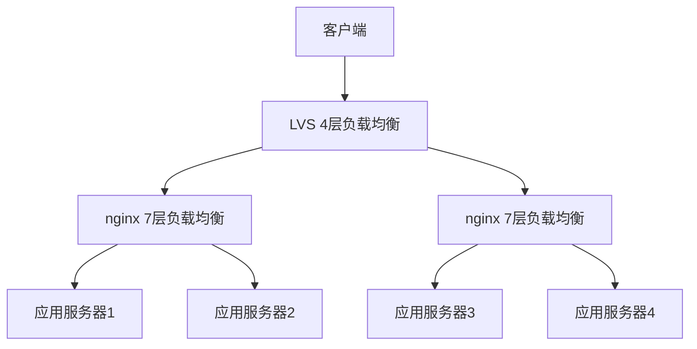
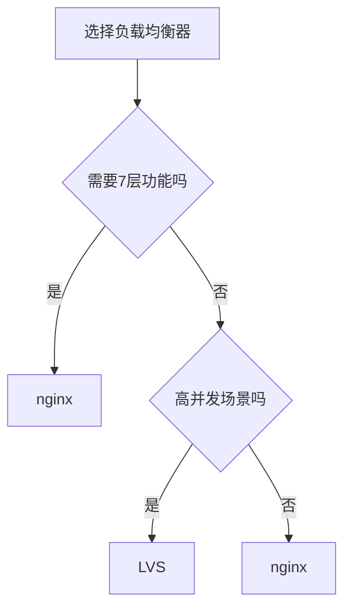

# 负载均衡调度算法深度解析：从LVS到nginx

## 情境(Situation)

在现代互联网架构中，负载均衡是保证系统高可用性和可扩展性的关键组件。无论是大型企业应用还是小型网站，都需要通过负载均衡来分发流量，提高系统性能和可靠性。

作为SRE工程师，我们需要掌握不同负载均衡器的调度算法，理解它们的工作原理和适用场景，以便在实际应用中选择最合适的方案。

## 冲突(Conflict)

在实际应用中，SRE工程师经常面临以下挑战：

- **算法选择**：不知道哪种调度算法最适合特定场景
- **性能优化**：如何根据业务特点优化负载均衡配置
- **会话保持**：如何确保用户会话的连续性
- **故障转移**：如何处理后端服务器故障
- **监控与告警**：如何监控负载均衡的状态和性能

## 问题(Question)

如何选择和配置合适的负载均衡调度算法，确保系统在高并发场景下稳定运行？

## 答案(Answer)

本文将从SRE视角出发，详细介绍负载均衡调度算法的原理、配置和最佳实践，重点比较LVS和nginx的调度算法差异，提供一套完整的负载均衡解决方案。核心方法论基于 [SRE面试题解析：nginx 和lvs的调度算法有哪些不同？](#57-nginx-和lvs的调度算法有哪些不同)。

---

## 一、负载均衡概述

### 1.1 负载均衡层次

**负载均衡层次**：

| 层次 | 技术 | 代表产品 | 特点 |
|:------|:------|:------|:------|
| **2层** | 链路层负载均衡 | 硬件负载均衡器 | 基于MAC地址转发 |
| **3层** | 网络层负载均衡 | IPVS (LVS) | 基于IP地址转发 |
| **4层** | 传输层负载均衡 | IPVS (LVS), nginx stream | 基于IP+端口转发 |
| **7层** | 应用层负载均衡 | nginx, HAProxy, Apache | 基于应用协议转发 |

### 1.2 负载均衡架构

**常见负载均衡架构**：

1. **单节点负载均衡**：单个负载均衡器分发流量
2. **高可用负载均衡**：主备或集群模式
3. **多级负载均衡**：前端LVS + 后端nginx
4. **混合架构**：不同层次负载均衡器配合使用

**架构示意图**：



---

## 二、LVS调度算法

### 2.1 LVS工作原理

**LVS (Linux Virtual Server)** 是Linux内核中的负载均衡模块，工作在网络层和传输层，通过IPVS模块实现负载均衡。

**LVS模式**：
- **NAT模式**：修改数据包的目标IP地址
- **DR模式**：直接路由，修改MAC地址
- **TUN模式**：IP隧道，封装数据包

**性能对比**：
| 模式 | 性能 | 配置复杂度 | 适用场景 |
|:------|:------|:------|:------|
| **NAT** | 中 | 低 | 后端服务器在同一网络 |
| **DR** | 高 | 中 | 后端服务器在同一网络 |
| **TUN** | 高 | 高 | 后端服务器跨网络 |

### 2.2 LVS调度算法

**LVS调度算法**：

| 类型 | 算法 | 英文名称 | 特点 | 适用场景 |
|:------|:------|:------|:------|:------|
| **静态** | 轮询 | Round Robin (RR) | 顺序分配，不考虑负载 | 无状态服务，后端服务器性能相近 |
| **静态** | 加权轮询 | Weighted Round Robin (WRR) | 按权重分配 | 后端服务器性能差异较大 |
| **静态** | 源地址哈希 | Source Hashing (SH) | 基于客户端IP哈希，会话保持 | 需要会话保持的服务 |
| **静态** | 目标地址哈希 | Destination Hashing (DH) | 基于目标IP哈希，提高缓存命中 | 缓存服务器，CDN |
| **动态** | 最少连接 | Least Connection (LC) | 分配给连接最少的服务器 | 长连接服务 |
| **动态** | 加权最少连接 | Weighted Least Connection (WLC) | 权重+连接数 | 后端服务器性能差异较大的长连接服务 |
| **动态** | 基于局部性的最少连接 | Locality-Based Least Connection (LBLC) | 考虑目标IP局部性 | 缓存服务器 |
| **动态** | 带复制的基于局部性最少连接 | Locality-Based Least Connection with Replication (LBLCR) | 考虑目标IP局部性并复制 | 缓存服务器，提高命中率 |

### 2.3 LVS配置示例

**IPVS管理工具**：

```bash
# 安装ipvsadm
apt-get install ipvsadm

# 创建虚拟服务
ipvsadm -A -t 192.168.1.100:80 -s rr

# 添加后端服务器
ipvsadm -a -t 192.168.1.100:80 -r 10.0.0.101:80 -g
ipvsadm -a -t 192.168.1.100:80 -r 10.0.0.102:80 -g

# 设置权重
ipvsadm -e -t 192.168.1.100:80 -r 10.0.0.101:80 -g -w 5
ipvsadm -e -t 192.168.1.100:80 -r 10.0.0.102:80 -g -w 1

# 查看配置
ipvsadm -L -n

# 保存配置
ipvsadm-save > /etc/ipvsadm.rules

# 恢复配置
ipvsadm-restore < /etc/ipvsadm.rules
```

**LVS配置文件**：

```bash
# /etc/sysconfig/ipvsadm
-A -t 192.168.1.100:80 -s wlc
-a -t 192.168.1.100:80 -r 10.0.0.101:80 -g -w 5
-a -t 192.168.1.100:80 -r 10.0.0.102:80 -g -w 1
```

---

## 三、nginx调度算法

### 3.1 nginx工作原理

**nginx** 是一个高性能的HTTP和反向代理服务器，工作在应用层，支持多种调度算法和7层功能。

**nginx负载均衡模块**：
- **ngx_http_upstream_module**：HTTP upstream模块
- **ngx_stream_upstream_module**：TCP/UDP upstream模块

**nginx特点**：
- 支持7层内容过滤和处理
- 支持SSL终结
- 支持缓存
- 配置简单灵活
- 性能优秀

### 3.2 nginx调度算法

**nginx调度算法**：

| 算法 | 特点 | 适用场景 | 配置示例 |
|:------|:------|:------|:------|
| **轮询** | 顺序分配 | 无状态服务，后端服务器性能相近 | `upstream backend { server 10.0.0.101; server 10.0.0.102; }` |
| **加权轮询** | 按权重分配 | 后端服务器性能差异较大 | `upstream backend { server 10.0.0.101 weight=5; server 10.0.0.102 weight=1; }` |
| **IP哈希** | 基于客户端IP哈希，会话保持 | 需要会话保持的服务 | `upstream backend { ip_hash; server 10.0.0.101; server 10.0.0.102; }` |
| **最少连接** | 分配给连接最少的服务器 | 长连接服务 | `upstream backend { least_conn; server 10.0.0.101; server 10.0.0.102; }` |
| **加权最少连接** | 权重+连接数 | 后端服务器性能差异较大的长连接服务 | `upstream backend { least_conn; server 10.0.0.101 weight=5; server 10.0.0.102 weight=1; }` |
| **fair** | 基于响应时间分配 | 对延迟敏感的服务 | `upstream backend { fair; server 10.0.0.101; server 10.0.0.102; }`（需要第三方模块） |
| **url_hash** | 基于URL哈希 | 缓存服务器，提高缓存命中 | `upstream backend { hash $request_uri; server 10.0.0.101; server 10.0.0.102; }` |
| **一致性哈希** | 基于哈希值分配，减少服务器变更时的影响 | 后端服务器经常变更的场景 | `upstream backend { hash $remote_addr consistent; server 10.0.0.101; server 10.0.0.102; }` |

### 3.3 nginx配置示例

**基本配置**：

```nginx
# nginx.conf
http {
    upstream backend {
        # 轮询
        server 10.0.0.101:80;
        server 10.0.0.102:80;
    }

    server {
        listen 80;
        server_name example.com;

        location / {
            proxy_pass http://backend;
            proxy_set_header Host $host;
            proxy_set_header X-Real-IP $remote_addr;
            proxy_set_header X-Forwarded-For $proxy_add_x_forwarded_for;
        }
    }
}
```

**加权轮询配置**：

```nginx
upstream backend {
    server 10.0.0.101:80 weight=5;
    server 10.0.0.102:80 weight=1;
}
```

**IP哈希配置**：

```nginx
upstream backend {
    ip_hash;
    server 10.0.0.101:80;
    server 10.0.0.102:80;
}
```

**最少连接配置**：

```nginx
upstream backend {
    least_conn;
    server 10.0.0.101:80;
    server 10.0.0.102:80;
}
```

**URL哈希配置**：

```nginx
upstream backend {
    hash $request_uri;
    server 10.0.0.101:80;
    server 10.0.0.102:80;
}
```

**一致性哈希配置**：

```nginx
upstream backend {
    hash $remote_addr consistent;
    server 10.0.0.101:80;
    server 10.0.0.102:80;
}
```

---

## 四、LVS vs nginx对比

### 4.1 核心差异

**LVS vs nginx**：

| 对比项 | LVS | nginx |
|:------|:------|:------|
| **工作层级** | 网络层（3层）和传输层（4层） | 应用层（7层），也支持传输层（4层） |
| **性能** | 更高（内核态处理） | 中（用户态处理） |
| **功能** | 基础负载均衡 | 丰富的7层功能（缓存、SSL、内容过滤） |
| **调度算法** | 基础算法，内置在内核 | 丰富的算法，支持第三方模块 |
| **会话保持** | 源地址哈希（SH） | ip_hash、hash指令 |
| **配置复杂度** | 较复杂，需要专用工具 | 简单，配置文件直观 |
| **扩展性** | 有限 | 强，支持模块扩展 |
| **适用场景** | 高并发、纯负载均衡 | 需要7层功能的场景 |

### 4.2 性能对比

**性能测试结果**（仅供参考）：

| 场景 | LVS (DR模式) | nginx (7层) | nginx (4层) |
|:------|:------|:------|:------|
| **并发连接数** | 100万+ | 5万+ | 10万+ |
| **每秒请求数** | 100万+ | 5万+ | 10万+ |
| **延迟** | 低 | 中 | 低 |
| **CPU使用率** | 低 | 中 | 低 |

### 4.3 选择建议

**选择流程**：



**推荐场景**：
- **LVS**：高并发、纯负载均衡场景，如大型电商、金融系统
- **nginx**：需要7层功能的场景，如Web应用、API网关
- **混合架构**：LVS作为前端4层负载均衡，nginx作为后端7层负载均衡

---

## 五、会话保持

### 5.1 会话保持方法

**会话保持技术**：

| 方法 | 实现方式 | 适用负载均衡器 | 优点 | 缺点 |
|:------|:------|:------|:------|:------|
| **源地址哈希** | 基于客户端IP哈希 | LVS (SH), nginx (ip_hash) | 配置简单 | 可能导致负载不均 |
| **Cookie** | 基于Cookie会话标识 | nginx | 负载均衡更均匀 | 增加网络开销 |
| **Session共享** | 外部存储（Redis/Memcached） | 所有 | 最灵活 | 增加系统复杂度 |
| **粘性会话** | 服务器标识 | nginx | 实现简单 | 依赖客户端支持 |

### 5.2 会话保持配置

**nginx会话保持配置**：

1. **IP哈希**：

```nginx
upstream backend {
    ip_hash;
    server 10.0.0.101:80;
    server 10.0.0.102:80;
}
```

2. **一致性哈希**：

```nginx
upstream backend {
    hash $remote_addr consistent;
    server 10.0.0.101:80;
    server 10.0.0.102:80;
}
```

3. **基于Cookie**：

```nginx
upstream backend {
    server 10.0.0.101:80;
    server 10.0.0.102:80;
}

server {
    listen 80;
    server_name example.com;

    location / {
        proxy_pass http://backend;
        proxy_set_header Host $host;
        proxy_set_header X-Real-IP $remote_addr;
        proxy_set_header X-Forwarded-For $proxy_add_x_forwarded_for;
        proxy_cookie_path / /; # 确保Cookie路径正确
    }
}
```

4. **Session共享**：

```nginx
# 应用配置（以PHP为例）
session.save_handler = redis
session.save_path = "tcp://10.0.0.100:6379"
```

---

## 六、故障转移与健康检查

### 6.1 健康检查

**LVS健康检查**：

```bash
# 使用keepalived实现健康检查
# /etc/keepalived/keepalived.conf
vrrp_instance VI_1 {
    state MASTER
    interface eth0
    virtual_router_id 51
    priority 100
    advert_int 1
    authentication {
        auth_type PASS
        auth_pass 1111
    }
    virtual_ipaddress {
        192.168.1.100
    }
}

virtual_server 192.168.1.100 80 {
    delay_loop 6
    lb_algo wlc
    lb_kind DR
    persistence_timeout 50
    protocol TCP

    real_server 10.0.0.101 80 {
        weight 1
        HTTP_GET {
            url {
                path /health
                status_code 200
            }
            connect_timeout 3
            nb_get_retry 3
            delay_before_retry 3
        }
    }

    real_server 10.0.0.102 80 {
        weight 1
        HTTP_GET {
            url {
                path /health
                status_code 200
            }
            connect_timeout 3
            nb_get_retry 3
            delay_before_retry 3
        }
    }
}
```

**nginx健康检查**：

```nginx
upstream backend {
    server 10.0.0.101:80 max_fails=3 fail_timeout=30s;
    server 10.0.0.102:80 max_fails=3 fail_timeout=30s;
    
    # 主动健康检查（nginx 1.19+）
    health_check interval=5s fails=3 passes=2;
}

server {
    listen 80;
    server_name example.com;

    location / {
        proxy_pass http://backend;
        proxy_set_header Host $host;
        proxy_set_header X-Real-IP $remote_addr;
        proxy_set_header X-Forwarded-For $proxy_add_x_forwarded_for;
    }

    # 健康检查端点
    location /health {
        access_log off;
        return 200 "OK";
    }
}
```

### 6.2 故障转移策略

**故障转移策略**：

1. **自动故障转移**：
   - 检测到后端服务器故障时，自动将流量转移到健康服务器
   - 故障服务器恢复后，自动重新加入集群

2. **手动故障转移**：
   - 维护时手动将服务器从集群中移除
   - 维护完成后手动将服务器重新加入集群

3. **优雅下线**：
   - 逐步减少故障服务器的流量
   - 确保现有连接完成处理
   - 完全移除故障服务器

**nginx优雅下线配置**：

```nginx
upstream backend {
    server 10.0.0.101:80 weight=1 max_fails=3 fail_timeout=30s;
    server 10.0.0.102:80 weight=1 max_fails=3 fail_timeout=30s;
}

# 维护模式
upstream backend_maintenance {
    server 10.0.0.103:80;
}

server {
    listen 80;
    server_name example.com;

    location / {
        # 根据维护标志决定使用哪个 upstream
        if (-f /etc/nginx/maintenance) {
            proxy_pass http://backend_maintenance;
        } {
            proxy_pass http://backend;
        }
        proxy_set_header Host $host;
        proxy_set_header X-Real-IP $remote_addr;
        proxy_set_header X-Forwarded-For $proxy_add_x_forwarded_for;
    }
}
```

---

## 七、性能优化

### 7.1 LVS性能优化

**LVS性能优化**：

1. **选择合适的模式**：
   - 优先使用DR模式，性能最高
   - 跨网络场景使用TUN模式

2. **内核参数优化**：

```bash
# /etc/sysctl.conf
# 网络优化
net.core.somaxconn = 65535
net.ipv4.tcp_max_syn_backlog = 65535
net.ipv4.tcp_tw_reuse = 1
net.ipv4.ip_local_port_range = 1024 65535

# LVS相关
net.ipv4.ip_forward = 1
net.ipv4.vs.conn_reuse_mode = 1
net.ipv4.vs.expire_nodest_conn = 1
net.ipv4.vs.expire_quiescent_template = 1

# 应用参数
sysctl -p
```

3. **调优IPVS表大小**：

```bash
# 调整IPVS连接表大小
sysctl -w net.ipv4.vs.maxconn=1048576
```

### 7.2 nginx性能优化

**nginx性能优化**：

1. **工作进程配置**：

```nginx
# nginx.conf
worker_processes auto;  # 自动设置为CPU核心数
worker_rlimit_nofile 65536;  # 提高文件描述符限制

events {
    worker_connections 10240;  # 每个工作进程的最大连接数
    use epoll;  # 使用epoll事件模型
    multi_accept on;  # 一次性接受多个连接
}
```

2. **HTTP优化**：

```nginx
http {
    # 连接复用
    keepalive_timeout 65;
    keepalive_requests 10000;
    
    # 缓冲区
    client_body_buffer_size 16k;
    client_header_buffer_size 1k;
    large_client_header_buffers 4 8k;
    
    # 发送文件
    sendfile on;
    tcp_nopush on;
    tcp_nodelay on;
    
    # 压缩
    gzip on;
    gzip_comp_level 6;
    gzip_types text/plain text/css application/json application/javascript;
}
```

3. **负载均衡优化**：

```nginx
upstream backend {
    least_conn;  # 使用最少连接算法
    keepalive 32;  # 保持连接复用
    
    server 10.0.0.101:80 max_fails=3 fail_timeout=30s;
    server 10.0.0.102:80 max_fails=3 fail_timeout=30s;
}
```

---

## 八、监控与告警

### 8.1 LVS监控

**LVS监控**：

1. **ipvsadm命令**：

```bash
# 查看LVS状态
ipvsadm -L -n --stats
ipvsadm -L -n --rate

# 查看连接数
ipvsadm -L -n --exact
```

2. **Prometheus监控**：

```yaml
# prometheus.yml
scrape_configs:
  - job_name: 'lvs'
    static_configs:
      - targets: ['lvs-exporter:9650']
```

3. **Grafana面板**：
   - 连接数监控
   - 流量监控
   - 后端服务器状态

### 8.2 nginx监控

**nginx监控**：

1. **nginx状态模块**：

```nginx
# nginx.conf
server {
    listen 80;
    server_name localhost;

    location /status {
        stub_status on;
        access_log off;
        allow 127.0.0.1;
        deny all;
    }
}
```

2. **Prometheus监控**：

```yaml
# prometheus.yml
scrape_configs:
  - job_name: 'nginx'
    static_configs:
      - targets: ['nginx-exporter:9113']
```

3. **Grafana面板**：
   - 连接数监控
   - 请求数监控
   - 错误率监控
   - 后端服务器状态

### 8.3 告警策略

**告警规则**：

1. **LVS告警**：
   - 后端服务器健康状态
   - 连接数异常增长
   - 流量异常

2. **nginx告警**：
   - 错误率超过阈值
   - 连接数超过阈值
   - 后端服务器健康状态
   - 响应时间异常

**Prometheus告警规则**：

```yaml
# LVS告警规则
groups:
- name: lvs_alerts
  rules:
  - alert: LVSBackendDown
    expr: ipvs_backend_status{status="down"} == 1
    for: 5m
    labels:
      severity: critical
    annotations:
      summary: "LVS backend down"
      description: "Backend server {{ $labels.backend }} is down"

  - alert: LVSConnectionHigh
    expr: ipvs_backend_connections > 10000
    for: 5m
    labels:
      severity: warning
    annotations:
      summary: "LVS connection high"
      description: "Backend server {{ $labels.backend }} has {{ $value }} connections"

# nginx告警规则
groups:
- name: nginx_alerts
  rules:
  - alert: NginxHighErrorRate
    expr: sum(rate(nginx_http_requests_total{status=~"5.."}[5m])) / sum(rate(nginx_http_requests_total[5m])) > 0.05
    for: 5m
    labels:
      severity: critical
    annotations:
      summary: "Nginx high error rate"
      description: "Error rate is {{ $value | printf '%.2f' }}%"

  - alert: NginxBackendDown
    expr: nginx_upstream_server_state{state="down"} == 1
    for: 5m
    labels:
      severity: critical
    annotations:
      summary: "Nginx backend down"
      description: "Backend server {{ $labels.server }} is down"
```

---

## 九、最佳实践总结

### 9.1 核心原则

**负载均衡核心原则**：

1. **选择合适的负载均衡器**：根据业务需求选择LVS或nginx
2. **选择合适的调度算法**：根据服务特点选择调度算法
3. **实现高可用**：配置主备或集群模式
4. **健康检查**：定期检查后端服务器状态
5. **会话保持**：根据业务需求实现会话保持
6. **性能优化**：根据实际情况优化配置
7. **监控告警**：建立完善的监控和告警机制
8. **故障演练**：定期进行故障演练，确保系统可靠性

### 9.2 配置建议

**生产环境配置清单**：
- [ ] 选择合适的负载均衡器（LVS或nginx）
- [ ] 配置合适的调度算法
- [ ] 实现高可用（keepalived或nginx集群）
- [ ] 配置健康检查
- [ ] 实现会话保持（如果需要）
- [ ] 优化性能参数
- [ ] 建立监控和告警机制
- [ ] 配置日志记录
- [ ] 定期备份配置

**推荐配置**：
- **高并发场景**：LVS (DR模式) + 加权最少连接算法
- **Web应用**：nginx + IP哈希或一致性哈希
- **缓存服务**：nginx + url_hash
- **混合架构**：LVS前端 + nginx后端

### 9.3 经验总结

**常见误区**：
- **过度配置**：配置过多的后端服务器，导致资源浪费
- **算法选择不当**：选择不适合业务场景的调度算法
- **缺乏监控**：没有建立完善的监控和告警机制
- **忽略健康检查**：没有配置健康检查，导致故障服务器仍接收流量
- **会话保持不当**：会话保持配置不当，导致负载不均

**成功经验**：
- **分层架构**：使用LVS作为前端4层负载均衡，nginx作为后端7层负载均衡
- **渐进式部署**：新服务器逐步加入集群，避免流量突增
- **定期维护**：定期检查和优化负载均衡配置
- **故障演练**：定期进行故障演练，确保系统可靠性
- **持续优化**：根据业务增长和变化，持续优化负载均衡配置

---

## 总结

负载均衡是现代互联网架构的重要组成部分，选择合适的负载均衡器和调度算法对系统性能和可靠性至关重要。通过本文介绍的最佳实践，您可以构建一个高效、可靠的负载均衡系统。

**核心要点**：

1. **负载均衡器选择**：LVS适合高并发场景，nginx适合需要7层功能的场景
2. **调度算法选择**：根据服务特点选择合适的调度算法
3. **会话保持**：根据业务需求实现会话保持
4. **健康检查**：配置健康检查，确保流量只分发到健康服务器
5. **性能优化**：根据实际情况优化负载均衡配置
6. **监控告警**：建立完善的监控和告警机制
7. **故障演练**：定期进行故障演练，确保系统可靠性

通过遵循这些最佳实践，我们可以构建一个高性能、高可用的负载均衡系统，为业务应用提供可靠的流量分发服务。

> **延伸学习**：更多面试相关的负载均衡知识，请参考 [SRE面试题解析：nginx 和lvs的调度算法有哪些不同？](#57-nginx-和lvs的调度算法有哪些不同)。

---

## 参考资料

- [LVS官方文档](http://www.linuxvirtualserver.org/)
- [nginx官方文档](https://nginx.org/en/docs/)
- [keepalived官方文档](https://keepalived.org/)
- [IPVS管理工具](https://manpages.ubuntu.com/manpages/bionic/man8/ipvsadm.8.html)
- [nginx负载均衡模块](https://nginx.org/en/docs/http/ngx_http_upstream_module.html)
- [LVS调度算法详解](http://www.linuxvirtualserver.org/docs/scheduling.html)
- [nginx调度算法详解](https://docs.nginx.com/nginx/admin-guide/load-balancer/http-load-balancer/)
- [负载均衡最佳实践](https://aws.amazon.com/cn/elasticloadbalancing/)
- [高可用架构设计](https://www.nginx.com/blog/high-availability-setup-with-nginx-plus/)
- [会话保持技术](https://www.nginx.com/blog/sticky-sessions-nginx/)
- [健康检查配置](https://docs.nginx.com/nginx/admin-guide/load-balancer/http-health-check/)
- [性能优化指南](https://www.nginx.com/blog/tuning-nginx/)
- [监控与告警](https://prometheus.io/docs/introduction/overview/)
- [Grafana面板](https://grafana.com/grafana/dashboards/)
- [企业级负载均衡架构](https://www.cisco.com/c/en/us/products/routers/load-balancers.html)
- [微服务架构中的负载均衡](https://microservices.io/patterns/server-side-discovery.html)
- [云原生负载均衡](https://kubernetes.io/docs/concepts/services-networking/service/)
- [CDN与负载均衡](https://www.cloudflare.com/learning/cdn/what-is-a-load-balancer/)
- [安全负载均衡](https://www.nginx.com/blog/securing-load-balancers/)
- [容器环境中的负载均衡](https://docs.docker.com/engine/swarm/ingress/)