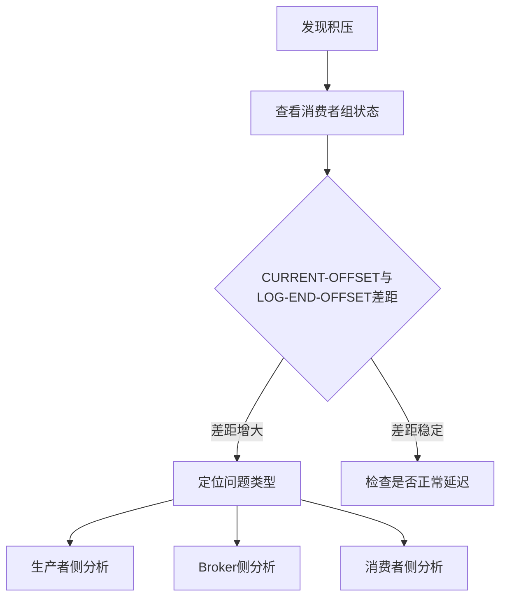

# Kafka消息积压生产环境最佳实践：从诊断到优化

## 情境与背景

在分布式系统中，Kafka作为消息中间件的核心组件，承载着海量消息的生产与消费。然而，当**生产者速度超过消费者处理能力**、**消费者故障**或**Broker资源瓶颈**时，消息会在Topic中积压，导致业务延迟、数据不一致甚至系统崩溃。根据Confluent 2023年生产环境报告，**超过65%的消息延迟问题**与不当的消费者配置或再平衡策略直接相关。本文从实战角度出发，系统讲解消息积压的诊断方法、解决策略和长期优化方案。

## 一、消息积压的核心原因分析

### 1.1 生产者侧原因

**消息突增/峰值**：业务高峰期、营销活动或突发流量会导致消息生产速度急剧上升。

**生产速度过快**：生产者配置不当，如 `acks=0` 或 `batch.size` 设置不合理，导致消息过度发送。

```bash
# 查看生产者吞吐量
kafka-producer-perf-test.sh --topic test-topic --num-records 100000 --record-size 1024 --throughput 10000
```

### 1.2 Broker侧原因

**分区数量不足**：Topic分区数决定了最大并发消费能力，分区数过少会成为瓶颈。

**磁盘IO瓶颈**：Kafka依赖磁盘存储消息，磁盘写入速度不足会导致消息堆积。

**网络带宽限制**：跨机房部署或网络拥塞会影响消息传输速度。

```bash
# 查看Topic分区信息
kafka-topics.sh --bootstrap-server localhost:9092 --describe --topic test-topic

# 查看Broker磁盘状态
iostat -x 1 5
df -h
```

### 1.3 消费者侧原因

**消费速度过慢**：消费者业务逻辑复杂、处理耗时过长。

**再平衡频繁**：消费者加入/离开、心跳超时会触发再平衡，期间暂停消费。

**消费者故障**：消费者进程崩溃、线程死锁或异常退出。

```bash
# 查看消费者组状态
kafka-consumer-groups.sh --bootstrap-server localhost:9092 --describe --group my-consumer-group
```

## 二、消息积压诊断流程

### 2.1 快速诊断三步法



### 2.2 关键诊断命令

```bash
# 1. 查看消费者组详情
kafka-consumer-groups.sh --bootstrap-server localhost:9092 --describe --group my-consumer-group

# 2. 查看Topic分区分布
kafka-topics.sh --bootstrap-server localhost:9092 --describe --topic test-topic

# 3. 查看Broker指标
curl -s http://broker:9093/metrics | grep -E "(under_replicated|leader_election|disk)"

# 4. 查看消费者进程状态
ps aux | grep consumer
jstack <pid> | grep -i consumer
```

### 2.3 积压类型识别矩阵

| 现象 | 可能原因 | 验证方法 |
|:----:|----------|----------|
| 所有分区积压 | 消费者数量不足、消费逻辑慢 | 检查消费者数量与分区数比例 |
| 特定分区积压 | 分区数据倾斜、消费者故障 | 查看各分区offset差距 |
| 间歇性积压 | 再平衡频繁、网络抖动 | 监控rebalance次数 |
| 持续增长积压 | 生产者速度 > 消费能力 | 对比生产/消费TPS |

## 三、即时解决方案

### 3.1 紧急扩容消费者

**原理**：Kafka消费者数量不能超过Topic分区数，增加消费者可提升并行消费能力。

```bash
# 步骤1：查看当前消费者数量
kafka-consumer-groups.sh --bootstrap-server localhost:9092 --describe --group my-consumer-group | grep "Members"

# 步骤2：查看Topic分区数
kafka-topics.sh --bootstrap-server localhost:9092 --describe --topic test-topic | grep "PartitionCount"

# 步骤3：扩容消费者至分区数
# 修改部署配置，增加消费者实例数
```

### 3.2 临时消费服务

**场景**：需要快速清空积压消息，不影响主业务。

```bash
# 创建临时消费者，跳过业务逻辑直接消费
kafka-console-consumer.sh --bootstrap-server localhost:9092 --topic test-topic --group temp-consumer --from-beginning > /dev/null
```

### 3.3 调整消费者参数

```bash
# consumer.properties 关键参数调整
fetch.min.bytes=102400       # 增加批量拉取大小
fetch.max.wait.ms=500        # 等待更多消息再返回
max.poll.records=500        # 单次拉取消息数
session.timeout.ms=30000     # 延长会话超时，减少再平衡
heartbeat.interval.ms=3000   # 心跳间隔
```

## 四、长期优化策略

### 4.1 分区规划优化

**原则**：分区数应根据预期吞吐量和消费者数量合理规划。

```bash
# 创建Topic时合理设置分区数
kafka-topics.sh --bootstrap-server localhost:9092 --create --topic test-topic --partitions 32 --replication-factor 3
```

### 4.2 再平衡策略优化

**三种分区分配策略对比**：

| 策略 | 特点 | 适用场景 |
|:----:|------|----------|
| **Range** | 按范围分配，可能不均衡 | 分区数与消费者数成倍数关系 |
| **RoundRobin** | 轮询分配，均衡性好 | 通用场景 |
| **Sticky** | 最小化分区移动 | 频繁再平衡场景 |

```java
// 设置分区分配策略
Properties props = new Properties();
props.put(ConsumerConfig.PARTITION_ASSIGNMENT_STRATEGY_CONFIG, 
          RoundRobinAssignor.class.getName());
```

### 4.3 消费者代码优化

**批量处理**：减少网络往返，提升处理效率。

```java
// 批量处理示例
ConsumerRecords<String, String> records = consumer.poll(Duration.ofMillis(100));
List<String> messages = new ArrayList<>();

for (ConsumerRecord<String, String> record : records) {
    messages.add(record.value());
}

// 批量处理
processBatch(messages);
consumer.commitSync();
```

**异步处理**：将耗时操作异步化，不阻塞消费线程。

```java
// 异步处理示例
ExecutorService executor = Executors.newFixedThreadPool(10);

for (ConsumerRecord<String, String> record : records) {
    executor.submit(() -> processMessage(record));
}
```

### 4.4 Broker资源优化

**磁盘优化**：使用SSD硬盘，分散日志目录到多块磁盘。

```bash
# server.properties 配置
log.dirs=/disk1/kafka-logs,/disk2/kafka-logs,/disk3/kafka-logs
```

**内存优化**：合理设置JVM堆内存，避免GC问题。

```bash
# kafka-server-start.sh
export KAFKA_HEAP_OPTS="-Xms8G -Xmx8G"
```

## 五、监控与告警

### 5.1 关键监控指标

```bash
# Prometheus监控指标示例
# 消费者滞后量
sum(kafka_consumer_group_lag{group="my-consumer-group"})

# 再平衡次数
sum(kafka_consumer_rebalance_total{group="my-consumer-group"})

# 分区复制状态
sum(kafka_topic_partition_under_replicated)
```

### 5.2 告警规则配置

```yaml
# Prometheus Alertmanager配置
groups:
- name: kafka-alerts
  rules:
  - alert: ConsumerLagHigh
    expr: sum(kafka_consumer_group_lag{group="my-consumer-group"}) > 10000
    for: 5m
    labels:
      severity: critical
    annotations:
      summary: "消费者组 {{ $labels.group }} 消息积压超过10000条"
```

## 六、实战案例：百万级消息积压处理

### 6.1 问题背景

某电商平台在大促期间，订单消息Topic积压超过500万条，消费者滞后持续增长。

### 6.2 诊断过程

```bash
# 1. 查看消费者组状态
kafka-consumer-groups.sh --bootstrap-server kafka:9092 --describe --group order-consumer
# 发现 CURRENT-OFFSET 与 LOG-END-OFFSET 差距持续增大

# 2. 检查消费者数量
# 当前消费者数量为8，Topic分区数为32

# 3. 分析消费速度
# 消费速度约1000条/秒，生产速度约5000条/秒
```

### 6.3 解决方案

1. **紧急扩容**：将消费者数量从8增加到32
2. **临时消费**：部署临时消费者服务，跳过部分非关键业务逻辑
3. **优化参数**：调整 `max.poll.records=1000`，`fetch.min.bytes=102400`
4. **代码优化**：将订单处理逻辑异步化，减少单条消息处理时间

### 6.4 效果

- 积压消息在4小时内全部消费完成
- 消费速度提升至4500条/秒
- 后续大促期间未再出现严重积压

## 七、总结与建议

### 7.1 预防措施

1. **容量规划**：根据业务峰值预估，合理设置分区数和消费者数量
2. **压力测试**：定期进行消息生产/消费压力测试，提前发现瓶颈
3. **监控告警**：设置合理的滞后阈值告警，及时发现积压

### 7.2 处理流程

```
发现积压 → 诊断原因 → 即时处理 → 长期优化 → 复盘总结
    ↓              ↓           ↓           ↓
监控告警     命令排查     扩容/参数调整  架构优化   经验沉淀
```

### 7.3 关键指标

| 指标 | 阈值 | 说明 |
|:----:|------|------|
| **消费者滞后** | < 1000条 | 正常范围 |
| **再平衡频率** | < 1次/小时 | 频繁再平衡需要优化 |
| **分区分布** | 均匀 | 数据倾斜需要处理 |
| **消费速度** | > 生产速度 | 避免积压的关键 |

> **参考链接**：[SRE运维面试题全解析：从理论到实践]()