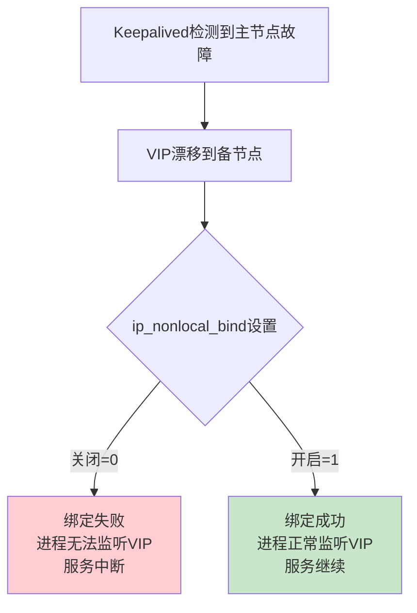

# Linux内核参数生产环境最佳实践：高可用架构必备

## 情境与背景

在高可用架构中，**VIP（虚拟IP）漂移**是实现负载均衡器双机热备的核心机制。当主节点故障时，VIP会漂移到备节点，此时备节点的负载均衡进程必须能够接管绑定到该VIP的端口。默认情况下，Linux只允许进程绑定本机IP地址，`ip_nonlocal_bind`参数打破了这一限制，是实现HAProxy Keepalived、Nginx等高可用方案的关键配置。

## 一、ip_nonlocal_bind核心机制

### 1.1 默认行为与问题



### 1.2 参数详解

```bash
# 参数位置
net.ipv4.ip_nonlocal_bind

# 取值含义
0 - 仅允许绑定本机IP地址（默认）
1 - 允许绑定非本机IP地址（VIP/浮动IP）
```

## 二、实战配置指南

### 2.1 配置方法

```bash
# 1. 查看当前值
sysctl net.ipv4.ip_nonlocal_bind
# 输出：net.ipv4.ip_nonlocal_bind = 0

# 2. 临时生效（重启失效）
sysctl -w net.ipv4.ip_nonlocal_bind=1

# 3. 永久生效
echo "net.ipv4.ip_nonlocal_bind = 1" >> /etc/sysctl.conf

# 4. 使配置立即生效
sysctl -p

# 5. 验证
sysctl net.ipv4.ip_nonlocal_bind
```

### 2.2 HAProxy + Keepalived配置示例

```bash
# /etc/keepalived/keepalived.conf
global_defs {
    router_id HAProxy LB01
}

vrrp_instance VI_1 {
    state MASTER
    interface eth0
    virtual_router_id 51
    priority 100
    advert_int 1
    virtual_ipaddress {
        192.168.1.100/24 dev eth0
    }
}
```

```bash
# /etc/haproxy/haproxy.cfg
global
    log 127.0.0.1 local0
    maxconn 4096
    user haproxy
    group haproxy
    daemon

defaults
    log global
    mode tcp
    option tcplog

listen http_front
    bind 0.0.0.0:80
    mode http
    default_backend web_servers

backend web_servers
    mode http
    balance roundrobin
    server web1 192.168.1.101:8080 check inter 2000 rise 2 fall 3
    server web2 192.168.1.102:8080 check inter 2000 rise 2 fall 3
```

### 2.3 验证与排查

```bash
# 检查VIP是否绑定成功
ip addr show eth0 | grep 192.168.1.100

# 检查HAProxy监听状态
ss -tlnp | grep :80

# 查看绑定失败的进程
lsof -i :80

# 查看系统日志
journalctl -u keepalived -f
journalctl -u haproxy -f
```

## 三、相关内核参数汇总

### 3.1 高可用相关参数

```bash
# 开启IP转发（路由功能）
net.ipv4.ip_forward = 1

# 允许绑定非本机IP（VIP）
net.ipv4.ip_nonlocal_bind = 1

# 开启rp_filter（反向路径过滤）
net.ipv4.conf.default.rp_filter = 1
net.ipv4.conf.all.rp_filter = 1

# 允许发送ICMP重定向
net.ipv4.conf.all.accept_redirects = 0
net.ipv4.conf.default.accept_redirects = 0
```

### 3.2 网络性能优化参数

```bash
# TCP连接复用
net.ipv4.tcp_tw_reuse = 1

# 调整最大TIME_WAIT队列长度
net.ipv4.tcp_max_tw_buckets = 200000

# 调整最大半连接队列长度
net.core.somaxconn = 65535

# 调整文件描述符限制
fs.file-max = 1000000
```

## 四、生产环境完整配置

### 4.1 sysctl.conf配置示例

```bash
# /etc/sysctl.conf
# 网络核心参数
net.ipv4.ip_forward = 1
net.ipv4.ip_nonlocal_bind = 1
net.ipv4.tcp_tw_reuse = 1
net.ipv4.tcp_max_tw_buckets = 200000
net.ipv4.tcp_fin_timeout = 30
net.ipv4.tcp_keepalive_time = 1200
net.ipv4.tcp_max_syn_backlog = 8192

# 端口范围
net.ipv4.ip_local_port_range = 1024 65535

# 连接队列
net.core.somaxconn = 65535
net.core.netdev_max_backlog = 65535

# 文件描述符
fs.file-max = 1000000
fs.nr_open = 1000000

# 内存优化
net.core.rmem_max = 16777216
net.core.wmem_max = 16777216
net.ipv4.tcp_rmem = 4096 87380 16777216
net.ipv4.tcp_wmem = 4096 65536 16777216
```

### 4.2 负载均衡器检查清单

| 检查项 | 命令 | 预期结果 |
|:------:|------|----------|
| ip_nonlocal_bind | `sysctl net.ipv4.ip_nonlocal_bind` | = 1 |
| VIP绑定 | `ip addr show` | 能看到VIP |
| HAProxy进程 | `ps aux \| grep haproxy` | 进程运行中 |
| 端口监听 | `ss -tlnp \| grep :80` | LISTEN状态 |
| Keepalived状态 | `systemctl status keepalived` | active (running) |

## 五、常见问题与排查

### 5.1 HAProxy无法绑定VIP

```bash
# 症状：HAProxy启动失败，提示"cannot bind address"
# 排查步骤：
# 1. 检查ip_nonlocal_bind是否开启
sysctl net.ipv4.ip_nonlocal_bind

# 2. 检查VIP是否已漂移
ip addr show eth0

# 3. 检查HAProxy启动用户是否有权限
ps aux | grep haproxy
id haproxy

# 4. 检查SELinux和防火墙
getenforce
sestatus
iptables -L
```

### 5.2 Keepalived VIP漂移失败

```bash
# 症状：主节点故障后VIP未漂移到备节点
# 排查步骤：
# 1. 检查Keepalived日志
journalctl -u keepalived -n 50

# 2. 检查VRRP通信
tcpdump -i eth0 vrrp -n

# 3. 检查网络连通性
ping -I VIP target_host

# 4. 检查防火墙规则
iptables -I INPUT -p vrrp -j ACCEPT
```

## 六、总结

### 6.1 核心要点

1. **ip_nonlocal_bind是高可用架构的基础**：允许进程绑定非本机IP，是VIP漂移的前提
2. **生产环境必须开启**：HAProxy、Nginx等负载均衡器的高可用都依赖此参数
3. **配合Keepalived使用**：实现双机热备和故障自动切换

### 6.2 配置口诀

```
高可用要bind，nonlocal设为1
VIP漂移不发愁，服务切换无担忧
```

> **参考链接**：[SRE运维面试题全解析：从理论到实践（第二部分）]()