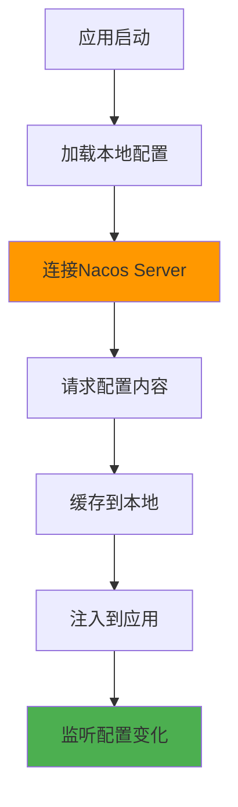
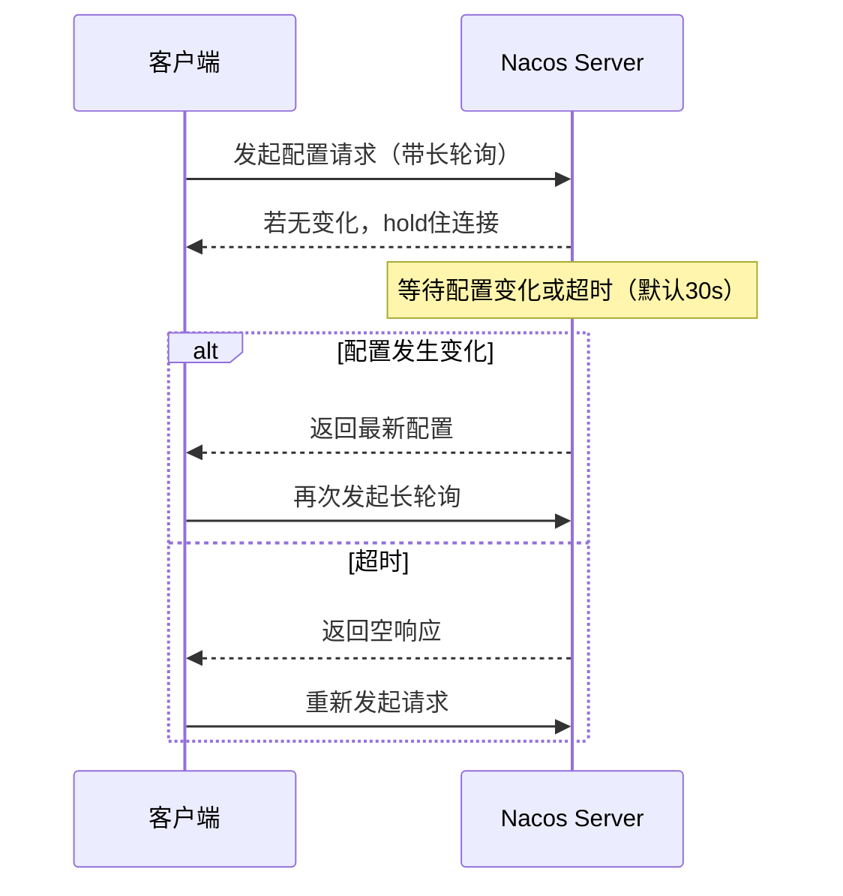
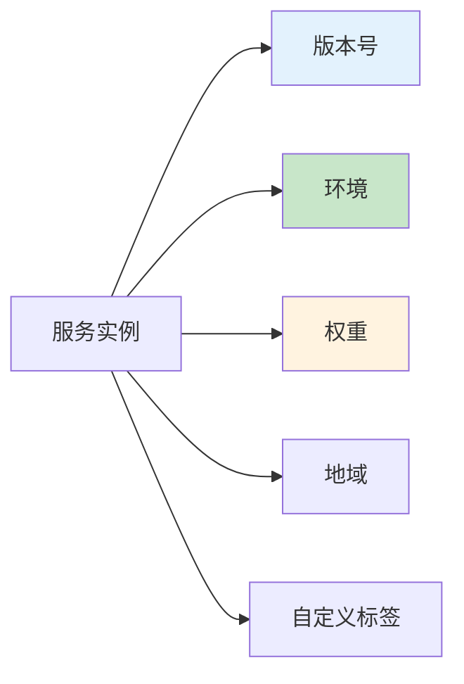

# Nacos生产环境最佳实践：从配置管理到服务发现

## 情境与背景

Nacos作为阿里巴巴开源的服务发现与配置管理平台，已成为Spring Cloud生态中最核心的组件之一。在微服务架构中，**配置中心**和**服务发现**是实现高可用、可扩展系统的基础。然而，在生产环境中，配置读取效率、配置变更实时性、服务分类管理等问题直接影响系统的稳定性和运维效率。本文从实战角度出发，系统讲解Nacos的核心机制、最佳配置和生产环境实践。

## 一、Nacos配置读取机制

### 1.1 配置读取流程



### 1.2 配置读取方式

**方式一：通过Nacos SDK直接读取**

```java
import com.alibaba.nacos.api.NacosFactory;
import com.alibaba.nacos.api.config.ConfigService;

public class NacosConfigReader {
    public static void main(String[] args) throws Exception {
        String serverAddr = "localhost:8848";
        String dataId = "example.properties";
        String group = "DEFAULT_GROUP";
        
        ConfigService configService = NacosFactory.createConfigService(serverAddr);
        String content = configService.getConfig(dataId, group, 5000);
        System.out.println("配置内容: " + content);
    }
}
```

**方式二：通过Spring Cloud Nacos自动装配**

```yaml
# application.yml
spring:
  cloud:
    nacos:
      config:
        server-addr: localhost:8848
        namespace: prod
        group: DEFAULT_GROUP
        extension-configs:
          - data-id: common.properties
            group: DEFAULT_GROUP
            refresh: true
```

### 1.3 配置读取优先级

| 优先级 | 配置来源 | 说明 |
|:------:|----------|------|
| 1 | 命令行参数 | `java -jar app.jar --server.port=8080` |
| 2 | 环境变量 | 操作系统环境变量 |
| 3 | Nacos配置中心 | 远程配置 |
| 4 | 本地配置文件 | application.yml/properties |
| 5 | 默认配置 | Spring Boot默认值 |

## 二、配置变化监听与推送

### 2.1 配置监听机制

Nacos采用**长轮询**机制实现配置实时推送，默认轮询间隔30秒。



### 2.2 配置监听实现

**方式一：使用Nacos SDK监听**

```java
ConfigService configService = NacosFactory.createConfigService(serverAddr);

// 添加配置监听
configService.addListener(dataId, group, new Listener() {
    @Override
    public void receiveConfigInfo(String configInfo) {
        System.out.println("配置已更新: " + configInfo);
        // 重新加载配置
        reloadConfig(configInfo);
    }
    
    @Override
    public Executor getExecutor() {
        // 返回自定义线程池，null表示使用默认线程池
        return Executors.newFixedThreadPool(2);
    }
});
```

**方式二：使用Spring Cloud @RefreshScope**

```java
@RestController
@RefreshScope
public class ConfigController {
    
    @Value("${app.name}")
    private String appName;
    
    @Value("${app.version}")
    private String appVersion;
    
    @GetMapping("/config")
    public Map<String, String> getConfig() {
        Map<String, String> config = new HashMap<>();
        config.put("appName", appName);
        config.put("appVersion", appVersion);
        return config;
    }
}
```

### 2.3 配置推送性能优化

```bash
# Nacos Server配置优化（application.properties）
# 调整长轮询超时时间
nacos.config.long-poll.timeout=30000

# 配置监听线程池大小
nacos.config.listener.thread-pool.size=10

# 配置变更推送队列大小
nacos.config.push.queue.size=10000
```

## 三、服务提供者分类

### 3.1 服务分类维度



### 3.2 服务分类配置示例

**服务提供者配置**

```yaml
# application.yml
spring:
  cloud:
    nacos:
      discovery:
        server-addr: localhost:8848
        metadata:
          version: v1.0.0
          env: prod
          weight: 100
          region: cn-beijing
          zone: zone-a
```

**服务消费者按分类调用**

```java
@RestController
public class ServiceController {
    
    @Autowired
    private DiscoveryClient discoveryClient;
    
    @GetMapping("/services")
    public List<ServiceInstance> getServicesByVersion(@RequestParam String version) {
        return discoveryClient.getInstances("example-service").stream()
            .filter(instance -> version.equals(instance.getMetadata().get("version")))
            .collect(Collectors.toList());
    }
}
```

### 3.3 服务分类场景应用

| 分类维度 | 应用场景 | 实现方式 |
|:--------:|----------|----------|
| **版本号** | 灰度发布、蓝绿部署 | 通过metadata.version区分 |
| **环境** | dev/test/prod隔离 | 通过namespace或metadata.env |
| **权重** | 流量分配、熔断降级 | 通过metadata.weight调整 |
| **地域** | 多地域部署、就近访问 | 通过metadata.region/zone |

## 四、生产环境最佳实践

### 4.1 Nacos集群部署

```bash
# cluster.conf - 配置集群节点
192.168.1.101:8848
192.168.1.102:8848
192.168.1.103:8848
```

```yaml
# application.yml - 客户端配置
spring:
  cloud:
    nacos:
      config:
        server-addr: 192.168.1.101:8848,192.168.1.102:8848,192.168.1.103:8848
      discovery:
        server-addr: 192.168.1.101:8848,192.168.1.102:8848,192.168.1.103:8848
```

### 4.2 配置管理规范

**配置文件命名规范**

```
{application}-{profile}.{file-extension}
# 示例
example-service-dev.yaml
example-service-prod.yaml
common-config.yaml
```

**配置分组策略**

| 分组 | 用途 | 示例 |
|:----:|------|------|
| **DEFAULT_GROUP** | 默认分组 | 通用配置 |
| **APP_GROUP** | 应用专属配置 | example-service |
| **COMMON_GROUP** | 公共配置 | 数据库连接、日志配置 |

### 4.3 配置加密与安全

```bash
# 启用配置加密（Nacos 2.0+）
# application.properties
nacos.cmdb.dumpTaskInterval=3600
nacos.cmdb.eventTaskInterval=10
nacos.cmdb.labelTaskInterval=300

# 配置加密密钥
nacos.config.encrypt.key=your-encryption-key
```

### 4.4 服务健康检查

```yaml
# application.yml - 服务提供者健康检查配置
spring:
  cloud:
    nacos:
      discovery:
        server-addr: localhost:8848
        heart-beat-interval: 5000
        heart-beat-timeout: 15000
        ip-delete-timeout: 30000
```

## 五、监控与告警

### 5.1 关键监控指标

```bash
# Prometheus监控指标示例
# 配置监听数量
sum(nacos_config_listener_count)

# 服务实例数量
sum(nacos_service_instance_count{service="example-service"})

# 配置变更次数
sum(nacos_config_change_total)
```

### 5.2 告警规则配置

```yaml
# Prometheus Alertmanager配置
groups:
- name: nacos-alerts
  rules:
  - alert: NacosServiceInstanceDown
    expr: nacos_service_instance_count{service="example-service"} == 0
    for: 5m
    labels:
      severity: critical
    annotations:
      summary: "服务 {{ $labels.service }} 实例数为0"
```

## 六、实战案例：配置热更新实现

### 6.1 场景描述

某电商平台需要动态调整商品价格配置，要求无需重启服务即可生效。

### 6.2 实现方案

```java
@Service
public class PriceConfigService {
    
    private volatile Map<String, Double> priceConfig = new HashMap<>();
    
    @Value("${nacos.config.data-id}")
    private String dataId;
    
    @Value("${nacos.config.group}")
    private String group;
    
    @Autowired
    private ConfigService configService;
    
    @PostConstruct
    public void init() {
        loadConfig();
        addConfigListener();
    }
    
    private void loadConfig() {
        try {
            String config = configService.getConfig(dataId, group, 5000);
            priceConfig = parseConfig(config);
        } catch (Exception e) {
            log.error("加载配置失败", e);
        }
    }
    
    private void addConfigListener() {
        configService.addListener(dataId, group, new Listener() {
            @Override
            public void receiveConfigInfo(String configInfo) {
                priceConfig = parseConfig(configInfo);
                log.info("价格配置已更新");
            }
            
            @Override
            public Executor getExecutor() {
                return null;
            }
        });
    }
    
    public double getPrice(String productId) {
        return priceConfig.getOrDefault(productId, 0.0);
    }
}
```

## 七、总结与建议

### 7.1 最佳实践清单

1. **使用长轮询机制**：保持配置实时性，避免频繁轮询
2. **合理配置监听线程池**：根据业务量调整线程池大小
3. **使用@RefreshScope**：Spring Cloud环境下实现配置热更新
4. **配置命名规范**：统一配置文件命名和分组策略
5. **集群部署**：保证Nacos服务高可用
6. **配置加密**：敏感配置进行加密存储

### 7.2 常见问题排查

| 问题 | 原因 | 解决方案 |
|:----:|------|----------|
| **配置不生效** | 配置文件路径错误 | 检查dataId和group配置 |
| **配置更新延迟** | 长轮询超时设置过大 | 调整`nacos.config.long-poll.timeout` |
| **服务注册失败** | 网络不通或端口占用 | 检查网络连接和端口 |
| **配置监听重复** | 重复添加监听器 | 使用单例模式或检查重复 |

> **参考链接**：[SRE运维面试题全解析：从理论到实践（第二部分）]()