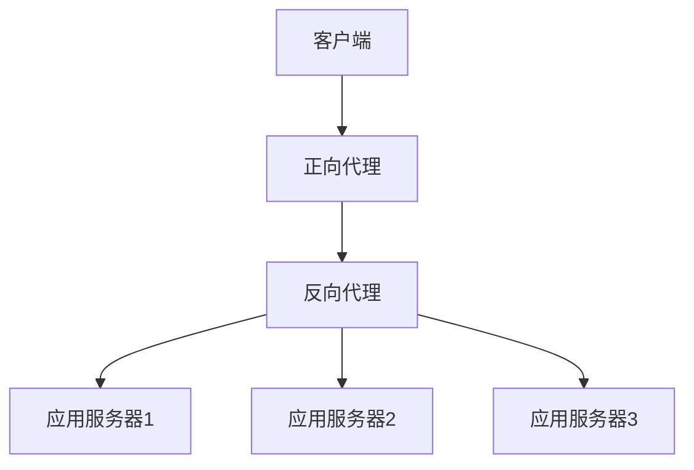
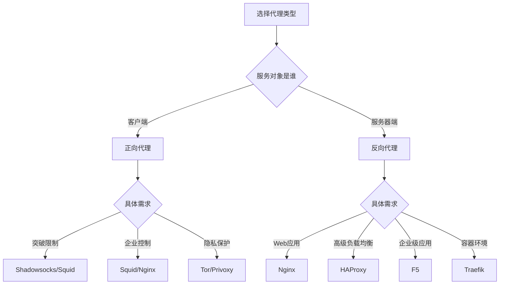

# 正向代理与反向代理深度解析：从原理到实践

## 情境(Situation)

在现代网络架构中，代理服务器扮演着重要角色。无论是企业内网的安全控制，还是大型网站的高可用架构，代理服务器都是不可或缺的组成部分。

作为SRE工程师，我们需要深入理解正向代理和反向代理的工作原理，掌握它们的配置方法和最佳实践，以便在实际应用中选择最合适的代理方案。

## 冲突(Conflict)

在实际应用中，SRE工程师经常面临以下挑战：

- **代理类型选择**：不知道何时使用正向代理，何时使用反向代理
- **配置复杂度**：代理服务器的配置参数众多，难以掌握
- **性能优化**：如何优化代理服务器性能，避免成为瓶颈
- **安全配置**：如何确保代理服务器的安全性
- **监控与告警**：如何监控代理服务器的状态和性能

## 问题(Question)

如何选择和配置合适的代理服务器，确保系统在各种场景下稳定运行？

## 答案(Answer)

本文将从SRE视角出发，详细介绍正向代理和反向代理的原理、配置和最佳实践，提供一套完整的代理服务器解决方案。核心方法论基于 [SRE面试题解析：反向代理vs正向代理？](#58-反向代理vs正向代理)。

---

## 一、代理服务器概述

### 1.1 代理服务器定义

**代理服务器**是位于客户端和目标服务器之间的中间服务器，它可以：
- **转发请求**：将客户端的请求转发到目标服务器
- **接收响应**：将目标服务器的响应返回给客户端
- **处理请求**：对请求进行处理，如缓存、过滤、转换等

### 1.2 代理服务器类型

**代理服务器类型**：

| 类型 | 服务对象 | 部署位置 | 客户端感知 | 主要用途 | 典型场景 |
|:------|:------|:------|:------|:------|:------|
| **正向代理** | 客户端 | 客户端侧 | 需配置代理 | 突破限制、匿名访问 | 科学上网、企业内网控制 |
| **反向代理** | 服务器端 | 服务器侧 | 无感知 | 负载均衡、安全隐藏 | 高并发网站、API网关 |

### 1.3 代理服务器架构

**常见代理服务器架构**：

1. **单节点代理**：单个代理服务器处理所有请求
2. **高可用代理**：主备或集群模式
3. **多级代理**：多个代理服务器串联使用
4. **混合架构**：正向代理和反向代理配合使用

**架构示意图**：



---

## 二、正向代理

### 2.1 正向代理工作原理

**正向代理**是客户端和目标服务器之间的中介，客户端通过正向代理访问目标服务器。

**工作流程**：
1. 客户端配置正向代理服务器地址
2. 客户端向正向代理发送请求
3. 正向代理验证请求（如权限检查）
4. 正向代理向目标服务器发送请求
5. 目标服务器返回响应给正向代理
6. 正向代理处理响应（如缓存）
7. 正向代理返回响应给客户端

**特点**：
- 客户端需要知道代理服务器的存在
- 目标服务器只知道代理服务器的IP，不知道真实客户端IP
- 正向代理可以隐藏客户端身份，保护隐私
- 正向代理可以突破访问限制，如防火墙、地理限制等

### 2.2 正向代理应用场景

**正向代理应用场景**：

1. **突破访问限制**：
   - 访问被地理限制的网站和服务
   - 绕过企业内网的访问限制

2. **匿名访问**：
   - 隐藏客户端真实IP，保护隐私
   - 避免被目标服务器跟踪

3. **企业内网控制**：
   - 统一管理员工的网络访问
   - 实现访问审计和日志记录
   - 过滤不良内容

4. **缓存加速**：
   - 缓存常用资源，减少重复请求
   - 提高访问速度

5. **内容过滤**：
   - 过滤恶意网站和内容
   - 保护企业网络安全

### 2.3 正向代理实现方案

**常见正向代理实现**：

| 方案 | 特点 | 适用场景 |
|:------|:------|:------|
| **Squid** | 功能丰富，支持缓存 | 企业内网、内容过滤 |
| **Nginx** | 性能优秀，配置简单 | 轻量级代理、HTTPS代理 |
| **Shadowsocks** | 加密传输，绕过限制 | 个人使用、科学上网 |
| **Privoxy** | 隐私保护，内容过滤 | 隐私保护、广告过滤 |
| **Tor** | 多层加密，高度匿名 | 高度隐私保护 |

### 2.4 正向代理配置示例

**Nginx正向代理配置**：

1. **HTTP正向代理**：

```nginx
# nginx.conf
server {
    listen 8080;
    resolver 8.8.8.8;
    
    location / {
        proxy_pass $scheme://$http_host$request_uri;
        proxy_set_header Host $http_host;
        proxy_set_header X-Real-IP $remote_addr;
        proxy_set_header X-Forwarded-For $proxy_add_x_forwarded_for;
    }
}
```

2. **HTTPS正向代理**（需要ngx_http_proxy_connect_module模块）：

```nginx
# nginx.conf
server {
    listen 8080;
    resolver 8.8.8.8;
    
    # HTTPS代理
    location / {
        proxy_pass $scheme://$http_host$request_uri;
        proxy_set_header Host $http_host;
        proxy_set_header X-Real-IP $remote_addr;
        proxy_set_header X-Forwarded-For $proxy_add_x_forwarded_for;
    }
    
    # CONNECT方法处理（HTTPS需要）
    proxy_connect;
    proxy_connect_allow 443 563;
    proxy_connect_connect_timeout 10s;
    proxy_connect_read_timeout 10s;
    proxy_connect_send_timeout 10s;
}
```

3. **Squid正向代理配置**：

```conf
# squid.conf
http_port 3128

# 访问控制
acl localnet src 192.168.1.0/24
http_access allow localnet
http_access deny all

# 缓存配置
cache_dir ufs /var/spool/squid 100 16 256
cache_mem 256 MB
maximum_object_size_in_memory 1024 KB

# 日志配置
access_log /var/log/squid/access.log
cache_log /var/log/squid/cache.log
```

4. **客户端配置**：

- **浏览器配置**：
  - Chrome/Edge: 设置 → 高级 → 系统 → 打开代理设置
  - Firefox: 首选项 → 网络设置 → 手动代理配置

- **命令行配置**：

```bash
# 设置HTTP代理
export http_proxy=http://proxy.example.com:8080
export https_proxy=http://proxy.example.com:8080

# 取消代理
export http_proxy=
export https_proxy=
```

---

## 三、反向代理

### 3.1 反向代理工作原理

**反向代理**是服务器端和客户端之间的中介，客户端通过反向代理访问服务器端。

**工作流程**：
1. 客户端向反向代理发送请求
2. 反向代理接收请求（客户端无感知）
3. 反向代理根据配置将请求分发到后端服务器
4. 后端服务器处理请求并返回响应
5. 反向代理接收响应
6. 反向代理处理响应（如缓存、压缩）
7. 反向代理返回响应给客户端

**特点**：
- 客户端不知道后端服务器的存在
- 后端服务器可以通过X-Forwarded-For等头信息获取客户端真实IP
- 反向代理可以实现负载均衡，提高系统可用性
- 反向代理可以提供安全防护，隐藏后端服务器

### 3.2 反向代理应用场景

**反向代理应用场景**：

1. **负载均衡**：
   - 分发流量到多个后端服务器
   - 提高系统可用性和扩展性

2. **安全防护**：
   - 隐藏后端服务器IP，减少攻击面
   - 实现WAF（Web应用防火墙）
   - 抵御DDoS攻击

3. **SSL终结**：
   - 在代理层处理SSL/TLS握手
   - 减轻后端服务器负担

4. **动静分离**：
   - 静态资源由反向代理直接处理
   - 动态请求转发到后端服务器

5. **缓存加速**：
   - 缓存静态资源和API响应
   - 提高访问速度

6. **API网关**：
   - 统一API入口
   - 实现认证、授权、限流等功能

7. **多租户隔离**：
   - 为不同租户提供独立的访问入口
   - 实现租户间的资源隔离

### 3.3 反向代理实现方案

**常见反向代理实现**：

| 方案 | 特点 | 适用场景 |
|:------|:------|:------|
| **Nginx** | 性能优秀，配置灵活 | 大多数Web应用场景 |
| **HAProxy** | 功能丰富，支持TCP/UDP | 高并发、需要高级负载均衡的场景 |
| **Apache** | 功能全面，生态丰富 | 传统Web应用 |
| **F5** | 硬件负载均衡，性能极高 | 企业级应用、金融系统 |
| **Cloudflare** | CDN+反向代理 | 全球分发、DDoS防护 |
| **Traefik** | 自动发现，适合容器环境 | Kubernetes、Docker Swarm |

### 3.4 反向代理配置示例

**Nginx反向代理配置**：

1. **基本负载均衡**：

```nginx
# nginx.conf
http {
    upstream backend {
        server 10.0.0.101:80;
        server 10.0.0.102:80;
        server 10.0.0.103:80;
    }

    server {
        listen 80;
        server_name example.com;

        location / {
            proxy_pass http://backend;
            proxy_set_header Host $host;
            proxy_set_header X-Real-IP $remote_addr;
            proxy_set_header X-Forwarded-For $proxy_add_x_forwarded_for;
            proxy_set_header X-Forwarded-Proto $scheme;
        }
    }
}
```

2. **加权负载均衡**：

```nginx
upstream backend {
    server 10.0.0.101:80 weight=5;
    server 10.0.0.102:80 weight=3;
    server 10.0.0.103:80 weight=2;
}
```

3. **会话保持**：

```nginx
upstream backend {
    ip_hash;
    server 10.0.0.101:80;
    server 10.0.0.102:80;
}
```

4. **SSL终结**：

```nginx
server {
    listen 443 ssl;
    server_name example.com;

    ssl_certificate /etc/nginx/ssl/example.com.crt;
    ssl_certificate_key /etc/nginx/ssl/example.com.key;
    ssl_protocols TLSv1.2 TLSv1.3;
    ssl_ciphers 'ECDHE-ECDSA-AES256-GCM-SHA384:ECDHE-RSA-AES256-GCM-SHA384';

    location / {
        proxy_pass http://backend;
        proxy_set_header Host $host;
        proxy_set_header X-Real-IP $remote_addr;
        proxy_set_header X-Forwarded-For $proxy_add_x_forwarded_for;
        proxy_set_header X-Forwarded-Proto $scheme;
    }
}

# 重定向HTTP到HTTPS
server {
    listen 80;
    server_name example.com;
    return 301 https://$host$request_uri;
}
```

5. **动静分离**：

```nginx
server {
    listen 80;
    server_name example.com;

    # 静态资源
    location ~* \.(js|css|png|jpg|jpeg|gif|ico)$ {
        root /var/www/html;
        expires 30d;
        add_header Cache-Control "public, max-age=2592000";
    }

    # 动态请求
    location / {
        proxy_pass http://backend;
        proxy_set_header Host $host;
        proxy_set_header X-Real-IP $remote_addr;
        proxy_set_header X-Forwarded-For $proxy_add_x_forwarded_for;
    }
}
```

6. **健康检查**：

```nginx
upstream backend {
    server 10.0.0.101:80 max_fails=3 fail_timeout=30s;
    server 10.0.0.102:80 max_fails=3 fail_timeout=30s;
}

server {
    listen 80;
    server_name example.com;

    location / {
        proxy_pass http://backend;
        proxy_set_header Host $host;
        proxy_set_header X-Real-IP $remote_addr;
        proxy_set_header X-Forwarded-For $proxy_add_x_forwarded_for;
    }

    # 健康检查端点
    location /health {
        access_log off;
        return 200 "OK";
    }
}
```

---

## 四、正向代理与反向代理对比

### 4.1 核心差异

**正向代理 vs 反向代理**：

| 对比项 | 正向代理 | 反向代理 |
|:------|:------|:------|
| **服务对象** | 客户端 | 服务器端 |
| **部署位置** | 客户端侧（如企业内网） | 服务器侧（如数据中心） |
| **客户端感知** | 需要配置代理服务器地址 | 无感知，直接访问代理地址 |
| **目标服务器感知** | 只知道代理IP，不知道客户端真实IP | 通过X-Forwarded-For等头信息获取客户端真实IP |
| **主要用途** | 突破访问限制、匿名访问、内容过滤 | 负载均衡、安全防护、SSL终结、缓存加速 |
| **典型应用** | 科学上网、企业内网控制 | 高并发网站、API网关、微服务架构 |
| **实现方式** | Squid、Nginx、Shadowsocks | Nginx、HAProxy、F5、Traefik |
| **配置复杂度** | 相对简单，主要配置客户端 | 相对复杂，需要配置后端服务器、负载均衡等 |
| **性能要求** | 中等，主要处理客户端请求 | 高，需要处理大量并发请求 |

### 4.2 选择建议

**选择流程**：



**推荐场景**：
- **正向代理**：
  - 企业内网控制：Squid
  - 个人科学上网：Shadowsocks
  - 隐私保护：Tor

- **反向代理**：
  - 一般Web应用：Nginx
  - 高并发场景：HAProxy
  - 企业级应用：F5
  - 容器环境：Traefik

---

## 五、性能优化

### 5.1 正向代理性能优化

**正向代理性能优化**：

1. **缓存优化**：
   - 配置合适的缓存大小和策略
   - 缓存常用资源，减少重复请求

2. **连接复用**：
   - 启用Keep-Alive
   - 配置连接池

3. **并发控制**：
   - 限制单个客户端的并发连接数
   - 限制总并发连接数

4. **硬件优化**：
   - 增加内存和CPU
   - 使用SSD存储缓存

5. **网络优化**：
   - 优化网络参数
   - 使用高带宽网络

**Squid性能优化**：

```conf
# squid.conf
# 缓存优化
cache_mem 512 MB
maximum_object_size_in_memory 2 MB
cache_dir ufs /var/spool/squid 2048 16 256

# 并发控制
maximum_concurrent_connections 10000
client_max_connections 100

# 网络优化
netstat_max_connections 10000
```

**Nginx正向代理性能优化**：

```nginx
# nginx.conf
worker_processes auto;
worker_rlimit_nofile 65536;

events {
    worker_connections 10240;
    use epoll;
    multi_accept on;
}

http {
    # 连接复用
    keepalive_timeout 65;
    keepalive_requests 10000;
    
    # 缓冲区
    client_body_buffer_size 16k;
    client_header_buffer_size 1k;
    large_client_header_buffers 4 8k;
    
    # 发送文件
    sendfile on;
    tcp_nopush on;
    tcp_nodelay on;
}
```

### 5.2 反向代理性能优化

**反向代理性能优化**：

1. **负载均衡算法**：
   - 根据后端服务器性能选择合适的负载均衡算法
   - 使用加权负载均衡

2. **健康检查**：
   - 配置合理的健康检查间隔和阈值
   - 快速检测并剔除故障服务器

3. **缓存策略**：
   - 缓存静态资源和API响应
   - 配置合适的缓存过期时间

4. **连接管理**：
   - 启用连接复用
   - 配置连接池

5. **SSL优化**：
   - 使用现代TLS协议和密码套件
   - 启用SSL会话复用
   - 考虑使用HTTP/2

6. **硬件优化**：
   - 增加内存和CPU
   - 使用SSD存储缓存

**Nginx反向代理性能优化**：

```nginx
# nginx.conf
worker_processes auto;
worker_rlimit_nofile 65536;

events {
    worker_connections 10240;
    use epoll;
    multi_accept on;
}

http {
    # 负载均衡
    upstream backend {
        least_conn;
        keepalive 32;
        
        server 10.0.0.101:80 max_fails=3 fail_timeout=30s;
        server 10.0.0.102:80 max_fails=3 fail_timeout=30s;
    }
    
    # 连接复用
    keepalive_timeout 65;
    keepalive_requests 10000;
    
    # 缓冲区
    client_body_buffer_size 16k;
    client_header_buffer_size 1k;
    large_client_header_buffers 4 8k;
    
    # 发送文件
    sendfile on;
    tcp_nopush on;
    tcp_nodelay on;
    
    # 压缩
    gzip on;
    gzip_comp_level 6;
    gzip_types text/plain text/css application/json application/javascript;
    
    # SSL优化
    ssl_session_cache shared:SSL:10m;
    ssl_session_timeout 10m;
    ssl_protocols TLSv1.2 TLSv1.3;
    ssl_ciphers 'ECDHE-ECDSA-AES256-GCM-SHA384:ECDHE-RSA-AES256-GCM-SHA384';
    ssl_prefer_server_ciphers on;
}
```

---

## 六、安全配置

### 6.1 正向代理安全配置

**正向代理安全配置**：

1. **访问控制**：
   - 限制允许访问代理的客户端IP
   - 实现认证机制（如用户名密码）

2. **内容过滤**：
   - 过滤恶意网站和内容
   - 防止访问不良网站

3. **日志审计**：
   - 记录所有代理请求
   - 定期审计日志

4. **SSL证书验证**：
   - 验证目标服务器的SSL证书
   - 防止中间人攻击

5. **防止滥用**：
   - 限制带宽和连接数
   - 监控异常访问

**Squid安全配置**：

```conf
# squid.conf
# 访问控制
acl localnet src 192.168.1.0/24
acl SSL_ports port 443
acl Safe_ports port 80 443 21 70 210 1025-65535
acl CONNECT method CONNECT

http_access allow localnet
http_access deny CONNECT !SSL_ports
http_access deny !Safe_ports
http_access deny all

# 认证
auth_param basic program /usr/lib/squid/basic_ncsa_auth /etc/squid/passwd
auth_param basic realm Squid proxy-caching web server
auth_param basic credentialsttl 2 hours
auth_param basic casesensitive off

acl authenticated proxy_auth REQUIRED
http_access allow authenticated

# 日志
access_log /var/log/squid/access.log
cache_log /var/log/squid/cache.log
```

**Nginx正向代理安全配置**：

```nginx
# nginx.conf
server {
    listen 8080;
    resolver 8.8.8.8;
    
    # 访问控制
    allow 192.168.1.0/24;
    deny all;
    
    # 认证
    auth_basic "Restricted";
    auth_basic_user_file /etc/nginx/.htpasswd;
    
    location / {
        proxy_pass $scheme://$http_host$request_uri;
        proxy_set_header Host $http_host;
        proxy_set_header X-Real-IP $remote_addr;
        proxy_set_header X-Forwarded-For $proxy_add_x_forwarded_for;
    }
}
```

### 6.2 反向代理安全配置

**反向代理安全配置**：

1. **隐藏后端信息**：
   - 隐藏服务器版本信息
   - 隐藏后端服务器IP

2. **WAF功能**：
   - 过滤恶意请求
   - 防止SQL注入、XSS等攻击

3. **HTTPS配置**：
   - 启用HTTPS
   - 使用强密码套件
   - 定期更新证书

4. **请求限制**：
   - 限制请求速率
   - 限制请求大小

5. **安全头信息**：
   - 设置合适的安全头信息
   - 如Content-Security-Policy、X-XSS-Protection等

6. **DDoS防护**：
   - 配置连接限制
   - 使用CDN或专业DDoS防护服务

**Nginx反向代理安全配置**：

```nginx
# nginx.conf
http {
    # 隐藏版本信息
    server_tokens off;
    
    # 安全头信息
    add_header X-Content-Type-Options nosniff;
    add_header X-Frame-Options SAMEORIGIN;
    add_header X-XSS-Protection "1; mode=block";
    add_header Content-Security-Policy "default-src 'self'";
    add_header Strict-Transport-Security "max-age=31536000; includeSubDomains";
    
    # 请求限制
    limit_req_zone $binary_remote_addr zone=req_limit:10m rate=10r/s;
    client_max_body_size 10M;
    
    server {
        listen 80;
        server_name example.com;
        return 301 https://$host$request_uri;
    }
    
    server {
        listen 443 ssl;
        server_name example.com;
        
        # SSL配置
        ssl_certificate /etc/nginx/ssl/example.com.crt;
        ssl_certificate_key /etc/nginx/ssl/example.com.key;
        ssl_protocols TLSv1.2 TLSv1.3;
        ssl_ciphers 'ECDHE-ECDSA-AES256-GCM-SHA384:ECDHE-RSA-AES256-GCM-SHA384';
        ssl_prefer_server_ciphers on;
        ssl_session_cache shared:SSL:10m;
        ssl_session_timeout 10m;
        
        # 请求限制
        location / {
            limit_req zone=req_limit burst=20 nodelay;
            proxy_pass http://backend;
            proxy_set_header Host $host;
            proxy_set_header X-Real-IP $remote_addr;
            proxy_set_header X-Forwarded-For $proxy_add_x_forwarded_for;
            proxy_set_header X-Forwarded-Proto $scheme;
        }
        
        # 健康检查
        location /health {
            access_log off;
            return 200 "OK";
        }
    }
}
```

---

## 七、监控与告警

### 7.1 正向代理监控

**正向代理监控**：

1. **关键指标**：
   - 并发连接数
   - 请求速率
   - 缓存命中率
   - 错误率
   - 响应时间

2. **监控工具**：
   - **Nginx**：ngx_http_stub_status_module
   - **Squid**：squidclient
   - **Prometheus + Grafana**：全面监控

3. **Nginx状态监控**：

```nginx
server {
    listen 8080;
    server_name localhost;
    
    location /status {
        stub_status on;
        access_log off;
        allow 127.0.0.1;
        deny all;
    }
}
```

4. **Squid状态监控**：

```bash
# 查看Squid状态
squidclient -p 3128 mgr:info
```

5. **Prometheus监控**：

```yaml
# prometheus.yml
scrape_configs:
  - job_name: 'nginx'
    static_configs:
      - targets: ['nginx-exporter:9113']
  
  - job_name: 'squid'
    static_configs:
      - targets: ['squid-exporter:9399']
```

### 7.2 反向代理监控

**反向代理监控**：

1. **关键指标**：
   - 并发连接数
   - 请求速率
   - 错误率
   - 后端服务器健康状态
   - 响应时间
   - 负载均衡分布

2. **监控工具**：
   - **Nginx**：ngx_http_stub_status_module
   - **HAProxy**：stats页面
   - **Prometheus + Grafana**：全面监控

3. **Nginx状态监控**：

```nginx
server {
    listen 80;
    server_name localhost;
    
    location /status {
        stub_status on;
        access_log off;
        allow 127.0.0.1;
        deny all;
    }
}
```

4. **HAProxy状态监控**：

```haproxy
# haproxy.cfg
listen stats
    bind *:9000
    mode http
    stats enable
    stats uri /stats
    stats auth admin:password
```

5. **Prometheus监控**：

```yaml
# prometheus.yml
scrape_configs:
  - job_name: 'nginx'
    static_configs:
      - targets: ['nginx-exporter:9113']
  
  - job_name: 'haproxy'
    static_configs:
      - targets: ['haproxy-exporter:9101']
```

### 7.3 告警策略

**告警规则**：

1. **正向代理告警**：
   - 连接数超过阈值
   - 错误率超过阈值
   - 缓存命中率过低
   - 代理服务器不可用

2. **反向代理告警**：
   - 连接数超过阈值
   - 错误率超过阈值
   - 后端服务器健康状态
   - 响应时间过长
   - 负载均衡分布不均

**Prometheus告警规则**：

```yaml
# 正向代理告警规则
groups:
- name: forward_proxy_alerts
  rules:
  - alert: ForwardProxyHighErrorRate
    expr: sum(rate(nginx_http_requests_total{status=~"5.."}[5m])) / sum(rate(nginx_http_requests_total[5m])) > 0.05
    for: 5m
    labels:
      severity: critical
    annotations:
      summary: "正向代理错误率高"
      description: "错误率为 {{ $value | printf '%.2f' }}%"

  - alert: ForwardProxyHighConnections
    expr: nginx_connections_active > 1000
    for: 5m
    labels:
      severity: warning
    annotations:
      summary: "正向代理连接数高"
      description: "当前连接数为 {{ $value }}"

# 反向代理告警规则
groups:
- name: reverse_proxy_alerts
  rules:
  - alert: ReverseProxyHighErrorRate
    expr: sum(rate(nginx_http_requests_total{status=~"5.."}[5m])) / sum(rate(nginx_http_requests_total[5m])) > 0.05
    for: 5m
    labels:
      severity: critical
    annotations:
      summary: "反向代理错误率高"
      description: "错误率为 {{ $value | printf '%.2f' }}%"

  - alert: BackendServerDown
    expr: nginx_upstream_server_state{state="down"} == 1
    for: 5m
    labels:
      severity: critical
    annotations:
      summary: "后端服务器不可用"
      description: "后端服务器 {{ $labels.server }} 不可用"

  - alert: ReverseProxyHighResponseTime
    expr: histogram_quantile(0.95, sum(rate(nginx_http_request_duration_seconds_bucket[5m])) by (le)) > 1
    for: 5m
    labels:
      severity: warning
    annotations:
      summary: "反向代理响应时间长"
      description: "95%响应时间超过 {{ $value }} 秒"
```

---

## 八、最佳实践总结

### 8.1 核心原则

**代理服务器核心原则**：

1. **选择合适的代理类型**：根据服务对象选择正向代理或反向代理
2. **选择合适的实现方案**：根据具体需求选择合适的代理服务器软件
3. **配置安全**：加强访问控制，防止滥用
4. **性能优化**：根据实际情况优化配置，避免成为瓶颈
5. **监控告警**：建立完善的监控和告警机制
6. **高可用**：配置主备或集群模式，确保服务可靠性
7. **定期维护**：定期检查和更新配置，确保安全和性能

### 8.2 配置建议

**生产环境配置清单**：
- [ ] 选择合适的代理类型（正向代理或反向代理）
- [ ] 选择合适的代理服务器软件
- [ ] 配置访问控制和认证
- [ ] 配置缓存策略
- [ ] 配置负载均衡（反向代理）
- [ ] 配置SSL/TLS
- [ ] 配置健康检查
- [ ] 优化性能参数
- [ ] 建立监控和告警机制
- [ ] 配置日志记录
- [ ] 定期备份配置

**推荐配置**：
- **正向代理**：
  - 企业内网：Squid + 认证 + 内容过滤
  - 个人使用：Shadowsocks + 加密

- **反向代理**：
  - 一般Web应用：Nginx + 负载均衡 + SSL
  - 高并发场景：HAProxy + 高级负载均衡
  - 容器环境：Traefik + 自动发现

### 8.3 经验总结

**常见误区**：
- **配置过于复杂**：配置过多的参数，导致维护困难
- **安全配置不足**：没有配置访问控制和认证，导致被滥用
- **性能优化不当**：没有根据实际情况优化配置，导致性能瓶颈
- **监控不足**：没有建立完善的监控和告警机制，导致问题无法及时发现
- **忽略高可用**：没有配置高可用，导致单点故障

**成功经验**：
- **分层架构**：使用多级代理，分担不同的职责
- **渐进式部署**：新配置逐步部署，避免影响现有服务
- **定期维护**：定期检查和更新配置，确保安全和性能
- **故障演练**：定期进行故障演练，确保系统可靠性
- **持续优化**：根据业务增长和变化，持续优化配置

---

## 总结

代理服务器是现代网络架构的重要组成部分，正向代理和反向代理各有其适用场景。通过本文介绍的最佳实践，您可以构建一个高效、安全、可靠的代理服务器系统。

**核心要点**：

1. **代理类型选择**：正向代理服务客户端，反向代理服务服务器端
2. **实现方案选择**：根据具体需求选择合适的代理服务器软件
3. **安全配置**：加强访问控制，防止滥用
4. **性能优化**：根据实际情况优化配置，避免成为瓶颈
5. **监控告警**：建立完善的监控和告警机制
6. **高可用**：配置主备或集群模式，确保服务可靠性
7. **定期维护**：定期检查和更新配置，确保安全和性能

通过遵循这些最佳实践，我们可以构建一个高性能、高可用、安全的代理服务器系统，为业务应用提供可靠的网络服务。

> **延伸学习**：更多面试相关的代理服务器知识，请参考 [SRE面试题解析：反向代理vs正向代理？](#58-反向代理vs正向代理)。

---

## 参考资料

- [Nginx官方文档](https://nginx.org/en/docs/)
- [Squid官方文档](http://www.squid-cache.org/Doc/)
- [HAProxy官方文档](https://cbonte.github.io/haproxy-dconv/)
- [Traefik官方文档](https://doc.traefik.io/traefik/)
- [正向代理与反向代理详解](https://www.nginx.com/resources/glossary/reverse-proxy-server/)
- [代理服务器工作原理](https://www.cloudflare.com/learning/cdn/glossary/reverse-proxy/)
- [Nginx正向代理配置](https://docs.nginx.com/nginx/admin-guide/web-server/reverse-proxy/)
- [Squid正向代理配置](http://www.squid-cache.org/Doc/config/)
- [负载均衡最佳实践](https://aws.amazon.com/cn/elasticloadbalancing/)
- [SSL/TLS最佳实践](https://mozilla.github.io/server-side-tls/ssl-config-generator/)
- [Web应用防火墙](https://owasp.org/www-community/Web_Application_Firewall)
- [DDoS防护](https://www.cloudflare.com/learning/ddos/what-is-a-ddos-attack/)
- [监控与告警](https://prometheus.io/docs/introduction/overview/)
- [Grafana面板](https://grafana.com/grafana/dashboards/)
- [企业级代理架构](https://www.cisco.com/c/en/us/products/security/proxy-servers/)
- [云原生代理方案](https://kubernetes.io/docs/concepts/services-networking/ingress/)
- [微服务架构中的代理](https://microservices.io/patterns/server-side-discovery.html)
- [CDN与代理](https://www.cloudflare.com/learning/cdn/what-is-a-cdn/)
- [安全代理配置](https://owasp.org/www-project-modsecurity/)
- [容器环境中的代理](https://docs.docker.com/network/proxy/)