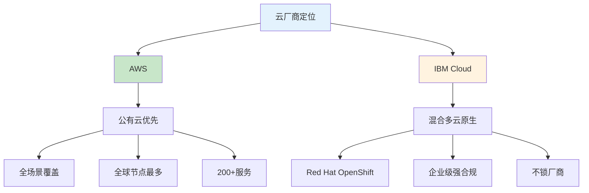
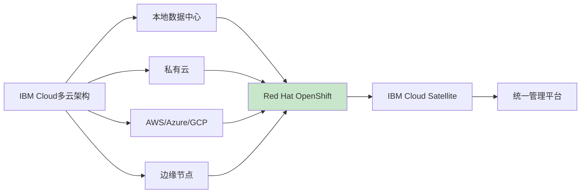
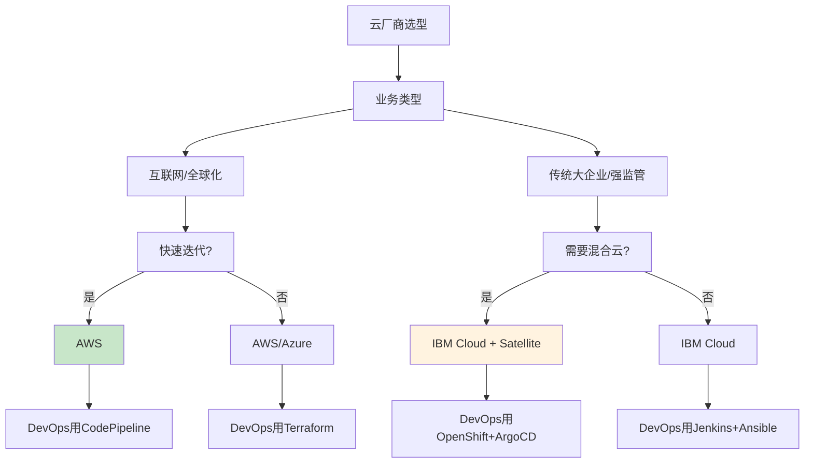

# AWS与IBM Cloud多云架构对比生产环境最佳实践：选型指南

## 情境与背景

在多云时代，选择合适的云厂商是企业IT战略的核心决策之一。AWS和IBM Cloud代表了两种不同的云服务理念：AWS是公有云绝对龙头，主打全场景弹性；IBM Cloud则是混合多云+企业级强合规，背靠Red Hat开源生态。本文从DevOps/SRE视角，系统对比两大云厂商的核心差异，帮助读者做出合理的技术选型。

## 一、一句话总区别

**AWS**：**公有云绝对龙头**，服务最全、全球节点最多、生态最成熟，主打"**全场景+弹性+创新快**"，适合互联网、全球化、快速迭代业务。

**IBM Cloud**：**混合多云+企业级强合规**，背靠IBM+Red Hat，主打"**开源开放+混合云集成+行业深度（金融/医疗/政府）**"，适合传统大企业、核心系统、强监管行业。



## 二、核心维度对比

### 2.1 市场与全球基础设施

| 指标 | AWS | IBM Cloud |
|:----:|-----|----------|
| **全球区域** | 38个 | 6个 |
| **可用区** | 120个 | 18个 |
| **数据中心** | - | 60个 |
| **服务数量** | 200+ | 170+ |
| **覆盖范围** | 全球最广 | 覆盖较小但混合云节点多 |

**AWS优势**：全球节点最广，适合全球化业务
**IBM优势**：混合云节点+本地部署+边缘一体化更强

### 2.2 定位：公有云 vs 混合云

| 维度 | AWS | IBM Cloud |
|:----:|-----|----------|
| **核心定位** | 公有云优先 | 混合多云原生设计 |
| **弹性能力** | 原生弹性强，Lambda无服务器极强 | 偏企业级弹性 |
| **混合云方案** | Outposts（补充方案） | **Satellite（核心方案）** |
| **跨云管理** | 单一AWS环境 | 统一管理本地/私有/公有/边缘 |



### 2.3 容器与Kubernetes

| 维度 | AWS | IBM Cloud |
|:----:|-----|----------|
| **托管K8s** | EKS | **OpenShift** |
| **K8s版本** | 多种版本可选 | 企业级K8s定制版 |
| **多集群管理** | EKS Connector | **OCM原生支持** |
| **服务网格** | App Mesh | **Istio原生集成** |
| **无服务器** | Fargate | **Knative** |
| **跨云迁移** | 一般 | **更强** |

**AWS EKS特点**：
- 成熟稳定，与AWS服务深度集成
- ECR、Fargate、ALB、CloudWatch无缝配合
- 但K8s定制化和跨云迁移能力一般

**IBM OpenShift特点**：
- 企业级K8s，开源度高
- 原生支持多集群、跨云、混合环境
- Istio/Knative深度集成
- 更适合复杂企业级微服务

```yaml
# OpenShift多集群配置示例
apiVersion: v1
kind: Namespace
metadata:
  name: prod-workload
  labels:
    name: prod-workload
---
apiVersion: apps/v1
kind: Deployment
metadata:
  name: my-app
  namespace: prod-workload
spec:
  replicas: 3
  selector:
    matchLabels:
      app: my-app
  template:
    metadata:
      labels:
        app: my-app
    spec:
      affinity:
        podAntiAffinity:
          requiredDuringSchedulingIgnoredDuringExecution:
          - labelSelector:
              matchLabels:
                app: my-app
            topologyKey: topology.kubernetes.io/zone
      containers:
      - name: my-app
        image: my-app:latest
        ports:
        - containerPort: 8080
```

### 2.4 企业合规与安全

| 维度 | AWS | IBM Cloud |
|:----:|-----|----------|
| **合规认证** | 多（FedRAMP、HIPAA、PCI等） | **更全面**（FIPS、FedRAMP、HIPAA、SOC2） |
| **安全模型** | 责任共担，需大量自配置 | **内置安全，非附加** |
| **硬件安全** | - | **KYOK（Keep Your Own Key）** |
| **密钥管理** | KMS | **HSM硬件级** |
| **金融合规** | 支持 | **更强（银行级）** |
| **政府云** | GovCloud | **专用政府云** |

**IBM Cloud安全优势**：
- 硬件级安全、密钥自主管理（KYOK），连IBM自己都拿不到密钥
- 安全是"内置"而非"附加"
- 金融/政府/医疗强合规（FIPS、FedRAMP、HIPAA）

### 2.5 生态与DevOps工具链

| 维度 | AWS | IBM Cloud |
|:----:|-----|----------|
| **IaC** | CloudFormation/Terraform | **Terraform/Ansible** |
| **CI/CD** | CodePipeline/CodeBuild | **Jenkins/GitLab/ArgoCD** |
| **监控** | CloudWatch | **Datadog/Prometheus/Grafana** |
| **日志** | CloudWatch Logs | **ELK/Loki** |
| **厂商锁定** | **绑定较深** | **不锁厂商** |
| **开源兼容** | 一般 | **极强** |

**AWS生态**：
- 全栈自研生态，CodePipeline、CodeBuild、CodeDeploy
- 与AWS服务深度绑定
- 迁移到其他云成本高

**IBM Cloud生态**：
- 开源优先、多云友好
- 支持Terraform、Ansible、Jenkins
- OpenShift兼容所有K8s工具
- 更容易和现有企业工具集成

```yaml
# Terraform多云IaC示例
# AWS Provider
provider "aws" {
  region = "us-east-1"
  alias  = "aws"
}

# IBM Cloud Provider
provider "ibm" {
  ibmcloud_api_key = var.ibmcloud_api_key
  region           = "us-south"
  alias            = "ibm"
}

# 统一使用Kubernetes资源
resource "kubernetes_deployment" "app" {
  count = 2
  
  metadata {
    name = "my-app"
  }
  
  spec {
    replicas = 3
    
    selector {
      match_labels = {
        app = "my-app"
      }
    }
    
    template {
      metadata {
        labels = {
          app = "my-app"
        }
      }
      
      container {
        image = "my-app:latest"
        name  = "my-app"
      }
    }
  }
}
```

### 2.6 AI/ML能力对比

| 维度 | AWS | IBM Cloud |
|:----:|-----|----------|
| **AI平台** | SageMaker、Bedrock | **Watson AI** |
| **行业AI** | 通用AI强 | **金融风控、医疗健康强** |
| **企业AI** | 一般 | **决策系统强** |
| **创新速度** | **快** | 较慢 |

**AWS AI优势**：AI服务全、创新快，适合互联网AI应用

**IBM AI优势**：Watson AI行业解决方案强，侧重企业级AI与决策系统

### 2.7 成本模式对比

| 维度 | AWS | IBM Cloud |
|:----:|-----|----------|
| **计费方式** | 按需付费、按秒计费 | 混合云折扣、订阅制、预留容量 |
| **价格体系** | 复杂 | 相对简单 |
| **长期成本** | 大规模偏高 | **混合云场景更划算** |
| **成本优化** | 多工具支持 | IBM硬件/软件集成环境更优 |

## 三、多云架构最佳实践

### 3.1 IBM Cloud Satellite混合云架构

```yaml
# IBM Cloud Satellite配置
apiVersion: v1
kind: ConfigMap
metadata:
  name: satellite-config
  namespace: ibm-system
data:
  region: "us-east"
  location: "on-prem-datacenter"
---
# Satellite Location
resource "ibm_satellite_location" "on_prem" {
  location          = "on-prem-location"
  managed_from      = "wdc04"
  description       = "On-premises location"
  zones             = ["zone1", "zone2", "zone3"]
}
```

### 3.2 OpenShift多集群管理

```yaml
# OpenShift Cluster Manager (OCM) 多集群配置
apiVersion: v1
kind: Secret
metadata:
  name: hub-cluster-kubeconfig
  namespace: open-cluster-management
type: Opaque
---
apiVersion: agent.open-cluster-management.io/v1
kind: KlusterletAddonConfig
metadata:
  name: managed-cluster
  namespace: managed-cluster
spec:
  clusterName: managed-cluster
  clusterNamespace: managed-cluster
  applicationManager:
    enabled: true
  certPolicyController:
    enabled: true
  iamPolicyController:
    enabled: true
  searchCollector:
    enabled: true
  policyController:
    enabled: true
  version: "2.6.0"
```

### 3.3 跨云CI/CD流水线

```yaml
# ArgoCD多云GitOps配置
apiVersion: argoproj.io/v1alpha1
kind: Application
metadata:
  name: my-app-aws
  namespace: argocd
spec:
  project: default
  source:
    repoURL: https://github.com/example/app.git
    targetRevision: main
    path: deploy/aws
  destination:
    server: https://aws-eks.amazonaws.com
    namespace: production
---
apiVersion: argoproj.io/v1alpha1
kind: Application
metadata:
  name: my-app-ibm
  namespace: argocd
spec:
  project: default
  source:
    repoURL: https://github.com/example/app.git
    targetRevision: main
    path: deploy/ibm
  destination:
    server: https://ibm-openshift.example.com
    namespace: production
```

## 四、选型决策树



## 五、面试1分钟精简版（直接背）

**完整版**：

我理解的 AWS 和 IBM Cloud 最大区别是**定位和场景**：

AWS 是公有云老大，服务最全、全球节点最多、生态成熟，适合互联网、全球化、快速迭代业务，弹性和无服务器能力很强；

IBM Cloud 则是**混合多云+企业级强合规**，背靠Red Hat OpenShift，擅长统一管理本地、私有云和公有云，开源开放、不锁厂商，特别适合金融、政府等强监管行业和传统大企业核心系统。

在 DevOps 上，AWS 工具链自研、深度绑定；IBM 更开放、多云兼容好，容器和混合云集成更强。

**30秒超短版**：

AWS适合互联网全球化，追求弹性创新选它；IBM Cloud适合强监管行业和混合云，背靠Red Hat，开源不锁厂。

## 六、总结

### 6.1 选型对照表

| 场景 | 推荐厂商 | 原因 |
|:----:|:--------:|------|
| **互联网/全球化** | AWS | 全球节点多，服务全 |
| **金融/政府/医疗** | IBM Cloud | 强合规，HSM硬件安全 |
| **混合多云** | IBM Cloud | Satellite统一管理 |
| **快速迭代** | AWS | Lambda无服务器极强 |
| **传统企业迁移** | IBM Cloud | 开源兼容，不锁厂商 |
| **多云管理** | IBM Cloud | OpenShift跨云更强 |
| **AI创新** | AWS | SageMaker/Bedrock更新快 |
| **企业级AI** | IBM Cloud | Watson行业解决方案 |

### 6.2 对比口诀

```
AWS全场景弹性广，公有云里它最强
IBM混合合规开源强，传统企业它最帮
互联网选AWS，强监管选IBM
DevOps AWS绑定深，IBM多云兼容强
```

> **参考链接**：[SRE运维面试题全解析：从理论到实践（第二部分）]()