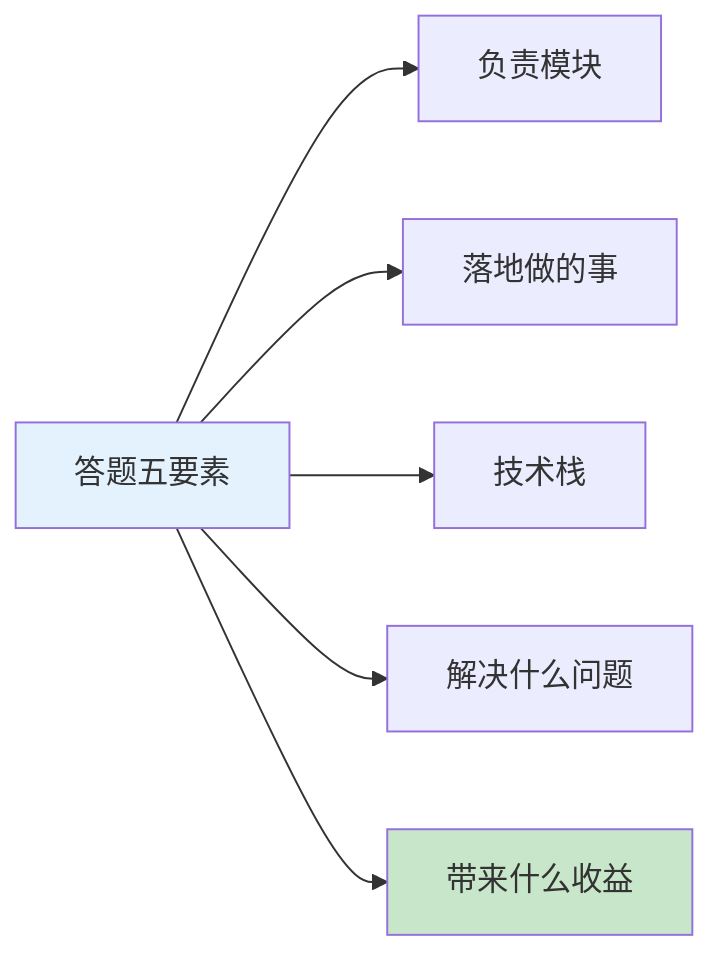
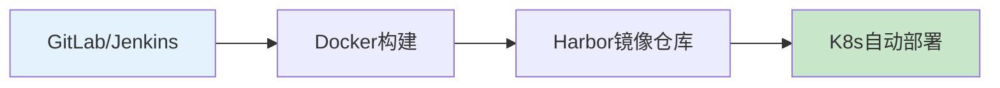
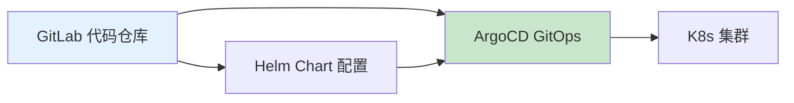
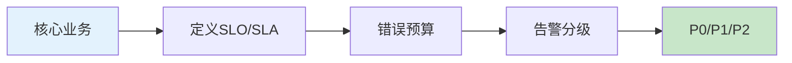
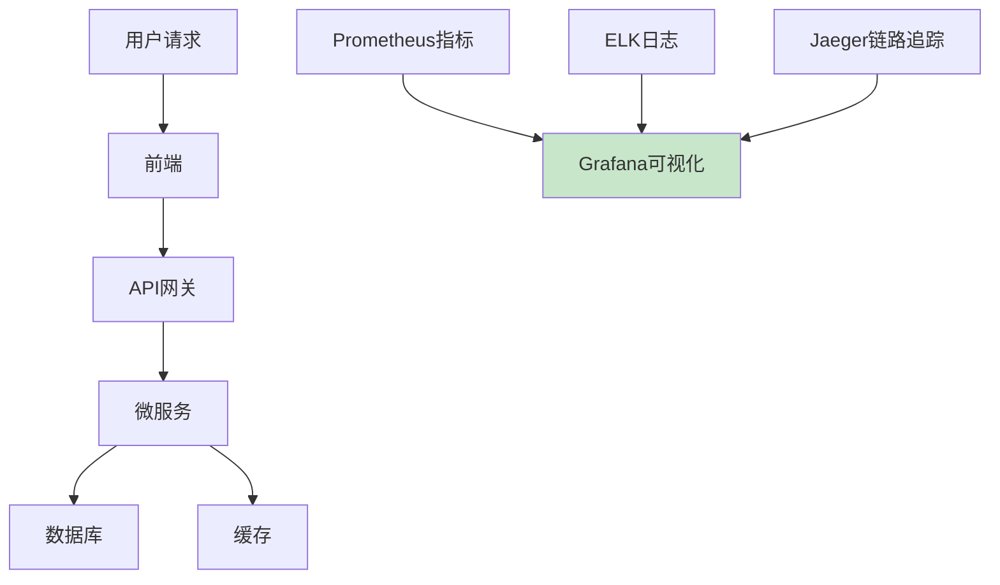
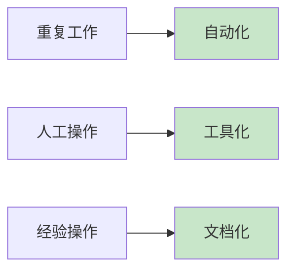

# DevOps/SRE日常工作生产环境最佳实践：三套面试回答模板+工程化落地指南

## 情境与背景

"你的日常工作是啥？" 是DevOps/SRE面试的**开篇高频题**，面试官通过这个问题快速判断你的真实经验、技术深度和项目落地能力。本文提供三套可直接背诵的回答模板（初级/中级/SRE资深），以及配套的工程化落地指南。

## 一、通用答题结构（必记）

**核心答题公式**：**负责模块 + 落地做的事 + 技术栈 + 解决什么问题 + 带来什么收益**



**面试加分话术**（随时插进去）：
- 我不只是做日常运维，更多是**用工程化、自动化思路，减少人工介入，提升研发效能和系统稳定性**。
- 遇到问题不只救火，会**复盘根因、固化规范、做自动化预防**。

---

## 二、模板一：初级DevOps（适合1-3年）

我日常主要负责公司**研发运维全流程落地**，具体做了这几块：

### 2.1 CI/CD流水线搭建



```groovy
// Jenkinsfile - CI/CD流水线示例
pipeline {
    agent any
    stages {
        stage('Git Checkout') {
            steps {
                git url: 'https://git.example.com/app.git'
            }
        }
        stage('Docker Build') {
            steps {
                sh 'docker build -t harbor.example.com/app:$BUILD_NUMBER .'
            }
        }
        stage('Push Image') {
            steps {
                sh 'docker push harbor.example.com/app:$BUILD_NUMBER'
            }
        }
        stage('K8s Deploy') {
            steps {
                sh 'helm upgrade --install app ./helm-chart --set image.tag=$BUILD_NUMBER'
            }
        }
    }
}
```

用 GitLab/Jenkins + Docker + Harbor + K8s，帮业务搭建自动化构建、镜像打包、自动部署流水线，替代原来手动打包上传，**从半小时部署缩短到5分钟**。

### 2.2 容器化迁移

```dockerfile
# Dockerfile 示例
FROM openjdk:11-jre-slim
WORKDIR /app
COPY target/app.jar app.jar
EXPOSE 8080
ENTRYPOINT ["java", "-jar", "app.jar"]
```

把传统虚拟机应用改成Docker容器化，统一运行环境，解决开发、测试、生产环境不一致导致的各种奇葩bug。

### 2.3 基础运维&环境管理

```yaml
# Namespace 资源配额
apiVersion: v1
kind: ResourceQuota
metadata:
  name: dev-quota
  namespace: dev
spec:
  hard:
    requests.cpu: "4"
    requests.memory: 8Gi
    limits.cpu: "8"
    limits.memory: 16Gi
```

负责测试/生产K8s集群日常维护、节点扩容、故障排查，配置Namespace、资源配额、权限RBAC管理。

### 2.4 监控告警落地

```yaml
# Prometheus 告警规则
groups:
- name: example_alerts
  rules:
  - alert: HighMemoryUsage
    expr: 100 - (node_memory_MemAvailable_bytes / node_memory_MemTotal_bytes * 100) > 80
    for: 5m
    labels:
      severity: warning
    annotations:
      summary: "服务器内存使用率过高"
```

用 Prometheus + Grafana + 钉钉告警，搭建服务器、容器、业务接口监控，CPU/内存/磁盘、接口响应时间实时监控，**提前发现隐患，减少突发故障**。

### 2.5 文档和规范

整理运维手册、部署规范、上线流程，把口头经验固化成文档，降低新人接手成本。

**技术栈**：Linux、Git、Docker、K8s、Jenkins、Prometheus、Shell脚本

---

## 三、模板二：中级DevOps（3-5年，偏工程化）

我主要负责**公司DevOps平台建设、云原生架构落地、研发效能提升**：

### 3.1 自研/落地DevOps平台



```yaml
# ArgoCD Application
apiVersion: argoproj.io/v1alpha1
kind: Application
metadata:
  name: my-app
  namespace: argocd
spec:
  project: default
  source:
    repoURL: https://git.example.com/app.git
    targetRevision: main
    path: helm-chart
  destination:
    server: https://kubernetes.default.svc
    namespace: prod
  syncPolicy:
    automated:
      prune: true
      selfHeal: true
```

基于GitLab + ArgoCD + Helm 搭建**GitOps持续交付体系**，实现配置声明式管理、环境一键发布、灰度/滚动发布策略，做到开发自助上线，无需运维介入。

### 3.2 K8s集群运维优化

```yaml
# HPA 自动扩缩容
apiVersion: autoscaling/v2
kind: HorizontalPodAutoscaler
metadata:
  name: my-app-hpa
spec:
  scaleTargetRef:
    apiVersion: apps/v1
    kind: Deployment
    name: my-app
  minReplicas: 3
  maxReplicas: 10
  metrics:
  - type: Resource
    resource:
      name: cpu
      target:
        type: Utilization
        averageUtilization: 60
```

负责多套K8s生产/测试集群规划、版本升级、节点管理，优化**资源调度、HPA自动扩缩容、污点容忍、亲和性调度**，提升集群资源利用率。

### 3.3 配置与中间件运维

```bash
# Redis 备份脚本
#!/bin/bash
REDIS_HOST="redis.example.com"
REDIS_PORT="6379"
BACKUP_DIR="/backup/redis"
DATE=$(date +%Y%m%d_%H%M%S)

redis-cli -h $REDIS_HOST -p $REDIS_PORT --rdb $BACKUP_DIR/redis-$DATE.rdb

# 保留7天备份
find $BACKUP_DIR -name "redis-*.rdb" -mtime +7 -delete
```

统一管理 Redis、MQ、MySQL 中间件部署、备份、迁移、日常巡检，制定定时备份、容灾恢复方案。

### 3.4 自动化&脚本赋能

```python
# Python 批量部署脚本
import subprocess
import paramiko

servers = ["192.168.1.101", "192.168.1.102", "192.168.1.103"]

for server in servers:
    ssh = paramiko.SSHClient()
    ssh.set_missing_host_key_policy(paramiko.AutoAddPolicy())
    ssh.connect(server, username="devops")
    
    stdin, stdout, stderr = ssh.exec_command("docker pull harbor.example.com/app:latest")
    print(stdout.read().decode())
    
    ssh.close()
```

用 Shell/Python 写自动化脚本，实现**服务器初始化、日志清理、批量部署、巡检自动化**，把重复人工工作全部自动化，节省大量运维人力。

### 3.5 稳定性与流程规范

制定**上线变更流程、故障应急流程、版本管理规范**，引入变更评审、灰度发布，降低上线故障率；配合研发做故障复盘，优化根因。

**亮点收益**：
研发交付周期从周级缩短到日级；集群资源利用率提升30%；线上变更故障下降明显。

---

## 四、模板三：SRE资深版（5年+，适合SRE/架构方向）

我的工作核心是**保障业务高可用、站点稳定性、容量规划、故障治理、SLO体系建设**：

### 4.1 SRE体系与SLO落地



```yaml
# SLO指标配置示例
SLIs:
  - name: api_availability
    objective: 99.9
    description: API接口可用性
    expression: sum(rate(http_requests_total{status!~"5.."}[1h])) / sum(rate(http_requests_total[1h]))

  - name: api_latency_p99
    objective: 500ms
    description: API P99延迟
    expression: histogram_quantile(0.99, sum(rate(http_request_duration_seconds_bucket[1h])) by (le))
```

定义核心业务SLO/SLA、错误预算，制定告警分级（P0/P1/P2），收敛无效告警，避免告警轰炸，聚焦真正影响用户的故障。

### 4.2 全链路监控与可观测性



搭建 **Prometheus + Grafana + ELK + Jaeger 链路追踪**，覆盖基础设施、容器、微服务、接口、日志全链路，故障时能快速定位到代码、节点、网络层。

### 4.3 高可用架构与容灾

```yaml
# 服务熔断降级配置（Resilience4j）
resilience4j:
  circuitbreaker:
    configs:
      default:
        failureRateThreshold: 50
        waitDurationInOpenState: 10s
        permittedNumberOfCallsInHalfOpenState: 3
    instances:
      orderService:
        baseConfig: default
```

负责业务**多可用区部署、异地多活、服务熔断降级、限流**配置，制定RTO/RPO容灾指标，定期做故障演练、容灾切换演练。

### 4.4 混沌工程&故障治理

```bash
# 混沌工程 - 模拟Pod驱逐
kubectl delete pod -l app=my-app --grace-period=0 --force

# 混沌工程 - 模拟网络延迟
tc qdisc add dev eth0 root netem delay 500ms
```

主动做混沌注入（节点下线、Pod驱逐、网络延迟），提前暴露架构短板；每次线上故障做**复盘RCA**，制定改进项跟进落地，避免重复踩坑。

### 4.5 容量规划与性能调优

```bash
# JVM 参数调优
JAVA_OPTS="-Xms4g -Xmx4g 
  -XX:+UseG1GC 
  -XX:MaxGCPauseMillis=200 
  -XX:InitiatingHeapOccupancyPercent=45 
  -XX:+HeapDumpOnOutOfMemoryError 
  -XX:HeapDumpPath=/heapdump"
```

做日常流量压测、全链路压测，评估大促/高峰容量需求，优化K8s内核参数、JVM参数、中间件配置，做资源削峰填谷，控制云资源成本。

### 4.6 GitOps & 基础设施即代码

```hcl
# Terraform 管理云资源
provider "aws" {
  region = "cn-north-1"
}

resource "aws_vpc" "main" {
  cidr_block = "10.0.0.0/16"
}

resource "aws_eks_cluster" "main" {
  name     = "my-cluster"
  role_arn = aws_iam_role.eks-cluster.arn
  version  = "1.27"
}
```

用 Terraform/CloudFormation 管理云资源，Helm管理应用发布，ArgoCD实现集群应用自动同步，所有基础设施和配置代码化、版本化、可回溯。

---

## 五、面试回答技巧与优化建议

### 5.1 如何把通用模板改成你的专属版本？

**三步定制法**：
1. **替换技术栈**：把GitLab/Jenkins/ArgoCD换成你实际用的工具
2. **加上具体数据**：比如"部署时间从30分钟降到5分钟"、"资源利用率提升30%"
3. **补充真实项目**：比如"当时公司有20个微服务要容器化"

### 5.2 面试官追问时的应对策略

| 追问场景 | 应对思路 | 示例回答 |
|:-------:|--------|--------|
| "具体怎么做的？" | 讲1-2个具体项目的细节 | "比如当时我们有个订单服务，经常因为环境不一致出问题，我牵头改成Docker容器化..." |
| "遇到过什么困难？" | 讲遇到的坑+解决方法 | "当时K8s集群升级遇到过Pod无法启动的问题，后来发现是CNI插件版本不兼容，通过滚动升级解决了..." |
| "你在项目里的角色？" | 讲清楚你是牵头人还是参与者 | "我是这个项目的负责人，从调研到落地都是我主导的..." |

---

## 六、工程化落地最佳实践总结

### 6.1 自动化优先原则



### 6.2 持续优化闭环

1. **发现问题** → 通过监控告警发现
2. **分析根因** → 复盘RCA
3. **解决问题** → 人工修复
4. **自动化预防** → 写脚本/工具自动解决
5. **固化规范** → 写文档、定流程

### 6.3 关键技术栈清单

| 类别 | 推荐工具 |
|:----:|--------|
| CI/CD | GitLab CI, Jenkins, GitHub Actions |
| 容器编排 | Kubernetes, Docker |
| GitOps | ArgoCD, Flux |
| 监控告警 | Prometheus, Grafana, Alertmanager |
| 日志 | ELK Stack, Loki |
| 链路追踪 | Jaeger, Zipkin |
| 基础设施即代码 | Terraform, Ansible |
| 配置管理 | Helm, Kustomize |

---

## 七、总结

### 7.1 核心要点

1. **回答要有结构**：按"模块+事情+技术栈+问题+收益"五要素
2. **要有数据支撑**：用具体数字体现成果
3. **按级别选模板**：初级讲执行落地，中级讲平台建设，资深讲体系优化
4. **体现工程化思维**：不只是做，还要思考如何做得更好

### 7.2 答题口诀

```
模块事情技术栈，问题收益是关键
按级选对模板用，张口就能说清楚
数据支撑显成果，工程思维是加分
```

> **参考链接**：[SRE运维面试题全解析：从理论到实践（第二部分）]()