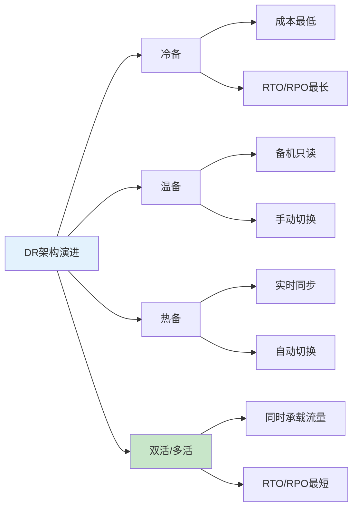
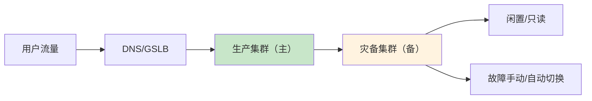
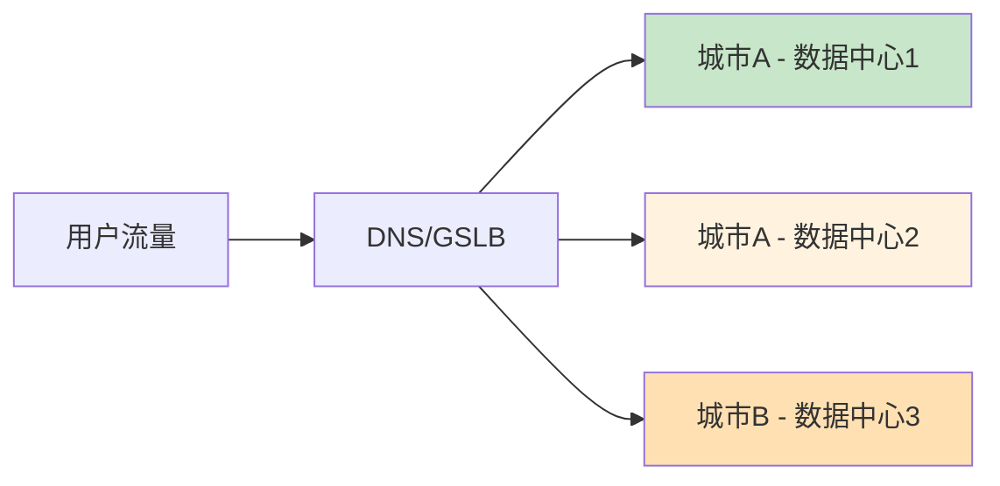
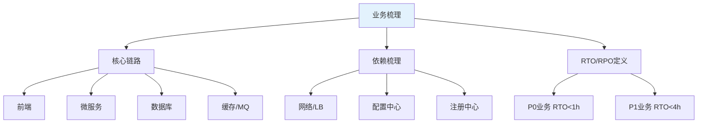
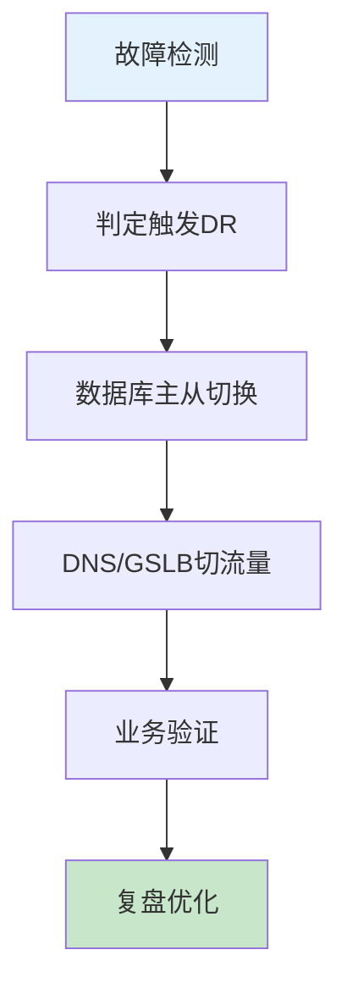

# DR灾备环境完整搭建流程生产环境最佳实践：SRE/DevOps面试版+实操步骤

## 情境与背景

DR（Disaster Recovery 容灾备份/灾难恢复）是保障极端情况下业务连续性的最后一道防线，核心目标是**生产故障后快速切换到灾备环境，业务不中断、数据不丢**。本文从实战角度出发，系统讲解DR灾备系统的核心概念、架构选型和生产环境落地完整流程。

## 一、先搞懂DR核心概念

**DR = Disaster Recovery 容灾备份/灾难恢复**

核心目标：**生产故障后，快速切换到灾备环境，业务不中断、数据不丢**

关键指标：
- **RTO (Recovery Time Objective)**：故障后恢复业务耗时
- **RPO (Recovery Point Objective)**：故障最多丢失多少数据

常见架构：**冷备、温备、热备、异地多活**



## 二、DR环境两种主流架构

### 2.1 主备模式（同城/异地 冷/温备）



生产集群（主） ↔ 灾备集群（备）

平时**备机闲置/只读**，故障手动/自动切换

### 2.2 双活/多活DR（企业生产主流）



两地三中心、多可用区同时承载流量，任意一端挂了业务自动切走

## 三、从零搭建DR环境标准步骤（面试+实操通用）

### 步骤1：业务与资源梳理

1. 梳理核心业务链路：前端、微服务、数据库、缓存、MQ、存储
2. 梳理依赖：网络、域名、LB、SSL、配置中心、注册中心
3. 定指标：定每个业务的 **RTO/RPO**、容忍故障级别（单节点/单AZ/整机房）



### 步骤2：底层基础设施DR规划

#### 2.1 网络层

```bash
# 专线/IPsec VPN配置示例
# ipsec.conf
config setup
    charondebug="ike 2, knl 2, cfg 2"

conn prod-dr
    keyexchange=ikev2
    left=%defaultroute
    leftid=@prod.example.com
    leftcert=prod-cert.pem
    leftsubnet=10.0.0.0/16
    right=dr.example.com
    rightid=@dr.example.com
    rightcert=dr-cert.pem
    rightsubnet=10.100.0.0/16
    auto=start
```

- 生产、灾备机房专线/IPsec VPN打通
- 规划独立网段，路由互通、安全组策略放行
- 跨区DNS、全局负载均衡GSLB预留

#### 2.2 服务器/容器层（K8s场景）

```yaml
# K8s DR集群配置对齐
# kubelet-config.yaml
apiVersion: kubelet.config.k8s.io/v1beta1
kind: KubeletConfiguration
cpuManagerPolicy: static
systemReserved:
  cpu: 100m
  memory: 1Gi
kubeReserved:
  cpu: 100m
  memory: 1Gi
```

- 灾备搭建同版本K8s集群，节点配置、OS内核参数和生产对齐
- 镜像统一存**跨区域Harbor/容器镜像仓库**，主备拉取同一镜像
- 使用**Namespace、RBAC、资源配额**和生产保持一致

### 步骤3：数据层DR配置（最核心）

#### 3.1 MySQL 数据库DR

```bash
# my.cnf - 生产主库配置
[mysqld]
server-id = 1
log-bin = mysql-bin
binlog-format = ROW
relay-log = relay-bin
read-only = 0
replicate-do-db = my_database
plugin-load-add = rpl_semi_sync_master.so
rpl-semi-sync-master-enabled = 1
rpl-semi-sync-slave-enabled = 1

# 主从同步检查
SHOW SLAVE STATUS\G
# 检查 Seconds_Behind_Master
```

- 主从复制：**生产主库 → 灾备从库 实时同步**
- 半同步复制，降低数据丢失
- 定时全量备份+binlog增量备份，落地到对象存储
- 故障切换：手动切换VIP / MHA / MGR 自动选主

#### 3.2 Redis DR

```bash
# Redis Sentinel配置 - 生产
port 26379
dir /tmp
sentinel monitor mymaster 192.168.1.101 6379 2
sentinel down-after-milliseconds mymaster 5000
sentinel parallel-syncs mymaster 1
sentinel failover-timeout mymaster 60000

# Redis Sentinel配置 - DR
port 26379
dir /tmp
sentinel monitor mymaster 10.100.1.101 6379 2
sentinel down-after-milliseconds mymaster 5000
```

- 主从复制 + 哨兵Sentinel
- 或 跨区域Redis集群同步
- 开启持久化RDB+AOF，定时备份上传云端

#### 3.3 MQ（RocketMQ/Kafka）

- 跨集群镜像同步、Topic配置同步
- 消息副本跨机房存储，避免单机房故障消息丢失

#### 3.4 文件/存储

```bash
# 文件同步脚本 - rsync示例
#!/bin/bash
PROD_NAS="/mnt/prod-nas"
DR_OBS="/mnt/dr-obs"

# 实时同步
inotifywait -m -r -e modify,create,delete "$PROD_NAS" | while read path action file; do
    rsync -avz --delete "$PROD_NAS/" "$DR_OBS/"
done
```

- 生产NAS/对象存储 → 灾备对象存储 **定时同步/实时同步**
- 重要配置、脚本、介质全量归档备份

### 步骤4：应用层DR部署

```yaml
# Helm Chart - 支持多环境
values-prod.yaml
namespace: prod
replicas: 3
resources:
  limits:
    cpu: "0.5"
    memory: "512Mi"

values-dr.yaml  
namespace: dr
replicas: 3
resources:
  limits:
    cpu: "0.5"
    memory: "512Mi"
```

1. 所有应用采用 **IaC 代码化**：Terraform/Helm/K8s YAML
2. 生产、灾备环境**同一套配置代码**，环境变量区分prod/dr
3. 通过 **ArgoCD/Flux GitOps** 同时同步部署到生产、DR集群
4. 配置**相同副本数、资源限制、HPA策略**

### 步骤5：配置与中间件DR

```yaml
# Nacos 配置同步
apiVersion: nacos.io/v1
kind: ConfigSync
metadata:
  name: prod-to-dr
spec:
  source:
    serverAddr: nacos-prod:8848
    namespace: prod
  target:
    serverAddr: nacos-dr:8848
    namespace: dr
  syncInterval: 60s
```

- Nacos/Apollo/配置中心：配置跨环境同步
- 注册中心Nacos/Eureka：DR集群独立注册，可互相发现
- 定时同步定时任务、定时脚本、运维配置

### 步骤6：监控、告警、可观测性DR

```yaml
# Prometheus 告警规则
groups:
- name: dr_alerts
  rules:
  - alert: DRSwitchRequired
    expr: sum(up{job="prod-app"}) == 0
    for: 5m
    labels:
      severity: critical
    annotations:
      summary: "生产集群完全不可用，触发DR切换"
```

1. 监控系统同时采集生产+DR集群指标
2. 告警分级：P0/P1故障触发DR切换预案
3. 日志ELK、链路追踪Jaeger 跨机房汇聚，方便故障排查

### 步骤7：切换预案与演练（SRE重点）

1. 编写**DR切换操作手册**：
   - 故障判定标准
   - DNS/GSLB切流量步骤
   - 数据库主从切换步骤
   - 服务启停、校验业务可用性

2. **定期容灾演练**：
   模拟单AZ宕机、节点下线、数据库故障，执行切换，校验RTO/RPO达标

3. 演练后复盘，优化切换流程



## 四、K8s环境DR最佳实践（面试必说）

1. 集群**多AZ部署**是最低成本DR
2. 所有资源YAML Helm化、Git托管，DR环境一键拉起
3. 镜像、配置、存储、数据**全链路跨区域同步**
4. 不依赖单机本地存储，全部用**PVC+共享存储/对象存储**
5. 用GSLB做域名流量自动调度，故障自动切DR

```yaml
# PVC - 使用共享存储
apiVersion: v1
kind: PersistentVolumeClaim
metadata:
  name: app-pvc
spec:
  storageClassName: shared-storage
  accessModes:
    - ReadWriteMany
  resources:
    requests:
      storage: 10Gi
```

## 五、DR切换操作手册模板

```markdown
# DR切换操作手册

## 1. 故障判定条件
- 生产集群所有节点不可用 > 5分钟
- 数据库主库不可用 > 10分钟

## 2. 切换步骤
### 2.1 数据库主从切换
```bash
# 1. 停止生产主库写入
mysql -h prod-db -e "FLUSH TABLES WITH READ LOCK;"

# 2. 提升DR从库为主
mysql -h dr-db -e "STOP SLAVE; RESET SLAVE ALL;"

# 3. 更新应用配置
kubectl patch cm app-config -p '{"data":{"DB_HOST":"dr-db"}}'
```

### 2.2 DNS/GSLB切流量
```bash
# 更新DNS记录到DR集群
aws route53 change-resource-record-sets --hosted-zone-id XXXX --change-batch '
{
  "Changes": [
    {
      "Action": "UPSERT",
      "ResourceRecordSet": {
        "Name": "app.example.com",
        "Type": "A",
        "TTL": 60,
        "ResourceRecords": [{"Value": "10.100.1.100"}]
      }
    }
  ]
}
'
```

## 3. 业务验证
- 检查核心API可用性
- 验证数据一致性
- 检查监控告警恢复
```

## 六、面试标准回答话术（直接背）

**标准版回答**：

我在公司负责搭建和落地**两地三中心DR灾备环境**，整体流程是：
首先梳理核心业务链路和依赖，定义各业务RTO/RPO指标；然后打通生产和灾备机房专线网络，搭建同版本K8s灾备集群；
数据层面做MySQL主从半同步复制、Redis哨兵跨机房同步、MQ消息镜像同步，同时把重要文件和配置定时归档到对象存储；
应用全部采用Helm+GitOps管理，通过ArgoCD同时发布到生产和DR集群，保证配置版本一致；
同时搭建跨环境统一监控告警和全链路日志追踪，编写完整DR切换预案，定期做容灾演练，模拟机房故障进行流量切换和数据库主从切换，验证灾备可用性，保障生产故障时可以快速切到DR环境，满足业务高可用要求。

**1分钟口述版**：

我搭建了两地三中心DR环境，先梳理业务定RTO/RPO，打通专线搭同版本K8s集群；数据层做MySQL主从、Redis哨兵同步；应用用Helm+GitOps发布到双环境；同时有统一监控和DR切换预案，定期做容灾演练，保障生产故障时能快速切DR。

## 七、总结

### 7.1 核心要点

1. **梳理指标先行**：先梳理业务链路，定义RTO/RPO
2. **数据同步核心**：数据层是DR的重中之重，保证数据不丢
3. **IaC代码化**：生产和DR环境同套代码，保证一致性
4. **定期演练验证**：只有经过演练的DR才是可靠的DR
5. **监控告警联动**：P0故障自动触发DR切换流程

### 7.2 DR口诀

```
梳理规划定指标，数据同步是核心
IaC代码化部署，定期演练保切换
```

> **参考链接**：[SRE运维面试题全解析：从理论到实践（第二部分）]()