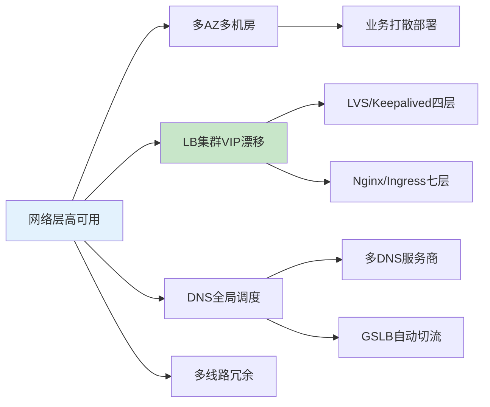
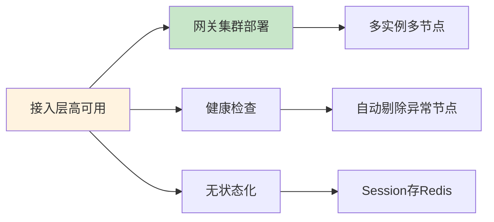
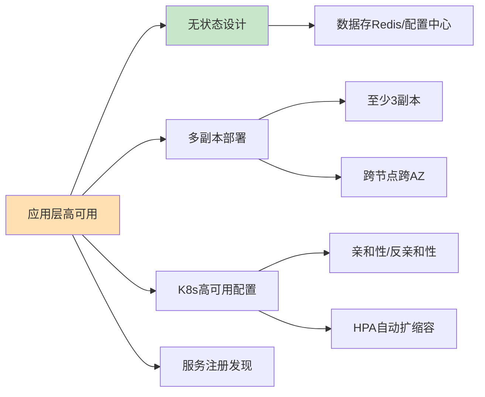
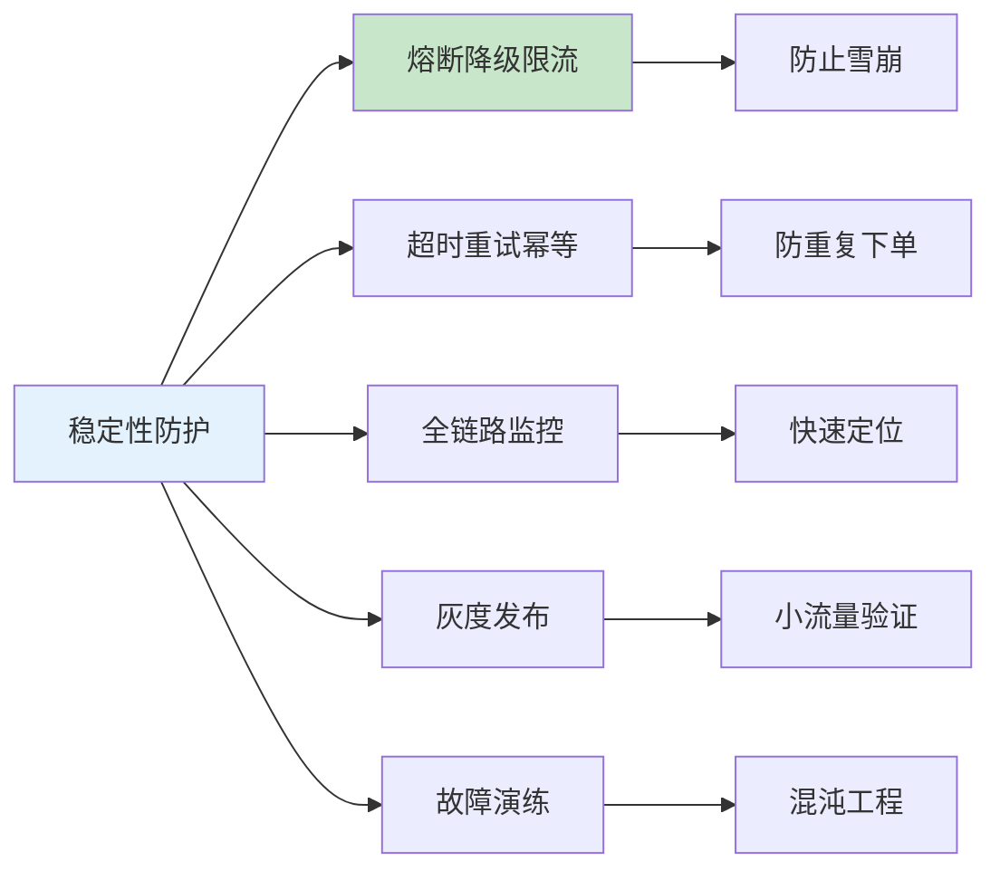

# 高可用HA环境搭建生产环境最佳实践：DevOps/SRE面试标准答法+实操全流程

## 情境与背景

高可用HA架构的核心目标是**消除单点故障**，任何一台服务器、一个节点、一个组件、一个机房挂了，业务都能**不中断、不宕机、自动容错**。这是DevOps/SRE面试的必考题，也是生产环境的基本要求。本文从实战角度出发，系统讲解高可用HA环境的分层搭建和标准落地流程。

## 一、高可用核心目标

**消除单点故障**，任何一台服务器、一个节点、一个组件、一个机房挂了，业务**不中断、不宕机、自动容错**。

核心关键词：**冗余、集群、故障自动转移、负载均衡、多AZ、限流熔断降级**

## 二、高可用分层搭建（从下到上逐层做）

### 2.1 网络层高可用



#### 2.1.1 多可用区/多机房部署
业务打散部署在不同AZ、不同机房，避免单机房整体故障。

#### 2.1.2 负载均衡LB高可用
- **四层**：LVS/Keepalived 主备漂移VIP
- **七层**：Nginx/Ingress 集群 + 上游LB
- LB本身做**集群冗余**，杜绝单个LB节点单点

```bash
# /etc/keepalived/keepalived.conf - 双机热备配置
global_defs {
    router_id LB01
}

vrrp_instance VI_1 {
    state MASTER
    interface eth0
    virtual_router_id 51
    priority 100
    advert_int 1
    virtual_ipaddress {
        192.168.1.100/24 dev eth0
    }
    track_script {
        chk_haproxy
    }
}

vrrp_script chk_haproxy {
    script "/usr/bin/killall -0 haproxy"
    interval 2
    weight 2
}
```

#### 2.1.3 DNS高可用
多DNS服务商、GSLB全局负载均衡，自动探测节点健康，异常自动切流量。

#### 2.1.4 多线路冗余
运营商双线、专线冗余，防止单链路断网。

### 2.2 接入层/网关层高可用



- Nginx/APIServer/网关 **集群部署**，多实例多节点
- 开启**健康检查、自动剔除异常节点**
- 会话保持无状态化，不依赖本地Session

### 2.3 应用服务层高可用（微服务/K8s）



#### 2.3.1 无状态设计
应用不存本地数据，所有会话、缓存放Redis/配置中心，随时扩缩容、随时重启不影响业务。

#### 2.3.2 多副本部署
每个服务至少 **3副本**，打散在不同节点、不同AZ。

#### 2.3.3 K8s高可用配置

```yaml
# deployment.yaml
apiVersion: apps/v1
kind: Deployment
metadata:
  name: my-service
spec:
  replicas: 3
  selector:
    matchLabels:
      app: my-service
  template:
    metadata:
      labels:
        app: my-service
    spec:
      affinity:
        podAntiAffinity:
          preferredDuringSchedulingIgnoredDuringExecution:
          - weight: 100
            podAffinityTerm:
              topologyKey: kubernetes.io/hostname
              labelSelector:
                matchLabels:
                  app: my-service
      containers:
      - name: my-service
        image: my-service:latest
        resources:
          limits:
            cpu: "0.5"
            memory: "512Mi"
        readinessProbe:
          httpGet:
            path: /actuator/health
            port: 8080
          initialDelaySeconds: 10
          periodSeconds: 5
        livenessProbe:
          httpGet:
            path: /actuator/health
            port: 8080
          initialDelaySeconds: 30
          periodSeconds: 10
```

- 节点**亲和性、反亲和性**，避免同一个服务都跑在同一台宿主机
- **Pod调度打散**跨机架、跨AZ
- **HPA自动扩缩容**，流量高峰自动加节点
- **污点与容忍**，核心服务隔离资源

#### 2.3.4 服务注册发现
Nacos/Consul/Eureka 集群部署，自身高可用，实例上下线自动感知。

### 2.4 中间件高可用

#### 2.4.1 MySQL高可用

```bash
# /etc/my.cnf - MySQL主从复制配置
[mysqld]
server-id = 1
log-bin = mysql-bin
binlog-format = ROW
relay-log = relay-bin
read-only = 0
replicate-do-db = my_database

# 主从同步检查
SHOW SLAVE STATUS\G
# 检查 Seconds_Behind_Master
```

- 主从架构 + MHA / MGR / 读写分离
- 多节点、半同步复制，避免数据丢失
- 定时全量备份+binlog增量备份

#### 2.4.2 Redis高可用

```bash
# Redis Sentinel配置
port 26379
dir /tmp
sentinel monitor mymaster 192.168.1.101 6379 2
sentinel down-after-milliseconds mymaster 5000
sentinel parallel-syncs mymaster 1
sentinel failover-timeout mymaster 60000
```

- 主从 + **哨兵Sentinel** 自动故障转移
- 或 Redis Cluster 集群分片高可用
- 开启RDB+AOF持久化

#### 2.4.3 MQ高可用（Kafka/RocketMQ）
- 多Broker节点、多副本
- 分区副本跨节点存放
- NameServer/Controller集群部署，无单点

### 2.5 配置&存储高可用

- 配置中心 Nacos/Apollo **集群部署**
- 存储用 **分布式存储 / 对象存储 / NAS**，不使用本地磁盘
- K8s 用 PVC 绑定共享存储，节点挂了Pod漂移数据不丢

### 2.6 稳定性防护高可用（SRE必讲）



#### 2.6.1 熔断、降级、限流、排队
防止下游故障拖垮全站，雪崩防护。

```java
import io.github.resilience4j.circuitbreaker.CircuitBreaker;
import io.github.resilience4j.circuitbreaker.CircuitBreakerConfig;
import io.github.resilience4j.ratelimiter.RateLimiter;
import io.github.resilience4j.ratelimiter.RateLimiterConfig;

@Service
public class OrderService {
    
    private final CircuitBreaker circuitBreaker;
    private final RateLimiter rateLimiter;
    
    public OrderService() {
        CircuitBreakerConfig cbConfig = CircuitBreakerConfig.custom()
            .failureRateThreshold(50)
            .waitDurationInOpenState(Duration.ofSeconds(10))
            .ringBufferSizeInHalfOpenState(3)
            .ringBufferSizeInClosedState(10)
            .build();
        
        RateLimiterConfig rlConfig = RateLimiterConfig.custom()
            .limitForPeriod(100)
            .limitRefreshPeriod(Duration.ofSeconds(1))
            .timeoutDuration(Duration.ofMillis(100))
            .build();
        
        this.circuitBreaker = CircuitBreaker.of("orderService", cbConfig);
        this.rateLimiter = RateLimiter.of("orderService", rlConfig);
    }
    
    @CircuitBreaker(name = "orderService", fallbackMethod = "fallback")
    @RateLimiter(name = "orderService")
    public Order createOrder(OrderRequest request) {
        return orderRepository.save(request);
    }
    
    public Order fallback(OrderRequest request, Exception e) {
        return new Order().setStatus("PENDING");
    }
}
```

#### 2.6.2 超时、重试、幂等
接口调用加超时控制、合理重试，接口幂等防重复下单/扣款。

#### 2.6.3 全链路监控告警
Prometheus + Grafana + 日志 + 链路追踪，提前发现隐患，故障快速定位。

```yaml
# prometheus/alerts.yaml
groups:
- name: high_availability_alerts
  rules:
  - alert: ServiceDown
    expr: up == 0
    for: 1m
    labels:
      severity: critical
    annotations:
      summary: "服务 {{ $labels.job }} 实例 {{ $labels.instance }} 不可用"
      
  - alert: HighErrorRate
    expr: 100 - (sum(rate(http_requests_total{status=~"2.."}[5m])) / sum(rate(http_requests_total[5m])) * 100) > 5
    for: 5m
    labels:
      severity: warning
    annotations:
      summary: "服务 {{ $labels.job }} 错误率过高"
```

#### 2.6.4 灰度发布 & 滚动更新
避免一次性全量发布出问题，小流量验证，逐步放量。

#### 2.6.5 故障演练 & 混沌工程
主动杀Pod、下线节点、模拟网络延迟，验证高可用是否真的扛得住。

## 三、一套标准高可用落地步骤（工作实操版）

| 步骤 | 动作 | 核心要点 |
|:----:|------|---------|
| 1 | 梳理业务链路 | 找出所有单点组件，逐个消除单点 |
| 2 | 底层网络规划 | 多AZ、多线路、LB集群 |
| 3 | 应用无状态化 | 多副本跨节点跨AZ部署 |
| 4 | 中间件集群化 | 数据库、缓存、MQ全部改成集群/主备自动切换架构 |
| 5 | 接入层集群 | 网关、配置中心、注册中心全部集群化 |
| 6 | 稳定性防护 | 加上限流熔断降级、超时重试幂等 |
| 7 | 监控与发布 | 配置监控告警、灰度发布流程 |
| 8 | 故障演练 | 定期做故障演练，验证高可用容灾能力 |

## 四、面试可直接背诵回答话术

**标准版回答**：

我在工作中主要从**分层架构**落地业务高可用：
首先网络和接入层做多可用区部署、LB负载均衡集群+DNS全局调度，消除网络单点；
应用侧统一做**无状态改造**，微服务多副本跨节点、跨AZ打散部署，基于K8s反亲和性保证不会集中在同一宿主机，配合HPA实现流量自动弹性扩缩容；
中间件层面，MySQL做主从复制+自动故障切换，Redis用哨兵集群实现主从自动漂移，Kafka/RocketMQ多副本分区存储，保证中间件层无单点；
同时引入服务熔断、降级、限流、超时重试和幂等设计，防止服务雪崩；
配合全链路监控、灰度发布和定期故障演练，从架构、部署、治理三个维度整体保障业务高可用，单节点、单AZ故障都不影响用户正常访问。

**1分钟口述版**：

我从分层架构落地高可用：网络层做多AZ多LB集群+DNS调度；应用侧无状态改造+3副本跨AZ打散，K8s反亲和+HPA弹性；中间件用MySQL主从+Redis哨兵+MQ多副本；配合熔断限流、超时重试幂等，加上全链路监控和定期故障演练，从架构、部署、治理三个维度保障业务高可用。

## 五、总结

### 5.1 核心要点

1. **消除单点故障**：所有关键组件必须冗余部署
2. **分层搭建**：从下到上逐层保障高可用
3. **自动化运维**：故障转移、扩容缩容自动化
4. **监控告警**：建立完整的监控体系，及时发现问题
5. **定期演练**：定期进行故障演练，验证高可用方案

### 5.2 高可用架构口诀

```
分层架构消单点，多AZ部署防故障
中间件集群自动切，监控演练保稳定
```

> **参考链接**：[SRE运维面试题全解析：从理论到实践（第二部分）]()