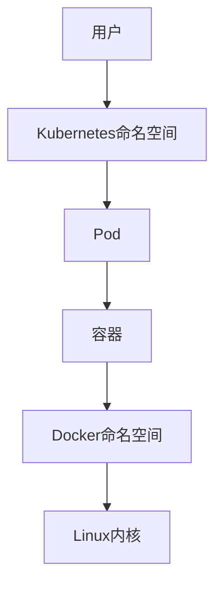

# Kubernetes与Docker命名空间深度解析：从内核到集群

## 情境(Situation)

在容器化和Kubernetes集群管理中，命名空间是一个核心概念。然而，Docker命名空间和Kubernetes命名空间是两个不同层次的概念，经常被混淆。

作为SRE工程师，我们需要深入理解这两种命名空间的工作原理、区别和最佳实践，以便在实际应用中正确使用它们，确保容器的隔离性和集群的管理效率。

## 冲突(Conflict)

在实际应用中，SRE工程师经常面临以下挑战：

- **概念混淆**：Docker命名空间和Kubernetes命名空间的概念混淆
- **资源隔离**：如何确保容器之间的资源隔离
- **集群管理**：如何在Kubernetes集群中有效管理资源
- **权限控制**：如何实现细粒度的权限控制
- **多环境隔离**：如何在单一集群中隔离多个环境

## 问题(Question)

如何正确理解和使用Docker命名空间和Kubernetes命名空间，确保容器的隔离性和集群的管理效率？

## 答案(Answer)

本文将从SRE视角出发，详细介绍Docker命名空间（内核级）和Kubernetes命名空间（用户级）的原理、区别和最佳实践，提供一套完整的命名空间管理解决方案。核心方法论基于 [SRE面试题解析：k8s和docker的名称空间有啥区别？](#59-k8s和docker的名称空间有啥区别)。

---

## 一、命名空间概述

### 1.1 命名空间定义

**命名空间**是一种资源隔离和管理机制，用于将一组资源与另一组资源隔离开来。在容器和集群管理中，命名空间起着至关重要的作用。

### 1.2 命名空间层次

**命名空间层次**：

| 层次 | 类型 | 实现 | 作用 |
|:------|:------|:------|:------|
| **内核级** | Docker命名空间 | Linux内核namespace | 容器资源隔离 |
| **用户级** | Kubernetes命名空间 | Kubernetes API | 集群资源管理 |

### 1.3 命名空间关系

**命名空间关系**：
- Docker命名空间是Kubernetes的底层基础
- Kubernetes命名空间是在Docker命名空间之上的集群管理机制
- 两者相互补充，共同构成完整的容器和集群管理体系

**关系示意图**：



---

## 二、Docker命名空间

### 2.1 Docker命名空间工作原理

**Docker命名空间**是Linux内核提供的资源隔离机制，通过不同类型的命名空间实现容器的隔离。

**工作原理**：
- 每个容器运行在一组独立的命名空间中
- 不同命名空间中的进程相互隔离
- 命名空间提供了轻量级的虚拟化机制

### 2.2 Docker命名空间类型

**Docker 6种命名空间**：

| 类型 | 英文名称 | 作用 | 示例 | 隔离效果 |
|:------|:------|:------|:------|:------|
| **PID** | Process ID | 隔离进程ID | 容器内PID=1 | 容器内进程看不到宿主机和其他容器的进程 |
| **Network** | Network | 隔离网络资源 | 独立IP地址、网络设备 | 容器拥有独立的网络栈 |
| **Mount** | Mount | 隔离文件系统挂载 | 独立文件系统视图 | 容器内看到的文件系统与宿主机不同 |
| **UTS** | Unix Time Sharing | 隔离主机名/域名 | 独立hostname | 容器有独立的主机名 |
| **IPC** | Inter-Process Communication | 隔离进程通信 | 消息队列、共享内存 | 容器内进程只能与同容器内的进程通信 |
| **User** | User | 隔离用户/组ID | 容器内root映射宿主机普通用户 | 容器内的用户与宿主机用户隔离 |

### 2.3 Docker命名空间实践

**Docker命名空间操作**：

1. **查看容器的命名空间**：

```bash
# 查看容器的PID
CONTAINER_ID=$(docker run -d --name test busybox sleep 3600)
CONTAINER_PID=$(docker inspect --format '{{ "{{" }}.State.Pid}}' $CONTAINER_ID)

# 查看容器的命名空间
ls -la /proc/$CONTAINER_PID/ns/
```

2. **进入容器的命名空间**：

```bash
# 使用nsenter进入容器的PID命名空间
sudo nsenter --pid=/proc/$CONTAINER_PID/ns/pid /bin/bash

# 进入容器的网络命名空间
sudo nsenter --net=/proc/$CONTAINER_PID/ns/net /bin/bash
```

3. **Docker命名空间配置**：

```bash
# 共享网络命名空间
docker run --name container1 -d busybox sleep 3600
docker run --name container2 --network container:container1 -d busybox sleep 3600

# 共享PID命名空间
docker run --name container1 -d busybox sleep 3600
docker run --name container2 --pid container:container1 -d busybox sleep 3600

# 共享IPC命名空间
docker run --name container1 -d busybox sleep 3600
docker run --name container2 --ipc container:container1 -d busybox sleep 3600

# 禁用网络命名空间
docker run --name container1 --network none -d busybox sleep 3600

# 使用宿主机网络命名空间
docker run --name container1 --network host -d busybox sleep 3600
```

### 2.4 Docker命名空间安全

**Docker命名空间安全考虑**：

1. **User命名空间**：
   - 启用User命名空间，将容器内的root用户映射到宿主机的普通用户
   - 减少容器逃逸的风险

2. **Network命名空间**：
   - 限制容器的网络访问
   - 使用网络策略控制容器间通信

3. **Mount命名空间**：
   - 限制容器的文件系统访问
   - 使用只读挂载保护关键目录

4. **PID命名空间**：
   - 防止容器内进程看到宿主机进程
   - 减少信息泄露

**启用User命名空间**：

```bash
# 编辑Docker配置文件
sudo vi /etc/docker/daemon.json

# 添加User命名空间配置
{
  "userns-remap": "default"
}

# 重启Docker服务
sudo systemctl restart docker
```

---

## 三、Kubernetes命名空间

### 3.1 Kubernetes命名空间工作原理

**Kubernetes命名空间**是集群级别的资源管理机制，用于逻辑分组和隔离集群资源。

**工作原理**：
- 命名空间是Kubernetes API中的一个资源对象
- 资源名称在命名空间内必须唯一，但可以在不同命名空间中重复
- 命名空间可以用于多环境隔离、多租户管理和权限控制

### 3.2 Kubernetes命名空间类型

**Kubernetes默认命名空间**：

| 命名空间 | 用途 | 特点 |
|:------|:------|:------|
| **default** | 默认命名空间 | 未指定命名空间的资源会被创建到这里 |
| **kube-system** | 系统组件 | 存放Kubernetes系统组件 |
| **kube-public** | 公共资源 | 所有用户（包括未认证用户）都可以访问 |
| **kube-node-lease** | 节点租约 | 用于节点心跳检测 |

**自定义命名空间**：
- 可以根据业务需求创建自定义命名空间
- 适合多环境隔离（如dev、staging、prod）
- 适合多租户管理

### 3.3 Kubernetes命名空间操作

**Kubernetes命名空间管理**：

1. **创建命名空间**：

```bash
# 使用kubectl创建命名空间
kubectl create namespace dev

# 使用YAML文件创建命名空间
cat <<EOF | kubectl apply -f -
apiVersion: v1
kind: Namespace
metadata:
  name: dev
  labels:
    environment: development
EOF
```

2. **查看命名空间**：

```bash
# 查看所有命名空间
kubectl get namespaces

# 查看命名空间详情
kubectl describe namespace dev
```

3. **删除命名空间**：

```bash
# 删除命名空间（会删除命名空间内的所有资源）
kubectl delete namespace dev
```

4. **在命名空间中创建资源**：

```bash
# 在指定命名空间中创建资源
kubectl create deployment nginx --image=nginx -n dev

# 查看指定命名空间中的资源
kubectl get pods -n dev
```

### 3.4 Kubernetes命名空间资源管理

**资源配额**：

1. **创建资源配额**：

```yaml
# resource-quota.yaml
apiVersion: v1
kind: ResourceQuota
metadata:
  name: dev-quota
  namespace: dev
spec:
  hard:
    pods: "10"
    requests.cpu: "4"
    requests.memory: 4Gi
    limits.cpu: "8"
    limits.memory: 8Gi
    requests.storage: 10Gi
```

```bash
# 应用资源配额
kubectl apply -f resource-quota.yaml

# 查看资源配额
kubectl get resourcequota -n dev
```

2. **创建限制范围**：

```yaml
# limit-range.yaml
apiVersion: v1
kind: LimitRange
metadata:
  name: dev-limits
  namespace: dev
spec:
  limits:
  - default:
      cpu: "1"
      memory: 512Mi
    defaultRequest:
      cpu: "500m"
      memory: 256Mi
    type: Container
```

```bash
# 应用限制范围
kubectl apply -f limit-range.yaml

# 查看限制范围
kubectl get limitrange -n dev
```

### 3.5 Kubernetes命名空间权限管理

**RBAC权限控制**：

1. **创建角色**：

```yaml
# role.yaml
apiVersion: rbac.authorization.k8s.io/v1
kind: Role
metadata:
  name: dev-reader
  namespace: dev
rules:
- apiGroups: [""]
  resources: ["pods", "services", "configmaps"]
  verbs: ["get", "list", "watch"]
```

```bash
# 应用角色
kubectl apply -f role.yaml
```

2. **创建角色绑定**：

```yaml
# role-binding.yaml
apiVersion: rbac.authorization.k8s.io/v1
kind: RoleBinding
metadata:
  name: dev-reader-binding
  namespace: dev
subjects:
- kind: User
  name: alice
  apiGroup: rbac.authorization.k8s.io
roleRef:
  kind: Role
  name: dev-reader
  apiGroup: rbac.authorization.k8s.io
```

```bash
# 应用角色绑定
kubectl apply -f role-binding.yaml
```

3. **集群角色和集群角色绑定**：

```yaml
# cluster-role.yaml
apiVersion: rbac.authorization.k8s.io/v1
kind: ClusterRole
metadata:
  name: cluster-reader
rules:
- apiGroups: [""]
  resources: ["namespaces", "nodes"]
  verbs: ["get", "list", "watch"]
```

```yaml
# cluster-role-binding.yaml
apiVersion: rbac.authorization.k8s.io/v1
kind: ClusterRoleBinding
metadata:
  name: cluster-reader-binding
subjects:
- kind: User
  name: bob
  apiGroup: rbac.authorization.k8s.io
roleRef:
  kind: ClusterRole
  name: cluster-reader
  apiGroup: rbac.authorization.k8s.io
```

---

## 四、Docker命名空间与Kubernetes命名空间对比

### 4.1 核心区别

**Docker命名空间 vs Kubernetes命名空间**：

| 对比项 | Docker命名空间 | Kubernetes命名空间 |
|:------|:------|:------|
| **级别** | 内核级 | 用户级 |
| **目的** | 容器资源隔离 | 集群资源管理 |
| **实现** | Linux内核namespace | Kubernetes API |
| **数量** | 固定6种 | 可自定义 |
| **范围** | 单个容器 | 整个集群 |
| **管理方式** | Docker命令 | kubectl命令 |
| **资源隔离** | 强隔离（内核级） | 逻辑隔离（用户级） |
| **权限控制** | 有限 | 细粒度（RBAC） |
| **资源管理** | 无 | 支持资源配额 |
| **多环境隔离** | 不支持 | 支持 |

### 4.2 联系与协作

**联系与协作**：

1. **层次关系**：
   - Docker命名空间是底层基础，提供容器级别的隔离
   - Kubernetes命名空间是上层管理，提供集群级别的资源管理

2. **协作方式**：
   - Kubernetes通过Pod管理容器
   - 每个Pod可以包含多个容器，这些容器共享某些Docker命名空间
   - Pod之间通过Kubernetes命名空间进行逻辑隔离

3. **最佳实践**：
   - 结合使用Docker命名空间和Kubernetes命名空间
   - 利用Docker命名空间的强隔离性
   - 利用Kubernetes命名空间的资源管理和权限控制能力

### 4.3 选择建议

**选择建议**：

| 场景 | 选择 | 原因 |
|:------|:------|:------|
| **容器隔离** | Docker命名空间 | 提供内核级的强隔离 |
| **多环境隔离** | Kubernetes命名空间 | 提供逻辑隔离和资源管理 |
| **多租户管理** | Kubernetes命名空间 | 支持RBAC权限控制 |
| **资源限制** | Kubernetes命名空间 + 资源配额 | 细粒度的资源管理 |
| **权限控制** | Kubernetes命名空间 + RBAC | 细粒度的权限管理 |

---

## 五、多环境隔离最佳实践

### 5.1 多环境隔离方案

**多环境隔离方案**：

| 方案 | 特点 | 适用场景 | 优点 | 缺点 |
|:------|:------|:------|:------|:------|
| **单集群多命名空间** | 在单个集群中使用不同命名空间 | 开发、测试、预发布环境 | 资源利用率高，管理简单 | 存在一定的安全风险 |
| **多集群** | 每个环境使用独立集群 | 生产环境 | 完全隔离，安全可靠 | 资源利用率低，管理复杂 |
| **混合方案** | 关键环境使用独立集群，非关键环境使用命名空间 | 混合环境 | 平衡隔离性和资源利用率 | 管理复杂度中等 |

### 5.2 单集群多命名空间配置

**单集群多命名空间配置**：

1. **创建命名空间**：

```yaml
# namespaces.yaml
apiVersion: v1
kind: Namespace
metadata:
  name: dev
  labels:
    environment: development
---
apiVersion: v1
kind: Namespace
metadata:
  name: staging
  labels:
    environment: staging
---
apiVersion: v1
kind: Namespace
metadata:
  name: prod
  labels:
    environment: production
```

2. **配置资源配额**：

```yaml
# dev-quota.yaml
apiVersion: v1
kind: ResourceQuota
metadata:
  name: dev-quota
  namespace: dev
spec:
  hard:
    pods: "20"
    requests.cpu: "10"
    requests.memory: 20Gi
    limits.cpu: "20"
    limits.memory: 40Gi
```

```yaml
# prod-quota.yaml
apiVersion: v1
kind: ResourceQuota
metadata:
  name: prod-quota
  namespace: prod
spec:
  hard:
    pods: "50"
    requests.cpu: "50"
    requests.memory: 100Gi
    limits.cpu: "100"
    limits.memory: 200Gi
```

3. **配置RBAC权限**：

```yaml
# dev-role.yaml
apiVersion: rbac.authorization.k8s.io/v1
kind: Role
metadata:
  name: dev-admin
  namespace: dev
rules:
- apiGroups: ["", "apps", "extensions"]
  resources: ["*"]
  verbs: ["*"]
```

```yaml
# prod-role.yaml
apiVersion: rbac.authorization.k8s.io/v1
kind: Role
metadata:
  name: prod-reader
  namespace: prod
rules:
- apiGroups: ["", "apps", "extensions"]
  resources: ["pods", "services", "deployments"]
  verbs: ["get", "list", "watch"]
```

4. **配置网络策略**：

```yaml
# network-policy.yaml
apiVersion: networking.k8s.io/v1
kind: NetworkPolicy
metadata:
  name: prod-network-policy
  namespace: prod
spec:
  podSelector: {}
  policyTypes:
  - Ingress
  - Egress
  ingress:
  - from:
    - namespaceSelector:
        matchLabels:
          environment: staging
    ports:
    - protocol: TCP
      port: 80
  egress:
  - to:
    - namespaceSelector:
        matchLabels:
          name: kube-system
    ports:
    - protocol: TCP
      port: 53
    - protocol: UDP
      port: 53
```

### 5.3 跨命名空间访问

**跨命名空间访问**：

1. **服务访问**：
   - 使用`service.namespace.svc.cluster.local`格式访问其他命名空间的服务

2. **配置示例**：

```yaml
# service.yaml
apiVersion: v1
kind: Service
metadata:
  name: api
  namespace: backend
spec:
  selector:
    app: api
  ports:
  - port: 80
    targetPort: 8080
```

```yaml
# frontend-deployment.yaml
apiVersion: apps/v1
kind: Deployment
metadata:
  name: frontend
  namespace: frontend
spec:
  replicas: 3
  selector:
    matchLabels:
      app: frontend
  template:
    metadata:
      labels:
        app: frontend
    spec:
      containers:
      - name: frontend
        image: frontend:latest
        env:
        - name: API_URL
          value: "http://api.backend.svc.cluster.local"
```

3. **服务发现**：
   - 使用DNS进行服务发现
   - 配置CoreDNS实现跨命名空间服务发现

---

## 六、监控与告警

### 6.1 Docker命名空间监控

**Docker命名空间监控**：

1. **监控指标**：
   - 容器资源使用情况（CPU、内存、磁盘、网络）
   - 容器状态
   - 命名空间隔离状态

2. **监控工具**：
   - Docker stats
   - cAdvisor
   - Prometheus + Grafana

3. **Docker stats**：

```bash
# 查看容器资源使用情况
docker stats

# 查看特定容器的资源使用情况
docker stats container_name
```

4. **cAdvisor**：

```bash
# 运行cAdvisor
docker run \
  --volume=/:/rootfs:ro \
  --volume=/var/run:/var/run:ro \
  --volume=/sys:/sys:ro \
  --volume=/var/lib/docker/:/var/lib/docker:ro \
  --publish=8080:8080 \
  --detach=true \
  --name=cadvisor \
  gcr.io/cadvisor/cadvisor:latest
```

### 6.2 Kubernetes命名空间监控

**Kubernetes命名空间监控**：

1. **监控指标**：
   - 命名空间资源使用情况
   - 命名空间资源配额使用情况
   - 命名空间内资源状态
   - 命名空间事件

2. **监控工具**：
   - kubectl
   - Prometheus + Grafana
   - Kubernetes Dashboard

3. **kubectl监控**：

```bash
# 查看命名空间资源使用情况
kubectl top namespace

# 查看命名空间内资源使用情况
kubectl top pods -n dev

# 查看命名空间事件
kubectl get events -n dev
```

4. **Prometheus监控**：

```yaml
# prometheus.yml
scrape_configs:
  - job_name: 'kubernetes-namespaces'
    kubernetes_sd_configs:
    - role: namespace
    relabel_configs:
    - source_labels: [__meta_kubernetes_namespace]
      action: keep
      regex: .+
```

5. **Grafana面板**：
   - 命名空间资源使用情况
   - 命名空间资源配额使用情况
   - 命名空间内资源状态

### 6.3 告警策略

**告警规则**：

1. **Docker命名空间告警**：
   - 容器资源使用超过阈值
   - 容器状态异常
   - 命名空间隔离失败

2. **Kubernetes命名空间告警**：
   - 命名空间资源使用超过配额
   - 命名空间内资源状态异常
   - 命名空间事件异常

**Prometheus告警规则**：

```yaml
# 命名空间资源使用告警
groups:
- name: namespace_alerts
  rules:
  - alert: NamespaceResourceQuotaExceeded
    expr: sum(kube_pod_container_resource_requests{resource="cpu"}) by (namespace) > sum(kube_resourcequota{resource="cpu",scope="requests"}) by (namespace) * 0.9
    for: 5m
    labels:
      severity: warning
    annotations:
      summary: "命名空间资源配额即将耗尽"
      description: "命名空间 {{ "{{" }} $labels.namespace }} 的CPU请求已使用90%以上"

  - alert: NamespacePodLimitExceeded
    expr: kube_namespace_status_pods_available{namespace=~"dev|staging|prod"} > kube_resourcequota{resource="pods"} by (namespace)
    for: 5m
    labels:
      severity: critical
    annotations:
      summary: "命名空间Pod数量超过限制"
      description: "命名空间 {{ "{{" }} $labels.namespace }} 的Pod数量已超过限制"
```

---

## 七、最佳实践总结

### 7.1 核心原则

**命名空间管理核心原则**：

1. **层次分明**：明确Docker命名空间和Kubernetes命名空间的层次关系
2. **隔离适当**：根据需求选择合适的隔离级别
3. **资源管理**：合理配置资源配额和限制范围
4. **权限控制**：使用RBAC实现细粒度的权限控制
5. **多环境隔离**：根据环境重要性选择合适的隔离方案
6. **监控告警**：建立完善的监控和告警机制
7. **安全配置**：加强命名空间的安全配置

### 7.2 配置建议

**生产环境配置清单**：
- [ ] 启用Docker User命名空间，提高容器安全性
- [ ] 为不同环境创建独立的Kubernetes命名空间
- [ ] 配置资源配额和限制范围
- [ ] 实现RBAC权限控制
- [ ] 配置网络策略，限制跨命名空间访问
- [ ] 建立监控和告警机制
- [ ] 定期审计命名空间配置
- [ ] 备份命名空间配置

**推荐配置**：
- **开发环境**：单集群多命名空间，资源配额适中
- **测试环境**：单集群多命名空间，资源配额接近生产
- **预发布环境**：单集群多命名空间，资源配额与生产一致
- **生产环境**：独立集群或严格隔离的命名空间

### 7.3 经验总结

**常见误区**：
- **概念混淆**：将Docker命名空间和Kubernetes命名空间混为一谈
- **过度隔离**：使用过多的命名空间，增加管理复杂度
- **资源配置不当**：资源配额设置不合理，导致资源浪费或不足
- **权限配置过松**：RBAC权限控制不足，存在安全风险
- **监控不足**：没有建立完善的监控和告警机制

**成功经验**：
- **合理规划**：根据业务需求和环境重要性规划命名空间
- **资源管理**：合理配置资源配额，避免资源浪费
- **权限控制**：使用RBAC实现细粒度的权限控制
- **网络隔离**：配置网络策略，限制跨命名空间访问
- **监控告警**：建立完善的监控和告警机制
- **定期审计**：定期审计命名空间配置，确保安全和合规

---

## 总结

Docker命名空间和Kubernetes命名空间是容器和集群管理中的核心概念，它们分别在不同层次上提供了资源隔离和管理能力。通过本文介绍的最佳实践，您可以构建一个高效、安全、可靠的容器和集群管理系统。

**核心要点**：

1. **层次关系**：Docker命名空间是内核级的资源隔离机制，Kubernetes命名空间是用户级的资源管理机制
2. **隔离级别**：Docker命名空间提供强隔离，Kubernetes命名空间提供逻辑隔离
3. **资源管理**：Kubernetes命名空间支持资源配额和限制范围
4. **权限控制**：Kubernetes命名空间支持RBAC权限控制
5. **多环境隔离**：根据环境重要性选择合适的隔离方案
6. **监控告警**：建立完善的监控和告警机制
7. **安全配置**：加强命名空间的安全配置

通过遵循这些最佳实践，我们可以构建一个高性能、高可用、安全的容器和集群管理系统，为业务应用提供可靠的运行环境。

> **延伸学习**：更多面试相关的命名空间知识，请参考 [SRE面试题解析：k8s和docker的名称空间有啥区别？](#59-k8s和docker的名称空间有啥区别)。

---

## 参考资料

- [Docker官方文档](https://docs.docker.com/)
- [Kubernetes官方文档](https://kubernetes.io/docs/)
- [Linux命名空间文档](https://man7.org/linux/man-pages/man7/namespaces.7.html)
- [Docker命名空间详解](https://docs.docker.com/engine/reference/run/#network-settings)
- [Kubernetes命名空间文档](https://kubernetes.io/docs/concepts/overview/working-with-objects/namespaces/)
- [Kubernetes资源配额](https://kubernetes.io/docs/concepts/policy/resource-quotas/)
- [Kubernetes RBAC](https://kubernetes.io/docs/reference/access-authn-authz/rbac/)
- [Kubernetes网络策略](https://kubernetes.io/docs/concepts/services-networking/network-policies/)
- [Docker安全最佳实践](https://docs.docker.com/engine/security/)
- [Kubernetes安全最佳实践](https://kubernetes.io/docs/concepts/security/)
- [Prometheus监控](https://prometheus.io/docs/introduction/overview/)
- [Grafana面板](https://grafana.com/grafana/dashboards/)
- [cAdvisor监控](https://github.com/google/cadvisor)
- [Kubernetes多环境隔离](https://kubernetes.io/docs/setup/multiple-clusters/)
- [Kubernetes多租户管理](https://kubernetes.io/docs/concepts/security/multitenancy/)
- [容器安全](https://www.cncf.io/blog/2021/08/31/container-security-best-practices/)
- [集群安全](https://kubernetes.io/docs/tasks/administer-cluster/securing-a-cluster/)