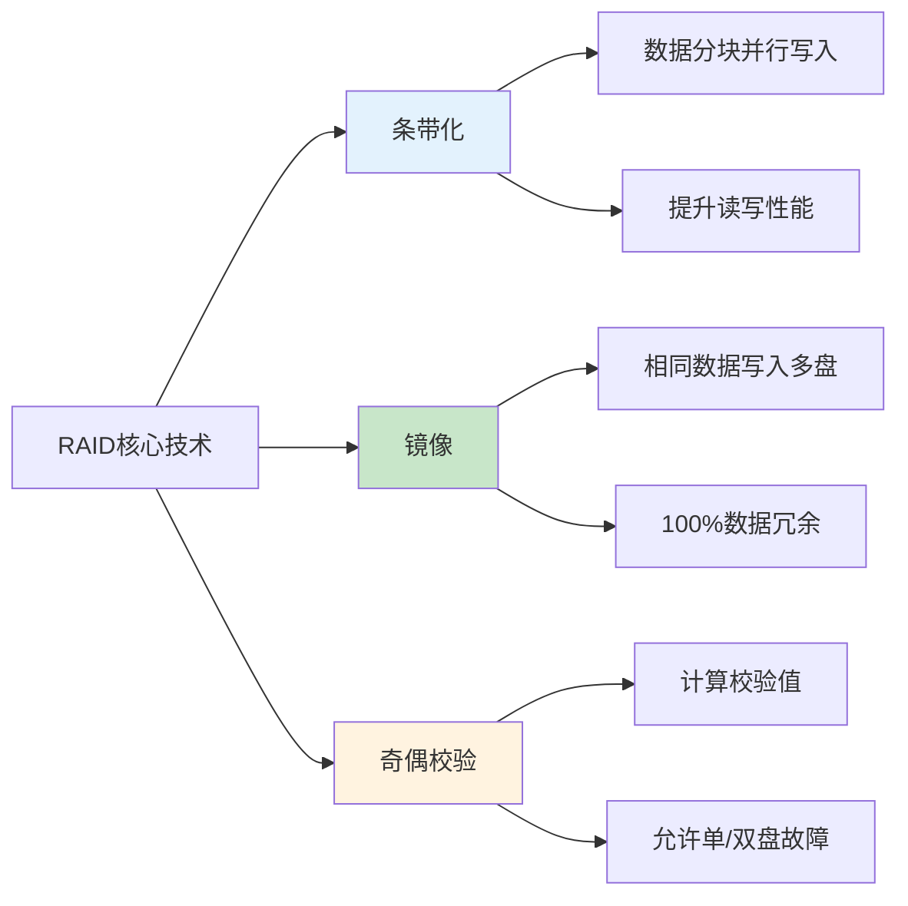
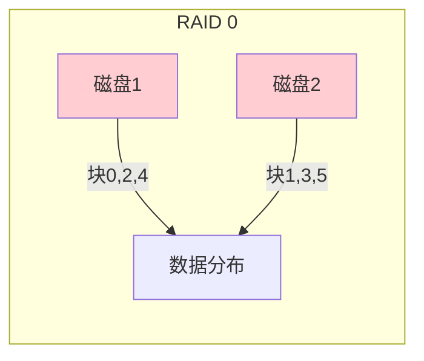
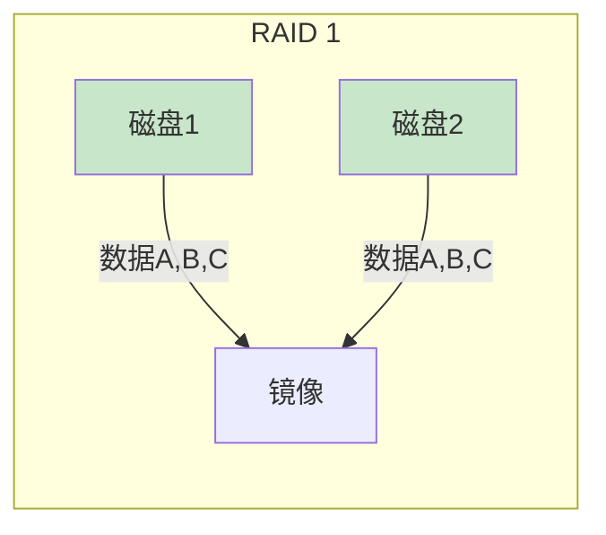
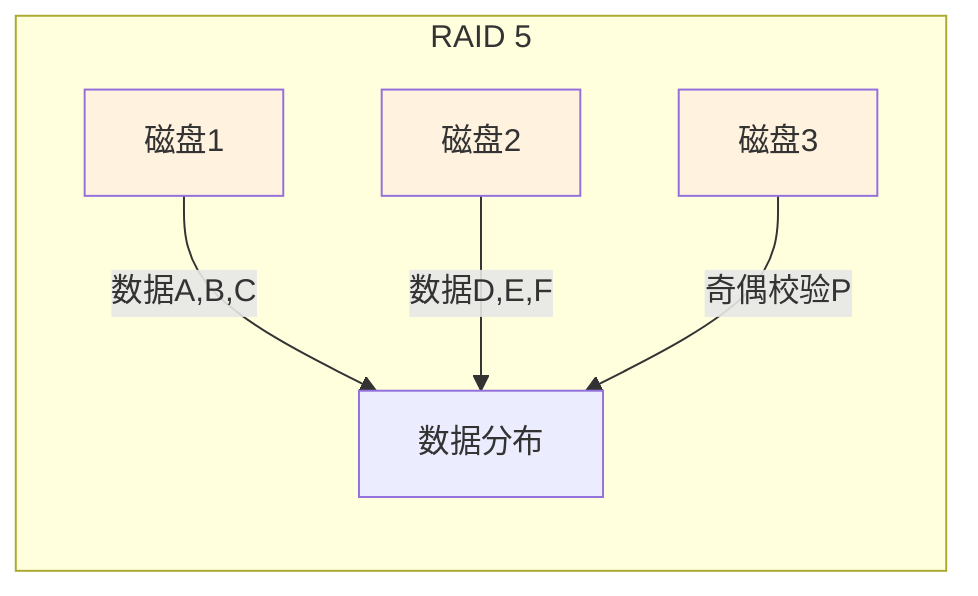
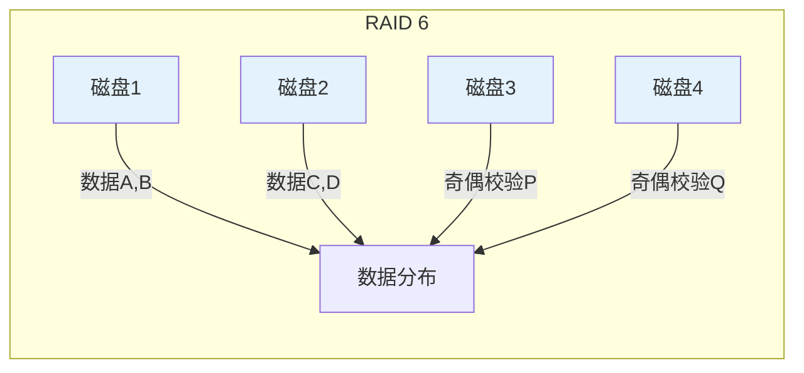
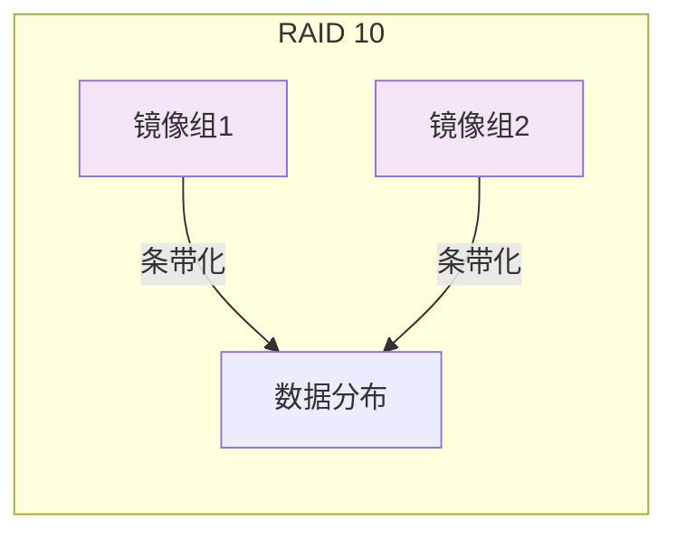
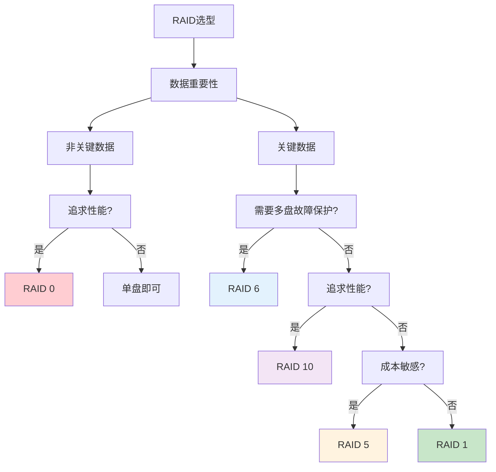

# RAID存储技术详解：生产环境选型与部署指南

## 情境与背景

RAID（Redundant Array of Independent Disks）是企业级存储系统的核心技术，通过将多个物理磁盘组合成逻辑卷，实现**数据冗余、性能提升和容量扩展**。在生产环境中，正确选择和配置RAID级别直接关系到数据安全和系统性能。本文从DevOps/SRE视角，深入剖析常见RAID级别的技术原理、适用场景和生产环境最佳实践。

## 一、RAID核心概念

### 1.1 什么是RAID

RAID是一种**数据存储虚拟化技术**，通过将多个独立磁盘组合成一个逻辑单元，提供以下核心能力：

- **数据冗余**：通过镜像或奇偶校验实现数据容错
- **性能提升**：通过条带化并行读写提升IO性能
- **容量扩展**：将多块磁盘容量合并使用

### 1.2 RAID核心技术

| 技术 | 原理 | 作用 |
|:----:|------|------|
| **条带化** | 数据分成块，轮流写入不同磁盘 | 提升读写性能 |
| **镜像** | 数据同时写入多个磁盘 | 实现冗余，提升读性能 |
| **奇偶校验** | 计算校验值存储，用于数据恢复 | 实现冗余，节省空间 |



## 二、常见RAID级别详解

### 2.1 RAID 0：条带化

**原理**：将数据分成相等大小的块，依次写入不同磁盘

**特点**：

| 特性 | 说明 |
|:----:|------|
| **最小磁盘数** | 2 |
| **冗余能力** | 无（一块盘故障全部数据丢失） |
| **读性能** | 高（多盘并行读取） |
| **写性能** | 高（多盘并行写入） |
| **空间利用率** | 100% |
| **成本** | 低 |

**适用场景**：
- 临时数据存储
- 缓存层
- 视频编辑等需要高IO性能的场景
- **不适合生产关键数据**

**示意图**：



### 2.2 RAID 1：镜像

**原理**：相同数据同时写入两块磁盘，形成镜像对

**特点**：

| 特性 | 说明 |
|:----:|------|
| **最小磁盘数** | 2 |
| **冗余能力** | 允许1盘故障 |
| **读性能** | 高（双盘并行读取） |
| **写性能** | 一般（需要写两次） |
| **空间利用率** | 50% |
| **成本** | 高 |

**适用场景**：
- 操作系统盘
- 关键数据库日志
- 重要配置文件
- 任何需要高可靠性的场景

**示意图**：



### 2.3 RAID 5：分布式奇偶校验

**原理**：数据条带化分布，奇偶校验信息分散存储在所有磁盘上

**特点**：

| 特性 | 说明 |
|:----:|------|
| **最小磁盘数** | 3 |
| **冗余能力** | 允许1盘故障 |
| **读性能** | 高（多盘并行读取） |
| **写性能** | 一般（需要计算和写入校验值） |
| **空间利用率** | (n-1)/n |
| **成本** | 中等 |

**适用场景**：
- 通用文件存储
- 数据库（读多写少）
- 中小型企业存储
- 性价比要求高的场景

**示意图**：



### 2.4 RAID 6：双分布式奇偶校验

**原理**：在RAID 5基础上增加第二份奇偶校验，支持两块磁盘同时故障

**特点**：

| 特性 | 说明 |
|:----:|------|
| **最小磁盘数** | 4 |
| **冗余能力** | 允许2盘故障 |
| **读性能** | 高 |
| **写性能** | 低（需要计算两份校验值） |
| **空间利用率** | (n-2)/n |
| **成本** | 较高 |

**适用场景**：
- 大容量存储系统
- 归档存储
- 关键业务数据
- 数据中心级存储

**示意图**：



### 2.5 RAID 10：RAID 1 + RAID 0

**原理**：先做镜像（RAID 1），再做条带化（RAID 0）

**特点**：

| 特性 | 说明 |
|:----:|------|
| **最小磁盘数** | 4 |
| **冗余能力** | 允许每组镜像中各坏1盘 |
| **读性能** | 最高 |
| **写性能** | 高 |
| **空间利用率** | 50% |
| **成本** | 最高 |

**适用场景**：
- 高性能数据库
- OLTP系统
- 关键业务应用
- 对性能和可靠性要求都高的场景

**示意图**：



## 三、RAID级别对比与选型

### 3.1 综合对比表

| RAID级别 | 最小磁盘数 | 冗余能力 | 读性能 | 写性能 | 空间利用率 | 适用场景 | 成本 |
|:--------:|:---------:|:--------:|:------:|:------:|:----------:|----------|:----:|
| **RAID 0** | 2 | 无 | ★★★★★ | ★★★★★ | 100% | 临时数据、缓存 | ★☆☆☆☆ |
| **RAID 1** | 2 | 1盘 | ★★★★☆ | ★★★☆☆ | 50% | 系统盘、关键数据 | ★★★★☆ |
| **RAID 5** | 3 | 1盘 | ★★★★☆ | ★★★☆☆ | (n-1)/n | 通用存储、数据库 | ★★☆☆☆ |
| **RAID 6** | 4 | 2盘 | ★★★★☆ | ★★☆☆☆ | (n-2)/n | 大容量存储、归档 | ★★★☆☆ |
| **RAID 10** | 4 | 多盘 | ★★★★★ | ★★★★☆ | 50% | 高性能数据库、关键业务 | ★★★★★ |

### 3.2 选型决策树



## 四、生产环境最佳实践

### 4.1 Linux下软件RAID配置

#### 创建RAID 1

```bash
# 创建RAID 1
mdadm --create /dev/md0 --level=1 --raid-devices=2 /dev/sdb /dev/sdc

# 创建文件系统
mkfs.ext4 /dev/md0

# 挂载
mkdir /mnt/data
mount /dev/md0 /mnt/data

# 设置开机自动挂载
echo "/dev/md0 /mnt/data ext4 defaults 0 0" >> /etc/fstab
```

#### 创建RAID 5

```bash
# 创建RAID 5（3块盘）
mdadm --create /dev/md0 --level=5 --raid-devices=3 /dev/sdb /dev/sdc /dev/sdd

# 创建文件系统
mkfs.xfs /dev/md0

# 挂载
mkdir /mnt/storage
mount /dev/md0 /mnt/storage
```

#### 创建RAID 10

```bash
# 创建RAID 10（4块盘）
mdadm --create /dev/md0 --level=10 --raid-devices=4 /dev/sdb /dev/sdc /dev/sdd /dev/sde

# 创建文件系统
mkfs.ext4 /dev/md0

# 挂载
mkdir /mnt/database
mount /dev/md0 /mnt/database
```

### 4.2 查看RAID状态

```bash
# 查看RAID状态
mdadm --detail /dev/md0

# 查看所有RAID设备
cat /proc/mdstat
```

### 4.3 故障恢复

```bash
# 标记磁盘故障
mdadm /dev/md0 --fail /dev/sdb

# 移除故障磁盘
mdadm /dev/md0 --remove /dev/sdb

# 添加新磁盘
mdadm /dev/md0 --add /dev/sdf

# 查看重建进度
watch cat /proc/mdstat
```

### 4.4 硬件RAID配置（以LSI为例）

```bash
# 安装MegaCLI工具
apt-get install megacli

# 查看RAID控制器信息
MegaCLI64 -AdpAllInfo -aALL

# 创建RAID 5（磁盘0,1,2）
MegaCLI64 -CfgLdAdd -r5 [128:0,128:1,128:2] WB Direct -a0

# 查看逻辑驱动器状态
MegaCLI64 -LDInfo -LALL -aALL

# 查看物理磁盘状态
MegaCLI64 -PDList -aALL
```

## 五、RAID监控与告警

### 5.1 监控脚本

```bash
#!/bin/bash
# RAID状态监控脚本

RAID_STATUS=$(cat /proc/mdstat | grep -E 'md[0-9]+' | grep -v '_')

for md in $RAID_STATUS; do
    mdadm --detail /dev/$md | grep -q "State : clean"
    if [ $? -ne 0 ]; then
        echo "WARNING: RAID $md status is not clean!"
        # 发送告警
        curl -X POST "https://api.pagerduty.com/incidents" \
            -H "Content-Type: application/json" \
            -H "Authorization: Token token=YOUR_TOKEN" \
            -d '{"incident":{"type":"incident","title":"RAID '$md' degraded","service":{"id":"P12345","type":"service_reference"},"priority":{"id":"P1","type":"priority_reference"}}}'
    fi
done
```

### 5.2 Prometheus监控配置

```yaml
# Node Exporter已内置RAID监控
# 指标包括：md_state, md_disks, md_disks_active, md_disks_failed
```

## 六、面试1分钟精简版（直接背）

**完整版**：

常见RAID级别有0、1、5、6、10。RAID 0是条带化，无冗余但速度最快，适合临时数据和缓存；RAID 1是镜像，100%冗余，读快写慢，适合系统盘和关键数据；RAID 5用分布式奇偶校验，允许1盘故障，性价比高，适合通用存储和数据库；RAID 6双奇偶校验，允许2盘故障更安全，适合大容量存储和归档；RAID 10是1+0组合，高性能高可靠但成本高，适合关键业务数据库。

**选型策略**：非关键数据追求性能选RAID 0，关键数据需要多盘保护选RAID 6，追求高性能选RAID 10，成本敏感选RAID 5，系统盘选RAID 1。

**30秒超短版**：

RAID 0速度快无冗余，RAID 1镜像高可靠，RAID 5性价比高，RAID 6更安全，RAID 10高性能。关键业务用10，通用存储用5，安全要求高用6。

## 七、总结

### 7.1 选型建议

| 场景 | 推荐RAID级别 | 理由 |
|:----:|:-----------:|------|
| **操作系统盘** | RAID 1 | 高可靠性，读性能好 |
| **数据库主库** | RAID 10 | 高IOPS，高可靠性 |
| **数据库从库** | RAID 5/6 | 读多写少，性价比高 |
| **日志存储** | RAID 5 | 写多读少，成本敏感 |
| **归档存储** | RAID 6 | 大容量，高冗余 |
| **缓存层** | RAID 0 | 极致性能 |

### 7.2 关键注意事项

1. **热备盘**：配置热备盘自动替换故障磁盘
2. **定期巡检**：监控RAID状态，及时处理故障
3. **备份策略**：RAID不是备份，需要额外备份方案
4. **选型平衡**：根据业务需求平衡性能、可靠性和成本
5. **硬件RAID vs 软件RAID**：硬件RAID性能更好，软件RAID更灵活

### 7.3 记忆口诀

```
0条带无冗余速度快，1镜像全冗余读快，
5校验性价比高，6双校验更安全，
10组合高性能，关键业务首选它。
```

> **参考链接**：[SRE运维面试题全解析：从理论到实践（第二部分）]()