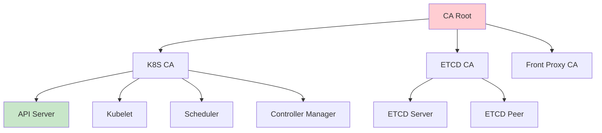

# K8S证书管理全攻略：从命令到自动化

## 情境与背景

在Kubernetes生产环境中，证书管理是保障服务安全运行的关键环节。证书过期会导致服务不可用、认证失败等问题。作为高级DevOps/SRE工程师，需要掌握K8S证书的查看、更新、自动化续期等全流程管理技能。本文从实战角度详细讲解K8S证书管理的完整方案。

## 一、证书类型概述

### 1.1 K8S证书类型

**证书分类**：

| 证书类型 | 路径 | 用途 | 有效期 |
|:--------:|------|------|:------:|
| **Kubelet Client** | /var/lib/kubelet/pki | API Server认证 | 1年 |
| **Kubelet Server** | /var/lib/kubelet/pki | Kubelet HTTPS服务 | 1年 |
| **API Server** | /etc/kubernetes/pki | K8S API服务 | 1年 |
| **ETCD** | /etc/kubernetes/pki/etcd | ETCD通信 | 1年 |
| **Front Proxy** | /etc/kubernetes/pki | API聚合层 | 1年 |
| **Kubeconfig** | ~/.kube/config | 集群访问凭证 | 1年 |

### 1.2 证书架构

**证书层次结构**：



## 二、证书查看命令

### 2.1 OpenSSL查看证书

**查看证书信息**：
```bash
# 查看证书完整信息
openssl x509 -in /etc/kubernetes/pki/apiserver.crt -text -noout

# 查看证书subject（CN）
openssl x509 -in /etc/kubernetes/pki/apiserver.crt -subject -noout

# 查看证书签发者
openssl x509 -in /etc/kubernetes/pki/apiserver.crt -issuer -noout

# 查看证书有效期
openssl x509 -in /etc/kubernetes/pki/apiserver.crt -dates -noout

# 查看证书序列号
openssl x509 -in /etc/kubernetes/pki/apiserver.crt -serial -noout
```

**关键输出解读**：
```yaml
# 证书信息解读
Certificate:
    Data:
        Version: 3 (0x2)
        Serial Number: 1234567890
        Signature Algorithm: sha256WithRSAEncryption
        Issuer: CN=kubernetes
        Validity
            Not Before: Jan  1 00:00:00 2024 GMT
            Not After : Dec 31 23:59:59 2024 GMT
        Subject: CN=kube-apiserver
        Subject Public Key Info:
            Public Key Algorithm: rsaEncryption
```

### 2.2 Kubeadm查看集群证书

**Kubeadm证书管理**：
```bash
# 列出所有证书
ls -la /etc/kubernetes/pki/

# 查看kubeadm证书到期时间
kubeadm certs check-expiration

# 输出示例
CERTIFICATE                EXPIRES                  RESIDUAL TIME   SECRET
apiserver                  Jan 01, 2025 00:00 UTC   180d            apiserver
apiserver-etcd-client      Jan 01, 2025 00:00 UTC   180d            apiserver-etcd-client
apiserver-kubelet-client   Jan 01, 2025 00:00 UTC   180d            apiserver-etcd-client
etcd-server                Jan 01, 2025 00:00 UTC   180d            etcd-server
front-proxy-client         Jan 01, 2025 00:00 UTC   180d            front-proxy-client
```

### 2.3 Kubernetes API查看证书

**Kubelet证书状态**：
```bash
# 查看kubelet证书
kubectl get csr

# 查看特定CSR详情
kubectl describe csr <csr-name>

# 查看节点证书到期时间
kubectl get nodes -o jsonpath='{range .items[*]}name: {.metadata.name} kubelet-certificate-authority: {.status.addresses[?(@.type=="Hostname")].address}'

# 查看证书批准状态
kubectl get csr -o wide
```

## 三、证书生成命令

### 3.1 CFSSL工具使用

**安装CFSSL**：
```bash
# 下载安装
wget https://github.com/cloudflare/cfssl/releases/download/v1.6.4/cfssl_1.6.4_linux_amd64
mv cfssl_1.6.4_linux_amd64 /usr/local/bin/cfssl
chmod +x /usr/local/bin/cfssl

# 验证安装
cfssl version
```

**生成CA配置**：
```json
# ca-config.json
{
    "signing": {
        "default": {
            "expiry": "8760h",
            "ca_constraint": {
                "is_ca": true
            }
        },
        "profiles": {
            "server": {
                "expiry": "8760h",
                "usages": ["signing", "key encipherment", "server auth"]
            },
            "client": {
                "expiry": "8760h",
                "usages": ["signing", "key encipherment", "client auth"]
            }
        }
    }
}
```

**生成证书请求**：
```json
# csr.json
{
    "CN": "my-service",
    "key": {
        "algo": "rsa",
        "size": 2048
    },
    "names": [
        {
            "C": "CN",
            "ST": "Beijing",
            "L": "Beijing",
            "O": "MyCompany"
        }
    ]
}
```

**生成证书**：
```bash
# 生成CA证书
cfssl gencert -initca csr.json | cfssljson -bare ca

# 使用CA签名生成服务端证书
cfssl gencert -ca=ca.pem -ca-key=ca-key.pem -config=ca-config.json -profile=server csr.json | cfssljson -bare server

# 生成客户端证书
cfssl gencert -ca=ca.pem -ca-key=ca-key.pem -config=ca-config.json -profile=client csr.json | cfssljson -bare client
```

### 3.2 OpenSSL生成证书

**自签名证书**：
```bash
# 生成私钥
openssl genrsa -out server.key 2048

# 生成证书请求
openssl req -new -key server.key -out server.csr -subj "/CN=my-service/O=MyCompany"

# 自签名证书
openssl x509 -req -in server.csr -CA ca.crt -CAkey ca.key -CAcreateserial -out server.crt -days 365

# 验证证书
openssl x509 -in server.crt -text -noout
```

### 3.3 K8S CSR方式生成

**创建CSR请求**：
```yaml
apiVersion: certificates.k8s.io/v1
kind: CertificateSigningRequest
metadata:
  name: my-service-csr
spec:
  request: <base64-encoded-csr>
  signerName: kubernetes.io/kube-apiserver-client
  usages:
    - digital signature
    - key encipherment
    - client auth
  groups:
    - system:authenticated
```

**批准CSR**：
```bash
# 查看CSR
kubectl get csr

# 批准CSR
kubectl certificate approve my-service-csr

# 获取证书
kubectl get csr my-service-csr -o jsonpath='{.status.certificate}' | base64 -d > server.crt
```

## 四、证书更新命令

### 4.1 Kubeadm更新证书

**更新所有证书**：
```bash
# 备份现有证书
cp -r /etc/kubernetes/pki /etc/kubernetes/pki.backup
cp /etc/kubernetes/admin.conf /etc/kubernetes/admin.conf.backup

# 重新生成证书
kubeadm certs renew all

# 重启API Server
systemctl restart kubelet

# 验证证书
kubeadm certs check-expiration
```

**更新特定证书**：
```bash
# 更新apiserver证书
kubeadm certs renew apiserver

# 更新etcd证书
kubeadm certs renew etcd-server

# 更新admin.conf
kubeadm certs renew admin.conf
```

### 4.2 K8S Secret更新证书

**创建TLS Secret**：
```bash
# 方法1：直接创建
kubectl create secret tls my-cert \
  --cert=server.crt \
  --key=server.key \
  --namespace=default

# 方法2：Dry-run方式
kubectl create secret tls my-cert \
  --cert=server.crt \
  --key=server.key \
  --dry-run=client \
  -o yaml | kubectl apply -f -

# 更新已有Secret
kubectl create secret tls my-cert \
  --cert=new-server.crt \
  --key=new-server.key \
  --dry-run=client \
  -o yaml | kubectl replace -f -
```

### 4.3 Ingress证书更新

**更新Ingress TLS**：
```yaml
apiVersion: networking.k8s.io/v1
kind: Ingress
metadata:
  name: my-ingress
  namespace: default
  annotations:
    kubernetes.io/ingress.class: nginx
spec:
  tls:
    - hosts:
        - myapp.example.com
      secretName: my-cert
  rules:
    - host: myapp.example.com
      http:
        paths:
          - path: /
            pathType: Prefix
            backend:
              service:
                name: myapp
                port:
                  number: 80
```

**更新命令**：
```bash
# 更新证书后执行
kubectl apply -f ingress.yaml

# 或直接patch
kubectl patch ingress my-ingress -p '{"spec":{"tls":[{"hosts":["myapp.example.com"],"secretName":"my-cert-new"}]}}'
```

## 五、证书验证命令

### 5.1 证书验证

**curl验证**：
```bash
# 验证证书有效性
curl -v https://myapp.example.com 2>&1 | grep -E "SSL|TLS|certificate"

# 验证证书过期时间
echo | openssl s_client -connect myapp.example.com:443 -servername myapp.example.com 2>/dev/null | openssl x509 -dates -noout

# 验证证书链
openssl verify -CAfile ca.pem server.crt
```

**Kubernetes验证**：
```bash
# 验证API Server证书
kubectl get --raw='/api/v1/namespaces/kube-system/services/https:kubernetes:443'

# 验证etcd证书
etcdctl --endpoints=https://127.0.0.1:2379 --cacert=/etc/kubernetes/pki/etcd/ca.crt --cert=/etc/kubernetes/pki/etcd/peer.crt --key=/etc/kubernetes/pki/etcd/peer.key endpoint health

# 验证kubelet证书
kubectl get nodes -o jsonpath='{.items[*].status.addresses[?(@.type=="InternalIP")].address}'
```

## 六、Cert-Manager自动化

### 6.1 Cert-Manager安装

**Helm安装**：
```bash
# 添加Jetstack仓库
helm repo add jetstack https://charts.jetstack.io
helm repo update

# 安装Cert-Manager
helm install cert-manager jetstack/cert-manager \
  --namespace cert-manager \
  --create-namespace \
  --set installCRDs=true
```

### 6.2 ClusterIssuer配置

**配置Let's Encrypt**：
```yaml
apiVersion: cert-manager.io/v1
kind: ClusterIssuer
metadata:
  name: letsencrypt-prod
spec:
  acme:
    server: https://acme-v02.api.letsencrypt.org/directory
    email: admin@example.com
    privateKeySecretRef:
      name: letsencrypt-prod
    solvers:
      - http01:
          ingress:
            class: nginx
```

### 6.3 自动签发证书

**Ingress自动签发**：
```yaml
apiVersion: networking.k8s.io/v1
kind: Ingress
metadata:
  name: my-ingress
  annotations:
    cert-manager.io/cluster-issuer: "letsencrypt-prod"
spec:
  tls:
    - hosts:
        - myapp.example.com
      secretName: myapp-tls
  rules:
    - host: myapp.example.com
      http:
        paths:
          - path: /
            pathType: Prefix
            backend:
              service:
                name: myapp
                port:
                  number: 80
```

### 6.4 证书自动续期

**配置续期策略**：
```yaml
apiVersion: cert-manager.io/v1
kind: Certificate
metadata:
  name: myapp-tls
  namespace: default
spec:
  secretName: myapp-tls
  issuerRef:
    name: letsencrypt-prod
    kind: ClusterIssuer
  dnsNames:
    - myapp.example.com
  duration: 2160h  # 90天
  renewBefore: 360h  # 提前15天续期
```

## 七、最佳实践

### 7.1 证书管理最佳实践

**实践清单**：
```yaml
# 证书管理最佳实践
best_practices:
  - "证书有效期不超过1年"
  - "使用自动化工具管理证书"
  - "定期检查证书过期时间"
  - "配置证书过期告警"
  - "证书更新前先备份"
  - "更新后立即验证"
```

### 7.2 监控告警配置

**证书过期监控**：
```yaml
# Prometheus告警规则
groups:
  - name: certificate-alerts
    rules:
      - alert: CertificateExpiringIn30Days
        expr: |
          (kubelet_certificate_manager_client_ttl_seconds / 86400) < 30
        for: 1h
        labels:
          severity: warning
        annotations:
          summary: "证书将在30天内过期"
          
      - alert: CertificateExpiringIn7Days
        expr: |
          (kubelet_certificate_manager_client_ttl_seconds / 86400) < 7
        for: 1h
        labels:
          severity: critical
        annotations:
          summary: "证书将在7天内过期"
```

### 7.3 备份策略

**证书备份脚本**：
```bash
#!/bin/bash
# 证书备份脚本

BACKUP_DIR="/backup/kubernetes-certs/$(date +%Y%m%d)"
mkdir -p $BACKUP_DIR

# 备份PKI目录
cp -r /etc/kubernetes/pki $BACKUP_DIR/

# 备份kubeconfig
cp -r ~/.kube $BACKUP_DIR/

# 备份etcd证书
cp -r /etc/kubernetes/pki/etcd $BACKUP_DIR/etcd

# 压缩备份
tar -czvf certs-backup-$(date +%Y%m%d).tar.gz $BACKUP_DIR

# 上传到对象存储
aws s3 cp certs-backup-$(date +%Y%m%d).tar.gz s3://my-bucket/kubernetes-certs/

echo "证书备份完成: $BACKUP_DIR"
```

## 八、实战案例分析

### 8.1 案例1：API Server证书过期

**问题描述**：
- API Server无法访问
- kubectl命令超时

**排查过程**：
```bash
# 1. 检查证书状态
kubeadm certs check-expiration

# 2. 查看kubelet日志
journalctl -u kubelet | grep "certificate"

# 3. 确认为证书过期
# 输出：Certificate "apiserver" is expired (2024-01-01)
```

**解决方案**：
```bash
# 1. 备份证书
cp -r /etc/kubernetes/pki /etc/kubernetes/pki.backup

# 2. 重新生成证书
kubeadm certs renew all

# 3. 重启kubelet
systemctl restart kubelet

# 4. 验证
kubeadm certs check-expiration
```

### 8.2 案例2：Ingress证书自动更新

**问题描述**：
- 需要为多个域名配置HTTPS
- 手动管理证书繁琐

**解决方案**：
```yaml
# 部署Cert-Manager
helm install cert-manager jetstack/cert-manager \
  --namespace cert-manager \
  --create-namespace \
  --set installCRDs=true

# 创建ClusterIssuer
apiVersion: cert-manager.io/v1
kind: ClusterIssuer
metadata:
  name: letsencrypt-prod
spec:
  acme:
    server: https://acme-v02.api.letsencrypt.org/directory
    email: admin@example.com
    privateKeySecretRef:
      name: letsencrypt-prod
    solvers:
      - http01:
          ingress:
            class: nginx

# 创建Ingress（自动签发）
apiVersion: networking.k8s.io/v1
kind: Ingress
metadata:
  name: my-ingress
  annotations:
    cert-manager.io/cluster-issuer: "letsencrypt-prod"
spec:
  tls:
    - hosts:
        - myapp.example.com
        - api.example.com
      secretName: myapp-tls
  rules:
    - host: myapp.example.com
      http:
        paths:
          - path: /
            backend:
              service:
                name: myapp
                port:
                  number: 80
```

## 九、面试1分钟精简版（直接背）

**完整版**：

我们主要使用openssl和cfssl命令管理证书。查看证书用openssl x509 -in cert.pem -text -noout，可以查看证书的CN、有效期、签发者等信息。检查证书过期用openssl x509 -in cert.pem -dates -noout。生成新证书用cfssl工具，我们有标准化的cfssl配置文件。对于K8S中的证书，通过Secret或Ingress配置更新，更新后用curl验证证书是否生效。生产环境我们还配置了Cert-manager实现证书自动续期。

**30秒超短版**：

查看用openssl x509，生成用cfssl，K8S用Secret更新，Cert-manager自动续期。

## 十、总结

### 10.1 核心命令

| 操作 | 命令 |
|:----:|------|
| **查看证书** | openssl x509 -in cert.pem -text -noout |
| **检查过期** | openssl x509 -in cert.pem -dates -noout |
| **生成证书** | cfssl gencert -ca=ca.pem -ca-key=ca-key.pem |
| **更新K8S** | kubeadm certs renew all |
| **验证** | curl -v https://example.com |

### 10.2 管理原则

| 原则 | 说明 |
|:----:|------|
| **自动化** | 使用Cert-manager自动续期 |
| **监控** | 配置证书过期告警 |
| **备份** | 更新前先备份 |
| **验证** | 更新后立即验证 |

### 10.3 记忆口诀

```
证书更新先检查openssl，
生成用cfssl，
更新K8S Secret，
验证用curl，
Cert-manager自动续期。
```

> **参考链接**：[SRE运维面试题全解析：从理论到实践（第二部分）]()