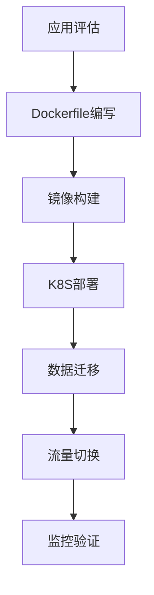

# 容器化迁移棘手问题与解决方案：从踩坑到最佳实践

## 情境与背景

容器化迁移是将传统应用迁移到Kubernetes平台的重要过程，涉及应用改造、环境适配、数据迁移等多个环节。作为高级DevOps/SRE工程师，需要掌握容器化迁移中的常见问题和解决方案。本文从DevOps/SRE视角，详细讲解容器化迁移过程中的棘手问题和最佳实践。

## 一、容器化迁移概述

### 1.1 迁移流程

**标准化迁移流程**：



### 1.2 迁移策略

**策略对比**：

| 策略 | 说明 | 适用场景 |
|:----:|------|----------|
| **Lift & Shift** | 直接迁移 | 无状态应用 |
| **重构迁移** | 代码改造 | 有状态应用 |
| **渐进迁移** | 逐步切换 | 关键业务系统 |

## 二、常见棘手问题

### 2.1 依赖缺失问题

**问题表现**：
- 容器启动失败
- 缺少系统库或运行时

**原因分析**：
- 基础镜像不完整
- 应用依赖的系统库缺失
- 动态链接库不兼容

**解决方案**：
```dockerfile
# 多阶段构建示例
FROM maven:3.8 AS builder
WORKDIR /app
COPY pom.xml .
RUN mvn dependency:go-offline
COPY src ./src
RUN mvn package -DskipTests

FROM openjdk:11-jre-slim
WORKDIR /app
COPY --from=builder /app/target/*.jar app.jar
# 安装必要的系统库
RUN apt-get update && apt-get install -y \
    libfontconfig \
    fontconfig \
    && rm -rf /var/lib/apt/lists/*

ENTRYPOINT ["java", "-jar", "app.jar"]
```

### 2.2 配置文件问题

**问题表现**：
- 不同环境配置不一致
- 配置文件无法动态更新

**解决方案**：
```yaml
# ConfigMap配置
apiVersion: v1
kind: ConfigMap
metadata:
  name: app-config
data:
  application.yml: |
    server:
      port: 8080
    database:
      host: ${DB_HOST}
      port: 5432
---
# Secret配置
apiVersion: v1
kind: Secret
metadata:
  name: app-secret
type: Opaque
stringData:
  DB_PASSWORD: ${DB_PASSWORD}
  API_KEY: ${API_KEY}
---
# Pod使用配置
apiVersion: v1
kind: Pod
spec:
  containers:
    - name: app
      envFrom:
        - configMapRef:
            name: app-config
        - secretRef:
            name: app-secret
```

### 2.3 存储挂载问题

**问题表现**：
- 容器重启后数据丢失
- 无法持久化存储

**解决方案**：
```yaml
# PVC配置
apiVersion: v1
kind: PersistentVolumeClaim
metadata:
  name: app-data-pvc
spec:
  accessModes:
    - ReadWriteOnce
  resources:
    requests:
      storage: 10Gi
  storageClassName: fast
---
# Pod使用PVC
apiVersion: v1
kind: Pod
metadata:
  name: app
spec:
  containers:
    - name: app
      volumeMounts:
        - name: app-data
          mountPath: /app/data
  volumes:
    - name: app-data
      persistentVolumeClaim:
        claimName: app-data-pvc
```

### 2.4 网络配置问题

**问题表现**：
- 服务间无法通信
- 无法访问外部服务

**解决方案**：
```yaml
# Service配置
apiVersion: v1
kind: Service
metadata:
  name: app-service
spec:
  type: ClusterIP
  selector:
    app: app
  ports:
    - protocol: TCP
      port: 80
      targetPort: 8080
---
# NetworkPolicy配置
apiVersion: networking.k8s.io/v1
kind: NetworkPolicy
metadata:
  name: app-network-policy
spec:
  podSelector:
    matchLabels:
      app: app
  policyTypes:
    - Ingress
    - Egress
  ingress:
    - from:
        - podSelector:
            matchLabels:
              role: frontend
      ports:
        - protocol: TCP
          port: 8080
  egress:
    - to:
        - podSelector:
            matchLabels:
              role: database
      ports:
        - protocol: TCP
          port: 5432
```

### 2.5 权限问题

**问题表现**：
- 无法写入目录
- 权限被拒绝

**解决方案**：
```yaml
# SecurityContext配置
apiVersion: v1
kind: Pod
metadata:
  name: app
spec:
  securityContext:
    runAsUser: 1000
    runAsGroup: 1000
    fsGroup: 1000
  containers:
    - name: app
      securityContext:
        readOnlyRootFilesystem: false
        allowPrivilegeEscalation: false
        capabilities:
          drop:
            - ALL
      volumeMounts:
        - name: writable-dir
          mountPath: /app/writable
```

### 2.6 资源限制问题

**问题表现**：
- 容器被OOM Kill
- CPU被限制导致响应慢

**问题原因**：
- JVM内存未限制
- 物理机与容器内存认知差异

**解决方案**：
```yaml
# Resource Limit配置
apiVersion: v1
kind: Pod
metadata:
  name: app
spec:
  containers:
    - name: app
      resources:
        requests:
          cpu: "500m"
          memory: "512Mi"
        limits:
          cpu: "2000m"
          memory: "2Gi"
      env:
        - name: JAVA_OPTS
          value: "-Xms512m -Xmx1536m -XX:+UseG1GC"
```

## 三、数据迁移策略

### 3.1 无状态应用迁移

**迁移步骤**：
```yaml
# 部署配置
apiVersion: apps/v1
kind: Deployment
metadata:
  name: stateless-app
spec:
  replicas: 3
  strategy:
    type: RollingUpdate
    rollingUpdate:
      maxSurge: 1
      maxUnavailable: 0
```

### 3.2 有状态应用迁移

**迁移步骤**：
```yaml
# StatefulSet配置
apiVersion: apps/v1
kind: StatefulSet
metadata:
  name: stateful-app
spec:
  serviceName: stateful-app
  replicas: 3
  selector:
    matchLabels:
      app: stateful-app
  template:
    metadata:
      labels:
        app: stateful-app
    spec:
      containers:
        - name: app
          volumeMounts:
            - name: data
              mountPath: /data
  volumeClaimTemplates:
    - metadata:
        name: data
      spec:
        accessModes: ["ReadWriteOnce"]
        resources:
          requests:
            storage: 10Gi
```

### 3.3 数据同步策略

**同步方案**：
```yaml
# 数据同步Job
apiVersion: batch/v1
kind: Job
metadata:
  name: data-sync
spec:
  template:
    spec:
      containers:
        - name: sync
          image: sync-tool:latest
          command: ["/app/sync.sh"]
          env:
            - name: SOURCE_DB
              value: "old-db-host:5432"
            - name: TARGET_DB
              value: "new-db-service:5432"
      restartPolicy: OnFailure
```

## 四、最佳实践

### 4.1 Dockerfile最佳实践

**实践建议**：
```dockerfile
# 最佳实践示例
FROM eclipse-temurin:11-jre-jammy

# 设置非root用户
RUN groupadd -r appgroup && useradd -r -g appgroup appuser

# 复制文件
COPY --chown=appuser:appgroup app.jar /app/app.jar

# 设置工作目录
WORKDIR /app

# 使用exec格式
EXPOSE 8080

# 切换用户
USER appuser

# 启动命令
ENTRYPOINT ["java", "-jar", "app.jar"]
```

### 4.2 镜像安全最佳实践

**安全配置**：
```yaml
# 安全扫描配置
security:
  trivy:
    enabled: true
    severity: "HIGH,CRITICAL"
    
  runtime:
    read_only_root_filesystem: true
    privilege: false
```

### 4.3 迁移检查清单

**检查项目**：
```yaml
# 迁移前检查
pre_migration_check:
  - "应用依赖分析完成"
  - "配置文件清单准备"
  - "存储需求确认"
  - "网络策略规划"
  - "资源配额计算"
  - "监控告警配置"
```

## 五、实战案例分析

### 5.1 案例1：Java应用内存问题

**问题描述**：
- 物理机运行正常
- 容器内OOM被Kill

**排查过程**：
```bash
# 查看容器日志
kubectl logs app-pod

# 查看OOM事件
kubectl describe pod app-pod | grep -A 5 "Last State"

# 解决方案：设置JVM内存参数
env:
  - name: JAVA_OPTS
    value: "-Xms512m -Xmx1536m -XX:+UseG1GC"
```

### 5.2 案例2：配置文件环境差异

**问题描述**：
- 测试环境正常
- 生产环境配置失败

**排查过程**：
```yaml
# 解决方案：使用ConfigMap管理多环境配置
apiVersion: v1
kind: ConfigMap
metadata:
  name: app-config-prod
data:
  application.yml: |
    database:
      host: prod-db.example.com
      port: 5432
---
apiVersion: v1
kind: ConfigMap
metadata:
  name: app-config-test
data:
  application.yml: |
    database:
      host: test-db.example.com
      port: 5432
```

## 六、面试1分钟精简版（直接背）

**完整版**：

容器化迁移过程中确实遇到过几个棘手问题。首先是Java应用内存问题，在物理机运行时JVM可以使用全部内存，但容器内受cgroup限制导致内存不足，通过设置JAVA_OPTS环境变量限制堆内存解决。其次是配置文件问题，不同环境配置文件不同，采用ConfigMap和Secret管理，运行时动态挂载解决。还有数据库容器化后数据持久化问题，通过NFS存储挂载PV解决，确保数据不丢失。这些问题的解决思路是：先分析问题原因，选择K8S原生方案，充分利用K8S的声明式配置优势。

**30秒超短版**：

Java内存用JAVA_OPTS限制，配置用ConfigMap管理，存储用PV持久化，网络用Service和NetworkPolicy。

## 七、总结

### 7.1 核心要点

1. **依赖问题**：使用多阶段构建
2. **配置问题**：ConfigMap和Secret
3. **存储问题**：PV/PVC持久化
4. **网络问题**：Service和NetworkPolicy
5. **权限问题**：SecurityContext
6. **资源问题**：Resource Limit + JVM参数

### 7.2 迁移原则

| 原则 | 说明 |
|:----:|------|
| **无状态化** | 优先无状态迁移 |
| **配置外置** | 配置与镜像分离 |
| **安全第一** | 遵循最小权限 |
| **资源明确** | 合理设置限制 |

### 7.3 记忆口诀

```
依赖缺失多阶段，配置用ConfigMap，
存储用PV来持久，网络策略要配置，
权限SecurityContext，资源限制要设置。
```

> **参考链接**：[SRE运维面试题全解析：从理论到实践（第二部分）]()