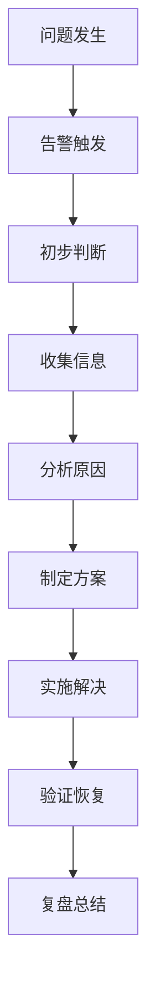

# 数据库常见问题排查与解决方案：从慢查到故障恢复

## 情境与背景

数据库是生产环境最核心的基础设施之一，问题排查能力是高级DevOps/SRE工程师的必备技能。本文从DevOps/SRE视角，详细讲解MySQL、MongoDB、Redis等常见数据库问题的排查方法和解决方案。

## 一、问题排查方法论

### 1.1 排查流程

**标准化排查流程**：



### 1.2 信息收集清单

**排查信息收集**：
```yaml
# 信息收集清单
information_collection:
  system_info:
    - "操作系统版本"
    - "内核参数"
    - "负载情况"
    
  database_info:
    - "数据库版本"
    - "配置参数"
    - "连接数"
    - "缓存命中率"
    
  logs:
    - "错误日志"
    - "慢查询日志"
    - "审计日志"
    
  performance:
    - "QPS"
    - "响应时间"
    - "并发连接数"
```

## 二、MySQL问题排查

### 2.1 连接数爆满问题

**问题表现**：
- 应用无法连接数据库
- 连接超时错误

**排查命令**：
```sql
-- 查看连接状态
SHOW STATUS LIKE 'Threads_connected';
SHOW STATUS LIKE 'Max_used_connections';

-- 查看当前连接
SHOW PROCESSLIST;

-- 查看最大连接数
SHOW VARIABLES LIKE 'max_connections';

-- 查看连接来源
SELECT 
    db,
    user,
    count(*) as connections
FROM information_schema.processlist
GROUP BY db, user
ORDER BY connections DESC;
```

**解决方案**：
```yaml
# 解决方案
solutions:
  immediate:
    - "杀掉空闲连接"
    command: "KILL PROCESSLIST_ID"
    
  configuration:
    - "调整最大连接数"
    max_connections: 2000
    
  application:
    - "检查连接泄漏"
    - "配置连接池"
```

### 2.2 慢查询问题

**问题表现**：
- 请求响应时间明显增长
- 数据库CPU使用率升高

**排查命令**：
```sql
-- 查看慢查询
SHOW VARIABLES LIKE 'slow_query_log';
SHOW VARIABLES LIKE 'long_query_time';

-- 分析慢查询日志
mysqldumpslow -s t /var/log/mysql/slow.log

-- 使用 EXPLAIN 分析查询
EXPLAIN SELECT * FROM orders WHERE user_id = 123;

-- 查看索引使用情况
SHOW INDEX FROM orders;
```

**解决方案**：
```yaml
# 慢查询优化方案
optimization:
  index_optimization:
    - "添加缺失索引"
    - "删除冗余索引"
    
  query_optimization:
    - "避免 SELECT *"
    - "使用 LIMIT 限制"
    - "优化 JOIN 操作"
    
  configuration:
    - "调整 innodb_buffer_pool_size"
    - "启用查询缓存"
```

### 2.3 主从延迟问题

**问题表现**：
- 从库数据落后主库
- 读写分离场景下数据不一致

**排查命令**：
```sql
-- 查看从库状态
SHOW SLAVE STATUS\G

-- 关键指标
-- Seconds_Behind_Master: 延迟时间
-- Slave_IO_Running: IO线程状态
-- Slave_SQL_Running: SQL线程状态
-- Relay_Log_Space: 中继日志大小
```

**解决方案**：
```yaml
# 主从延迟解决方案
solutions:
  network_optimization:
    - "提升网络带宽"
    - "优化网络路由"
    
  write_optimization:
    - "批量写入"
    - "错峰写入"
    
  configuration:
    - "调整 sync_binlog"
    - "调整 innodb_flush_log_at_trx_commit"
```

## 三、MongoDB问题排查

### 3.1 连接数问题

**排查命令**：
```bash
# 查看连接状态
db.serverStatus().connections

# 查看当前连接
db.currentOp()

# 查看连接来源
db.adminCommand({"connPoolStats": 1})
```

**解决方案**：
```yaml
# MongoDB连接优化
optimization:
  max_connections: 2000
  
  connection_pool:
    minSize: 10
    maxSize: 100
```

### 3.2 主从延迟问题

**排查命令**：
```javascript
// 查看副本集状态
rs.status()

// 查看复制延迟
db.adminCommand({replSetGetStatus: 1})

// 查看 oplog 大小
db.printReplicationInfo()
```

**解决方案**：
```yaml
# MongoDB主从延迟解决方案
solutions:
  oplog_optimization:
    - "增大 oplog 大小"
    oplog_size: "50GB"
    
  write_optimization:
    - "避免大批量写入"
    - "使用写关注"
```

### 3.3 磁盘空间问题

**排查命令**：
```bash
# 查看磁盘使用
df -h

# 查看数据库大小
db.stats()

# 查看集合大小
db.collection.stats()

# 查看存储引擎
db.serverStatus().wiredTiger
```

**解决方案**：
```yaml
# 磁盘空间解决方案
solutions:
  cleanup:
    - "删除过期数据"
    - "压缩集合"
    command: "db.runCommand({compact: 'collection_name'})"
    
  storage_expansion:
    - "扩容磁盘"
    - "添加分片"
```

## 四、Redis问题排查

### 4.1 内存不足问题

**问题表现**：
- Redis响应变慢
- 内存使用率超过90%

**排查命令**：
```bash
# 查看内存使用
INFO memory

# 关键指标
# used_memory_human: 已用内存
# maxmemory_human: 最大内存
# mem_fragmentation_ratio: 内存碎片率

# 查看大 Key
redis-cli --bigkeys

# 查看内存分配
redis-cli memory stats
```

**解决方案**：
```yaml
# Redis内存优化
solutions:
  eviction_policy:
    maxmemory_policy: "allkeys-lru"
    
  key_optimization:
    - "删除过期 key"
    - "使用合理的数据结构"
    
  memory_management:
    - "启用内存碎片整理"
    activedefrag: yes
```

### 4.2 慢查询问题

**排查命令**：
```bash
# 查看慢查询
SLOWLOG GET 10

# 配置慢查询阈值
CONFIG SET slowlog-log-slower-than 10000
```

**解决方案**：
```yaml
# Redis慢查询优化
solutions:
  key_design:
    - "避免大 Value"
    - "合理使用数据结构"
    
  operation_optimization:
    - "使用批量操作"
    - "避免阻塞命令"
```

## 五、Elasticsearch问题排查

### 5.1 集群健康问题

**问题表现**：
- 集群状态为 Yellow 或 Red
- 部分分片无法分配

**排查命令**：
```bash
# 查看集群健康
GET _cluster/health

# 查看分片分配情况
GET _cat/shards?v

# 查看未分配原因
GET _cluster/allocation/explain
```

**解决方案**：
```yaml
# ES集群健康优化
solutions:
  yellow_issues:
    - "增加副本数"
    PUT /my_index/_settings
      {"number_of_replicas": 1}
      
  red_issues:
    - "修复损坏分片"
    - "重新分配分片"
```

### 5.2 存储空间问题

**排查命令**：
```bash
# 查看磁盘使用
GET _cat/nodes?v

# 查看索引大小
GET _cat/indices?v
```

**解决方案**：
```yaml
# ES存储优化
solutions:
  ilm_policy:
    - "配置 ILM 策略"
    - "自动删除旧索引"
    
  disk_management:
    - "设置磁盘 watermark"
    - "配置副本分配策略"
```

## 六、通用排查命令速查

### 6.1 系统层面

**通用命令**：
```bash
# CPU使用
top -H
htop

# 内存使用
free -h
vmstat 1

# 磁盘使用
df -h
du -sh /*

# 网络连接
netstat -an | grep ESTABLISHED
ss -s
```

### 6.2 数据库通用命令

**MySQL**：
```sql
-- 状态检查
SHOW STATUS;
SHOW VARIABLES;

-- 连接检查
SHOW PROCESSLIST;
SHOW FULL PROCESSLIST;

-- 性能检查
SHOW ENGINE INNODB STATUS;
EXPLAIN [QUERY];
```

**MongoDB**：
```javascript
// 状态检查
db.serverStatus()

// 连接检查
db.currentOp()

// 性能检查
db.collection.aggregate([{$indexStats: {}}])
```

**Redis**：
```bash
# 状态检查
INFO all

# 连接检查
CLIENT LIST
CLIENT KILL [ID]

# 性能检查
MONITOR
```

## 七、实战案例分析

### 7.1 案例1：MySQL连接泄漏

**场景描述**：
- 应用突然无法连接数据库
- 数据库CPU使用率飙升

**排查过程**：
```sql
-- 1. 查看连接状态
SHOW PROCESSLIST;

-- 2. 发现大量连接来自同一应用
-- 3. 分析连接特征
SELECT 
    SUBSTRING(info, 1, 50),
    COUNT(*)
FROM information_schema.processlist
WHERE info IS NOT NULL
GROUP BY SUBSTRING(info, 1, 50);
```

**解决方案**：
```yaml
# 解决方案
solutions:
  immediate:
    - "杀掉问题连接"
    KILL 12345;
    
  application:
    - "修复连接泄漏代码"
    - "配置连接池"
    
  monitoring:
    - "添加连接数监控"
    - "设置告警阈值"
```

### 7.2 案例2：Redis内存溢出

**场景描述**：
- Redis服务频繁重启
- 内存使用率接近100%

**排查过程**：
```bash
# 1. 查看内存使用
INFO memory

# 2. 发现内存碎片率高
mem_fragmentation_ratio: 3.5

# 3. 查看大 Key
redis-cli --bigkeys
```

**解决方案**：
```yaml
# 解决方案
solutions:
  immediate:
    - "重启 Redis"
    systemctl restart redis
    
  configuration:
    - "启用内存碎片整理"
    activedefrag yes
    active-defrag-threshold-lower 10
    
  prevention:
    - "添加内存监控"
    - "设置告警阈值 80%"
```

## 八、面试1分钟精简版（直接背）

**完整版**：

日常维护中确实遇到过各种数据库问题。比如MySQL连接数爆满的问题，通过show status和show processlist发现大量连接堆积，分析发现是应用连接泄漏，立即杀掉空闲连接并调整max_connections参数解决。慢查询问题通过explain分析执行计划，优化了缺失的索引解决。MongoDB主从延迟问题通过show slave status发现延迟超过10秒，调整oplog大小和优化写入策略解决。排查思路是：先看告警收集初步信息，再查日志和数据库状态，最后分析原因并制定解决方案。

**30秒超短版**：

MySQL连接爆满用show processlist排查，慢查询用explain分析，主从延迟查show slave status。MongoDB用db.serverStatus()和rs.status()排查，Redis用INFO memory查看内存状态。

## 九、总结

### 9.1 核心要点

1. **连接问题**：show processlist / currentOp
2. **性能问题**：explain分析 / 慢查询日志
3. **主从延迟**：show slave status / rs.status()
4. **存储问题**：df -h / db.stats()
5. **内存问题**：INFO memory / dmesg

### 9.2 排查原则

| 原则 | 说明 |
|:----:|------|
| **先止血** | 先恢复服务再分析原因 |
| **后分析** | 收集信息分析根本原因 |
| **防复发** | 制定预防措施 |

### 9.3 记忆口诀

```
连接爆满show process，慢查询要explain，
主从延迟查slave，磁盘满了清空间，
内存不足看info，锁等待要kill。
```

> **参考链接**：[SRE运维面试题全解析：从理论到实践（第二部分）]()