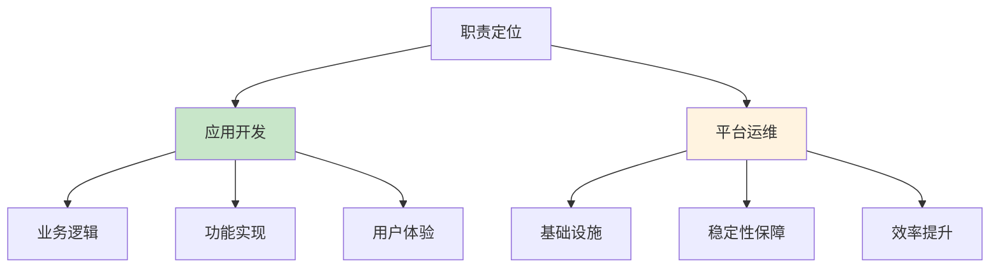
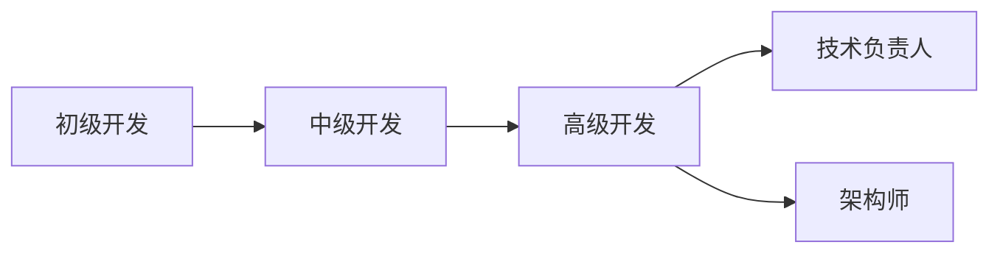
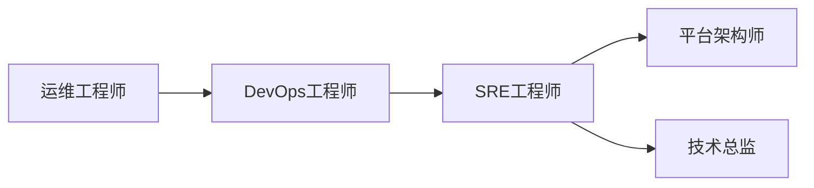
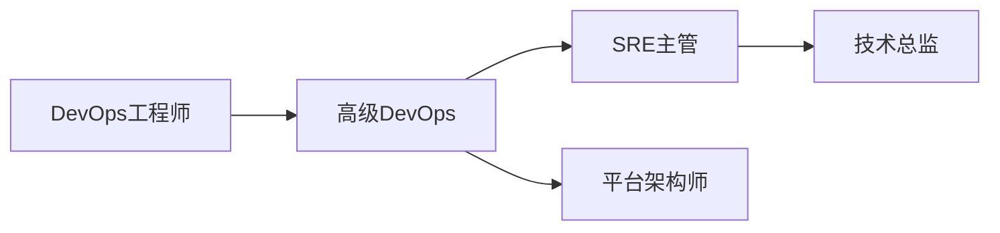

# DevOps工程师职责定位：应用开发与平台运维的平衡之道

## 情境与背景

在DevOps文化中，工程师的职责定位往往介于应用开发和平台运维之间。作为高级DevOps/SRE工程师，理解并平衡这两个角色是关键能力。本文从DevOps/SRE视角，深入讲解应用开发与平台运维的区别、职责定位和最佳实践。

## 一、职责定位对比

### 1.1 应用开发

**定义**：负责实现业务功能和特性的开发工作

**核心职责**：
- 业务需求分析
- 系统设计与架构
- 代码实现与测试
- 功能迭代与优化

**关注点**：
- 业务逻辑正确性
- 用户体验
- 功能交付速度
- 代码质量

### 1.2 平台运维

**定义**：负责基础设施和系统平台的建设与维护

**核心职责**：
- 基础设施搭建
- 系统监控与告警
- 故障排查与恢复
- 自动化工具开发

**关注点**：
- 系统稳定性
- 性能优化
- 安全合规
- 运维效率

### 1.3 职责对比表

| 维度 | 应用开发 | 平台运维 |
|:----:|----------|----------|
| **核心目标** | 实现业务功能 | 保障系统稳定 |
| **关注点** | 业务逻辑、用户体验 | 性能、可用性、安全 |
| **技术栈** | Java/Python/Go、框架 | K8s/Docker、云服务、监控 |
| **衡量指标** | 功能交付速度、代码质量 | 系统可用性、故障恢复时间 |
| **工作产出** | 业务功能、特性 | 工具、平台、运维体系 |
| **工作节奏** | 敏捷迭代、快速交付 | 持续稳定、预防性维护 |



## 二、技术能力对比

### 2.1 应用开发技术栈

```yaml
# 应用开发技术栈
languages:
  - Java
  - Python
  - Go
  - JavaScript/TypeScript

frameworks:
  - Spring Boot
  - Django
  - Gin
  - React/Vue

databases:
  - MySQL
  - PostgreSQL
  - Redis
  - MongoDB

tools:
  - Git
  - Jira
  - Jenkins
```

### 2.2 平台运维技术栈

```yaml
# 平台运维技术栈
infrastructure:
  - Kubernetes
  - Docker
  - Terraform
  - Ansible

cloud:
  - AWS
  - GCP
  - Azure
  - Aliyun

monitoring:
  - Prometheus
  - Grafana
  - ELK
  - Jaeger

tools:
  - Jenkins/GitLab CI
  - ArgoCD
  - Helm
  - Vault
```

### 2.3 DevOps工程师的综合能力

```yaml
# DevOps工程师能力模型
core_competencies:
  - infrastructure_as_code
  - ci_cd_pipeline
  - containerization
  - monitoring_observability
  
soft_skills:
  - communication
  - collaboration
  - problem_solving
  - continuous_learning

domain_knowledge:
  - cloud_native
  - distributed_systems
  - security_compliance
```

## 三、工作产出对比

### 3.1 应用开发产出

| 产出类型 | 示例 |
|:--------:|------|
| **功能模块** | 用户登录、支付系统 |
| **API接口** | RESTful API、GraphQL |
| **业务逻辑** | 订单处理、库存管理 |
| **测试用例** | 单元测试、集成测试 |

### 3.2 平台运维产出

| 产出类型 | 示例 |
|:--------:|------|
| **基础设施** | K8s集群、VPC网络 |
| **CI/CD流水线** | 自动化构建部署流程 |
| **监控体系** | 告警规则、仪表盘 |
| **运维工具** | 自动化脚本、管理平台 |

### 3.3 DevOps工程师产出

| 产出类型 | 示例 |
|:--------:|------|
| **自动化工具** | 部署脚本、配置管理 |
| **运维平台** | 发布平台、监控平台 |
| **流程规范** | 发布流程、变更管理 |
| **技术文档** | 运维手册、架构文档 |

## 四、实战案例分析

### 4.1 案例1：应用开发为主的DevOps

**角色定位**：DevOps工程师参与应用开发

**场景**：
- 负责开发内部工具和自动化脚本
- 参与业务系统的CI/CD集成
- 协助开发团队解决部署问题

**产出**：
- 自动化部署脚本
- CI/CD流水线配置
- 开发环境快速搭建工具

### 4.2 案例2：平台运维为主的DevOps

**角色定位**：DevOps工程师专注平台建设

**场景**：
- 负责K8s集群搭建和维护
- 设计监控告警体系
- 制定运维规范和流程

**产出**：
- 稳定的基础设施平台
- 完善的监控告警体系
- 标准化的运维流程

### 4.3 案例3：平衡型DevOps

**角色定位**：DevOps工程师兼顾开发和运维

**场景**：
- 开发运维工具平台
- 维护基础设施
- 支持业务团队

**产出**：
- 运维工具平台
- 稳定的基础设施
- 高效的协作流程

## 五、职业发展路径

### 5.1 应用开发方向



### 5.2 平台运维方向



### 5.3 DevOps综合方向



## 六、面试1分钟精简版（直接背）

**完整版**：

作为高级DevOps/SRE工程师，我的职责更偏向底层平台运维和基础设施建设。我负责设计和维护公司的云原生基础设施、CI/CD流水线、监控告警体系，保障核心系统的高可用和高性能。同时我也具备应用开发能力，能够开发运维工具和自动化脚本，帮助提升团队效率。我的核心价值在于通过技术手段提升系统稳定性和运维效率，支撑业务快速迭代。

**30秒超短版**：

我是DevOps工程师，主要负责平台运维和基础设施建设，包括K8s、CI/CD、监控告警。同时也能开发运维工具，平衡稳定性和效率。

## 七、总结

### 7.1 核心要点

1. **应用开发**：关注业务功能实现和用户体验
2. **平台运维**：关注系统稳定性和运维效率
3. **DevOps**：平衡两者，通过自动化提升效率

### 7.2 关键原则

| 原则 | 说明 |
|:----:|------|
| **明确定位** | 清楚自己的核心职责 |
| **持续学习** | 不断扩展技术能力 |
| **沟通协作** | 与开发和业务团队紧密合作 |
| **自动化优先** | 通过工具提升效率 |

### 7.3 记忆口诀

```
开发做业务功能，运维保系统稳定，
DevOps两者兼顾，自动化提效率。
```

> **参考链接**：[SRE运维面试题全解析：从理论到实践（第二部分）]()