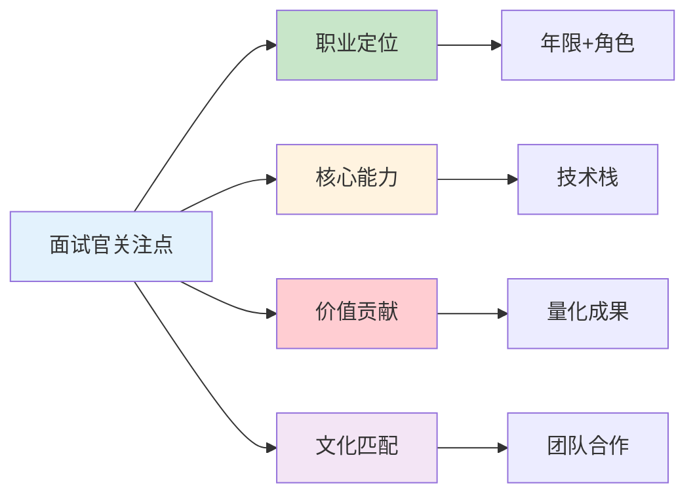

# 高级DevOps/SRE面试自我介绍指南：打造专业第一印象

## 情境与背景

自我介绍是面试的第一道关卡，也是最重要的第一印象。一份优秀的自我介绍能够快速建立专业形象，让面试官对你产生兴趣。本文从DevOps/SRE视角，深入讲解面试自我介绍的技巧、模板和最佳实践。

## 一、自我介绍的重要性

### 1.1 为什么自我介绍很重要？

| 作用 | 说明 |
|:----:|------|
| **第一印象** | 决定面试官对你的初步认知 |
| **建立信任** | 展示专业能力和自信 |
| **引导话题** | 为后续提问铺垫方向 |
| **差异化** | 在众多候选人中脱颖而出 |

### 1.2 面试官想了解什么？



## 二、自我介绍黄金结构

### 2.1 经典4段式结构

**第一段：开场定位**
- 姓名、年限、岗位定位
- 一句话概括核心竞争力

**第二段：核心能力**
- 技术栈展示
- 核心技能亮点

**第三段：关键成就**
- 量化成果
- 项目经验

**第四段：价值主张**
- 岗位匹配点
- 加入动机

### 2.2 结构模板

```text
你好，我是[姓名]，[年限]年[岗位]经验，专注于[核心领域]。

我精通[技术栈1]、[技术栈2]，擅长[核心技能]，具备[经验场景]经验。

曾主导[项目]，通过[方法]，实现[成果]，带来[价值]。

期待能将我的[能力]应用到贵公司的[业务场景]中，为[目标]贡献价值。
```

## 三、不同经验级别模板

### 3.1 初级DevOps（1-3年）

```text
面试官你好，我是张三，2年DevOps工程师经验，专注于CI/CD和容器化。

我精通Docker、K8s基础操作，熟悉Jenkins、GitLab CI，掌握Linux系统运维。

曾搭建公司CI/CD流水线，将部署时间从30分钟缩短到5分钟，提升了团队交付效率。

我对云原生技术充满热情，希望能在贵公司继续学习和成长，为团队贡献力量。
```

### 3.2 中级DevOps（3-5年）

```text
面试官你好，我是李四，4年DevOps/SRE经验，专注于云原生架构和自动化运维。

我精通K8s、Docker、Terraform，熟悉AWS云服务，擅长CI/CD流水线设计和基础设施即代码。

曾负责公司K8s集群搭建和优化，将集群资源利用率从40%提升到70%，同时建立了完善的监控告警体系，故障发现时间缩短80%。

期待能加入贵公司，将我的自动化运维经验应用到更大规模的系统中。
```

### 3.3 高级DevOps/SRE（5年+）

```text
面试官你好，我是王五，7年DevOps/SRE经验，专注于大型分布式系统稳定性建设和云原生架构。

我精通K8s、Istio、Prometheus，熟悉AWS/GCP云平台，具备亿级流量系统运维经验，擅长SLO体系建设和混沌工程。

曾主导核心系统高可用改造，将系统可用性从99.5%提升到99.99%，同时通过GitOps实践将变更故障率降低60%，帮助团队实现了DevOps转型。

期待能将我的架构设计和稳定性建设经验应用到贵公司的核心系统中，助力业务持续发展。
```

### 3.4 SRE架构师（8年+）

```text
面试官你好，我是赵六，10年技术经验，其中6年SRE经验，专注于大型互联网架构和SRE体系建设。

我精通K8s生态、分布式系统设计、全链路可观测性，熟悉AWS/GCP/Azure多云架构，具备从0到1搭建SRE体系的经验。

曾负责某头部互联网公司SRE团队搭建，建立了完善的SLO/SLA体系、故障管理流程和容量规划机制，支撑了日均10亿PV的业务规模，将年度故障时长降低70%。

期待能带领贵公司的运维团队实现从传统运维到现代SRE的转型，构建更稳定、更高效的技术体系。
```

## 四、自我介绍技巧

### 4.1 技术栈展示技巧

| 技巧 | 说明 | 示例 |
|:----:|------|------|
| **STAR法则** | 情境-任务-行动-结果 | 用具体项目说明 |
| **量化成果** | 用数据说话 | 性能提升50% |
| **关键词匹配** | 匹配JD关键词 | 提到JD中的技术栈 |
| **差异化亮点** | 突出独特优势 | 混沌工程经验 |

### 4.2 常见错误避免

| 错误类型 | 说明 | 正确做法 |
|:--------:|------|----------|
| **流水账** | 罗列经历无重点 | 聚焦核心成就 |
| **过于笼统** | 缺乏具体案例 | 用项目故事支撑 |
| **技术堆砌** | 只说技术名 | 说明技术应用场景 |
| **时间过长** | 超过2分钟 | 控制在1分钟左右 |
| **负面评价** | 抱怨前公司 | 聚焦积极内容 |

### 4.3 练习方法

**方法1：录音回放**
- 录音自我介绍
- 回放检查语速、语气、时间

**方法2：镜子练习**
- 对着镜子练习
- 注意表情和肢体语言

**方法3：模拟面试**
- 找朋友模拟面试
- 获取反馈改进

## 五、实战案例分析

### 5.1 案例1：云原生方向

```text
面试官你好，我是陈七，5年DevOps经验，专注于云原生架构。

我精通K8s、Docker、Istio、Prometheus，熟悉AWS EKS、GCP GKE，擅长CI/CD流水线设计和微服务架构。

曾负责公司微服务平台搭建，基于K8s+Istio实现服务网格，将服务间调用延迟降低30%，同时建立了GitOps持续交付体系，部署频率提升到每日10+次。

期待能在贵公司的云原生转型中发挥作用，帮助团队构建更高效的技术基础设施。
```

### 5.2 案例2：稳定性方向

```text
面试官你好，我是周八，6年SRE经验，专注于系统稳定性和可靠性工程。

我精通Prometheus、Grafana、Jaeger，熟悉混沌工程、故障演练，具备大型分布式系统运维经验。

曾建立公司SLO体系，定义核心业务SLA，通过混沌工程发现并修复多个架构隐患，将系统可用性从99.7%提升到99.95%，年度故障次数减少50%。

期待能加入贵公司，帮助构建更稳定、更可靠的系统架构。
```

### 5.3 案例3：运维自动化方向

```text
面试官你好，我是吴九，4年DevOps经验，专注于运维自动化和工具链建设。

我精通Python、Go、Shell脚本开发，熟悉Terraform、Ansible、Jenkins，擅长自动化工具开发。

曾开发公司运维自动化平台，实现服务器初始化、配置管理、部署发布全流程自动化，节省运维人力60%，同时将日常运维任务处理时间从小时级缩短到分钟级。

期待能在贵公司继续深耕自动化领域，提升团队运维效率。
```

## 六、面试加分项

### 6.1 加分技巧

| 技巧 | 说明 |
|:----:|------|
| **项目亮点** | 讲清项目背景、挑战、解决方案、成果 |
| **技术深度** | 展示对某个技术的深入理解 |
| **持续学习** | 提到最近学习的新技术 |
| **开源贡献** | 提到开源项目贡献或技术博客 |
| **团队协作** | 展示沟通和协作能力 |

### 6.2 准备清单

- [ ] 研究目标公司业务和技术栈
- [ ] 准备3-5个核心项目故事
- [ ] 梳理量化成果数据
- [ ] 匹配JD关键词
- [ ] 练习语速和表达
- [ ] 准备反问问题

## 七、面试1分钟精简版（直接背）

**完整版**：

面试官你好，我是XXX，拥有8年DevOps/SRE经验，专注于云原生架构和系统稳定性建设。精通K8s、Docker、CI/CD流水线设计，熟悉AWS/GCP云服务，具备大型分布式系统运维经验。曾主导过多个核心系统的高可用改造，将系统可用性从99.5%提升到99.99%，同时通过自动化工具链将部署时间从小时级缩短到分钟级。期待能将我的技术经验和问题解决能力应用到贵公司的架构优化和稳定性建设中。

**30秒超短版**：

面试官你好，我是XXX，8年DevOps/SRE经验，专注云原生和稳定性建设。精通K8s、CI/CD，熟悉AWS/GCP。曾将系统可用性从99.5%提升到99.99%，部署时间缩短90%。期待加入贵公司贡献价值。

## 八、总结

### 8.1 核心要点

1. **结构清晰**：开场定位→核心能力→关键成就→价值主张
2. **量化成果**：用数据展示价值
3. **匹配岗位**：突出JD关键词
4. **控制时间**：1分钟左右
5. **自信表达**：语气坚定，眼神交流

### 8.2 记忆口诀

```
开场定基调，能力讲清楚，
成就用数据，价值要匹配，
时间控制好，自信最重要。
```

### 8.3 行动建议

1. 根据目标岗位定制自我介绍
2. 准备多个版本（30秒、1分钟、2分钟）
3. 反复练习直到自然流畅
4. 收集反馈持续改进

> **参考链接**：[SRE运维面试题全解析：从理论到实践（第二部分）]()