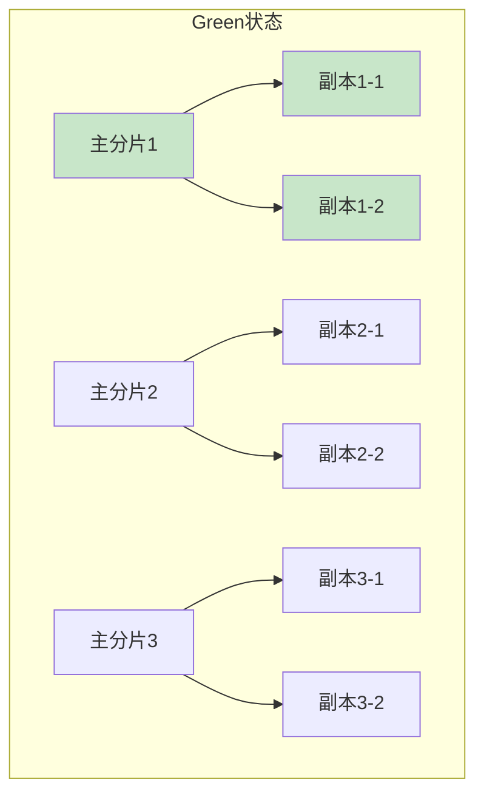
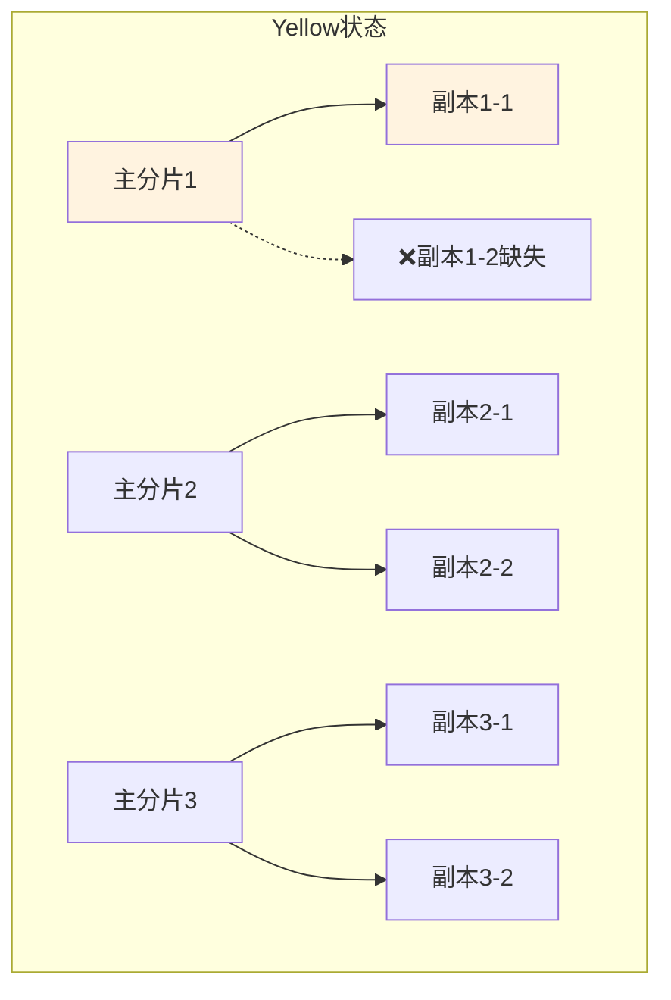
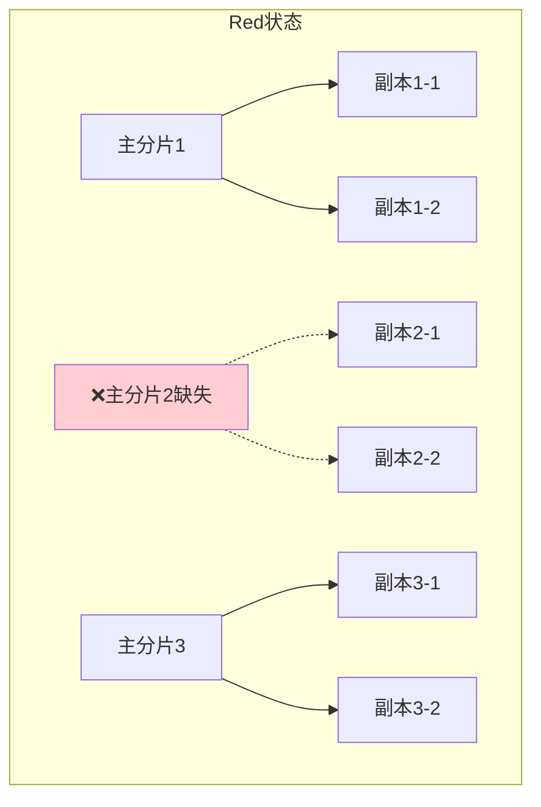

# Elasticsearch集群健康管理与故障排查指南

## 情境与背景

Elasticsearch集群健康状态（Green/Yellow/Red）是监控的核心指标，直接反映集群的可用性和数据完整性。本文从DevOps/SRE视角，深入讲解三种健康状态的含义、检查方法、常见问题排查和生产环境最佳实践。

## 一、三种健康状态详解

### 1.1 状态对比

| 颜色 | 状态 | 主分片 | 副本分片 | 数据完整度 | 可用性 | 优先级 |
|:----:|:------:|:------:|:--------:|:----------:|:------:|:------:|
| **Green绿色** | 正常 | 全部 ✅ | 全部 ✅ | 100% | 100% | - |
| **Yellow黄色** | 警告 | 全部 ✅ | 部分 ❌ | 100% | 100% | P2 |
| **Red红色** | 异常 | 部分 ❌ | 无关 | <100% | 部分 | P0/P1 |

### 1.2 Green绿色状态

**状态描述**：

- 所有主分片正常分配
- 所有副本分片正常分配
- 数据100%完整
- 集群完全可用

**示意图**：



### 1.3 Yellow黄色状态

**状态描述**：

- 所有主分片正常分配（数据完整）
- 部分副本分片缺失（容错性下降）
- 集群完全可用

**示意图**：



**常见原因**：

- 节点故障导致副本迁移
- 节点离开后副本未重新分配
- 磁盘空间不足
- 副本数设置过大

### 1.4 Red红色状态

**状态描述**：

- 部分主分片缺失
- 数据不完整
- 部分索引不可读写

**示意图**：



**常见原因**：

- 多个节点同时故障
- 主分片所在节点永久丢失
- 磁盘损坏导致数据不可恢复
- 手动删除索引错误

## 二、集群健康检查

### 2.1 基础检查命令

```bash
# 查看集群健康
curl -XGET 'http://es:9200/_cluster/health?pretty'

# 响应示例
{
  "cluster_name": "es-cluster",
  "status": "green",
  "timed_out": false,
  "number_of_nodes": 5,
  "number_of_data_nodes": 3,
  "active_primary_shards": 10,
  "active_shards": 30,
  "relocating_shards": 0,
  "initializing_shards": 0,
  "unassigned_shards": 0,
  "delayed_unassigned_shards": 0
}
```

### 2.2 详细健康检查

```bash
# 查看分片详细信息
curl -XGET 'http://es:9200/_cat/shards?v'

# 查看节点状态
curl -XGET 'http://es:9200/_cat/nodes?v'

# 查看特定索引健康
curl -XGET 'http://es:9200/my_index/_stats?pretty'
```

### 2.3 集群健康指标说明

| 指标 | 含义 | 正常范围 |
|:----:|------|----------|
| `status` | 健康状态 | green |
| `number_of_nodes` | 节点数 | 预期值 |
| `active_primary_shards` | 主分片数 | 预期值 |
| `active_shards` | 总活动分片 | 预期值 |
| `unassigned_shards` | 未分配分片 | 0 |
| `relocating_shards` | 迁移中分 | 0 |
| `initializing_shards` | 初始化分片 | 0 |

## 三、故障排查指南

### 3.1 Yellow状态排查

**步骤1：查看未分配分片**

```bash
curl -XGET 'http://es:9200/_cluster/allocation/explain?pretty'
```

**步骤2：查看节点状态**

```bash
curl -XGET 'http://es:9200/_cat/nodes?v&h=name,status,node.role,disk.used_percent'
```

**步骤3：检查磁盘空间**

```bash
# 检查节点磁盘
curl -XGET 'http://es:9200/_cat/allocation?v'
```

**常见解决方案**：

| 原因 | 解决方案 |
|:----:|----------|
| 节点离线 | 重启离线节点 |
| 磁盘空间不足 | 清理磁盘或扩容 |
| 分片分配策略问题 | 调整分片分配配置 |
| 副本数过多 | 减少副本数 |

### 3.2 Red状态排查（紧急）

**步骤1：立即检查**

```bash
# 查看哪些索引是Red
curl -XGET 'http://es:9200/_cat/indices?v&health=red'

# 查看未分配主分片详情
curl -XGET 'http://es:9200/_cluster/allocation/explain?pretty&index=my_index&shard=0'
```

**步骤2：优先恢复主分片**

**方案A：副本升主（推荐）**

如果有副本分片，可以尝试将副本分片提升为主分片。

```bash
# 等待ES自动将可用副本提升为主
# 或者手动重新路由
POST /_cluster/reroute?pretty
{
  "commands": [
    {
      "allocate_replica": {
        "index": "my_index",
        "shard": 0,
        "node": "es-data-01"
      }
    }
  ]
}
```

**方案B：强制分配**

```bash
POST /_cluster/reroute?pretty
{
  "commands": [
    {
      "allocate_empty_primary": {
        "index": "my_index",
        "shard": 0,
        "node": "es-data-01",
        "accept_data_loss": true
      }
    }
  ]
}
```

### 3.3 分片分配配置

```yaml
# elasticsearch.yml
cluster.routing.allocation.awareness.attributes: zone
cluster.routing.allocation.disk.watermark.low: 80%
cluster.routing.allocation.disk.watermark.high: 85%
cluster.routing.allocation.disk.watermark.flood_stage: 95%
```

## 四、生产环境最佳实践

### 4.1 监控告警配置

**告警规则示例**：

```json
{
  "rules": [
    {
      "name": "ES集群Red",
      "condition": {
        "type": "compare",
        "query": {
          "term": { "cluster.status": "red" }
        },
        "time_window": "1m"
      },
      "priority": "P0",
      "actions": [
        {
          "type": "pagerduty",
          "severity": "critical"
        }
      ]
    },
    {
      "name": "ES集群Yellow",
      "condition": {
        "type": "compare",
        "query": {
          "term": { "cluster.status": "yellow" }
        },
        "time_window": "5m"
      },
      "priority": "P2",
      "actions": [
        {
          "type": "slack",
          "channel": "#es-alerts"
        }
      ]
    }
  ]
}
```

### 4.2 备份与恢复

**快照备份配置**：

```bash
# 注册仓库
PUT /_snapshot/my_backup
{
  "type": "fs",
  "settings": {
    "location": "/var/backups/elasticsearch"
  }
}

# 创建快照
PUT /_snapshot/my_backup/snapshot_20240508?wait_for_completion=true
{
  "indices": "logs-*,my_index"
}

# 恢复快照
POST /_snapshot/my_backup/snapshot_20240508/_restore
{
  "indices": "my_index"
}
```

### 4.3 集群容量规划

| 指标 | 建议值 |
|:----:|--------|
| 节点数量 | 至少3个数据节点 |
| 分片大小 | 10-50GB/片 |
| 副本数 | 生产环境2个 |
| 磁盘使用率 | <75% |
| 堆内存使用率 | <75% |

## 五、面试1分钟精简版（直接背）

**完整版**：

ES集群健康有三种颜色：绿色表示所有主分片和副本分片都正常分配，数据100%完整，完全可读写，是理想状态；黄色表示所有主分片都正常分配，但有部分副本分片缺失，数据还是完整的，可读写但容错性下降，需要检查；红色表示有主分片缺失，数据不完整，部分索引不可读写，属于紧急故障。排查时，首先查看 `_cluster/health`，黄色检查副本分配，红色优先恢复主分片，从副本升主或强制分配。

**30秒超短版**：

ES三色：绿主副全正常，黄主全副本缺（数据完整），红主缺数据丢（部分不可用）。排查先查 `_cluster/health`，黄色检查副本，红色优先恢复主分片。

## 六、总结

### 6.1 关键要点

1. **Green**：理想状态，主副分片全正常
2. **Yellow**：警告状态，主分片全正常但副本缺失
3. **Red**：紧急状态，主分片缺失，数据不完整

### 6.2 故障处理优先级

| 状态 | 响应时间 | 处理优先级 |
|:----:|:---------:|:----------:|
| Red | 15分钟内 | P0 |
| Yellow | 24小时内 | P2 |
| Green | 持续监控 | - |

### 6.3 记忆口诀

```
绿主副全正常，数据完整可读写，
黄主全副本缺，数据完整容错降，
红主缺数据丢，部分索引不可用，
先查健康看颜色，快速定位故障点。
```

> **参考链接**：[SRE运维面试题全解析：从理论到实践（第二部分）]()