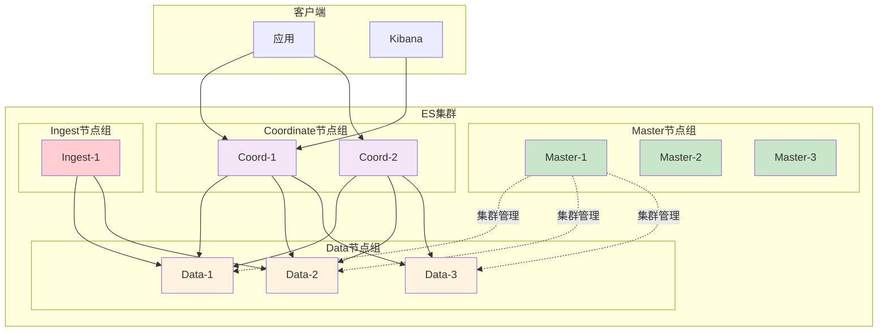

# Elasticsearch节点角色分工与资源配置指南

## 情境与背景

Elasticsearch集群由不同角色的节点组成，合理的节点分工是集群高性能、高可用的基础。本文从DevOps/SRE视角，深入讲解ES各节点角色的职责、配置方法和生产环境最佳实践。

## 一、ES节点角色概述

### 1.1 节点角色分类

| 节点角色 | 核心职责 | 关键特性 |
|:--------:|----------|----------|
| **Master** | 集群状态管理 | 轻量级、高可用 |
| **Data** | 数据存储与查询 | 性能核心、资源密集 |
| **Ingest** | 数据预处理 | 管道处理、转换 |
| **Coordinate** | 查询协调 | 无状态、可扩展 |
| **ML** | 机器学习任务 | 计算密集 |

### 1.2 节点角色架构图



## 二、Master主节点

### 2.1 核心职责

- 集群状态管理
- 索引创建、删除、映射更新
- 节点加入和离开
- 分片分配决策
- 集群元数据存储

### 2.2 配置示例

```yaml
# elasticsearch.yml
node.master: true
node.data: false
node.ingest: false
node.ml: false

# 集群发现配置
discovery.seed_hosts: ["master-01", "master-02", "master-03"]
cluster.initial_master_nodes: ["master-01", "master-02", "master-03"]

# 防止脑裂
discovery.zen.minimum_master_nodes: 2
```

### 2.3 资源配置建议

| 资源 | 配置建议 | 说明 |
|:----:|----------|------|
| **CPU** | 4-8核 | 不需要高性能CPU |
| **内存** | 8-16GB | 堆内存8GB足够 |
| **存储** | 50-100GB | 仅存储集群元数据 |
| **网络** | 千兆网卡 | 管理流量小 |

### 2.4 生产环境建议

- **数量**：3个（奇数），避免脑裂
- **高可用**：部署在不同机架/可用区
- **监控**：监控Master选举状态
- **隔离**：不存储数据，不处理查询

## 三、Data数据节点

### 3.1 核心职责

- 数据存储（分片）
- 索引写入
- 搜索查询
- 聚合计算
- 数据恢复

### 3.2 配置示例

```yaml
# elasticsearch.yml
node.master: false
node.data: true
node.ingest: false
node.ml: false

# 存储配置
path.data: /data/elasticsearch
path.logs: /var/log/elasticsearch

# 线程池配置
thread_pool.search.size: 8
thread_pool.write.size: 4
```

### 3.3 资源配置建议

| 资源 | 配置建议 | 说明 |
|:----:|----------|------|
| **CPU** | 8-16核 | 高性能CPU |
| **内存** | 32-64GB | 堆内存不超过30GB |
| **存储** | SSD 1TB+ | 高IOPS存储 |
| **网络** | 万兆网卡 | 数据传输量大 |

### 3.4 性能优化

**JVM配置**：

```bash
# jvm.options
-Xms30g
-Xmx30g
-XX:+UseG1GC
-XX:MaxGCPauseMillis=200
```

**存储优化**：

```yaml
# elasticsearch.yml
index.refresh_interval: 30s
index.number_of_replicas: 2
```

### 3.5 生产环境建议

- **数量**：根据数据量计算（每节点10-50GB分片）
- **扩展**：水平扩展，按需增加节点
- **监控**：磁盘使用率、查询延迟、索引速率
- **备份**：定期快照备份

## 四、Ingest预处理节点

### 4.1 核心职责

- 数据预处理管道
- 字段提取和转换
- 数据丰富（GeoIP、UserAgent）
- 格式转换

### 4.2 配置示例

```yaml
# elasticsearch.yml
node.master: false
node.data: false
node.ingest: true
node.ml: false
```

### 4.3 管道配置示例

```json
PUT _ingest/pipeline/my_pipeline
{
  "description": "日志预处理管道",
  "processors": [
    {
      "grok": {
        "field": "message",
        "patterns": ["%{COMBINEDAPACHELOG}"]
      }
    },
    {
      "date": {
        "field": "timestamp",
        "formats": ["yyyy-MM-dd HH:mm:ss"]
      }
    },
    {
      "geoip": {
        "field": "clientip",
        "target_field": "geoip"
      }
    }
  ]
}
```

### 4.4 资源配置建议

| 资源 | 配置建议 | 说明 |
|:----:|----------|------|
| **CPU** | 4-8核 | 需要计算能力 |
| **内存** | 16-32GB | 处理管道缓存 |
| **存储** | 100GB | 日志存储 |
| **网络** | 千兆网卡 | 数据传输 |

### 4.5 生产环境建议

- **数量**：根据数据量，1-3个
- **场景**：复杂日志处理、数据转换
- **监控**：管道处理延迟、错误率
- **可选**：简单场景可省略

## 五、Coordinate协调节点

### 5.1 核心职责

- 接收客户端请求
- 查询分发
- 结果聚合
- 排序和分页
- 负载均衡

### 5.2 配置示例

```yaml
# elasticsearch.yml
node.master: false
node.data: false
node.ingest: false
node.ml: false

# 协调节点专用配置
http.enabled: true
transport.enabled: true
```

### 5.3 资源配置建议

| 资源 | 配置建议 | 说明 |
|:----:|----------|------|
| **CPU** | 8-16核 | 需要聚合计算 |
| **内存** | 16-32GB | 结果集缓存 |
| **存储** | 无 | 不存储数据 |
| **网络** | 万兆网卡 | 高并发请求 |

### 5.4 生产环境建议

- **数量**：2-3个，高可用
- **场景**：大规模查询、复杂聚合
- **监控**：查询延迟、并发连接数
- **负载均衡**：配合外部LB使用

## 六、ML机器学习节点

### 6.1 核心职责

- 异常检测
- 预测分析
- 数据建模
- 机器学习任务

### 6.2 配置示例

```yaml
# elasticsearch.yml
node.master: false
node.data: false
node.ingest: false
node.ml: true

# ML配置
xpack.ml.enabled: true
xpack.ml.max_machine_memory_percent: 30
```

### 6.3 资源配置建议

| 资源 | 配置建议 | 说明 |
|:----:|----------|------|
| **CPU** | 8-16核 | 计算密集 |
| **内存** | 32-64GB | 模型训练 |
| **存储** | 500GB | 模型存储 |
| **网络** | 千兆网卡 | 数据传输 |

### 6.4 生产环境建议

- **数量**：按需配置
- **场景**：异常检测、预测分析
- **监控**：ML任务状态、资源使用
- **许可**：需要白金版许可

## 七、生产环境架构示例

### 7.1 小型集群（<10TB）

```yaml
# 3节点混合模式
node.master: true
node.data: true
node.ingest: true

# 资源配置
CPU: 16核
内存: 64GB
存储: 5TB SSD
```

### 7.2 中型集群（10-100TB）

```yaml
# Master节点（3个）
node.master: true
node.data: false
CPU: 4核, 内存: 16GB

# Data节点（5-10个）
node.master: false
node.data: true
CPU: 16核, 内存: 64GB, 存储: 10TB SSD

# Coordinate节点（2个）
node.master: false
node.data: false
CPU: 8核, 内存: 32GB
```

### 7.3 大型集群（>100TB）

```yaml
# Master节点（3个）
node.master: true
CPU: 8核, 内存: 16GB

# Data节点（20+个）
node.master: false
node.data: true
CPU: 16核, 内存: 64GB, 存储: 20TB SSD

# Coordinate节点（3个）
node.master: false
node.data: false
CPU: 16核, 内存: 32GB

# Ingest节点（2个）
node.master: false
node.data: false
node.ingest: true
CPU: 8核, 内存: 32GB
```

## 八、监控与运维

### 8.1 关键监控指标

| 节点类型 | 监控指标 |
|:--------:|----------|
| **Master** | 选举状态、集群健康、元数据大小 |
| **Data** | 磁盘使用率、查询延迟、索引速率、GC时间 |
| **Ingest** | 管道处理延迟、错误率 |
| **Coordinate** | 查询延迟、并发连接数、结果集大小 |
| **ML** | 任务状态、内存使用、CPU使用率 |

### 8.2 运维命令

```bash
# 查看节点角色
curl -XGET 'http://es:9200/_cat/nodes?v&h=name,node.role,master'

# 查看节点统计
curl -XGET 'http://es:9200/_nodes/stats?pretty'

# 查看集群状态
curl -XGET 'http://es:9200/_cluster/health?pretty'
```

## 九、面试1分钟精简版（直接背）

**完整版**：

ES节点分5种角色：Master节点负责集群状态管理、索引创建删除，配置4-8核CPU、8-16GB内存，生产环境需要3个组成奇数避免脑裂；Data节点负责数据存储和查询，是性能核心，配置8-16核CPU、32-64GB内存、SSD大容量存储；Ingest节点做数据预处理管道，配置中等；Coordinate节点专门处理查询请求协调，减轻Data节点压力；ML节点跑机器学习任务。生产环境建议Master和Data分离，小型集群可以混合部署，大型集群建议角色分离。

**30秒超短版**：

ES五角色：Master管集群（3个奇数），Data存数据（性能核心），Ingest预处理，Coordinate协调，ML做分析。生产Master和Data分离。

## 十、总结

### 10.1 选型建议

| 集群规模 | 架构建议 |
|:--------:|----------|
| **小型（<10TB）** | 混合节点，3节点 |
| **中型（10-100TB）** | Master+Data+Coordinate分离 |
| **大型（>100TB）** | 全角色分离，专用节点 |

### 10.2 关键原则

1. **Master必须奇数**：避免脑裂
2. **Data节点专用**：性能核心
3. **Coordinate可选**：大规模查询场景
4. **Ingest按需**：复杂预处理场景
5. **ML按需**：机器学习场景

### 10.3 记忆口诀

```
Master管集群，奇数防脑裂，
Data存数据，性能是核心，
Ingest预处理，管道做转换，
Coordinate协调，查询聚合用，
ML做分析，智能检测跑。
```

> **参考链接**：[SRE运维面试题全解析：从理论到实践（第二部分）]()