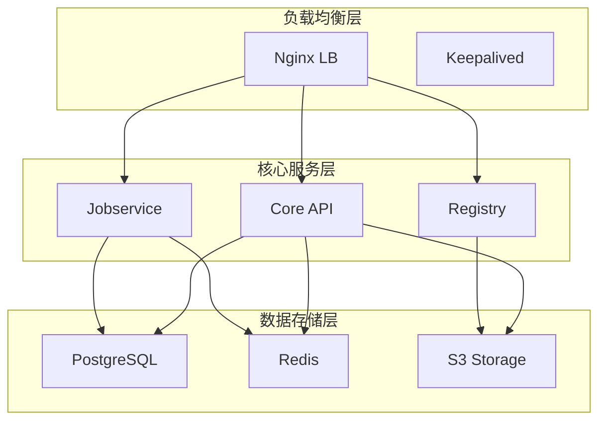

# Harbor高可用实战：从架构设计到故障演练

## 情境与背景

Harbor作为企业级容器镜像仓库，其高可用性直接关系到CI/CD流水线的稳定性和业务连续性。作为高级DevOps/SRE工程师，需要深入理解Harbor高可用架构设计、部署实现和故障处理。本文从实战角度详细讲解Harbor高可用的完整方案。

## 一、高可用架构设计

### 1.1 架构设计原则

**设计原则**：
```yaml
# 高可用设计原则
design_principles:
  - "消除单点故障"
  - "数据冗余备份"
  - "自动故障转移"
  - "性能水平扩展"
  - "可观测性"
```

### 1.2 三层架构

**架构层次**：



### 1.3 组件部署清单

**组件配置**：

| 组件 | 角色 | 副本数 | 部署方式 |
|:----:|------|:------:|----------|
| **Nginx** | 负载均衡 | 2 | 双机热备 |
| **Core API** | 核心服务 | 3 | 无状态 |
| **Registry** | 镜像存储 | 3 | 共享存储 |
| **PostgreSQL** | 数据库 | 3 | Patroni集群 |
| **Redis** | 缓存 | 6 | Cluster模式 |
| **MinIO** | 对象存储 | 4 | 分布式 |

## 二、部署准备

### 2.1 环境要求

**服务器配置**：
```yaml
# 服务器配置要求
servers:
  - name: "harbor-01"
    role: "core"
    cpu: "4"
    memory: "8Gi"
    storage: "100Gi"
    
  - name: "harbor-02"
    role: "core"
    cpu: "4"
    memory: "8Gi"
    storage: "100Gi"
    
  - name: "harbor-03"
    role: "core"
    cpu: "4"
    memory: "8Gi"
    storage: "100Gi"
    
  - name: "minio-01"
    role: "storage"
    cpu: "2"
    memory: "4Gi"
    storage: "2Ti"
```

### 2.2 网络规划

**网络配置**：
```yaml
# 网络规划
network:
  vpc: "harbor-vpc"
  subnet: "10.0.1.0/24"
  
  load_balancer:
    ip: "10.0.1.100"
    ports:
      - 80
      - 443
      
  service_discovery:
    type: "DNS"
    domain: "harbor.example.com"
```

## 三、部署流程

### 3.1 PostgreSQL集群部署

**Patroni配置**：
```yaml
# Patroni配置
patroni:
  scope: "harbor-pg"
  namespace: "harbor"
  
  config:
    postgresql:
      listen: "*:5432"
      connect_address: "$(POD_IP):5432"
      synchronous_commit: "on"
      synchronous_standby_names: "*"
      
  replicas: 3
  resources:
    cpu: "2"
    memory: "4Gi"
```

**初始化命令**：
```bash
# 初始化Patroni集群
kubectl apply -f patroni.yaml

# 查看集群状态
patronictl list
```

### 3.2 Redis集群部署

**Redis Cluster配置**：
```yaml
# Redis Cluster配置
redis:
  cluster:
    enabled: true
    replicas: 3
    sentinel:
      enabled: true
      replicas: 3
  
  resources:
    cpu: "1"
    memory: "2Gi"
  
  persistence:
    enabled: true
    size: "10Gi"
```

**初始化命令**：
```bash
# 部署Redis Cluster
helm install redis bitnami/redis-cluster

# 验证集群状态
redis-cli -h redis-0.redis-headless.default.svc.cluster.local cluster info
```

### 3.3 MinIO分布式部署

**MinIO配置**：
```yaml
# MinIO配置
minio:
  mode: "distributed"
  replicas: 4
  drivesPerNode: 4
  
  resources:
    requests:
      cpu: "2"
      memory: "4Gi"
    limits:
      cpu: "4"
      memory: "8Gi"
  
  persistence:
    enabled: true
    size: "500Gi"
  
  securityContext:
    runAsUser: 1000
    runAsGroup: 1000
```

**初始化命令**：
```bash
# 部署MinIO
helm install minio minio/minio

# 创建存储桶
mc mb minio/harbor-registry
```

### 3.4 Harbor核心组件部署

**Harbor配置**：
```yaml
# Harbor配置
harbor:
  expose:
    type: "ingress"
    tls:
      enabled: true
      secretName: "harbor-tls"
  
  persistence:
    imageChartStorage:
      type: "s3"
      s3:
        region: "us-east-1"
        bucket: "harbor-registry"
        accessKey: "minioadmin"
        secretKey: "minioadmin"
        endpoint: "http://minio.default.svc.cluster.local:9000"
  
  database:
    type: "external"
    host: "patroni.default.svc.cluster.local"
    port: 5432
    username: "postgres"
    password: "password"
  
  redis:
    type: "external"
    host: "redis-headless.default.svc.cluster.local"
    port: 6379
```

**部署命令**：
```bash
# 部署Harbor
helm install harbor harbor/harbor -f harbor-values.yaml

# 验证部署
kubectl get pods -n harbor
```

## 四、负载均衡配置

### 4.1 Nginx配置

**Nginx配置**：
```nginx
http {
    upstream harbor_core {
        server harbor-core-0.harbor-core.default.svc.cluster.local:8080;
        server harbor-core-1.harbor-core.default.svc.cluster.local:8080;
        server harbor-core-2.harbor-core.default.svc.cluster.local:8080;
        
        ip_hash;
        keepalive 64;
    }
    
    server {
        listen 443 ssl http2;
        server_name harbor.example.com;
        
        ssl_certificate /etc/nginx/certs/fullchain.pem;
        ssl_certificate_key /etc/nginx/certs/privkey.pem;
        
        location / {
            proxy_pass http://harbor_core;
            proxy_set_header Host $host;
            proxy_set_header X-Real-IP $remote_addr;
            proxy_set_header X-Forwarded-For $proxy_add_x_forwarded_for;
            proxy_set_header X-Forwarded-Proto $scheme;
        }
    }
}
```

### 4.2 Keepalived配置

**Keepalived配置**：
```yaml
# Keepalived配置
keepalived:
  global_defs:
    router_id: "harbor-lb"
  
  vrrp_instance:
    state: "BACKUP"
    interface: "eth0"
    virtual_router_id: 51
    priority: 100
    advert_int: 1
    
    virtual_ipaddress:
      - "10.0.1.100/24"
    
    authentication:
      auth_type: "PASS"
      auth_pass: "harbor"
```

## 五、监控与告警

### 5.1 Prometheus监控

**监控配置**：
```yaml
# Prometheus配置
prometheus:
  scrape_configs:
    - job_name: "harbor"
      scrape_interval: "30s"
      static_configs:
        - targets:
            - "harbor-core.default.svc.cluster.local:8080"
            - "harbor-registry.default.svc.cluster.local:5000"
      metrics_path: "/metrics"
  
  alerting:
    alertmanagers:
      - static_configs:
          - targets:
              - "alertmanager.default.svc.cluster.local:9093"
```

**关键指标**：
```yaml
# 监控指标
metrics:
  - name: "harbor_core_request_duration_seconds"
    description: "Core API请求耗时"
    
  - name: "harbor_registry_requests_total"
    description: "Registry请求总数"
    
  - name: "harbor_storage_usage_bytes"
    description: "存储使用量"
```

### 5.2 告警规则

**告警配置**：
```yaml
# 告警规则
alerts:
  - name: "HarborCoreDown"
    expr: "up{job=\"harbor-core\"} == 0"
    for: "1m"
    labels:
      severity: "critical"
    annotations:
      summary: "Harbor Core服务不可用"
      
  - name: "HarborStorageHigh"
    expr: "harbor_storage_usage_bytes / 1024 / 1024 / 1024 > 800"
    for: "5m"
    labels:
      severity: "warning"
    annotations:
      summary: "Harbor存储使用率过高"
```

## 六、故障演练

### 6.1 故障场景模拟

**故障场景**：
```yaml
# 故障演练场景
failover_scenarios:
  - name: "core_pod_failure"
    description: "模拟Core API Pod故障"
    action: "kubectl delete pod harbor-core-0"
    
  - name: "database_failure"
    description: "模拟数据库主节点故障"
    action: "kubectl cordon patroni-0"
    
  - name: "storage_failure"
    description: "模拟存储节点故障"
    action: "kubectl cordon minio-0"
    
  - name: "lb_failure"
    description: "模拟负载均衡故障"
    action: "systemctl stop nginx"
```

### 6.2 故障恢复流程

**恢复流程**：
```bash
#!/bin/bash
# Harbor故障恢复脚本

# 1. 检查服务状态
kubectl get pods -n harbor

# 2. 定位故障组件
kubectl describe pod harbor-core-0 -n harbor

# 3. 恢复故障组件
kubectl delete pod harbor-core-0 -n harbor

# 4. 验证恢复
curl -I https://harbor.example.com/api/v2.0/health

# 5. 记录故障
echo "$(date) - Harbor Core恢复完成" >> /var/log/harbor-recovery.log
```

## 七、最佳实践

### 7.1 部署最佳实践

**实践清单**：
```yaml
# 部署最佳实践
deployment_best_practices:
  - "使用外部数据库替代内置数据库"
  - "使用分布式存储替代本地存储"
  - "配置健康检查和自动重启"
  - "使用HTTPS加密传输"
  - "配置资源限制和请求"
  - "使用版本标签而非latest"
```

### 7.2 运维最佳实践

**运维清单**：
```yaml
# 运维最佳实践
operations_best_practices:
  - "定期备份数据库和存储"
  - "定期执行故障演练"
  - "监控关键指标"
  - "配置告警通知"
  - "定期更新版本"
  - "保持配置版本化"
```

## 八、实战案例分析

### 8.1 案例1：Registry故障恢复

**场景描述**：
- Registry Pod意外终止
- 需要快速恢复服务

**恢复过程**：
```bash
# 1. 查看Pod状态
kubectl get pods -n harbor | grep registry

# 2. 查看日志定位问题
kubectl logs harbor-registry-0 -n harbor

# 3. 删除故障Pod触发自动重建
kubectl delete pod harbor-registry-0 -n harbor

# 4. 验证恢复
curl -I https://harbor.example.com/v2/
```

### 8.2 案例2：数据库故障转移

**场景描述**：
- PostgreSQL主节点故障
- 需要自动故障转移

**故障转移过程**：
```bash
# 1. 查看Patroni状态
patronictl list

# 2. 模拟主节点故障
kubectl cordon patroni-0

# 3. 等待自动故障转移
sleep 30

# 4. 验证新主节点
patronictl list
```

## 九、面试1分钟精简版（直接背）

**完整版**：

是的，我负责过Harbor高可用的部署和维护。我们采用三节点部署方案，Core API和Registry都是多副本运行。数据库使用PostgreSQL Patroni集群实现多主复制，Redis采用Cluster模式3主3从。存储后端使用S3兼容的MinIO分布式存储，确保数据冗余。前端通过Nginx负载均衡实现流量分发和健康检查。这样的架构能够保证任意节点故障时服务不中断，数据不丢失。

**30秒超短版**：

Harbor高可用用三节点部署，Core和Registry多副本，PostgreSQL Patroni集群，Redis Cluster，MinIO分布式存储，Nginx负载均衡。

## 十、总结

### 10.1 核心要点

1. **消除单点故障**：多节点部署
2. **数据冗余**：分布式存储+数据库复制
3. **自动故障转移**：Patroni+Keepalived
4. **负载均衡**：Nginx+健康检查
5. **监控告警**：Prometheus+Alertmanager

### 10.2 架构原则

| 原则 | 说明 |
|:----:|------|
| **高可用** | 多副本、自动故障转移 |
| **可扩展** | 水平扩展能力 |
| **可观测** | 完整监控告警 |
| **可恢复** | 定期备份+故障演练 |

### 10.3 记忆口诀

```
Harbor高可用，多节点部署，
LB做负载，PostgreSQL多主，
Redis集群，存储用S3，
故障自动转，服务不中断。
```

> **参考链接**：[SRE运维面试题全解析：从理论到实践（第二部分）]()