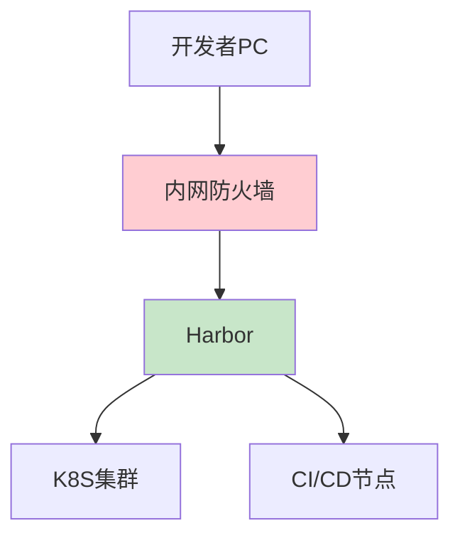
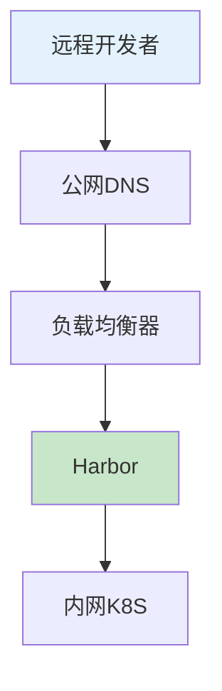
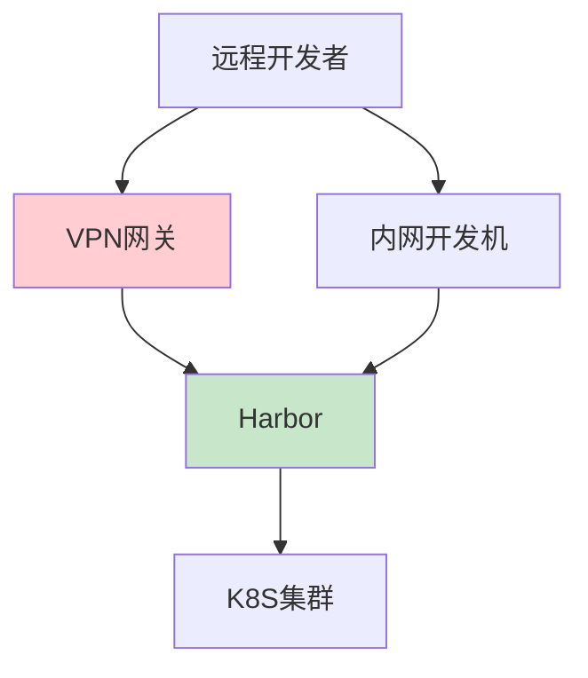
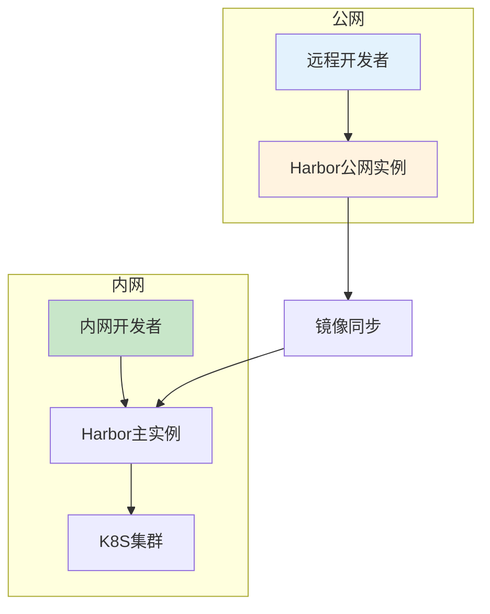

# Harbor网络架构设计：从内网到混合云方案

## 情境与背景

Harbor作为企业级容器镜像仓库，其网络架构设计直接影响到CI/CD流程的效率和安全性。作为高级DevOps/SRE工程师，需要根据企业实际情况设计合理的Harbor网络架构。本文从实战角度详细讲解Harbor网络架构的多种方案及最佳实践。

## 一、网络架构概述

### 1.1 常见架构类型

**架构类型对比**：

| 架构类型 | 描述 | 适用场景 |
|:--------:|------|----------|
| **纯内网** | 仅内网访问 | 金融、政府等高安全要求 |
| **公网访问** | 直接公网访问 | 纯公有云环境 |
| **VPN+内网** | VPN接入后访问 | 大多数企业 |
| **混合架构** | 多网络区域隔离 | 大型企业/多分支 |

### 1.2 架构设计原则

**设计原则**：

```yaml
# 架构设计原则
design_principles:
  - "安全性第一"
  - "访问便捷性"
  - "高性能传输"
  - "可扩展性"
  - "容灾备份"
```

## 二、纯内网架构

### 2.1 架构设计

**纯内网架构图**：



### 2.2 配置示例

**内网DNS配置**：

```yaml
# DNS记录
harbor.internal.company.com:
  type: A
  value: 10.0.1.100
  
# /etc/hosts配置
10.0.1.100 harbor.internal.company.com
```

**内网Harbor配置**：

```yaml
# Harbor配置
expose:
  type: internal
  tls:
    enabled: true
    cert_source: secret
    
network:
  internal: true
  ip_range: "10.0.1.0/24"
```

### 2.3 适用场景

**适用场景**：
- 金融、政府等高安全行业
- 完全隔离的研发环境
- 不允许外部访问的内网

## 三、公网访问架构

### 3.1 架构设计

**公网访问架构图**：



### 3.2 配置示例

**公网DNS配置**：

```yaml
# DNS记录
harbor.example.com:
  type: A
  value: 203.0.113.100
  
# CDN配置（可选）
harbor.example.com:
  type: CNAME
  value: cdn.cloudprovider.com
```

**公网Harbor配置**：

```yaml
# Harbor配置
expose:
  type: ingress
  ingress:
    host: harbor.example.com
    className: nginx
    annotations:
      cert-manager.io/cluster-issuer: "letsencrypt-prod"
  tls:
    enabled: true
    cert_source: secret
    secretName: harbor-tls
```

## 四、VPN+内网架构

### 4.1 架构设计

**VPN架构图**：



### 4.2 VPN配置

**OpenVPN配置**：

```yaml
# OpenVPN服务器配置
port: 1194
proto: udp
dev: tun
ca: ca.crt
cert: server.crt
key: server.key
dh: dh.pem
server: 10.8.0.0 255.255.255.0
ifconfig-pool-persist: /var/log/openvpn/ipp.txt
client-to-client
keepalive: 10 120
cipher: AES-256-GCM
auth: SHA256
```

**内网访问控制**：

```yaml
# 网络策略配置
apiVersion: networking.k8s.io/v1
kind: NetworkPolicy
metadata:
  name: harbor-access
  namespace: harbor
spec:
  podSelector:
    matchLabels:
      app: harbor
  ingress:
    - from:
        - namespaceSelector:
            matchLabels:
              name: ci-cd
        - podSelector:
            matchLabels:
              app: openvpn
      ports:
        - protocol: TCP
          port: 443
```

## 五、混合架构

### 5.1 架构设计

**混合架构图**：



### 5.2 主从同步配置

**Harbor复制策略**：

```yaml
# 复制策略配置
apiVersion: v1
kind: ConfigMap
metadata:
  name: harbor-sync
  namespace: harbor
data:
  sync.yaml: |
    replication:
      mode: push
      targets:
        - url: "https://harbor-public.example.com"
          credential:
            access_key: "sync-user"
            access_secret: "sync-password"
      filters:
        - name: name
          value: "project-*"
      trigger:
        type: event
        event:
          type: push_image
```

### 5.3 公网实例配置

**公网Harbor配置**：

```yaml
# 公网Harbor配置
expose:
  type: ingress
  ingress:
    host: harbor-public.example.com
  tls:
    enabled: true
    cert_source: letsencrypt
    
proxy:
  http_proxy: "http://proxy.example.com:8080"
  https_proxy: "http://proxy.example.com:8080"
  no_proxy: "harbor.internal.com,*.local"
```

## 六、安全配置

### 6.1 防火墙配置

**防火墙规则**：

```yaml
# iptables规则
-A INPUT -p tcp --dport 443 -j ACCEPT
-A INPUT -p tcp --dport 80 -j ACCEPT
-A INPUT -p tcp --dport 5000 -j ACCEPT
-A INPUT -s 10.0.0.0/8 -p tcp --dport 443 -j ACCEPT
-A INPUT -m limit --limit 100/min -j LOG
```

**云防火墙白名单**：

```yaml
# 云厂商安全组
security_group_rules:
  - type: inbound
    protocol: TCP
    port: 443
    source_ips:
      - "10.0.0.0/8"  # 内网
      - "203.0.113.0/24"  # 办公网络
      - "VPN客户端IP范围"
```

### 6.2 认证授权配置

**LDAP集成**：

```yaml
# Harbor LDAP配置
auth_mode: ldap_auth
ldap_url: "ldap://ldap.internal.com:389"
ldap_search_dn: "cn=admin,dc=company,dc=com"
ldap_search_password: "admin_password"
ldap_base_dn: "ou=people,dc=company,dc=com"
ldap_filter: "(objectClass=person)"
ldap_uid: "uid"
ldap_scope: 2
ldap_timeout: 5
```

### 6.3 网络隔离配置

**项目级别隔离**：

```yaml
# 项目隐私配置
projects:
  - name: public
    visibility: public
    public: true
    
  - name: internal
    visibility: private
    access_control:
      - role: developer
        members:
          - ldap_group: developers
      
  - name: security
    visibility: private
    access_control:
      - role: security
        members:
          - ldap_group: security-team
```

## 七、高可用网络配置

### 7.1 负载均衡配置

**多节点负载均衡**：

```yaml
# Nginx负载均衡配置
upstream harbor_backend {
    server harbor-0.harbor-headless.default.svc.cluster.local:443;
    server harbor-1.harbor-headless.default.svc.cluster.local:443;
    server harbor-2.harbor-headless.default.svc.cluster.local:443;
    
    keepalive 32;
}

server {
    listen 443 ssl http2;
    server_name harbor.example.com;
    
    ssl_certificate /etc/nginx/certs/fullchain.pem;
    ssl_certificate_key /etc/nginx/certs/privkey.pem;
    
    location / {
        proxy_pass https://harbor_backend;
        proxy_set_header Host $host;
        proxy_set_header X-Real-IP $remote_addr;
    }
}
```

### 7.2 DNS高可用配置

**DNS故障转移**：

```yaml
# DNS轮询+健康检查
route53_health_check:
  name: harbor-health
  host: harbor.example.com
  protocol: HTTPS
  path: /api/v2.0/systeminfo
  port: 443
  
  failure_threshold: 3
  request_interval: 10s
```

## 八、最佳实践

### 8.1 网络规划原则

**规划建议**：

```yaml
# 网络规划建议
network_planning:
  - "内网优先，减少公网暴露"
  - "VPN接入，确保身份认证"
  - "防火墙白名单，限制访问范围"
  - "TLS加密，保证传输安全"
  - "定期审计，清理无效访问"
```

### 8.2 访问控制策略

**访问控制清单**：

```yaml
# 访问控制最佳实践
access_control:
  - "内网：直接访问"
  - "远程：VPN接入"
  - "外部合作：临时账号+IP白名单"
  - "CI/CD节点：服务账号+内网"
  - "定期审查：清理离职人员账号"
```

### 8.3 监控告警配置

**访问监控配置**：

```yaml
# Harbor访问监控
groups:
  - name: harbor-access-alerts
    rules:
      - alert: HarborAccessFailure
        expr: |
          rate(nginx_http_requests_total{status=~"5.."}[5m]) > 0.1
        for: 2m
        labels:
          severity: warning
          
      - alert: HarborLDAPSyncFailure
        expr: |
          harbor_user_sync_failed_total > 0
        for: 5m
        labels:
          severity: critical
```

## 九、面试1分钟精简版（直接背）

**完整版**：

我们Harbor采用混合架构，内网开发环境和CI/CD节点通过内网访问Harbor，保证高速稳定；远程办公和外部合作方通过VPN接入内网后访问。同时配置了公网域名和SSL证书，但限制在防火墙白名单IP范围内访问。这种架构兼顾了安全性和便捷性：内网业务不受影响，远程协作也能正常进行，通过网络策略和访问控制保障安全。

**30秒超短版**：

内网开发用内网，远程用VPN，大企业用混合架构，防火墙白名单保障安全。

## 十、总结

### 10.1 方案选择指南

| 企业规模 | 推荐方案 |
|----------|----------|
| 小型企业 | VPN+内网 |
| 中型企业 | 混合架构 |
| 大型企业 | 多地域混合 |
| 高安全要求 | 纯内网 |

### 10.2 配置原则

| 原则 | 说明 |
|:----:|------|
| **安全优先** | 最小权限访问 |
| **便捷为辅** | 不影响工作效率 |
| **可观测** | 完整日志审计 |
| **容灾备份** | 高可用架构 |

### 10.3 记忆口诀

```
开发测试用内网，远程办公用VPN，
大企业用混合架构，防火墙白名单，
TLS加密保安全，监控审计不能少。
```

> **参考链接**：[SRE运维面试题全解析：从理论到实践（第二部分）]()