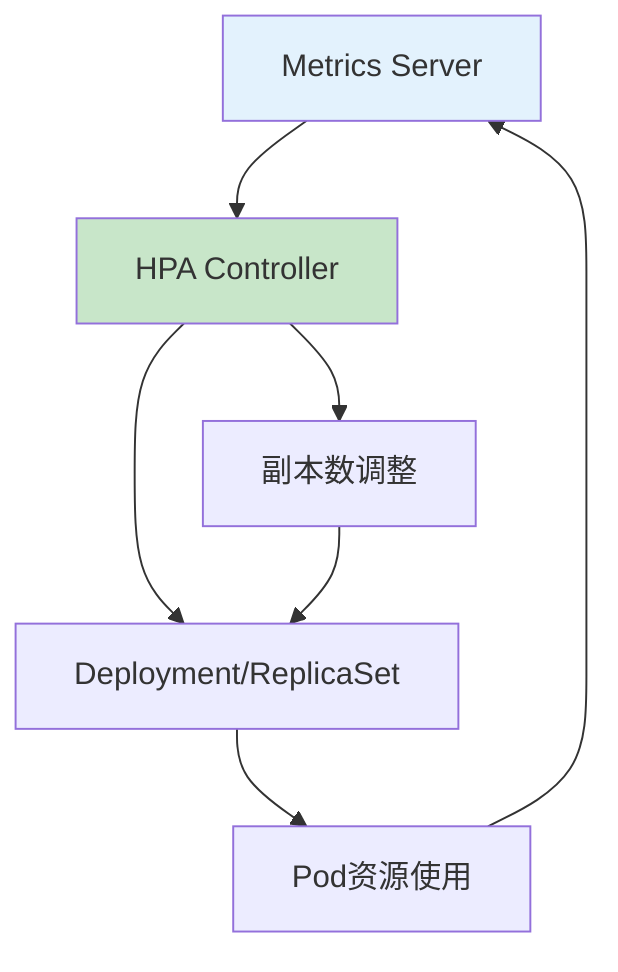

# K8S HPA阈值配置：从原理到生产环境优化

## 情境与背景

Horizontal Pod Autoscaler（HPA）是Kubernetes实现弹性伸缩的核心组件，合理的阈值配置能够保证业务稳定性的同时优化资源成本。作为高级DevOps/SRE工程师，需要深入理解HPA的工作原理和阈值配置策略。本文从实战角度详细讲解K8S HPA阈值配置的最佳实践。

## 一、HPA工作原理

### 1.1 HPA架构

**HPA工作流程**：



### 1.2 HPA版本演进

**版本对比**：

| 版本 | 指标类型 | 稳定性 |
|:----:|----------|:------:|
| **HPA v1** | CPU、内存 | 基础 |
| **HPA v2** | CPU、内存、自定义指标 | 增强 |
| **HPA v2 (metrics.k8s.io)** | External指标 | 完整 |

## 二、阈值设计原则

### 2.1 CPU阈值设计

**CPU阈值原理**：
```yaml
# CPU阈值计算
targetCPUUtilizationPercentage: 70

# 期望副本数计算
desiredReplicas = ceil(sum(currentReplicas) * currentCPUUtilization / targetCPUUtilization)

# 示例
# 当前3副本，CPU利用率85%，目标70%
# desiredReplicas = ceil(3 * 85 / 70) = ceil(3.64) = 4
```

**CPU阈值选择**：

| 阈值范围 | 适用场景 | 优缺点 |
|:--------:|----------|--------|
| **50-60%** | 延迟敏感型 | 资源浪费，但响应快 |
| **60-70%** | **推荐** | 平衡好 |
| **70-80%** | 成本优化型 | 可能扩容不及时 |
| **80%+** | 不推荐 | 风险高 |

### 2.2 内存阈值设计

**内存阈值特殊性**：
```yaml
# 内存阈值特点
memory_threshold_characteristics:
  - "内存不会立即释放"
  - "GC回收是延迟的"
  - "内存使用是累积的"
  - "需要留更多余量"
```

**内存阈值选择**：

| 阈值范围 | 适用场景 | 说明 |
|:--------:|----------|------|
| **60-70%** | 内存敏感型 | 保守配置 |
| **70-80%** | **推荐** | 平衡配置 |
| **80%+** | 内存充足时 | 需监控OOM |

## 三、推荐配置

### 3.1 基础HPA配置

**标准CPU+内存HPA**：
```yaml
apiVersion: autoscaling/v2
kind: HorizontalPodAutoscaler
metadata:
  name: myapp-hpa
  namespace: default
spec:
  scaleTargetRef:
    apiVersion: apps/v1
    kind: Deployment
    name: myapp
  minReplicas: 2
  maxReplicas: 10
  metrics:
    - type: Resource
      resource:
        name: cpu
        target:
          type: Utilization
          averageUtilization: 70
    - type: Resource
      resource:
        name: memory
        target:
          type: Utilization
          averageUtilization: 75
  behavior:
    scaleUp:
      stabilizationWindowSeconds: 0
      policies:
        - type: Percent
          value: 100
          periodSeconds: 15
    scaleDown:
      stabilizationWindowSeconds: 300
      policies:
        - type: Percent
          value: 50
          periodSeconds: 15
```

### 3.2 副本数设计

**副本数配置原则**：
```yaml
# 副本数设计
replica_design:
  min_replicas:
    default: 2
    high_availability: 3
    critical_system: 3-5
    
  max_replicas:
    calculation: "峰值QPS / 单副本QPS * 1.5"
    common_values: [10, 20, 50, 100]
    limit_factor: ["成本", "集群容量", "业务特性"]
```

### 3.3 冷却时间配置

**冷却时间设计**：
```yaml
# 冷却时间配置
cool_down:
  scale_up:
    stabilization_window: "0秒（立即扩容）"
    policies:
      - type: "Percent"
        value: 100  # 每次最多翻倍
        period: 15秒
    
  scale_down:
    stabilization_window: "5分钟"
    policies:
      - type: "Percent"
        value: 50  # 每次最多减半
        period: 15秒
      - type: "Pods"
        value: 4  # 每次最多减4个
        period: 15秒
```

## 四、场景化配置

### 4.1 Web服务HPA

**Web服务配置**：
```yaml
apiVersion: autoscaling/v2
kind: HorizontalPodAutoscaler
metadata:
  name: webapp-hpa
spec:
  scaleTargetRef:
    apiVersion: apps/v1
    kind: Deployment
    name: webapp
  minReplicas: 3
  maxReplicas: 50
  metrics:
    - type: Resource
      resource:
        name: cpu
        target:
          type: Utilization
          averageUtilization: 65
    - type: Resource
      resource:
        name: memory
        target:
          type: Utilization
          averageUtilization: 70
  behavior:
    scaleUp:
      stabilizationWindowSeconds: 0
      policies:
        - type: Percent
          value: 100
          periodSeconds: 15
    scaleDown:
      stabilizationWindowSeconds: 300
```

### 4.2 后台任务HPA

**后台任务配置**：
```yaml
apiVersion: autoscaling/v2
kind: HorizontalPodAutoscaler
metadata:
  name: worker-hpa
spec:
  scaleTargetRef:
    apiVersion: apps/v1
    kind: Deployment
    name: worker
  minReplicas: 1
  maxReplicas: 20
  metrics:
    - type: Resource
      resource:
        name: cpu
        target:
          type: Utilization
          averageUtilization: 80
    - type: External
      external:
        metric:
          name: queue_depth
          selector:
            matchLabels:
              queue: "task-queue"
        target:
          type: AverageValue
          averageValue: "100"
```

### 4.3 Java应用HPA

**Java应用特殊配置**：
```yaml
apiVersion: autoscaling/v2
kind: HorizontalPodAutoscaler
metadata:
  name: javaapp-hpa
spec:
  scaleTargetRef:
    apiVersion: apps/v1
    kind: Deployment
    name: javaapp
  minReplicas: 2
  maxReplicas: 20
  metrics:
    - type: Resource
      resource:
        name: cpu
        target:
          type: Utilization
          averageUtilization: 75
    - type: Resource
      resource:
        name: memory
        target:
          type: Utilization
          averageUtilization: 80
  behavior:
    scaleUp:
      stabilizationWindowSeconds: 60
```

## 五、自定义指标HPA

### 5.1 基于QPS的HPA

**QPS指标配置**：
```yaml
apiVersion: autoscaling/v2
kind: HorizontalPodAutoscaler
metadata:
  name: api-hpa
spec:
  scaleTargetRef:
    apiVersion: apps/v1
    kind: Deployment
    name: api
  minReplicas: 3
  maxReplicas: 30
  metrics:
    - type: External
      external:
        metric:
          name: http_requests_per_second
          selector:
            matchLabels:
              service: "api"
        target:
          type: AverageValue
          averageValue: "1000"
```

### 5.2 基于延迟的HPA

**延迟指标配置**：
```yaml
apiVersion: autoscaling/v2
kind: HorizontalPodAutoscaler
metadata:
  name: api-latency-hpa
spec:
  scaleTargetRef:
    apiVersion: apps/v1
    kind: Deployment
    name: api
  minReplicas: 2
  maxReplicas: 20
  metrics:
    - type: External
      external:
        metric:
          name: http_request_duration_seconds_p99
          selector:
            matchLabels:
              service: "api"
        target:
          type: AverageValue
          averageValue: "100m"
```

## 六、最佳实践

### 6.1 配置检查清单

**HPA配置检查清单**：
```yaml
# 配置前检查
pre_configuration:
  - "业务负载特征分析"
  - "单副本容量压测"
  - "峰值QPS评估"
  - "资源成本预算"
  
# 配置时检查
configuration:
  - "CPU阈值60-70%"
  - "内存阈值70-80%"
  - "最小副本2-3"
  - "最大副本合理"
  - "冷却时间配置"
  
# 配置后检查
post_configuration:
  - "压测验证"
  - "监控告警"
  - "演练测试"
```

### 6.2 常见错误

**错误配置及影响**：

| 错误配置 | 问题 | 影响 |
|:--------:|------|------|
| CPU阈值90% | 扩容太慢 | 响应超时 |
| CPU阈值50% | 频繁扩容 | 资源浪费 |
| 内存阈值90% | OOM风险 | 服务崩溃 |
| 无冷却时间 | 震荡 | 不稳定 |
| 最小副本1 | 单点故障 | 可用性差 |

### 6.3 监控告警

**HPA监控配置**：
```yaml
# Prometheus告警规则
groups:
  - name: hpa-alerts
    rules:
      - alert: HPAAttainingMaxReplicas
        expr: |
          kube_horizontalpodautoscaler_status_condition{
            condition="ScalingLimited"
          } == 1
        for: 5m
        labels:
          severity: warning
        annotations:
          summary: "HPA达到最大副本数"
          
      - alert: HPAScalingNotWorking
        expr: |
          changes(kube_horizontalpodautoscaler_status_current_replicas[5m]) == 0
        for: 10m
        labels:
          severity: warning
        annotations:
          summary: "HPA长时间未调整副本数"
```

## 七、故障排查

### 7.1 HPA不工作排查

**排查流程**：
```bash
# 1. 检查HPA状态
kubectl get hpa -o wide

# 2. 查看HPA事件
kubectl describe hpa <hpa-name>

# 3. 检查Metrics Server
kubectl get apiservices | grep metrics
kubectl top nodes
kubectl top pods

# 4. 检查Pod指标
kubectl get pod <pod-name> -o jsonpath='{.spec.containers[*].resources}'
```

### 7.2 常见问题

**问题与解决方案**：

| 问题 | 原因 | 解决 |
|------|------|------|
| **HPA无法获取指标** | Metrics Server问题 | 检查Metrics Server |
| **副本数一直是最小值** | 指标未达标 | 检查资源配置 |
| **频繁扩缩容** | 阈值太低 | 提高阈值 |
| **扩容太慢** | 阈值太高 | 降低阈值 |

## 八、面试1分钟精简版（直接背）

**完整版**：

我们生产环境的HPA配置是CPU阈值70%，内存阈值75%。CPU设置70%是因为如果设置太高，如90%，系统在负载高峰时扩容来不及，设置太低如50%则会频繁扩容浪费资源。内存阈值设为75%是因为内存回收不像CPU那么及时，需要留一定余量。最小副本设为2保证高可用，最大副本根据业务峰值设为10-20。扩容冷却时间3分钟，缩容5分钟，防止频繁抖动。实际配置需要根据业务特性和压测结果调整。

**30秒超短版**：

CPU70%，内存75%，最小2副本，最大看业务，扩容3分钟冷却，缩容5分钟冷却。

## 九、总结

### 9.1 推荐配置速查

| 配置项 | 推荐值 |
|:------:|:------:|
| **CPU阈值** | 60-70% |
| **内存阈值** | 70-80% |
| **最小副本** | 2-3 |
| **最大副本** | 10-20 |
| **扩容冷却** | 0-60秒 |
| **缩容冷却** | 5分钟 |

### 9.2 配置原则

| 原则 | 说明 |
|:----:|------|
| **业务优先** | 先保证性能再优化成本 |
| **压测验证** | 配置前必须压测 |
| **渐进调整** | 小步快跑 |
| **监控验证** | 配置后持续监控 |

### 9.3 记忆口诀

```
CPU设70%，内存设75%，
最小副本2起步，最大副本看业务，
扩容冷却3分钟，缩容冷却5分钟，
压测验证不能少，监控告警要配置。
```

> **参考链接**：[SRE运维面试题全解析：从理论到实践（第二部分）]()