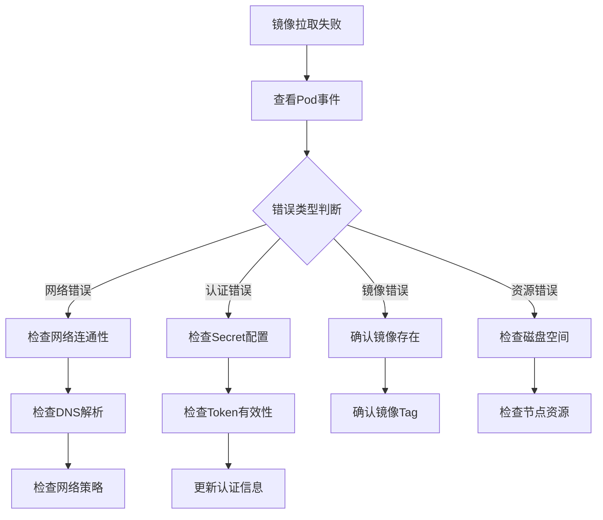

# K8S镜像拉取问题排查与解决方案：从网络到认证全解析

## 情境与背景

在Kubernetes生产环境中，应用发版时拉取镜像失败是常见问题，可能由网络不通、认证失败、镜像不存在、资源限制等多种原因导致。作为高级DevOps/SRE工程师，需要掌握镜像拉取问题的全面排查方法和解决方案。本文从实战角度详细讲解K8S镜像拉取问题的诊断与处理。

## 一、问题分类概述

### 1.1 问题分类

**问题类型**：

| 问题类型 | 错误表现 | 影响程度 |
|:--------:|----------|:--------:|
| **网络不通** | connection timeout | 严重 |
| **认证失败** | 401/403 Unauthorized | 严重 |
| **镜像不存在** | 404 Not Found | 严重 |
| **Token过期** | 403 Forbidden | 严重 |
| **磁盘空间** | no space left | 中等 |
| **拉取超时** | timeout | 中等 |

### 1.2 排查流程

**标准化排查流程**：



## 二、网络问题排查

### 2.1 DNS解析问题

**问题表现**：
- 无法解析Harbor域名
- curl: (6) Could not resolve host

**排查方法**：
```bash
# 1. 检查Pod DNS配置
kubectl exec -it <pod-name> -- cat /etc/resolv.conf

# 2. 测试DNS解析
kubectl exec -it <pod-name> -- nslookup harbor.example.com

# 3. 测试网络连通性
kubectl exec -it <pod-name> -- ping harbor.example.com

# 4. 测试端口连通性
kubectl exec -it <pod-name> -- telnet harbor.example.com 443
```

**解决方案**：
```yaml
# 检查CoreDNS配置
apiVersion: v1
kind: ConfigMap
metadata:
  name: coredns
  namespace: kube-system
data:
  Corefile: |
    .:53 {
        errors
        health
        kubernetes cluster.local in-addr.arpa ip6.arpa {
            pods insecure
            fallthrough in-addr.arpa ip6.arpa
        }
        forward . 8.8.8.8
        prometheus :9153
        cache 30
    }
```

### 2.2 网络策略问题

**问题表现**：
- 特定节点无法拉取镜像
- 部分Pod拉取失败

**排查方法**：
```bash
# 1. 查看Pod所在节点
kubectl get pod <pod-name> -o wide

# 2. 检查网络策略
kubectl get networkpolicy --all-namespaces

# 3. 查看Pod网络状态
kubectl describe pod <pod-name> | grep -A 10 "Events"

# 4. 测试节点网络
kubectl debug node/<node-name> -it --image=busybox -- nslookup harbor.example.com
```

**解决方案**：
```yaml
# 配置网络策略允许拉取镜像
apiVersion: networking.k8s.io/v1
kind: NetworkPolicy
metadata:
  name: allow-image-pull
  namespace: default
spec:
  podSelector:
    matchLabels:
      app: myapp
  policyTypes:
    - Egress
  egress:
    - to:
        - namespaceSelector:
            matchLabels:
              name: harbor
      ports:
        - protocol: TCP
          port: 443
        - protocol: TCP
          port: 80
```

## 三、认证问题排查

### 3.1 Secret配置问题

**问题表现**：
- 401 Unauthorized
- ImagePullBackOff

**排查方法**：
```bash
# 1. 查看Pod使用的Secret
kubectl get pod <pod-name> -o jsonpath='{.spec.imagePullSecrets}'

# 2. 检查Secret是否存在
kubectl get secret <secret-name>

# 3. 查看Secret内容
kubectl describe secret <secret-name>

# 4. 测试认证信息
kubectl get secret <secret-name> -o jsonpath='{.data.\.dockerconfigjson}' | base64 -d
```

**解决方案**：
```yaml
# 创建镜像拉取Secret
apiVersion: v1
kind: Secret
metadata:
  name: harbor-secret
  namespace: default
type: kubernetes.io/dockerconfigjson
data:
  .dockerconfigjson: <base64-encoded-config>
---
# Pod使用Secret
apiVersion: v1
kind: Pod
metadata:
  name: myapp
spec:
  imagePullSecrets:
    - name: harbor-secret
  containers:
    - name: myapp
      image: harbor.example.com/project/myapp:v1.0
```

### 3.2 Token过期问题

**问题表现**：
- 403 Forbidden
- Token expired

**排查方法**：
```bash
# 1. 查看认证错误详情
kubectl describe pod <pod-name> | grep -A 5 "Failed to pull image"

# 2. 检查Secret创建时间
kubectl get secret <secret-name> -o jsonpath='{.metadata.creationTimestamp}'

# 3. 测试手动登录
docker login harbor.example.com -u <username> -p <password>

# 4. 查看Harbor Token状态
curl -I https://harbor.example.com/api/v2.0/tokens
```

**解决方案**：
```bash
# 更新Secret
# 方法1：重新创建Secret
kubectl delete secret <secret-name>
kubectl create secret docker-registry <secret-name> \
  --docker-server=https://harbor.example.com \
  --docker-username=<username> \
  --docker-password=<password> \
  --namespace=default

# 方法2：更新Secret数据
kubectl patch secret <secret-name> -p \
  '{"data":{".dockerconfigjson":"<new-base64-config>"}}'
```

## 四、镜像问题排查

### 4.1 镜像不存在问题

**问题表现**：
- 404 Not Found
- repository does not exist

**排查方法**：
```bash
# 1. 确认镜像完整路径
kubectl describe pod <pod-name> | grep "Failed to pull"

# 2. 测试镜像存在性
docker pull harbor.example.com/project/myapp:v1.0

# 3. 列出Harbor项目镜像
curl -u <user>:<pass> https://harbor.example.com/api/v2.0/projects/project/repositories

# 4. 查看镜像Tag
curl -u <user>:<pass> https://harbor.example.com/api/v2.0/projects/project/repositories/myapp/tags
```

**解决方案**：
```yaml
# 确认正确的镜像名称和Tag
spec:
  containers:
    - name: myapp
      image: harbor.example.com/project/myapp:v1.0.0  # 注意Tag准确性

# 使用可变Tag时的最佳实践
# 生产环境应使用固定Tag而非latest
```

### 4.2 镜像Tag问题

**问题表现**：
- Tag not found
- latest拉取到旧版本

**排查方法**：
```bash
# 1. 查看Harbor上的Tag列表
curl -u <user>:<pass> \
  https://harbor.example.com/api/v2.0/projects/project/repositories/myapp/tags

# 2. 检查本地镜像
docker images | grep myapp

# 3. 确认CI/CD构建的镜像Tag
echo $IMAGE_TAG
```

**解决方案**：
```yaml
# 使用摘要替代Tag（确保精确版本）
image: harbor.example.com/project/myapp@sha256:abc123...

# 或使用唯一构建号作为Tag
image: harbor.example.com/project/myapp:build-${BUILD_NUMBER}
```

## 五、资源问题排查

### 5.1 磁盘空间问题

**问题表现**：
- no space left on device
- failed to reserve container

**排查方法**：
```bash
# 1. 检查节点磁盘空间
kubectl get node <node-name> -o jsonpath='{.status.capacity}'
df -h

# 2. 检查容器镜像存储
docker images
docker system df

# 3. 清理不需要的镜像
docker image prune -a

# 4. 检查Kubelet日志
journalctl -u kubelet --no-pager | grep "no space"
```

**解决方案**：
```yaml
# 配置Kubelet磁盘空间策略
apiVersion: kubelet.config.k8s.io/v1beta1
kind: KubeletConfiguration
imageGCHighThresholdPercent: 85
imageGCLowThresholdPercent: 80
imageGCPolicy:
  minAge: 1h
  garbageCollection: Background

# 节点清理脚本
#!/bin/bash
# 清理未使用的镜像和容器
docker system prune -af --volumes
docker image prune -a
```

### 5.2 拉取超时问题

**问题表现**：
- rpc error: code = DeadlineExceeded
- context deadline exceeded

**排查方法**：
```bash
# 1. 检查Pod拉取超时配置
kubectl describe pod <pod-name> | grep "pull deadline"

# 2. 测试镜像拉取速度
time docker pull harbor.example.com/project/myapp:v1.0

# 3. 检查网络带宽
iperf3 -c <server>

# 4. 查看Kubelet拉取日志
journalctl -u kubelet --no-pager | grep "pulling"
```

**解决方案**：
```yaml
# 配置拉取超时时间
apiVersion: v1
kind: Pod
metadata:
  name: myapp
spec:
  containers:
    - name: myapp
      image: harbor.example.com/project/myapp:v1.0
      imagePullPolicy: Always
  # 或设置全局默认超时
---
apiVersion: kubelet.config.k8s.io/v1beta1
kind: KubeletConfiguration
runtimeRequestTimeout: 5m
```

## 六、最佳实践

### 6.1 镜像预热策略

**预热配置**：
```yaml
# ImagePuller配置
apiVersion: v1
kind: ServiceAccount
metadata:
  name: image-puller
  namespace: default
---
apiVersion: rbac.authorization.k8s.io/v1
kind: Role
metadata:
  name: image-puller
rules:
  - apiGroups: [""]
    resources: ["pods"]
    verbs: ["create"]
---
apiVersion: rbac.authorization.k8s.io/v1
kind: RoleBinding
metadata:
  name: image-puller
roleRef:
  apiGroup: rbac.authorization.k8s.io
  kind: Role
  name: image-puller
subjects:
  - kind: ServiceAccount
    name: image-puller
    namespace: default
```

**预热脚本**：
```yaml
# CronJob预热镜像
apiVersion: batch/v1
kind: CronJob
metadata:
  name: image-prepuller
  namespace: default
spec:
  schedule: "0 */6 * * *"  # 每6小时执行
  jobTemplate:
    spec:
      template:
        spec:
          serviceAccountName: image-puller
          containers:
            - name: prepull
              image: harbor.example.com/project/myapp:v1.0
              command: ["sh", "-c", "echo 'Image prewarmed'"]
          restartPolicy: Never
```

### 6.2 高可用镜像仓库

**多Registry配置**：
```yaml
# 配置多个镜像源
apiVersion: v1
kind: ConfigMap
metadata:
  name: image-sources
  namespace: default
data:
  sources.yaml: |
    registries:
      - name: primary
        url: https://harbor-primary.example.com
        priority: 1
      - name: secondary
        url: https://harbor-secondary.example.com
        priority: 2
```

### 6.3 监控告警配置

**镜像拉取监控**：
```yaml
# Prometheus告警规则
groups:
  - name: image-pull-alerts
    rules:
      - alert: ImagePullFailure
        expr: |
          sum by (pod, namespace, reason) (
            kube_pod_container_status_last_termination_reason{
              reason="ContainerCannotPull"
            }
          ) > 0
        for: 1m
        labels:
          severity: critical
        annotations:
          summary: "镜像拉取失败"
          description: "Pod {{ $labels.pod }} 在 {{ $labels.namespace }} 拉取镜像失败"
          
      - alert: ImagePullBackOff
        expr: |
          kube_pod_container_status_waiting{
            reason="ImagePullBackOff"
          } > 0
        for: 2m
        labels:
          severity: warning
```

## 七、实战案例分析

### 7.1 案例1：Token过期导致认证失败

**问题描述**：
- 生产环境突然无法拉取镜像
- 错误信息：Unauthorized

**排查过程**：
```bash
# 1. 查看Pod事件
kubectl describe pod myapp-xxx | grep -A 3 "Failed to pull"

# 2. 检查Secret有效性
kubectl get secret harbor-secret -o jsonpath='{.data.\.dockerconfigjson}' | base64 -d

# 3. 手动测试登录
docker login harbor.example.com -u <user> -p <pass>
# 输出：Error: Unauthorized

# 4. 确认为Token过期
# Harbor系统中刷新Token
```

**解决方案**：
```bash
# 1. 删除旧Secret
kubectl delete secret harbor-secret

# 2. 重新创建Secret
kubectl create secret docker-registry harbor-secret \
  --docker-server=https://harbor.example.com \
  --docker-username=<new-user> \
  --docker-password=<new-password> \
  --namespace=default

# 3. 重启Pod
kubectl rollout restart deployment myapp
```

### 7.2 案例2：大镜像拉取超时

**问题描述**：
- 镜像大小约8GB
- 拉取超时失败

**排查过程**：
```bash
# 1. 测试拉取速度
time docker pull harbor.example.com/project/large-image:v1.0
# 耗时：15分钟

# 2. 检查网络带宽
iperf3 -c harbor.example.com

# 3. 确认为带宽不足
```

**解决方案**：
```yaml
# 配置更高的拉取超时
apiVersion: v1
kind: Pod
metadata:
  name: myapp
spec:
  containers:
    - name: myapp
      image: harbor.example.com/project/large-image:v1.0
      resources:
        limits:
          cpu: "2"
          memory: "4Gi"
  # 或配置Kubelet全局超时
---
apiVersion: kubelet.config.k8s.io/v1beta1
kind: KubeletConfiguration
runtimeRequestTimeout: 10m
```

## 八、面试1分钟精简版（直接背）

**完整版**：

确实遇到过这个问题。排查思路是：先看Pod事件确认错误类型，如果是网络不通，用ping和telnet检查连通性；如果是401认证失败，检查imagePullSecrets配置是否正确，Secret是否过期；如果是404镜像不存在，确认镜像名称和Tag是否正确；如果是Token过期，需要更新Secret。我们还配置了镜像预热策略，在发版前提前拉取镜像，避免发版时拉取失败。

**30秒超短版**：

拉不到镜像先看网络，认证Secret要配置，镜像名要确认，Token过期要更新，磁盘空间要检查。

## 九、总结

### 9.1 排查步骤

1. **查看Pod事件**：确认错误类型
2. **检查网络连通性**：DNS、路由、网络策略
3. **检查认证配置**：Secret、Token有效性
4. **确认镜像存在**：名称、Tag正确
5. **检查资源限制**：磁盘空间、拉取超时

### 9.2 预防措施

| 措施 | 说明 |
|:----:|------|
| **镜像预热** | 发版前提前拉取 |
| **多Registry** | 配置备选镜像源 |
| **固定Tag** | 避免使用latest |
| **Secret定期更新** | 避免Token过期 |
| **监控告警** | 及时发现问题 |

### 9.3 记忆口诀

```
拉不到镜像先看网络，
认证Secret要配置，
镜像名要确认，
Token过期要更新，
磁盘空间要检查，
预热策略不能少。
```

> **参考链接**：[SRE运维面试题全解析：从理论到实践（第二部分）]()