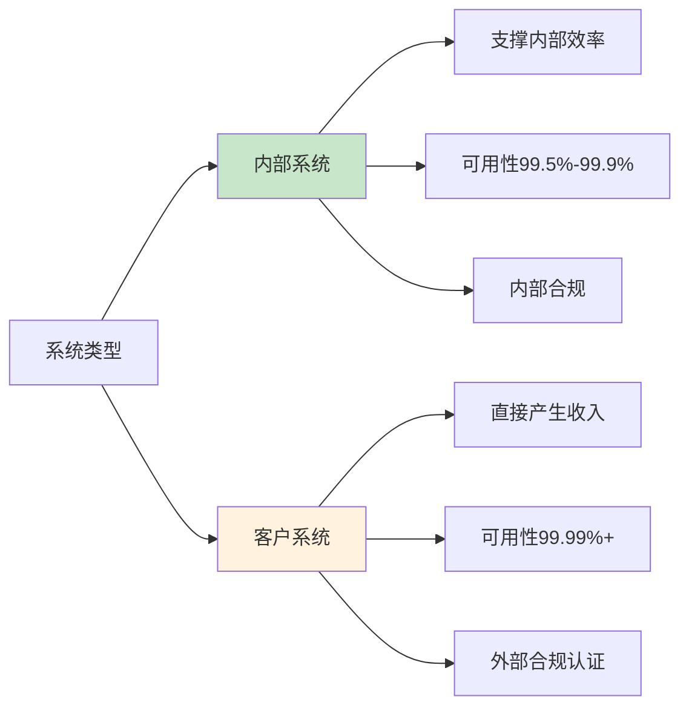
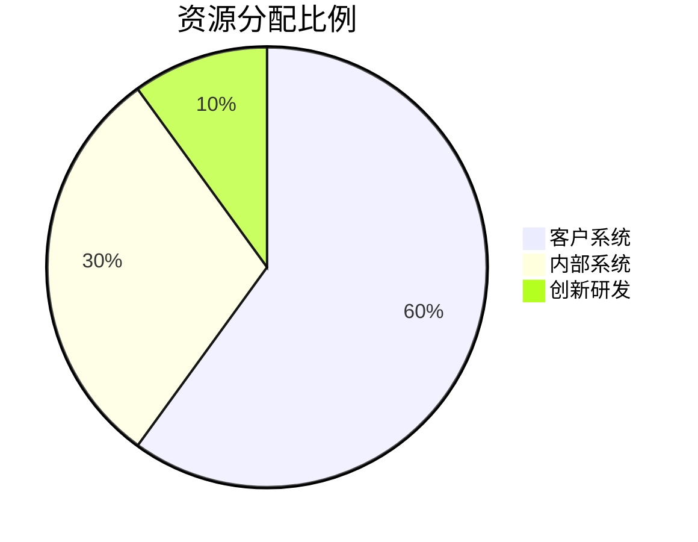
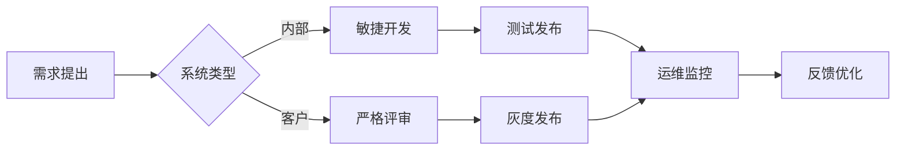

# 内部系统与客户系统运维策略：DevOps/SRE视角的差异化管理

## 情境与背景

在企业IT架构中，内部系统和客户系统扮演着不同的角色，对运维的要求也存在显著差异。作为高级DevOps/SRE工程师，理解这种差异并制定差异化的运维策略是关键能力。本文从DevOps/SRE视角，深入讲解内部系统与客户系统的运维策略差异和最佳实践。

## 一、系统类型定义与价值定位

### 1.1 内部系统

**定义**：面向公司内部员工和团队使用的系统

**常见类型**：
- OA办公系统
- CRM客户关系管理
- 人力资源系统
- 财务系统
- DevOps工具链（Jenkins、GitLab、ArgoCD等）
- 内部知识库和文档管理

**价值定位**：
- 支撑内部业务流程
- 提升员工工作效率
- 降低内部运营成本

### 1.2 客户系统

**定义**：面向外部客户使用的系统

**常见类型**：
- 电商平台
- SaaS服务
- 移动App后端
- API接口服务
- 门户网站

**价值定位**：
- 直接产生收入
- 塑造企业品牌形象
- 客户体验直接影响业务增长

### 1.3 系统类型对比

| 维度 | 内部系统 | 客户系统 |
|:----:|----------|----------|
| **用户群体** | 公司员工、内部团队 | 外部客户、合作伙伴 |
| **业务价值** | 支撑内部业务效率 | 直接产生收入 |
| **可用性要求** | 高（99.5%-99.9%） | 极高（99.99%+） |
| **安全合规** | 内部合规要求 | 外部合规认证（ISO27001、SOC2等） |
| **技术挑战** | 复杂度高、集成多 | 稳定性强、扩展性高 |
| **故障影响** | 内部效率下降 | 客户流失、收入损失 |
| **优先级** | 次高 | 最高 |



## 二、运维策略差异化

### 2.1 可用性保障策略

**内部系统**：
```yaml
# 内部系统可用性配置
availability:
  target: "99.5%"
  backup_policy:
    type: "daily"
    retention: "30 days"
  disaster_recovery:
    type: "warm"
    rto: "4 hours"
    rpo: "1 hour"
```

**客户系统**：
```yaml
# 客户系统可用性配置
availability:
  target: "99.99%"
  backup_policy:
    type: "real-time"
    retention: "90 days"
  disaster_recovery:
    type: "hot"
    rto: "5 minutes"
    rpo: "1 minute"
```

### 2.2 监控告警策略

**内部系统**：
```yaml
# 内部系统监控配置
monitoring:
  alert_levels:
    critical: "P2"
    warning: "P3"
  notification_channels:
    - "slack"
    - "email"
  response_time: "2 hours"
```

**客户系统**：
```yaml
# 客户系统监控配置
monitoring:
  alert_levels:
    critical: "P0"
    warning: "P1"
  notification_channels:
    - "pagerduty"
    - "slack"
    - "phone"
  response_time: "15 minutes"
```

### 2.3 发布策略

**内部系统**：
```yaml
# 内部系统发布配置
deployment:
  strategy: "rolling"
  canary_percentage: 0
  rollback_strategy: "manual"
  release_window: "working hours"
```

**客户系统**：
```yaml
# 客户系统发布配置
deployment:
  strategy: "canary"
  canary_percentage: 10
  rollback_strategy: "automatic"
  release_window: "off-peak hours"
```

### 2.4 资源配置策略

**内部系统**：
```yaml
# 内部系统资源配置
resources:
  scaling: "manual"
  reserved_instances: "no"
  cost_optimization: "aggressive"
```

**客户系统**：
```yaml
# 客户系统资源配置
resources:
  scaling: "auto"
  reserved_instances: "yes"
  cost_optimization: "balanced"
```

## 三、实战案例分析

### 3.1 案例1：内部DevOps工具链运维

**系统描述**：
- Jenkins、GitLab、ArgoCD、Prometheus、Grafana
- 服务于500+研发人员
- 支撑200+微服务的CI/CD

**运维策略**：
- **高可用**：关键组件双副本部署
- **监控**：基础指标监控，工作时间响应
- **备份**：每日备份，保留30天
- **升级**：定期维护窗口升级

**关键指标**：
| 指标 | 目标值 |
|:----:|--------|
| 构建成功率 | 99% |
| 部署成功率 | 99.5% |
| 工具可用性 | 99.5% |

### 3.2 案例2：客户电商平台运维

**系统描述**：
- 面向百万级用户
- 日均订单10万+
- 涉及支付、物流、库存等核心模块

**运维策略**：
- **高可用**：多可用区部署，主备切换
- **监控**：全链路监控，7x24小时响应
- **备份**：实时备份，保留90天
- **发布**：金丝雀发布，自动回滚

**关键指标**：
| 指标 | 目标值 |
|:----:|--------|
| 系统可用性 | 99.99% |
| 页面响应时间 | <300ms |
| 订单成功率 | 99.99% |

## 四、资源分配与优先级管理

### 4.1 SLA定义

**内部系统SLA**：
```yaml
sla:
  availability: "99.5%"
  response_time:
    critical: "2小时"
    normal: "1工作日"
```

**客户系统SLA**：
```yaml
sla:
  availability: "99.99%"
  response_time:
    critical: "15分钟"
    normal: "1小时"
```

### 4.2 故障优先级矩阵

| 系统类型 | P0故障 | P1故障 | P2故障 | P3故障 |
|:--------:|--------|--------|--------|--------|
| **内部系统** | 系统完全不可用 | 核心功能不可用 | 部分功能不可用 | 轻微影响 |
| **客户系统** | 任何用户影响 | 部分用户影响 | 性能下降 | 无影响 |

### 4.3 资源分配策略



## 五、统一运维平台建设

### 5.1 共享工具链

```yaml
# 统一运维平台架构
platform:
  monitoring:
    tools: ["Prometheus", "Grafana", "Alertmanager"]
    scope: ["内部", "客户"]
  
  logging:
    tools: ["Elasticsearch", "Logstash", "Kibana"]
    scope: ["内部", "客户"]
  
  ci_cd:
    tools: ["ArgoCD", "Tekton"]
    scope: ["内部", "客户"]
  
  incident_management:
    tools: ["PagerDuty", "Opsgenie"]
    scope: ["客户优先"]
```

### 5.2 标准化流程

**通用流程**：
- 变更管理流程
- 故障管理流程
- 配置管理流程
- 发布管理流程

**差异化流程**：
- 客户系统：变更审批更严格，发布窗口受限
- 内部系统：变更审批简化，发布灵活

## 六、团队协作模式

### 6.1 职责划分

| 角色 | 内部系统职责 | 客户系统职责 |
|:----:|--------------|--------------|
| **SRE** | 工具链维护、效率提升 | 稳定性保障、故障响应 |
| **开发** | 功能开发、bug修复 | 性能优化、故障排查 |
| **产品** | 内部需求管理 | 客户需求优先级 |

### 6.2 协作流程



## 七、面试1分钟精简版（直接背）

**完整版**：

我们维护的系统既有内部系统也有客户系统。内部系统包括OA、CRM、DevOps工具链等，支撑公司日常运营和研发效率，可用性要求99.5%-99.9%；客户系统是面向外部客户的核心业务平台，直接产生收入，可用性要求99.99%以上。运维策略上，客户系统采用多可用区部署、金丝雀发布、7x24小时监控；内部系统采用标准部署、滚动发布、工作时间监控。资源分配上向客户系统倾斜（约60%），同时通过统一运维平台实现工具共享和流程标准化。

**30秒超短版**：

我们维护内部和客户两类系统。内部系统支撑效率，可用性99.5%+；客户系统产生收入，可用性99.99%+。运维策略差异化，资源向客户系统倾斜，同时统一工具平台。

## 八、总结

### 8.1 核心要点

1. **价值差异**：客户系统直接产生收入，优先级更高
2. **要求差异**：客户系统可用性、合规要求更高
3. **策略差异**：资源分配、监控告警、发布策略都不同
4. **统一平台**：共享工具链，降低运维成本

### 8.2 关键原则

| 原则 | 说明 |
|:----:|------|
| **客户优先** | 客户系统故障优先处理 |
| **差异化管理** | 根据系统类型制定策略 |
| **统一平台** | 共享工具，避免重复建设 |
| **持续优化** | 定期评估调整资源分配 |

### 8.3 记忆口诀

```
内部支撑效率，客户产生收入，
运维策略不同，资源分配倾斜，
统一平台共享，保障质量效率。
```

> **参考链接**：[SRE运维面试题全解析：从理论到实践（第二部分）]()